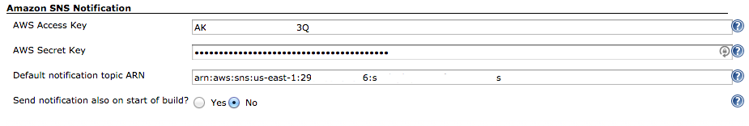

[.conf-macro .output-inline]# #

[.aui-icon .aui-icon-small .aui-iconfont-error .confluence-information-macro-icon]##

The current version of this plugin may not be safe to use. Please review
the following warnings before use:

* https://jenkins.io/security/advisory/2019-04-03/#SECURITY-832[Credentials
stored in plain text]

[.conf-macro .output-inline]#Send build notifications to an AWS SNS
Topic.#

From version 1.7 on you can customize the SNS subject and payload
message making use of build and environment variables.

From version 1.8 you can set in the global configuration whether you
want also to send out an SNS notification on build start.
[.confluence-embedded-file-wrapper]##
