Incompatibility with Sonar 7.7

[.aui-icon .aui-icon-small .aui-iconfont-info .confluence-information-macro-icon]#
#

Starting with Sonarqube 7.7 the preview mode
(-Dsonar.analysis.mode=preview) was removed, making it incompatible with
the plugin. 

Sonarqube release notes say it now has "native support for short-living
branches" https://www.sonarqube.org/sonarqube-7-7/, author will make an
effort to integrate these features. Contributions are
appreciated image:docs/images/wink.svg[(wink)]

A place to start with (for getting a json
report): https://community.sonarsource.com/t/sonar-report-json-is-this-file-still-available/5827/6

 +

The plugin shares http://www.sonarqube.org/[SonarQube] feedback with
developers via https://code.google.com/p/gerrit/[Gerrit] tools.

[.conf-macro .output-inline]# #

[.aui-icon .aui-icon-small .aui-iconfont-error .confluence-information-macro-icon]##

The current version of this plugin may not be safe to use. Please review
the following warnings before use:

* https://jenkins.io/security/advisory/2019-10-23/#SECURITY-1003[Credentials
stored in plain text]

[[SonarGerrit-Requirements]]
== Requirements

[[SonarGerrit-Jenkins]]
=== Jenkins

Jenkins http://jenkins-ci.org/changelog-stable#v1.565.1[version ]http://updates.jenkins-ci.org/download/war/1.625.3/jenkins.war[1.625.3]http://jenkins-ci.org/changelog-stable#v1.565.1[ ]http://updates.jenkins-ci.org/download/war/1.625.3/jenkins.war[ or
newer is required.]

[[SonarGerrit-SonarQube]]
=== SonarQube

This plugin is intended to work with report provided by SonarQube
running on a project in preview mode. That means SonarQube report
generation should be included to build.

If you use Maven, fill out "Goals and options" field in "Build" section
of your Jenkins job:

[source,syntaxhighlighter-pre]
----
clean install sonar:sonar -Dsonar.analysis.mode=preview -Dsonar.report.export.path=sonar-report.json
----

[[SonarGerrit-Gerrit]]
=== Gerrit

[[SonarGerrit-GerritTriggerconfiguration]]
==== Gerrit Trigger configuration

https://wiki.jenkins-ci.org/display/JENKINS/Gerrit+Trigger[Gerrit
Trigger] plugin should be installed and configured.

Rest API should be configured in the Advanced section of Gerrit Trigger
settings.

HTTP authentication data should be set up. Enable Code-Review and Enable
Verified checkboxes should be checked on.

For complete guidance please
see https://wiki.jenkins-ci.org/display/JENKINS/Gerrit+Trigger#GerritTrigger-SetupRequirements[Gerrit
Trigger Wiki page].

[.confluence-embedded-file-wrapper]#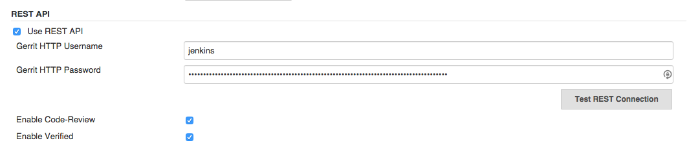#

[[SonarGerrit-RunningoutofGerritTriggerjob]]
==== Running out of Gerrit Trigger job

In case when the plugin is runing outside of a job with Gerrit Trigger
the next environmental variables should be set:

* GERRIT_NAME - Gerrit server name
* GERRIT_CHANGE_NUMBER - Change number
* GERRIT_PATCHSET_NUMBER - Patchset number

[[SonarGerrit-Setup]]
== Setup

[[SonarGerrit-Installplugin]]
=== Install plugin

Install the plugin via Jenkins plugin manager. Gerrit Trigger plugin
should be also installed and configured.

[[SonarGerrit-Configurebuild]]
=== Configure build

Sonar Gerrit plugin is intended to run as post-build action. Choose it
from available post-build actions.

[[SonarGerrit-Pluginsettings]]
=== Plugin settings

There are several settings allows customise plugin for your needs.

There are the next sections:

[[SonarGerrit-SonarQubeSettings]]
==== SonarQube Settings

[.confluence-embedded-file-wrapper]#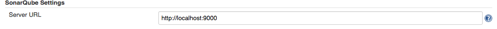#

. Server URL - URL of SonarQube instance used for analysis. It is also
used to provide a link to a SonarQube rule in Gerrit comments. Default
value: [.nolink]#http://localhost:9000/[http://localhost:9000]#

[[SonarGerrit-ProjectSettings]]
==== Project Settings

Use setting "Project configuration" if only one SonarQube report is
generated and static code analysis of the whole project is required.

[.confluence-embedded-file-wrapper]#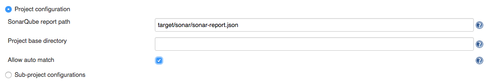#

Use setting "Sub-project configurations" to specify modules and paths
for separate reports if modules are analysed separately or not every
module needs to be analysed. 

[.confluence-embedded-file-wrapper]#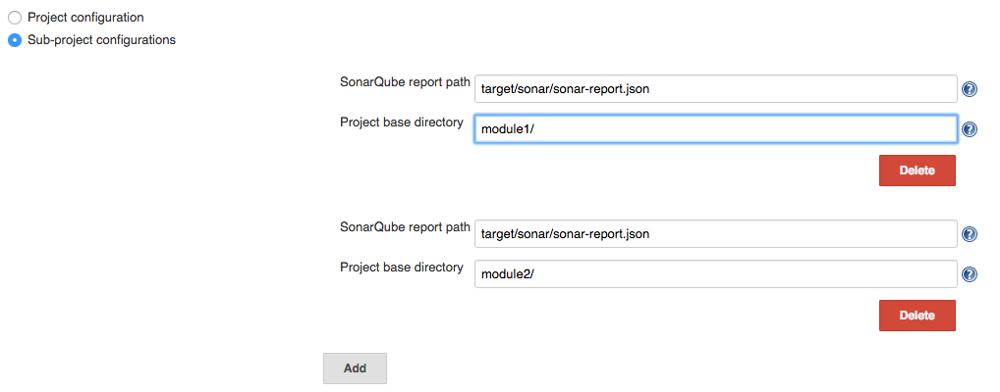#

Settings:

. Project base directory - subdirectory for a case when Jenkins job is
related to a specific module of a big project. The path is relative to a
main project root directory. Default value is empty.
. SonarQube report path - Path to a SonarQube report generated by
SonarQube while a project was being built. The path is relative to a
build working directory. Default value:
 *target/sonar/sonar-report.json*
. [.underline]##Allow auto match## - setting to allow automatically
match SonarQube issues to Gerrit files in case if project consists of
several sub-modules, but only one SonarQube report is generated for the
whole project.

[[SonarGerrit-Filter]]
==== Filter

Filter is used to specify what issues will be affected in the output: 

* to be commented
* to affect review score
* etc

It is possible to filter issues by:

. Severity - SonarQube issue severity. If user doesn't want issues with
low severity to be reported to Gerrit, he (or she) can choose the lowest
severity level to be reported. For example if "Major" level is selected,
information about issues with "Major", "Critical" and "Blocker" will be
included to Gerrit review. Default value: *Info*.
. New issues only - reflects SonarQube issue "new" property. If issue is
not marked as new that may be a sign that it is not created by
processing commit and this issue is not supposed to be included to
review.
. Changed lines only - when only several lines are changed in a commit
user may not want other lines to be commented by Gerrit. With "Add
comments to changed lines only" unchanged in the commit lines will not
be commented in Gerrit.

[[SonarGerrit-]]
===== [.confluence-embedded-file-wrapper]#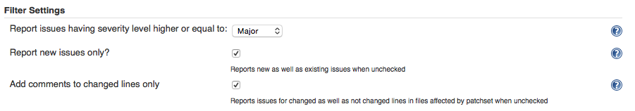#

[[SonarGerrit-ReviewSettings]]
==== Review Settings

Review settings contains of issue filter to specify issues to be
commented and review template. 

[.confluence-embedded-file-wrapper]#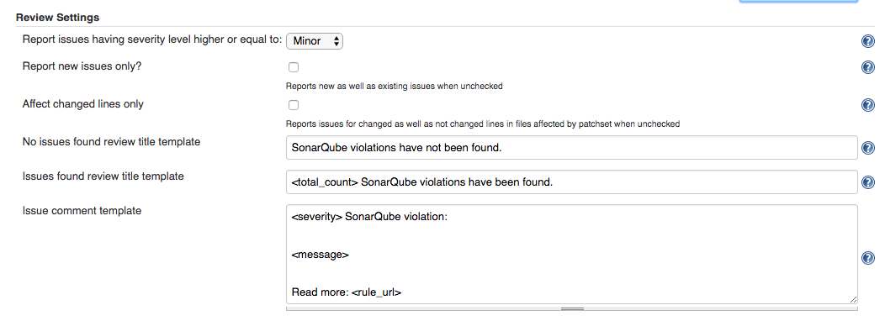#

[[SonarGerrit-ReportFormatting]]
==== Report Formatting

This section allows user to customise text, intended to use as review
title and issue comment. 

. Title - Review title settings allow customization of Gerrit review
titles for both cases (violations found or not) separately. There are
several tags to be replaced by real values allowed in this context: 
.. <info_count> - will be replaced with count of issues having INFO
severity level; 
.. <minor_count> - will be replaced with count of issues having MINOR
severity level;
.. <major_count> - will be replaced with count of issues having MAJOR
severity level;
.. <critical_count> - will be replaced with count of issues having
CRITICAL severity level;
.. <blocker_count> - will be replaced with count of issues having
BLOCKER severity level;
.. <min_minor_count> - will be replaced with count of issues having
MINOR severity level or higher;
.. <min_major_count> - will be replaced with count of issues having
MAJOR severity level or higher;
.. <min_critical_count> - will be replaced with count of issues having
CRITICAL severity level or higher;
.. <total_count> - will be replaced with total count of issues.      
. Comment - Issue comment pattern. Available tags:
.. <key> - will be replaced with issue key;
.. <component> - will be replaced with issue component info;
.. <message> - will be replaced with issue message;
.. <severity> - will be replaced with issue severity;
.. <rule> - will be replaced with issue rule name;
.. <rule_url> - will be replaced with link to rule description on
SonarQube if SonarQube URL is provided in SonarQube settings section or
rule name if URL is not provided; 
.. <status> - will be replaced with issue status;
.. <creation_date> - will be replaced with issue creation date.

[[SonarGerrit-ScoreSettings]]
==== Score Settings

Starting with v. 2.1 it's become possible to specify a separate filter
for score settings. 

[.confluence-embedded-file-wrapper]#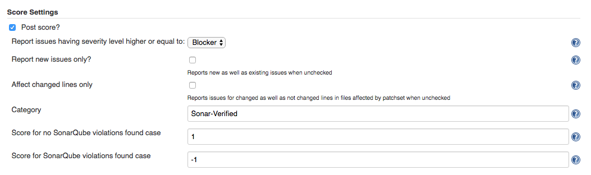#

. Post score - This setting describes whether it is necessary to post
score to Gerrit or not.
. Category - Gerrit category used for score posting. Default
value: *Code-Review*.
. Score for no SonarQube violation found case - Score to be posted to
Gerrit. Default value: *+1*
. Score for SonarQube violations found case - Score to be posted to
Gerrit. Default value: *-1*

Please note: to use Gerrit category other than Default it is necessary
to configure it in Gerrit. See details
in https://gerrit-review.googlesource.com/Documentation/config-labels.html[Gerrit
Documentation].

An example of settings to be added to the project.config for creating
Sonar-Verified category:

[source,syntaxhighlighter-pre]
----
[label "Sonar-Verified"]
    function = MaxWithBlock
    value = -1 Issues found
    value =  0 No score
    value = +1 Verified
    defaultValue = 0
----

And access rights:

[source,syntaxhighlighter-pre]
----
[access "refs/heads/*"]
    label-Sonar-Verified = -1..+1 group Project Owners
    label-Sonar-Verified = -1..+1 group Non-Interactive Users
----

 +

[[SonarGerrit-Credentials]]
===== Credentials

To override the credentials used to post comments on the job level set
up section "Override default HTTP credentials". (Global credentials on
the Gerrit Trigger Server level should be set up as well for Gerrit
Trigger needs.)

 +

[.confluence-embedded-file-wrapper]#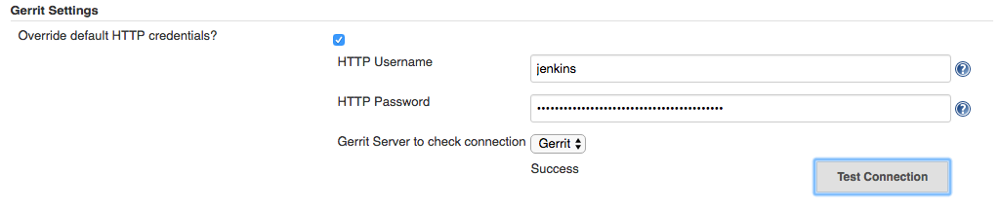#

. Override default HTTP credentials? - This setting describes whether it
is necessary to override Gerrit credentials from the Gerrit Trigger
Server settings or not.
. HTTP Username - Username to be used to post review result to Gerrit.
. [.underline]#HTTP Password# - Password to be used to post review
result to Gerrit.
. Gerrit Server - The server used to check connection with overridden
credentials. The value *does not* affect plugin settings and *only* used
to verify credentials. 

* +
*

*Notification Settings*

This functionality works when Gerrit is configured with post server
settings. 

. To be notified if no SonarQube violations found - Choice of persons to
be notified. Default value: *None*. 
. To be notified if SonarQube violations found - Choice of persons to be
notified. Default value: *Owner*.
. [.underline]#To be notified if negative score is posted# - Choice of
persons to be notified. Default value: *Owner*.

Options:

* None - No notification regarding particular review will be sent.
* Owner - Notification with review results will be sent to a change
owner.
* Owner & Reviewers - Notification with review results will be sent to
an owner and to all the change reviewers added to the change.
* All - Everyone in Gerrit project will receive notification.

[.confluence-embedded-file-wrapper]#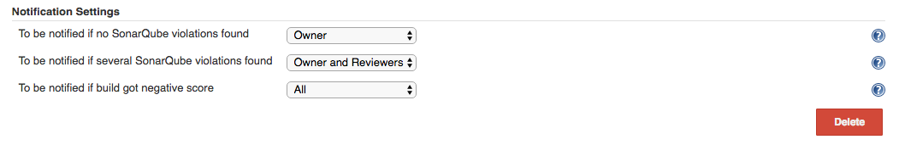#

[[SonarGerrit-Pipelinessupport]]
== Pipelines support

Basic support for pipelines is added in 2.0

*Pipeline with default settings example*

[source,syntaxhighlighter-pre]
----
node {
    // trigger build
    git url: 'ssh://your_project_repo'
    // Fetch the changeset to a local branch using the build parameters provided to the build by the Gerrit Trigger...
    def changeBranch = "change-${GERRIT_CHANGE_NUMBER}-${GERRIT_PATCHSET_NUMBER}"
    sh "git fetch origin ${GERRIT_REFSPEC}:${changeBranch}"
    sh "git checkout ${changeBranch}" 
 
 
    // Get the maven tool.
    def mvnHome = tool 'M3'
    // Mark the code build 'stage'....
    stage 'Build'
    // Run the maven build
    sh "${mvnHome}/bin/mvn clean install sonar:sonar -Dmaven.test.skip=true -Dsonar.analysis.mode=preview -Dsonar.report.export.path=sonar-report.json"

    // to run plugin with default settings
    stage 'Review'
    sonarToGerrit()
 
}
----

*Pipeline overridden settings example*

[source,syntaxhighlighter-pre]
----
   sonarToGerrit (
        inspectionConfig: [
            serverURL: 'http://localhost:9000',
            baseConfig: [
                projectPath: '',
                sonarReportPath: 'target/sonar/sonar-report.json',
                autoMatch: true
            ]
            // OR
            //subJobConfigs : [
            //  [
            //      projectPath: 'module0',
            //      sonarReportPath: 'target/sonar/sonar-report.json'
            //  ],
            //  [
            //      projectPath: 'module1',
            //      sonarReportPath: 'target/module1/sonar/sonar-report.json'
            //  ]
            //]
        ],
        reviewConfig: [ 
            issueFilterConfig: [
                severity: 'INFO', 
                newIssuesOnly: false, 
                changedLinesOnly: false
                ], 
            noIssuesTitleTemplate: 'SonarQube violations have not been found.', 
            someIssuesTitleTemplate: '<total_count> SonarQube violations have been found.',
            issueCommentTemplate: '<severity> SonarQube violation:\n\n\n<message>\n\n\nRead more: <rule_url>'
        ],
        scoreConfig: [ 
            issueFilterConfig: [
                severity: 'INFO', 
                newIssuesOnly: false, 
                changedLinesOnly: false
                ], 
            category: 'Code-Review', 
            noIssuesScore: 0,
            issuesScore: -1
        ],
        notificationConfig: [
            noIssuesNotificationRecipient: 'NONE',
            commentedIssuesNotificationRecipient: 'OWNER',
            negativeScoreNotificationRecipient: 'OWNER'
        ],
        authConfig: [
            username: 'Jenkins',
            password: 'HTTP Password of user called Jenkins'
        ]
    )
----

 +

 +
Known issues:

[.jira-issue .conf-macro .output-block]#
https://issues.jenkins-ci.org/browse/JENKINS-43804[[.aui-icon .aui-icon-wait .issue-placeholder]##
##JENKINS-43804] - [.summary]#Getting issue details...#
[.aui-lozenge .aui-lozenge-subtle .aui-lozenge-default .issue-placeholder]#STATUS#
#  - [.underline]##Overriding Gerrit credentials is unsafe (2.0)##

[[SonarGerrit-Resultexample]]
== Result example

Result of plugin work in Gerrit history:

[.confluence-embedded-file-wrapper]#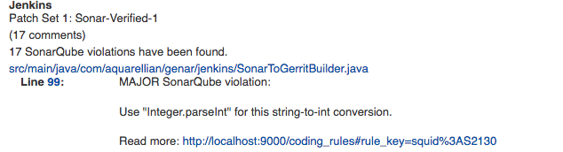#

Gerrit commit:

[.confluence-embedded-file-wrapper]#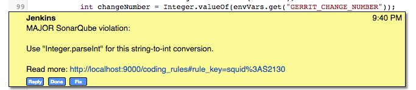#

Score posted:

[.confluence-embedded-file-wrapper]#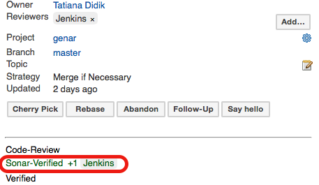#

[[SonarGerrit-Troubleshooting]]
== Troubleshooting

[[SonarGerrit-Pluginfailsbuildwithmessage"Unabletopostreview.Requestfailed"]]
=== Plugin fails build with message "Unable to post review. Request failed"

This message occurres when RestAPIException is thrown by Gerrit API on
attempt to post request.

Since version 1.0.7 it is possible to obtain a full stacktrace of the
exception using a logger for class

[source,syntaxhighlighter-pre]
----
org.jenkinsci.plugins.sonargerrit.SonarToGerritPublisher
----

[.confluence-embedded-file-wrapper]#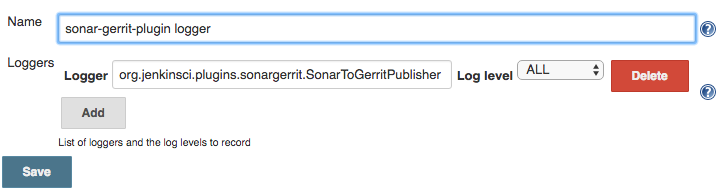#

The log will contain necessary information about the exception as
follows:  [.confluence-embedded-file-wrapper]#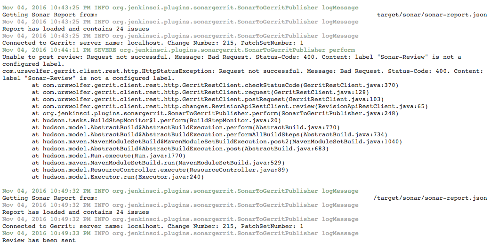#

[[SonarGerrit-Versionincompatibilities]]
== Version incompatibilities

[[SonarGerrit-Version1.0.5]]
=== Version 1.0.5

In this version plugin settings has moved from Build Steps to Post Build
Actions. User needs to reconfigure jobs, or settings will be erased to
default.

[[SonarGerrit-Versions]]
== Versions

[[SonarGerrit-Version2.3(2Apr2018)]]
=== Version 2.3 (2 Apr 2018)

[[SonarGerrit-BugsFixed]]
==== Bugs Fixed

[.jira-issue .conf-macro .output-block]#
https://issues.jenkins-ci.org/browse/JENKINS-49639[[.aui-icon .aui-icon-wait .issue-placeholder]##
##JENKINS-49639] - [.summary]#Getting issue details...#
[.aui-lozenge .aui-lozenge-subtle .aui-lozenge-default .issue-placeholder]#STATUS#
#  

[[SonarGerrit-Version2.2.1(5Feb2018)]]
=== Version 2.2.1 (5 Feb 2018)

[[SonarGerrit-BugsFixed.1]]
==== Bugs Fixed

[.jira-issue .conf-macro .output-block]#
https://issues.jenkins-ci.org/browse/JENKINS-49172[[.aui-icon .aui-icon-wait .issue-placeholder]##
##JENKINS-49172] - [.summary]#Getting issue details...#
[.aui-lozenge .aui-lozenge-subtle .aui-lozenge-default .issue-placeholder]#STATUS#
#  

[[SonarGerrit-Version2.1(6Jan2018)]]
=== Version 2.1 (6 Jan 2018)

[[SonarGerrit-BugsFixed.2]]
==== Bugs Fixed

. https://issues.jenkins-ci.org/browse/JENKINS-43730[JENKINS-43730] - No
issues reported if there are no Project Settings configurations

[[SonarGerrit-NewFeatures]]
==== New Features

. https://issues.jenkins-ci.org/browse/JENKINS-48808[JENKINS-48808] - Allow
file name auto-match for projects with several modules
. https://issues.jenkins-ci.org/browse/JENKINS-48807[JENKINS-48807] - Implement
separate filter for score settings

[[SonarGerrit-Version2.0(24Apr2017)]]
=== Version 2.0 (24 Apr 2017)

[[SonarGerrit-NewFeatures.1]]
==== New Features

. https://issues.jenkins-ci.org/browse/JENKINS-43397[JENKINS-43397] -
Support pipelines (initial)

[[SonarGerrit-Version1.0.8(6Apr2017)]]
=== Version 1.0.8 (6 Apr 2017)

[[SonarGerrit-BugsFixed.3]]
==== Bugs Fixed

. https://issues.jenkins-ci.org/browse/JENKINS-43093[JENKINS-43093] -
Replace NPE stacktrace with message in case when Gerrit Change and
Patchset numbers are not set
. https://issues.jenkins-ci.org/browse/JENKINS-43047[JENKINS-43047] -
Fix issue processing for nested modules
. https://issues.jenkins-ci.org/browse/JENKINS-42465[JENKINS-42465] -
Fix LDAP lockout when using Gerrit HTTP password

[[SonarGerrit-NewFeatures.2]]
==== New Features

. https://issues.jenkins-ci.org/browse/JENKINS-40970[JENKINS-40970] -
Add an option to override Gerrit HTTP credentials
. https://issues.jenkins-ci.org/browse/JENKINS-31240[JENKINS-31240] -
UI: Hide "Score Settings" section if "Post scor" is not checked

[[SonarGerrit-Version1.0.7.6(10Nov2016)]]
=== Version 1.0.7.6 (10 Nov 2016)

[[SonarGerrit-NewFeatures.3]]
==== New Features

. https://issues.jenkins-ci.org/browse/JENKINS-33892[JENKINS-33892] -
Add details of RestAPIException to a log

[[SonarGerrit-Version1.0.6(3Dec2015)]]
=== Version 1.0.6 (3 Dec 2015)

[[SonarGerrit-NewFeatures.4]]
==== New Features

. https://issues.jenkins-ci.org/browse/JENKINS-31892[JENKINS-31892] -
Support multiple project locations for multi-jobs

[[SonarGerrit-Version1.0.5(18Nov2015)]]
=== Version 1.0.5 (18 Nov 2015)

[[SonarGerrit-BugsFixed.4]]
==== Bugs Fixed

. https://issues.jenkins-ci.org/browse/JENKINS-31238[JENKINS-31238] -
Replace "Sonar" with "SonarQube" in plugin ui

[[SonarGerrit-NewFeatures.5]]
==== New Features

. https://issues.jenkins-ci.org/browse/JENKINS-31639[JENKINS-31639] -
Notify user about plugin changes causing incompatibility
. https://issues.jenkins-ci.org/browse/JENKINS-31003[JENKINS-31003] -
Move plugin from post-build steps to post-build actions

[[SonarGerrit-Version1.0.4(24Oct2015)]]
=== Version 1.0.4 (24 Oct 2015)

[[SonarGerrit-BugsFixed.5]]
==== Bugs Fixed

. https://issues.jenkins-ci.org/browse/JENKINS-31001[JENKINS-31001] -
Unable to save changes for Filter settings

[[SonarGerrit-NewFeatures.6]]
==== New Features

. https://issues.jenkins-ci.org/browse/JENKINS-31006[JENKINS-31006] -
Allow user to specify Gerrit category and post score under it.
. https://issues.jenkins-ci.org/browse/JENKINS-31005[JENKINS-31005] -
Move some settings to Advanced section
. https://issues.jenkins-ci.org/browse/JENKINS-31004[JENKINS-31004] -
Check if Gerrit RESTAPI is enabled

[[SonarGerrit-Version1.0.3(13Oct2015)]]
=== Version 1.0.3 (13 Oct 2015)

[[SonarGerrit-BugsFixed.6]]
==== Bugs Fixed

. https://issues.jenkins-ci.org/browse/JENKINS-30932[JENKINS-30932] -
Localisation is failed on error messages
. https://issues.jenkins-ci.org/browse/JENKINS-30933[JENKINS-30933] -
NPE on attempt to run job with no SonarQube execution configured

[[SonarGerrit-Version1.0.2(13Oct2015)]]
=== Version 1.0.2 (13 Oct 2015)

[[SonarGerrit-NewFeatures.7]]
==== New Features

. https://issues.jenkins-ci.org/browse/JENKINS-30915[JENKINS-30915] -
Support plugin run in downstream jobs

[[SonarGerrit-Version1.0.1(9Oct2015)]]
=== Version 1.0.1 (9 Oct 2015)

[[SonarGerrit-NewFeatures.8]]
==== New Features

. https://issues.jenkins-ci.org/browse/JENKINS-30853[JENKINS-30853] -
Support projects located in subdirectories of repository root directory.

[[SonarGerrit-BugsFixed.7]]
==== Bugs Fixed

. https://issues.jenkins-ci.org/browse/JENKINS-30863[JENKINS-30863] -
Unable to run plugin: NoSuchMethod Error: GerritTrigger.getTrigger

[[SonarGerrit-Version1.0(7Oct2015)]]
=== Version 1.0 (7 Oct 2015)

Basic functionality
