[[SonargraphIntegrationPlugin-SonargraphIntegrationPlugin]]
== Sonargraph Integration Plugin

[.conf-macro .output-inline]#This plugin integrates
https://www.hello2morrow.com/products/sonargraph[Sonargraph] version 8
and newer into your build. Sonargraph allows to define an architecture
for a software system and automatically checks how the code base
conforms to it.#

For Sonargraph version 7 use
https://wiki.jenkins-ci.org/display/JENKINS/Sonargraph+Plugin[Sonargraph
Plugin].

[[SonargraphIntegrationPlugin-Contents]]
=== Contents

[[SonargraphIntegrationPlugin-Introduction]]
=== Introduction

https://www.hello2morrow.com/products/sonargraph[Sonargraph] analyzes
the static (i.e. compile-time) dependencies of your software. The
free-of-charge license for the integration with Jenkins and also
http://www.sonarsource.org/[SonarQube] allows to detect cyclic
dependencies and additional metrics. You can mark the build as
"unstable" or "failed" if cyclic dependencies are detected. +
The real benefit of Sonargraph is that you can define a logical
architecture and perform automatic checks how the code conforms to it.
This functionality is only available for free, if you are working on a
non-commercial Open-Source project. More information is available on our
https://www.hello2morrow.com/[homepage], you can check there if you are
eligible for a https://www.hello2morrow.com/products/pricelist[free
license].

The Sonargraph Build component integrates Sonargraph in Ant, Gradle,
Maven and Shell based builds. The
http://eclipse.hello2morrow.com/doc/build/content/index.html[online
manual] provides more details. This Jenkins plugin allows to define if
the build should be marked as "unstable" or "failed" if architecture
violations, cyclic dependencies, etc. are detected. Trends of metrics
are displayed in charts and additionally the generated detailed HTML
report is available for each build.

[[SonargraphIntegrationPlugin-GettingStarted]]
=== Getting Started

If you already have Sonargraph integrated in your build, and a
Sonargraph report is already generated during one of your build steps,
use the post-build step called "Sonargraph Integration Report Generation
& Analysis", and select "Pre-generated". In this case no global Jenkins
configuration for Sonargraph Build is needed.

If you are new to Sonargraph, we advice you to register on our
http://www.hello2morrow.com/[Sonargraph Web Site], have a look at the
whitepapers and screencasts to get an idea of Sonargraph's
capabilities. +
You need to have a license in order to analyse a project. To get started
an evaluation license or the free integration license is sufficient.

If you are new to Sonargraph, use the post-build step called "Sonargraph
Integration Report Generation & Analysis", and select "Generate with
Sonargraph Build". In this case an installation of SonargraphBuild must
be configured in global Jenkins configuration.

*NOTE:* This Jenkins plugin requires Sonargraph version 8 and newer. For
Sonargraph version 7 use
https://wiki.jenkins-ci.org/display/JENKINS/Sonargraph+Plugin[Sonargraph
Plugin].

[[SonargraphIntegrationPlugin-GlobalConfiguration]]
=== Global Configuration

[[SonargraphIntegrationPlugin-ToolInstallationforSonargraphBuild]]
==== Tool Installation for Sonargraph Build

*NOTE:* This global configuration is only required when you are going to
use the "Generate with Sonargraph Build" option in "Sonargraph
Integration Generation & Analysis" post-build action.

To see the global configuration options after installing the plugin, go
to "Manage Jenkins" -> "Configure System" -> "Global Tool
Configuration". You will find the "Sonargraph Build" section

[.confluence-embedded-file-wrapper .confluence-embedded-manual-size]#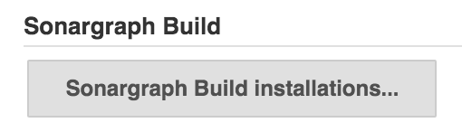#

Press button "Sonargraph Build Installations..." to see the list of
already installed Sonargraph Build installations Jenkins knows about, if
any. To add a new "Installation" of Sonargraph Build press button "Add
Sonargraph Build", give it a descriptive name, use default Installer
"Install from hello2morrow" for it, and select a Sonargraph Build
version from the version drop down box.

[.confluence-embedded-file-wrapper .confluence-embedded-manual-size]#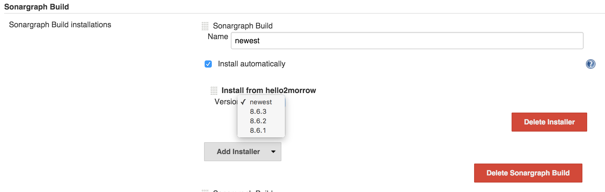#

*NOTE:* Version "newest" automatically updates your Sonargraph Build
installation to the most recent version.

[[SonargraphIntegrationPlugin-SonargraphLicenseServer]]
==== Sonargraph License Server

Sonargraph uses a web-based hello2morrow license server for activation
code based licenses by default. +
If you run your own local Sonargraph license server configure it here.

[.confluence-embedded-file-wrapper .confluence-embedded-manual-size]#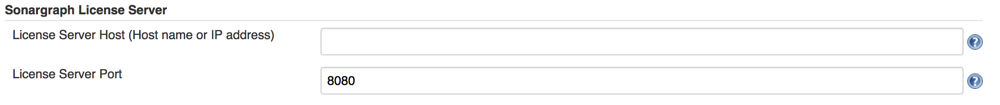#

[[SonargraphIntegrationPlugin-JobConfiguration]]
=== Job Configuration

Use the post-build action "Sonargraph Integration Report Generation &
Analysis" to create Sonargraph's XML and HTML reports (or use a
pre-generated XML report) and to configure how the Sonargraph analysis
should affect the final result of the build. +
For every Sonargraph metric supported by this plugin, you have the
following options:

* Don't mark: Will not change the build result in any way.
* Build unstable: If the value for this metric is greater than zero, the
build result will be set as "unstable".
* Build failed: If the value for this metric is greater than zero, the
build result will be set as "failure".

Take into account that if you have set to mark the build unstable for
one metric, failed for any other and both metric's value are greater
than zero, the worst state will prevail, so the build will be marked as
failure in this case. +
Besides controlling the build result, the plugin also generates graphics
to monitor the trend of metrics across builds and it will display the
full Sonargraph HTML report for each build.

NOTE: For the free Jenkins / SonarQube license, only the options for
"cyclic elements" and "empty workspace" are available.

[[SonargraphIntegrationPlugin-Addpost-buildaction]]
==== Add post-build action

[.confluence-embedded-file-wrapper .confluence-embedded-manual-size]#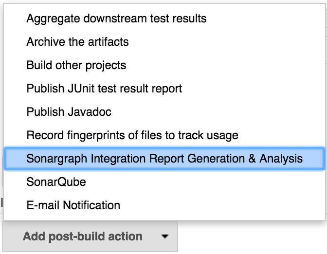#

[[SonargraphIntegrationPlugin-UsePre-GeneratedReport]]
==== Use Pre-Generated Report

Use this option to use a pre-generated Sonargraph report. To do so you
must use Sonargraph Maven plugin, Sonargraph Gradle plugin, or
Sonargraph Ant task in another upstream build step. +
Enter the path to the Sonargraph XML report file that has been generated
via the ANT task of Sonargraph. This path must be relative to the
workspace.

[.confluence-embedded-file-wrapper .confluence-embedded-manual-size]#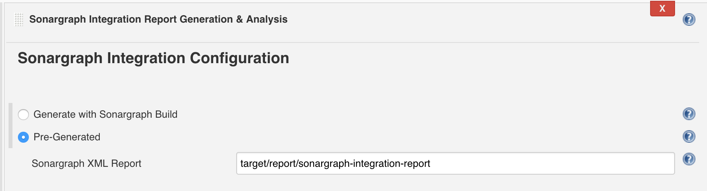#

* *"Sonargraph XML Report"* Enter the path to the pre-generated
Sonargraph XML report file (without extension ".xml"). This path must be
relative to the workspace.

[[SonargraphIntegrationPlugin-GenerateReportwithSonargraphBuild]]
==== Generate Report with Sonargraph Build

Use this option to let Sonargraph Build create a Sonargraph report.

[.confluence-embedded-file-wrapper .confluence-embedded-manual-size]#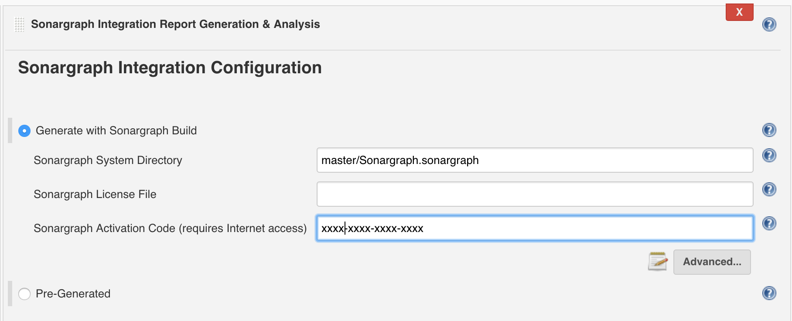#

* *"Sonargraph System Directory"* Enter the path to the Sonargraph
system (*.sonargraph) directory. This path must be relative to the
workspace.
* *"Sonargraph License File"* Sonargraph license file location. If this
parameter is not specified, you must specify the activation code
parameter.
* *"Sonargraph Activation Code"* Sonargraph license activation code. If
this parameter is not specified, you must specify a license file
parameter.

docs/images/Advanced_Options.png[[.confluence-embedded-file-wrapper .confluence-embedded-manual-size]#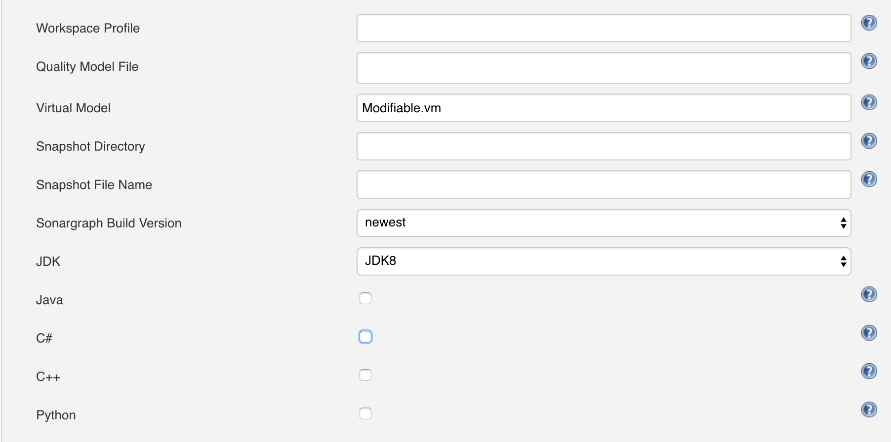#]

* *"Workspace Profile"* The profile file name (e.g. "BuildProfile.xml")
for transforming the workspace paths to match the build environment.
* *"Quality Model File"* Use a built-in Quality Model, or an external
Quality Model instead of the Quality Model included in Sonargraph
Software System. Must be either a file within workspace with extension
"sgqm", or one of the built-in Quality Models
** Sonargraph:Default.sgqm (language-independent)
** Sonargraph:Java.sgqm (language-specific)
** Sonargraph:CSharp.sgqm (language-specific)
** Sonargraph:CPlusPlus.sgqm (language-specific)
* *"Virtual Model"* The virtual model to be used when checking for
issues. This parameter overrides the default virtual model that is set
when the system is opened. Licensing:
** Sonargraph Explorer Changing virtual models is not supported,
"Parser" model is taken.
** Sonargraph Architect Changing virtual models is supported,
"Modifiable.vm" is taken by default.
* *"Snapshot Directory"* Target directory for the created snapshot. Only
if either this parameter or snapshotFileName is provided, a snapshot
will be generated. Parameter can only be used with Sonargraph Architect
license.
* *"Snapshot File Name"* The target file name (without extension). Only
if either this parameter or snapshotDirectory is provided, a snapshot
will be generated. Parameter can only be used with Sonargraph Architect
license.
* *"Sonargraph Build Version"* Select the Sonargraph Build version.
* *"JDK"* Select a JDK to be used for Sonargraph Build.
* *"Java"* Select if your Sonargraph system uses Java.
* *"C#"* Select if your Sonargraph system uses C#.
* *"C++"* Select if your Sonargraph system uses C+.
* *"Python"* Select if your Sonargraph system uses Python.

[.confluence-embedded-file-wrapper .confluence-embedded-manual-size]#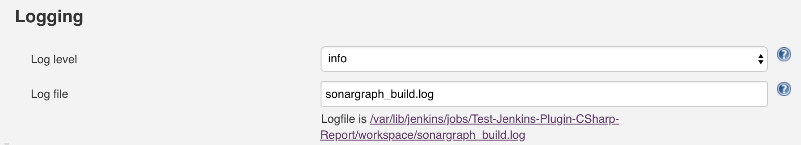#

* *"Log level"* Level of logging detail. One of: off, error, warn, info,
debug, trace, all. Default: info.
* *"Log file"* Path of the log file to be used for SonargraphBuild
(relative to workspace of Jenkins job). Default: sonargraph_build.log.

[.confluence-embedded-file-wrapper .confluence-embedded-manual-size]#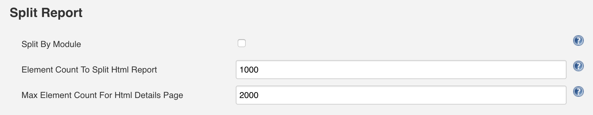#

* *"Split by Module"* Select to create individual HTML reports per
module.
* *"Element Count To Split Html Report"* This parameter controls the
lower limit of items that will cause separate files being generated per
issue type. Possible values are: -1 (never split), 0 (use default
value), 1 (always split), positive number > 1 (threshold for split)
* *"Max Elements Count For Html Details Page"* This parameter controls
the upper limit of elements shown in the table. Possible values are: -1
(no limit), 0 (use default limit), positive number > 1 (maximum number
of elements contained in page).

[[SonargraphIntegrationPlugin-ChartConfiguration]]
==== Chart Configuration

Besides controlling the build result, the plugin also generates graphics
to monitor the trend of metrics across builds and it will display the
full Sonargraph HTML report for each build.

[.confluence-embedded-file-wrapper .confluence-embedded-manual-size]#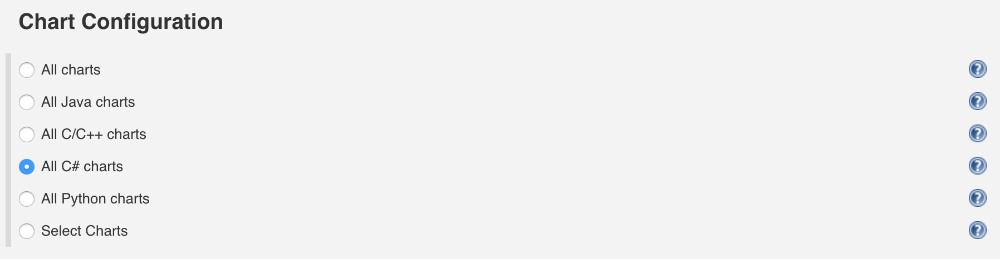#

Either select the charts that you want to show by their language, or
show all of them by selecting "All charts".

[.confluence-embedded-file-wrapper .confluence-embedded-manual-size]#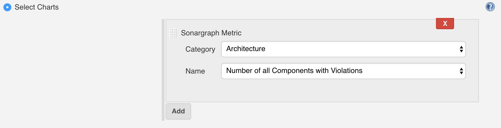#

[[SonargraphIntegrationPlugin-MarkBuild]]
==== Mark Build

For every Sonargraph metric supported by this plugin, you have the
following options:

* Don't mark: Will not change the build result in any way.
* Build unstable: If the value for this metric is greater than zero, the
build result will be set as "unstable".
* Build failed: If the value for this metric is greater than zero, the
build result will be set as "failure".

Take into account that if you have set to mark the build unstable for
one metric, failed for any other and both metric's value are greater
than zero, the worst state will prevail, so the build will be marked as
failure in this case.

NOTE: For the free Jenkins / SonarQube license, only the options for
"cyclic elements" and "empty workspace" are available.

[.confluence-embedded-file-wrapper .confluence-embedded-manual-size]#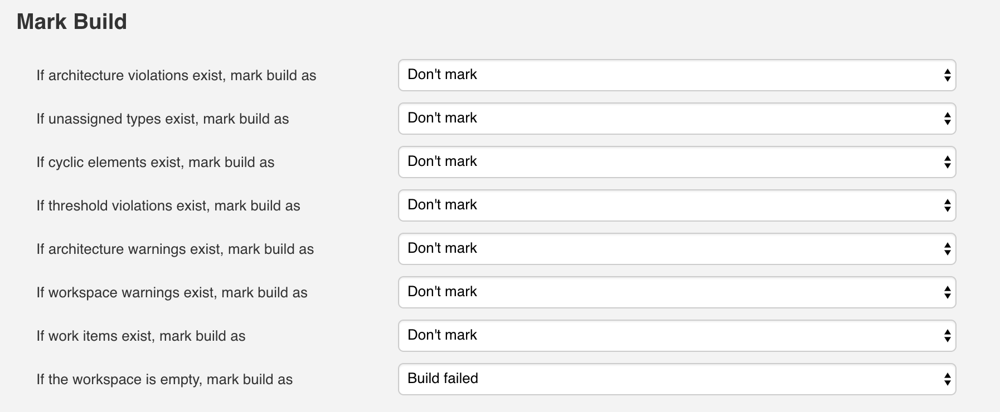#

[[SonargraphIntegrationPlugin-ConfigureJenkinsLogging]]
==== Configure Jenkins Logging

Sonargraph's Jenkins integration uses the standard Jenkins logger
mechanism to provide feedback to the user about the events that occur
during the execution of the post-build action or the generation of the
graphics. To enable this feature follow these steps:

* Go to "Manage Jenkins" -> "System Log".
* Click "Add new log recorder" button.
* Provide the name you wish for this log recorder.
* In the field logger, provide the value with the exact value
"com.hello2morrow.sonargraph.integration.jenkins" (Without the quotation
marks).
* Select the logging level for this logger.

Now you should have the new log recorder configured like this:

[.confluence-embedded-file-wrapper .confluence-embedded-manual-size]#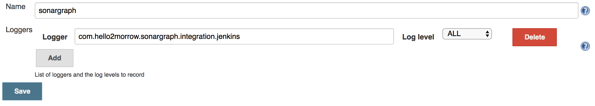#

* Click the save button.

When first created this log recorder is going to be empty and you will
be able to see messages as the post-build actions are executed and
graphics are generated.

[[SonargraphIntegrationPlugin-Changelog]]
=== Changelog

[[SonargraphIntegrationPlugin-2.2.2September5th,2019]]
==== 2.2.2 September 5th, 2019

* Fixed misleading message regarding Cycle Groups
* Fixed link "Show most recent Sonargraph Report"
* Show basic progress info for SonargraphBuild 9.12.0

[[SonargraphIntegrationPlugin-2.2.0December19th,2018]]
==== 2.2.0 December 19th, 2018

* Support for Sonargraph Python systems
* No metadata file needed anymore to get dynamic metrics created by
automated Sonargraph scripts
* Select charts by language
* Requires SonargraphBuild 9.9.2

[[SonargraphIntegrationPlugin-2.1.2October24th,2017]]
==== 2.1.2 October 24th, 2017

* Fixed problem on Jenkins/Java/SonargraphBuild installation directories
containing blanks

[[SonargraphIntegrationPlugin-2.1.1October2nd,2017]]
==== 2.1.1 October 2nd, 2017

* Requires SonargraphBuild 9.4.6

[[SonargraphIntegrationPlugin-2.1.0July7th,2017]]
==== 2.1.0 July 7th, 2017

* Requires SonargraphBuild 9.4.3

[[SonargraphIntegrationPlugin-2.0.2March1st,2017]]
==== 2.0.2 March 1st, 2017

* Fixed Sonargraph Charts on slave

[[SonargraphIntegrationPlugin-2.0.1February15th,2017]]
==== 2.0.1 February 15th, 2017

* Support for Sonargraph License Server
* Support for splitting of large Sonargraph Reports

[[SonargraphIntegrationPlugin-2.0.0December23rd,2016]]
==== 2.0.0 December 23rd, 2016

* Support for new Sonargraph Report format
* Requires SonargraphBuild 9.1.1

[[SonargraphIntegrationPlugin-1.1.4August25th,2016]]
==== 1.1.4 August 25th, 2016

* Fixed "Pre-Generated" on slave
* Fixed "Generate with Sonargraph Build" on slave
* Fixed report history for "Pre-Generated" when report name was changed
from default

[[SonargraphIntegrationPlugin-1.0.5July28th,2016]]
==== 1.0.5 July 28th, 2016

* Added configuration parameter "logLevel" (ironiusn)
* Set build result "failed" instead of "aborted" if report is missing
(patrickschlebusch)
* Added configuration parameter "logFile"
* Updated default meta data file
* Read changed meta data file immediately

[[SonargraphIntegrationPlugin-CompatibilityMatrix]]
=== Compatibility Matrix

Plugin version 2.2.0: Compatible with SonargraphBuild >= 9.9.2 and
Jenkins >= 2.138.2

Plugin version 2.1.1: Compatible with SonargraphBuild >= 9.4.6 and
Jenkins >= 1.609.3

Plugin version 2.1.0: Compatible with SonargraphBuild >= 9.4.3 and
Jenkins >= 1.609.3

Plugin version 2.0.0: Compatible with SonargraphBuild 9.1.1 - 9.4.2 and
Jenkins >= 1.609.3

Plugin version 1.1.4: Compatible with SonargraphBuild 8.x - 9.1.0 and
Jenkins >= 1.609.3
