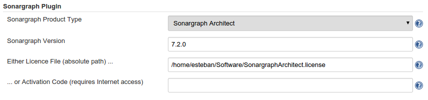
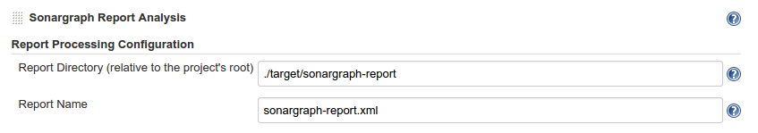
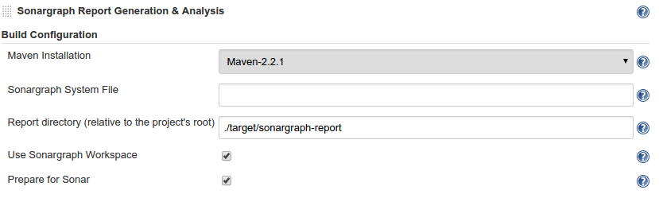
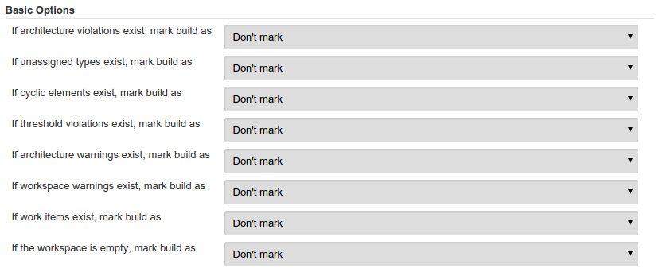
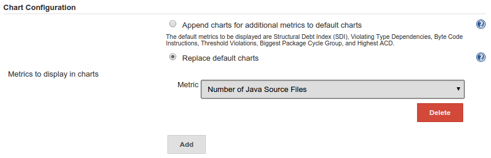
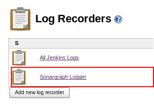
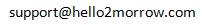

[[SonargraphPlugin-SonargraphPlugin]]
== Sonargraph Plugin

[.conf-macro .output-inline]# #

This plugin integrates
https://www.hello2morrow.com/products/sonargraph[Sonargraph] version 7
into your build. Sonargraph allows to define an architecture for a
software system and automatically checks how the code base conforms to
it.

For Sonargraph 8 and newer use
https://wiki.jenkins-ci.org/display/JENKINS/Sonargraph+Integration+Plugin[Sonargraph
Integration Plugin].

[[SonargraphPlugin-Contents]]
=== *Contents*

[[SonargraphPlugin-Introduction]]
=== Introduction

https://www.hello2morrow.com/products/sonargraph[Sonargraph] analyzes
the static (i.e. compile-time) dependencies of your software. The
free-of-charge license for the integration with Jenkins and also
http://www.sonarsource.org/[SonarQube] allows to detect cyclic
dependencies and additional metrics. You can mark the build as
"unstable" or "failed" if cyclic dependencies are detected. +
The real benefit of Sonargraph is that you can define a logical
architecture and perform automatic checks how the code conforms to it.
This functionality is only available for free, if you are working on a
non-commercial Open-Source project or if your project is sufficiently
small. More information is available on our
https://www.hello2morrow.com/[homepage], you can check there if you are
elligible for a https://www.hello2morrow.com/products/pricelist[free
license].

The Sonargraph Build component integrates Sonargraph in Ant and Maven
based builds. This Jenkins plugin allows to define if the build should
be marked as "unstable" or "failed" if architecture violations, cyclic
dependencies, etc. are detected. Trends of metrics are displayed in
charts and additionally the generated detailed HTML report is available
for each build.

[[SonargraphPlugin-GettingStarted]]
=== Getting Started

If you already have Sonargraph integrated in your build, use the
post-build step called
"https://wiki.jenkins-ci.org/display/JENKINS/Sonargraph+Plugin#SonargraphPlugin-SonargraphReportAnalysis-JobConfiguration[Sonargraph
Report Analysis]".

If you are new to Sonargraph, we advice you to register on our
http://www.hello2morrow.com/[Sonargraph Web Site], have a look at the
whitepapers and screencasts to get an idea of Sonargraph's
capabilities. +
You need to have a license in order to analyse a project. To get started
an evaluation license or the free integration license is sufficient. +
Download and install the correct version for your platform. A detailed
user manual is available in
<sonargraph-inst-dir/docs/pdf/Sonargraph-User-Manual.pdf that describes
how to integrate the analysis into your build process.

If you are new to Sonargraph and your build is based on Maven, use the
post-build step called
"https://wiki.jenkins-ci.org/display/JENKINS/Sonargraph+Plugin#SonargraphPlugin-SonargraphReportGeneration&Analysis-JobConfiguration[Sonargraph
Report Generation & Analysis]".

If you are new to Sonargraph and your build is not based on Maven, you
need to install Sonargraph on your build server and generate the
Sonargraph report during one of your build steps. This report can then
be evaluated in the post-build step called
"https://wiki.jenkins-ci.org/display/JENKINS/Sonargraph+Plugin#SonargraphPlugin-SonargraphReportAnalysis-JobConfiguration[Sonargraph
Report Analysis]".

NOTE: This Jenkins plugin requires Sonargraph version 7.1.9 and newer.
For Sonargraph 8 and newer
use https://wiki.jenkins-ci.org/display/JENKINS/Sonargraph+Integration+Plugin[Sonargraph
Integration Plugin].

[[SonargraphPlugin-GlobalConfiguration]]
==== Global Configuration

To see the global configuration options after installing the plugin, go
to "Manage Jenkins" -> "Configure System". You will find the "Sonargraph
Plugin" section 

[.confluence-embedded-file-wrapper]##

*NOTE:* This configuration is only required when you are going to use
the "Sonargraph Report Generation & Analysis" post-build action.

Set the global options for Sonagraph as follows:

* Sonargraph Product Type: Select either Sonargraph Architect or
Sonargraph Quality according to the product that you have purchased.
* Sonargraph Version: Provide the version of the product that you have
purchased. Only versions equal or greater than 7.1.9 are supported by
this plugin.
* License File: Provide an absolute path to a Sonargraph valid license
file in case you have one. License files are valid for up to 180 days.
* Activation Code: Enter a valid Sonargraph activation code in case you
have one. This operation requires Internet access as license tickets are
renewed automatically.

You can use the https://www.hello2morrow.com/[hello2morrow web site],
section "Your licenses" for managing license files and activation codes.

*NOTE:* If you haven't already used Sonargraph in your Maven build, you
have to make sure that you specify the following plugin repository
either in Maven's settings.xml, or in the project's pom.xml:

[source,syntaxhighlighter-pre]
----
        <pluginRepository>
          <id>hello2morrow.maven.repository</id>
          <url>http://maven.hello2morrow.com/repository</url>
        </pluginRepository>
----

*NOTE:* If you have a M2_HOME environment variable configured on the
machine executing the plugin, this Maven installation will be used by
the "Sonargraph Report Generation & Analysis" post build-step to
generate the report. The Maven installation configured in the
Jenkins-job itself will be ignored. +
This might lead to strange "failed to resolve plugin" error messages, if
that Maven installation has not the hello2morrow repository configured
as shown above.

[[SonargraphPlugin-SonargraphReportAnalysis-JobConfiguration]]
==== Sonargraph Report Analysis - Job Configuration

Use this post-build action for projects that are already using
Sonargraph Build. This action analyses the generated report and allows
to configure the overall result of the build depending on the results of
the analysis. If you have a project that relies on ANT based builds this
is the way to go to add Sonargraph functionality into your build job in
Jenkins.

Make sure that you use the same values for the parameters "report
directory" and "report name" that you have configured in your existing
Sonargraph Build integration. +
Additionally, add the flag "prepareForJenkins=true" to your existing
Sonargraph build. (e.g. <createReportTask ... prepareForJenkins=true ...
/>).

[.confluence-embedded-file-wrapper]##

[[SonargraphPlugin-ReportProcessingConfiguration]]
===== Report Processing Configuration

The following parametern must be supplied to configure this post-build
action:

* Report Directory: Enter the path to the directory where the Sonargraph
XML and HTML reports will be stored. This path must be relative to the
workspace. If you are using the Sonargraph ANT task for report
generation, make sure that the directories match.
* Report Name: Enter the name of the XML report file that has been
generated via the ANT or Maven integration of Sonargraph. If you are
using the Sonargraph ANT task for report generation, make sure that the
names match.

[[SonargraphPlugin-SonargraphReportGeneration&Analysis-JobConfiguration]]
==== Sonargraph Report Generation & Analysis - Job Configuration

Use this post-build action for integration of Sonargraph into Maven
based projects that are not already configured to use Sonargraph Build.
It will run Sonargraph's Maven goal generating XML and HTML reports for
further analysis by this plugin.

After installing the Sonargraph plugin into Jenkins, go to the
"Post-Build Actions" and select "Sonargraph Report Generation &
Analysis". The following options will be displayed:   

[.confluence-embedded-file-wrapper]##

[[SonargraphPlugin-BuildConfiguration]]
===== Build Configuration

The following parameters must be supplied to configure this post-build
action:

* Maven Installation: Select the Maven installation that will run
Sonargraph's goal. The elements displayed in this list will match the
Maven installations configured in "Manage Jenkins" -> "Configure
System". +
*NOTE:* A M2_HOME environment variable overrides this configuration!
* Sonargraph System File: Enter the path to the Sonargraph system
(.sonargraph) file. This path must be relative to the workspace. In case
you have a Sonargraph / Jenkins license you must not provide a system
file.
* Report directory: Enter the path to the directory where the Sonargraph
XML and HTML reports will be stored. This path must be relative to the
workspace.
* Use Sonargraph Workspace: Select if you want to use the workspace
defined in Sonargraph. If unselected, the source and target folders
defined in your pom.xml are used. This option must be unselected, if you
don't provide a Sonargraph system file.
* Prepare for Sonar: Select this option, if you want to publish
Sonargraph metrics to SonarQube.

[[SonargraphPlugin-Commonoptions]]
==== Common options

Both "Sonargraph Report Analysis" and "Sonargraph Report Generation &
Analysis" post-build steps share the same basic and advanced options: 

[[SonargraphPlugin-Basicoptions]]
===== Basic options

For every Sonargraph metric supported by this plugin, you have the
following options:

* Don't mark: Will not change the build result in any way.
* Build unstable: If the value for this metric is greater than zero, the
build result will be set as "unstable".
* Build failed: If the value for this metric is greater than zero, the
build result will be set as "failure". 

[.confluence-embedded-file-wrapper]##

Take into account that if you have set to mark the build unstable for
one metric, failed for any other and both metric's value are greater
than zero, the worst state will prevail, so the build will be marked as
failure in this case.

Known issue: In multi-module projects the goal "package" is executed
again (skipping the tests) as in some cases sub-modules are reported as
missing.

[[SonargraphPlugin-Advancedoptions(Chartconfiguration)]]
===== Advanced options (Chart configuration)

Sonargraph post-build steps allow the configuration of metrics that will
be displayed in the Sonargraph Job Page (See next section "Sonargraph
Job Page"). You have the following options:

* Append charts for additional metrics to default charts: The default
set of metrics will be shown plus the supplied metrics.
* Replace default charts: Only the supplied metrics will be displayed
and the the default ones will be discarded, however, the default metrics
will be available to be supplied.   

[.confluence-embedded-file-wrapper]##

[.aui-icon .aui-icon-small .aui-iconfont-warning .confluence-information-macro-icon]#
#

Changes will be visible only after the next build!

[[SonargraphPlugin-SonargraphJobPage]]
==== Sonargraph Job Page

For each job that the Sonargraph Jenkins Plugin is configured, a page is
available that shows short-term trends of metrics for the last 25 builds
and long-term trends of metrics for the complete job life-time.

To achieve reasonable performance for the creation of the charts, the
number of sampling points for the long-term charts is limited to 300. If
there are more sampling points available the data set is reduced by
calculating averages for adjacent points. The displayed long-term trend
is a 24h moving average.

[[SonargraphPlugin-ConfigureLogging]]
==== Configure Logging

Sonargraph's Jenkins integration uses default Jekins mechanism to
provide feedback to the user about the events that occur during the
execution of the post-build actions or the generation of the graphics.
To enable this feature follow these steps:

. Go to "Manage Jenkis" -> "System Log".
. Click "Add new log recorder" button.
. Provide the name you wish for this log recorder.
. In the field logger, provide the value with the exact value
"com.hello2morrow.sonargraph.jenkinsplugin" (Without the quotation
marks).
. Select the logging level for this logger.
. Click the save button.

You will now see an entry for the Sonargraph logger as shown in the
image:

[.confluence-embedded-file-wrapper]##

When first created this logger is going to be empty and you will be able
to see messages as the post-build actions are executed and graphics are
generated. Take into account that the messages will appear sorted by
date in a descending order, meaning that most recent entries will be
shown at the top.

[[SonargraphPlugin-FAQ]]
=== FAQ

Will be elaborated in the future.

If your question is not answered here, please have a look at the
Sonargraph_User_Manual.pdf contained in <sonargraph-inst-dir>/doc/pdf. +
Further questions should be sent to:

[.confluence-embedded-file-wrapper]##

[[SonargraphPlugin-Changelog]]
=== Changelog

[[SonargraphPlugin-1.6.4]]
==== 1.6.4

Bug fixes:

* https://issues.jenkins-ci.org/browse/JENKINS-29187[JENKINS-29187]
Support master-slave setup.
* Use configured Maven installation.

[[SonargraphPlugin-1.6.3]]
==== 1.6.3

Bug fixes:

* Fixed error after plugin update without saving the configuration.

[[SonargraphPlugin-1.6.2]]
==== 1.6.2

Improvements:

* Show default set of metrics after plugin update.

[[SonargraphPlugin-1.6.1]]
==== 1.6.1

Bug fixes:

* Fixed path validation for Sonargraph's license file.

Improvements:

* Sonargraph version is now supplied in a text field instead of being
selected in a drop down list.

New features:

* Charts for metrics displayed in the Sonargraph job page can now be
configured in both post build steps.

[[SonargraphPlugin-1.3]]
==== 1.3

Bug fixes:

* Fixed Sonargraph chart action not appearing for maven based projects.

Improvements:

* Plugin now supports different locations for the pom.xml file relying
on the maven build step configuration.
* Now Sonargraph versions 7.1.9, 7.1.10 and 7.2.0 are supported

[[SonargraphPlugin-1.2]]
==== 1.2

Improvements:

* Minor improvements

[[SonargraphPlugin-1.1]]
==== 1.1

Initial version.

[[SonargraphPlugin-FollowUs!]]
=== Follow Us!

https://www.facebook.com/sonargraph[[.confluence-embedded-file-wrapper]##]  
https://twitter.com/sonargraph[[.confluence-embedded-file-wrapper]##]  
https://www.linkedin.com/company/hello2morrow[[.confluence-embedded-file-wrapper]##]
