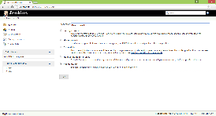
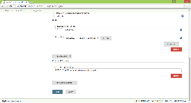

The TurboScript plugin for Jenkins allows to automatically build Spoon
images and push them to the Turbo.net Hub or local repository.

 +
The TurboScript Jenkins plugin includes the following capabilities:

* Build an image with TurboScript
* Push the resulting image to the Turbo.net Hub
* Export an image to the local repository
* Trigger a build job using webhooks

[[TurboScriptPlugin-QuickTour]]
== Quick Tour

[[TurboScriptPlugin-BuildanimagewithTurboScript]]
=== Build an image with TurboScript

. Create a new Jenkins item and select a *Turbo Project* as its type. +
[.confluence-embedded-file-wrapper]##
. Add *Execute TurboScript* build step. +
[.confluence-embedded-file-wrapper]##
. By convention, the default name for a TurboScript file is *turbo.me*.
It should be located in the Jenkins project workspace which corresponds
to the root directory of a GitHub project. +
[.confluence-embedded-file-wrapper]##
. Write a TurboScript to define how a new image should be created. For
more information about TurboScript refer to
the https://turbo.net/docs/reference/turboscript[language reference] or
take a look at sample scripts
in https://github.com/turboapps/turbome[GitHub].
. Provide credentials to a Turbo.net account. If no credentials are
provided, the TurboScript will be run as the currently logged on user. +
[.confluence-embedded-file-wrapper]##
. For enterprise deployments you may be interested in building images
that target a specific version of the Turbo VM. To gain access to this
and other optional settings, click *Advanced* button. For more
information about specific options, click buttons with help content or
refer to the https://turbo.net/docs/reference#build[online
documentation]. +
[.confluence-embedded-file-wrapper]##
. Save your changes and test the script by triggering the job manually.
In the next sections you will learn how to push new images to the
Turbo.net Hub.

[[TurboScriptPlugin-PushanimagetotheSpoon.netHub]]
=== Push an image to the Spoon.net Hub

Pushing images to the Turbo.net Hub is available as post-build action:

         
[.confluence-embedded-file-wrapper]##

There are three options for naming the new remote image:

. Use the same name as the local image.
. Generate the remote image name from the Git information for your
project (organization, project, branch, and current head version). Note
that you cannot publish images from an organization to which you do not
belong. For example, if your Spoon.net account name
is *JimmyKimmel* then you won’t be allowed to push images
as *OprahWinfrey*. If this is required, then overwrite the name of the
GitHub organization with your account name. +
[.confluence-embedded-file-wrapper]##
. Use a fixed remote image name hardcoded in the job definition.
Optionally, you may append a suffix from the date and time in order to
keep old images available in the Spoon.net Hub. +
[.confluence-embedded-file-wrapper]#image:docs/images/jenkins_push_fixed_image_name.png[image]#

[[TurboScriptPlugin-Exportanimagetothelocalrepository]]
=== Export an image to the local repository

Exporting images to the local repository is available as post-build
action:

         
[.confluence-embedded-file-wrapper]## +
         
[.confluence-embedded-file-wrapper]##

[[TurboScriptPlugin-Removeanimagefromthelocalrepository]]
=== Remove an image from the local repository

New images will remain in the local repository unless they are deleted
using the `+spoon rmi <image_name>+` command. This step can be included
in the job definition using the post-build action *Remove local Turbo
image*.

         
[.confluence-embedded-file-wrapper]##

[[TurboScriptPlugin-Triggerabuildjobusingwebhooks]]
=== Trigger a build job using webhooks

You may decide to build a Turbo container image whenever the source code
changes for your project. To facilitate this, a Turbo Jenkins job can be
triggered using an HTTP POST request. The request content is required to
be compatible with the structure
of https://developer.github.com/webhooks/[GitHub webhook events].

         
[.confluence-embedded-file-wrapper]##

Webhook messages are sent to Jenkins_URL/turbo-webhook endpoint as POST
with `+Content-Type+` set to `+application/x-www-form-urlencoded+`.

         
[.confluence-embedded-file-wrapper]##

Enjoy and please send any feedback or questions
to https://twitter.com/turbohq[@turbohq]!

[[TurboScriptPlugin-ChangeLog]]
== Change Log

[[TurboScriptPlugin-Version1.2(Jan4,2016)]]
=== Version 1.2 (Jan 4, 2016)

* Build and profile streaming models
* Take snapshots using Studio, Vagrant, VirtualBox

[[TurboScriptPlugin-Version1.1(Oct10,2015)]]
=== Version 1.1 (Oct 10, 2015)

* Rename and update to work with Turbo.net

[[TurboScriptPlugin-Version1.0(Apr21,2014)]]
=== Version 1.0 (Apr 21, 2014)

* Build an image with TurboScript
* Push the resulting image to the Turbo.net Hub
* Export an image to the local repository
* Trigger a build job using webhooks
* Integration with Credentials plugin
* Integration with Git plugin
