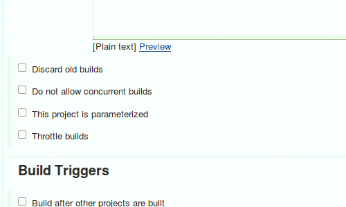
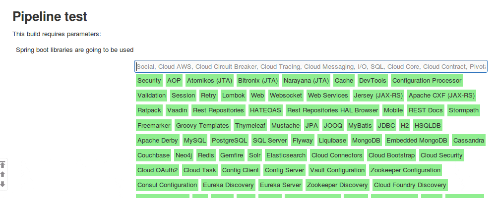
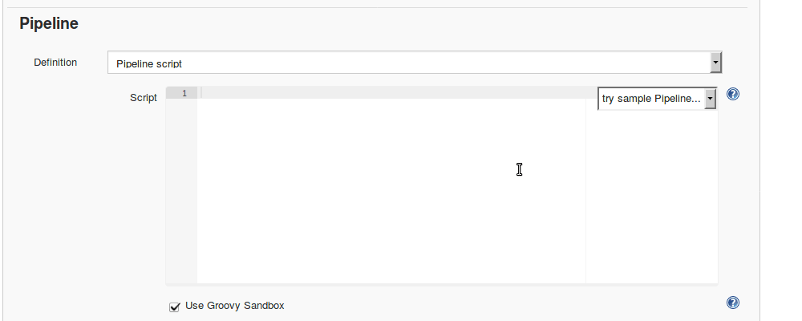

[[SpringInitializrPlugin-Pluginspring-initializr-plugin]]
== Plugin spring-initializr-plugin

 +
Add build parameter to be able to select spring dependencies (Spring
Initalzr, http://start.spring.io)

[[SpringInitializrPlugin-Getstarted]]
== Get started

. Make you build Parametrized
. Add Spring boot libraries parameter +
[.confluence-embedded-file-wrapper .confluence-embedded-manual-size]##
. Build it with parameters +
[.confluence-embedded-file-wrapper]##
. Now create Pipeline Job that generates spring boot application. Use
springBoot pipeline step +
[.confluence-embedded-file-wrapper .confluence-embedded-manual-size]##

[[SpringInitializrPlugin-springBootpipelinestep]]
== springBoot pipeline step

[source,syntaxhighlighter-pre]
----
springBoot <name>: <value>, <name>: <value>, ...  
----

[width="100%",cols="34%,33%,33%",options="header",]
|===
|Parameter |Default Value |Desciption
a|
....
selectedIDs 
....

|<empty> |Comma separated id from sprig boot libraries plugin
a|
....
type
....

|maven-project |maven-project, gradle-project
a|
....
bootVersion 
....

|1.5.3.RELEASE |1.3.8.RELEASE, 1.4.6.RELEASE,1.5.3.RELEASE
|groupId  |ru.ts.psb.cloud |<groupId>
a|
....
artifactId
....

|demo |<artifactId>
a|
....
packageName
....

|<groupId>.<artifactId> |package of main class
a|
....
description
....

|<empty> |content of <description> tag of pom.xml
a|
....
packaging
....

|jar |jar, war
a|
....
javaVersion
....

|1.8 |1.6, 1.7, 1.8
a|
....
language
....

|java |java, groovy, kotlin
a|
....
autocomplete
....

|<empty> |Not sure what does it used for.
|===
