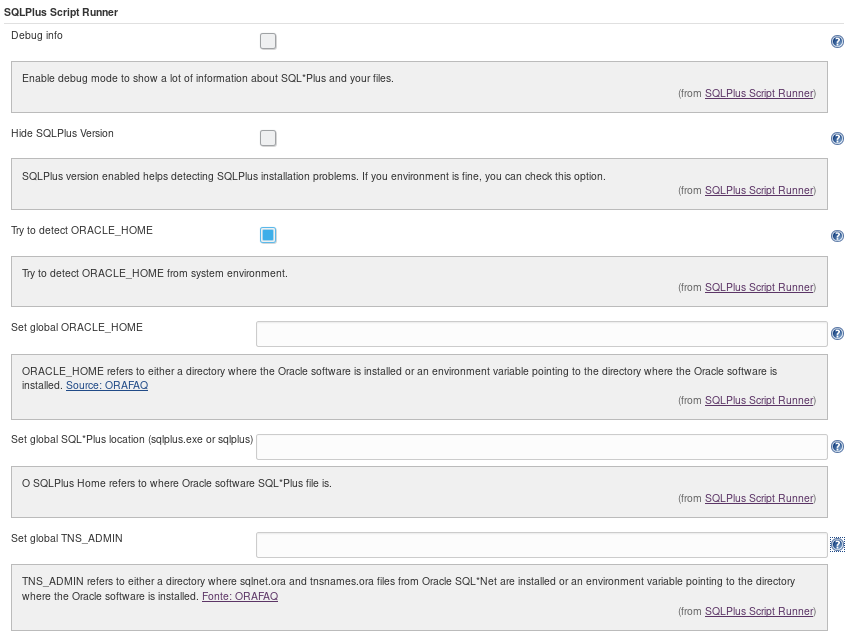
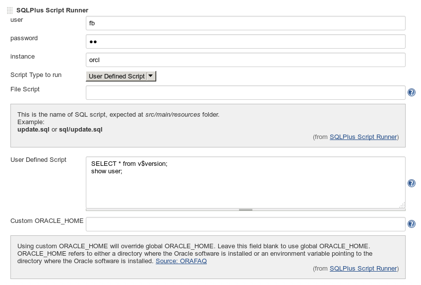
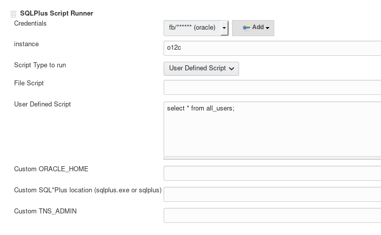
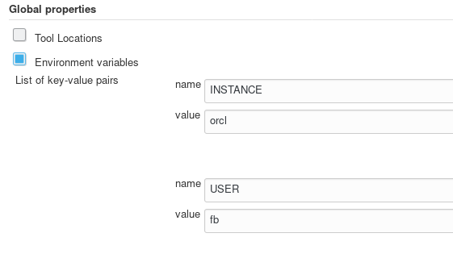
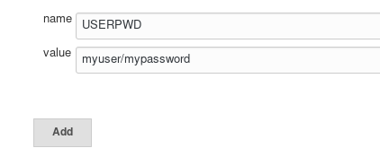
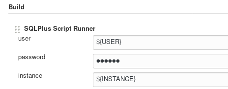
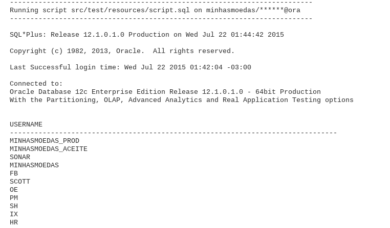

[.conf-macro .output-inline]#This plugin enables you run
http://www.orafaq.com/wiki/SQL*Plus_FAQ[Oracle SQL*Plus] scripts on your
Jenkins jobs (user defined scripts or a script inside a workspace).#

[[SQLPlusScriptRunnerPlugin-Releases]]
== Releases

* *1.x* - For Jenkins 1.x

* *2.x* - For mainly Jenkins 2.x, credentials plugins implemented and
pipeline support

 +

Migration Guide

[.aui-icon .aui-icon-small .aui-iconfont-info .confluence-information-macro-icon]#
#

To migrate your workspace from version 2 is very simple, all you need to
do is:

. Create a credential for your user and password;
. Edit you job configuration and select one credential;
. Save your changes and you are good to go!

 +

 +

[[SQLPlusScriptRunnerPlugin-Summary]]
== Summary

This plugin enables you run Oracle SQL*Plus scripts on your Jenkins jobs
( _Oracle SQL*Plus installation required!_ ).

[[SQLPlusScriptRunnerPlugin-Configuration]]
== Configuration

[[SQLPlusScriptRunnerPlugin-Global]]
=== Global

All you have to do is check the auto detect ORACLE_HOME option ( or a
valid _ORACLE_HOME_ ) and you are in business:

[.confluence-embedded-file-wrapper]##

 +

 +

If you are having problems try to enable _Debug info_ to see what is
going on.

[[SQLPlusScriptRunnerPlugin-ByJob]]
=== By Job

You can run a script inside your workspace or a user defined for every
job:

 +

Version 1.x:

 +

 
[.confluence-embedded-file-wrapper]##

 +

Version 2.x :

 +

[.confluence-embedded-file-wrapper]##

[[SQLPlusScriptRunnerPlugin-Environmentvariables]]
== Environment variables

 +

Pay attention to what version you are using in order to work with
variables:

 +

[cols=",^,^",options="header",]
|===
|variable |Version 1.x |Version 2.x
|user |  ok |_replaced by credentials_
|password | ok |_replaced by credentials_
|instance |ok |ok
|===

 +

 +

You can use global variables for *user* and *instance*, first creating
it in __Jenkins__→ _configuration_ :

[.confluence-embedded-file-wrapper]##

 +

You _user_ global variable can hold *username and password* as well like
this (_username/password_):

 +

[.confluence-embedded-file-wrapper]##

 +

And then using it:

[.confluence-embedded-file-wrapper]##

[[SQLPlusScriptRunnerPlugin-Running]]
== Running

You can check later all SQL*Plus output inside your build output:

[.confluence-embedded-file-wrapper]##

 +

[[SQLPlusScriptRunnerPlugin-Pipeline]]
== Pipeline

 +

[[SQLPlusScriptRunnerPlugin-Userdefinedscript]]
=== User defined script

 +

[source,syntaxhighlighter-pre]
----
node {
   echo 'SQLPlusRunner running user define script for system@xe'
  
 step([$class: 'SQLPlusRunnerBuilder',credentialsId:'system', 
instance:'xe',scriptType:'userDefined', script: '',scriptContent: 
'select * from v$version'])
}
----

 +

 +

[[SQLPlusScriptRunnerPlugin-Filescript]]
=== File script

 +

[source,syntaxhighlighter-pre]
----
node {
   echo 'SQLPlusRunner running file script for system@xe'
  
 step([$class: 'SQLPlusRunnerBuilder',credentialsId:'system', 
instance:'xe',scriptType:'file', script: 'start.sql',scriptContent: ''])
}
----

 +

 +

[[SQLPlusScriptRunnerPlugin-Optionalpipelineparameters]]
=== Optional pipeline parameters

 +

* customOracleHome
* customSQLPlusHome
* customTNSAdmin

 +

 +

Download the last release and give it a try!

[[SQLPlusScriptRunnerPlugin-Reportedproblems]]
== Reported problems

 +

[[SQLPlusScriptRunnerPlugin-myscripttakesforevertoexecute...]]
=== my script takes forever to execute...

 +

_Windows_ users sometimes get a running script stuck on build, even
though they run everything on Oracle.

In that case you should use
https://wiki.jenkins.io/display/JENKINS/Build-timeout+Plugin[Build]
https://wiki.jenkins.io/display/JENKINS/Build-timeout+Plugin[Time Out
plugin] together to get everything working fine.

 +

[[SQLPlusScriptRunnerPlugin-IhaveanerrorORA-????]]
=== I have an error ORA-????

 +

You should try running manually SQL*Plus before use Jenkins.

Sometimes on _Linux_ Jenkins has his *own* Operation System user with
his own variables.

 +

[[SQLPlusScriptRunnerPlugin-EverytimeIgetthiserror:cannotfindsqlplus]]
=== Every time I get this error: _cannot find sqlplus +
_

 +

Jenkins plugin can't find SQL*Plus executable file.

You should do in this order:

. Stop Jenkins;
. Find where are _sqlplus executable_ file (usually at *$ORACLE_HOME*);
. Check if they have proper permissions (_chmod 755 *_);
. Create a global environment variable *ORACLE_HOME* like this: +
*export ORACLE_HOME=/oracle/app/oracle/product/12.1.0/dbhome_1/   * or  
*export ORACLE_HOME=<your-sqlplus-directory>*
. Test your environment with:  _sqlplus -v   _ , should return *SQL*Plus
version like SQL*Plus: Release 12.1.0.1.0 Production*
. Start Jenkins;
. Use the try to detect *ORACLE_HOME* option;
. Retry your SQL*Plus operation.

 +

[[SQLPlusScriptRunnerPlugin-EverytimeIgetthiserror:libsqlplus.so:cannotopensharedobjectfile:NosuchfileordirectoryorSP2-0667:Messagefilesp1.msbnotfound]]
=== Every time I get this error: _libsqlplus.so: cannot open shared object file: No such file or directory_ or _SP2-0667: Message file sp1.msb_ not found

 +

SQL*Plus need its library and its message file to work properly.

You should do in this order:

. Stop Jenkins;
. Find where are _libsqlplus.so_ files (usually at *$ORACLE_HOME\lib* );
. Check if they have proper permissions (_chmod 755 *_);
. Create a global environment variable *LD_LIBRARY_PATH* like this: +
*export LD_LIBRARY_PATH=$ORACLE_HOME/lib:$LD_LIBRARY_PATH *   or  
*export LD_LIBRARY_PATH=<your-libsqlplus-directory>:$LD_LIBRARY_PATH*
. Test your environment with:  _sqlplus -v   _ , should return *SQL*Plus
version like SQL*Plus: Release 12.1.0.1.0 Production*
. Start Jenkins;
. Use the try to detect *ORACLE_HOME* option;
. Retry your SQL*Plus operation.

 +

[[SQLPlusScriptRunnerPlugin-Iwanttohidemyuser/passwordfromConsoleOutput]]
=== I want to hide my user / password from Console Output

 +

. Install
https://wiki.jenkins.io/display/JENKINS/Mask%2BPasswords%2BPlugin[Mask
Passwords Plugin];
. Setup to hide everything you want.
+
 +
 +
+
 +

[[SQLPlusScriptRunnerPlugin-Ihaveabugtoreport]]
== I have a bug to report

Please
https://github.com/jenkinsci/sqlplus-script-runner-plugin/issues/new[open
a new issue] and inform:

* Jenkins server Operation System;
* Jenkins version ;
* Where SQLPlus Script Runner is running (_local_ machine or _slave_
machine);
* Slave machine Operation System (if applicable);
* Oracle Database version;
* Oracle SQL*Plus version;
* Build log with debug info enabled.

 
