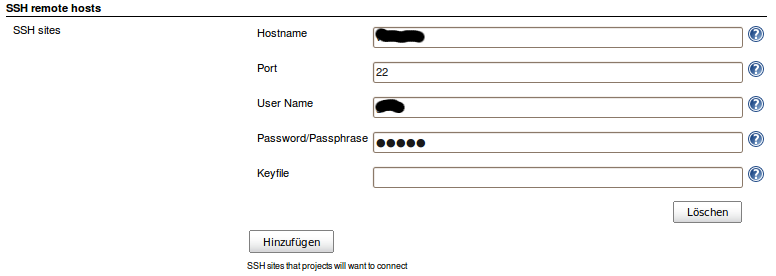
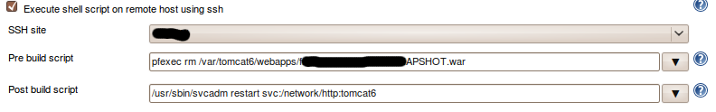
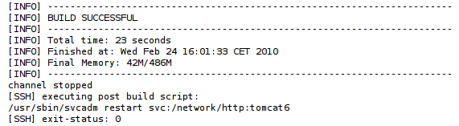

[.conf-macro .output-inline]##

[cols="",options="header",]
|===
|Plugin Information
|View SSH https://plugins.jenkins.io/ssh[on the plugin site] for more
information.
|===

[.aui-icon .aui-icon-small .aui-iconfont-info .confluence-information-macro-icon]##

Older versions of this plugin may not be safe to use. Please review the
following warnings before using an older version:

* https://jenkins.io/security/advisory/2017-07-10/[Credentials are
stored in unencrypted configuration files]

[[SSHplugin-Plugininfo]]
== Plugin info

This Plugin was derived from the very cool
https://wiki.jenkins-ci.org/display/JENKINS/SCP+plugin[SCP Plugin].You
can use the SSH Plugin to run shell commands on a remote machine via
ssh.

'''''

[[SSHplugin-Usage]]
== Usage

First go to the global configuration page and add a SSH site.

[.confluence-embedded-file-wrapper .confluence-embedded-manual-size]##

For your job select a configured site and enter the shell commands that
should be executed before and after the build.

[.confluence-embedded-file-wrapper]##

Log will look like this.

[.confluence-embedded-file-wrapper]##

'''''

[[SSHplugin-TODO]]
== TODO

* i18n
* we also need a post deploy script (ask some of the core team how to do
that)
* investigate stop behavior of Hudson jobs using the ssh Plugin
* use same sites as scp plugin (plugin dependencies???)
* ...

'''''

 +

[[SSHplugin-Changelog]]
== Changelog

[[SSHplugin-Version2.6.1(April132018)]]
=== Version 2.6.1 (April 13 2018)

* [JENKINS-19973] Option to hide ssh command in log

[[SSHplugin-Version2.6(April72018)]]
=== Version 2.6 (April 7 2018)

* [JENKINS-46172] Handle NPE when not all fields are specified & save
only properly configured sites
* [JENKINS-10128] Set build to UNSTABLE when no SSH site is configured
instead of NPE
* Add Jenkinsfile to plugin
* bump ssh-credentials dependency to 1.12
* Add ajax validation to essential ssh host fields

INFO: the "Add Credentials" button for SSH Site *don't work* in recent
Jenkins 2.x versions - this will be fixed in upcoming 3.0 version. +
(major version since plugin will have to migrate it's configuration to
new format)

[[SSHplugin-Version2.5(July82017)]]
=== Version 2.5 (July 8 2017)

* [JENKINS-21436] Integrate with the SSH Credentials Plugin; previous
credentials are migrated
* [JENKINS-23231] Add timeout parameter
* [JENKINS-24913] Don't show sensitive build variables in console log
* [JENKINS-12191] Restore resolving hostname from environment variables
* [JENKINS-12191] Support build variables (substitution variables)
during command execution (env variables are exported before the script)
* [JENKINS-24402] Updated to latest version of JSch (0.1.54) to support
modern algorithms
* Pull JSch dependency via Jenkins hosted jsch-plugin to use recommended
way of getting common dependencies in Jenkins
* Set Jenkins 1.609.3 as the oldest supported version
* Show warning for missing parameters during ajax form validation
* Fix security issue

Due to added integration with SSH Credentials Plugin, *this version
might NOT be fully compatibile* with previous version. Sorry!

Please *backup your org.jvnet.hudson.plugins.SSHBuildWrapper.xml* before
upgrading to version 2.5.* +
*

[[SSHplugin-Version2.4(Jan082014)]]
=== Version 2.4 (Jan 08 2014)

* ability to use variables when defining SSH host
* miscellaneous fixes
* added keep alive interval

[[SSHplugin-Version2.3(Sep242012)]]
=== Version 2.3 (Sep 24 2012)

* fixed
https://issues.jenkins-ci.org/browse/JENKINS-15265[JENKINS-15265]

[[SSHplugin-Version2.2(Sep032012)]]
=== Version 2.2 (Sep 03 2012)

* fixed https://issues.jenkins-ci.org/browse/JENKINS-15005[JENKINS-15005]
and https://issues.jenkins-ci.org/browse/JENKINS-14420[JENKINS-14420]

[[SSHplugin-Version2.1(Aug142012)]]
=== Version 2.1 (Aug 14 2012)

* configurable pty mode

[[SSHplugin-Version2.0(Jun26,2012)]]
=== Version 2.0 (Jun 26, 2012)

* support multiple sites on the same machine

[[SSHplugin-Version1.6(Jun24,2012)]]
=== Version 1.6 (Jun 24, 2012)

* support parameterized builds

[[SSHplugin-Version1.3(Jun25,2011)]]
=== Version 1.3 (Jun 25, 2011)

* Run script on build step.
* Fixed https://issues.jenkins-ci.org/browse/JENKINS-9240[JENKINS-9240]

[[SSHplugin-Version1.2(Feb17,2011)]]
=== Version 1.2 (Feb 17, 2011)

* Fix to avoid executing empty script.

[[SSHplugin-Version1.1(Jun2,2010)]]
=== Version 1.1 (Jun 2, 2010)

* Removed isEmpty() for 1.5 comp; better input areas

[[SSHplugin-Version1.0(Feb24,2010)]]
=== Version 1.0 (Feb 24, 2010)

* Initial release.
