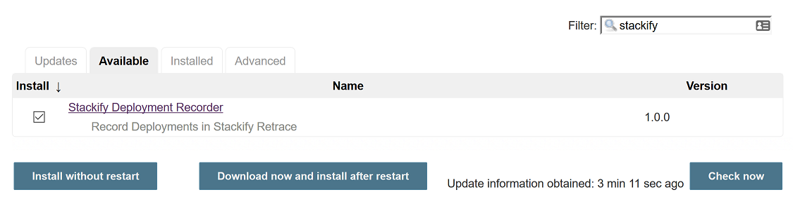
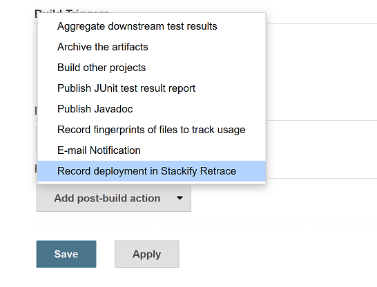
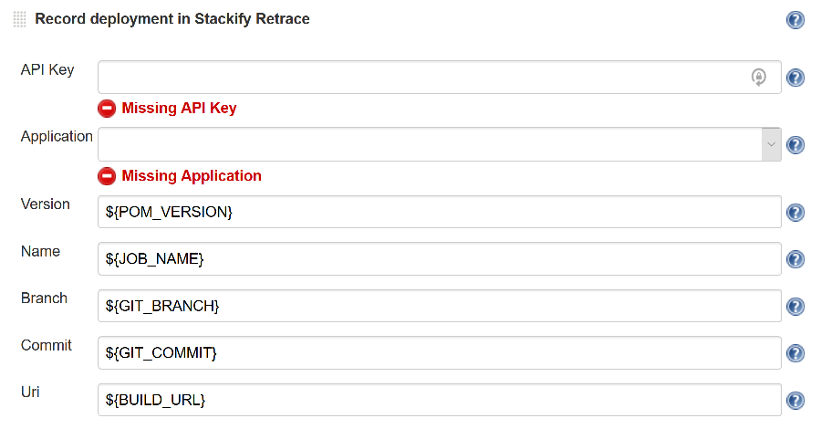
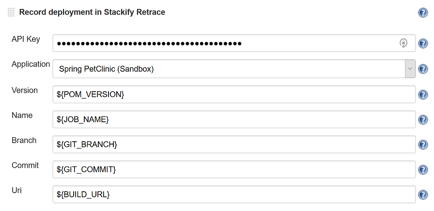
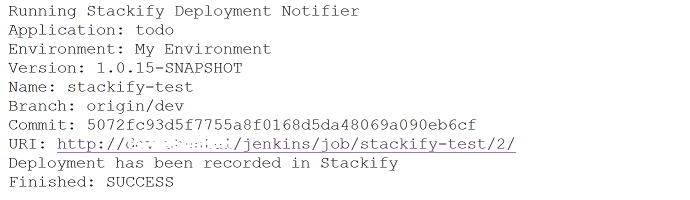
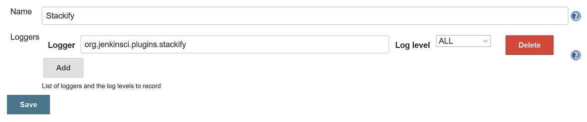
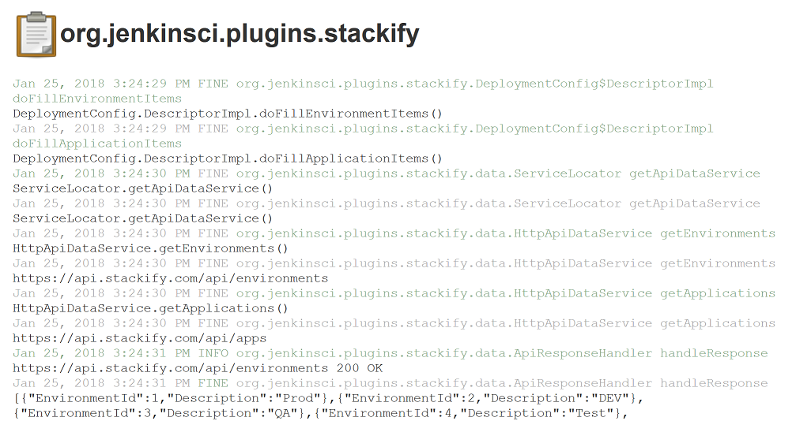

 

Jenkins Plugin to Record Deployments in Stackify Retrace +
 +
Deployment Tracking Overview: +
https://support.stackify.com/deployment-tracking-overview/ +
 +
Sign Up for a Trial: +
http://www.stackify.com/sign-up/

[[StackifyDeploymentRecorderPlugin-Installation]]
== Installation

Manage Jenkins / Manage Plugins / Available

Search for 'Stackify' and install the 'Stackify Deployment Recorder'
plugin.

[.confluence-embedded-file-wrapper .confluence-embedded-manual-size]##

[[StackifyDeploymentRecorderPlugin-Usage]]
== Usage

Jenkins Job / Configure

Add the 'Record deployment in Stackify Retrace' Post Build Action

[.confluence-embedded-file-wrapper .confluence-embedded-manual-size]##

Fill in your Stackify API key first. You will then get a drop down list
of applications to pick from.

[.confluence-embedded-file-wrapper .confluence-embedded-manual-size]##

The configuration defaults should be fine for a Git + Maven Java
project.

[.confluence-embedded-file-wrapper .confluence-embedded-manual-size]##

Save your job configuration changes.

[[StackifyDeploymentRecorderPlugin-Troubleshooting]]
== Troubleshooting

[[StackifyDeploymentRecorderPlugin-JobLog]]
=== Job Log

Jenkins Job / Console Output

[.confluence-embedded-file-wrapper .confluence-embedded-manual-size]##

[[StackifyDeploymentRecorderPlugin-SystemLog]]
=== System Log

Manage Jenkins / System Log / Add new log recorder

Name: Stackify

Logger: org.jenkinsci.plugins.stackify

[.confluence-embedded-file-wrapper .confluence-embedded-manual-size]##

Then you can view log messages from the Stackify plugin.

[.confluence-embedded-file-wrapper .confluence-embedded-manual-size]##

 

 +
 +
 +
 +
