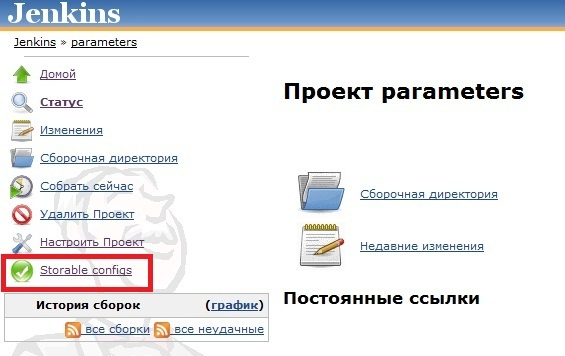

This plugin allows you to save and load set of job parameters.

Hudson 1.366 or later.

[.aui-icon .aui-icon-small .aui-iconfont-error .confluence-information-macro-icon]#
#

This plugin was created for Hudson 1.366. It might not work with earlier
versions of Hudson.

[[StorableConfigsPlugin-Userguide]]
== User guide

This plugin saves and loads job parameters (Boolean value, String
parameter,
http://wiki.jenkins-ci.org/display/JENKINS/Selection+Tasks+Plugin[ScriptSelectionTaskDefinition]
and etc.).

{empty}1. Select job. In menu there is button "Storable configs". Press
this button.

[.confluence-embedded-file-wrapper]##

{empty}2. You should see the following page with empty configuration
list.

[.confluence-embedded-file-wrapper]##

{empty}3. For saving current job parameters you need to enter the
filename and to press "Save settings" button. Plugin will save all job
parameters in HUDSON_HOME\jobs\job_name\storable-configs\filename.xml .
This file will appear in "Load configuration" section. You may view all
available configuration files.

{empty}4. For loading parameters you need to choose one file from the
list and to press "Change settings" button.

[[StorableConfigsPlugin-Changelog]]
=== Changelog +

[[StorableConfigsPlugin-Version1.0(February28,2011)]]
==== Version 1.0 (February 28, 2011) +

* Initial release.
