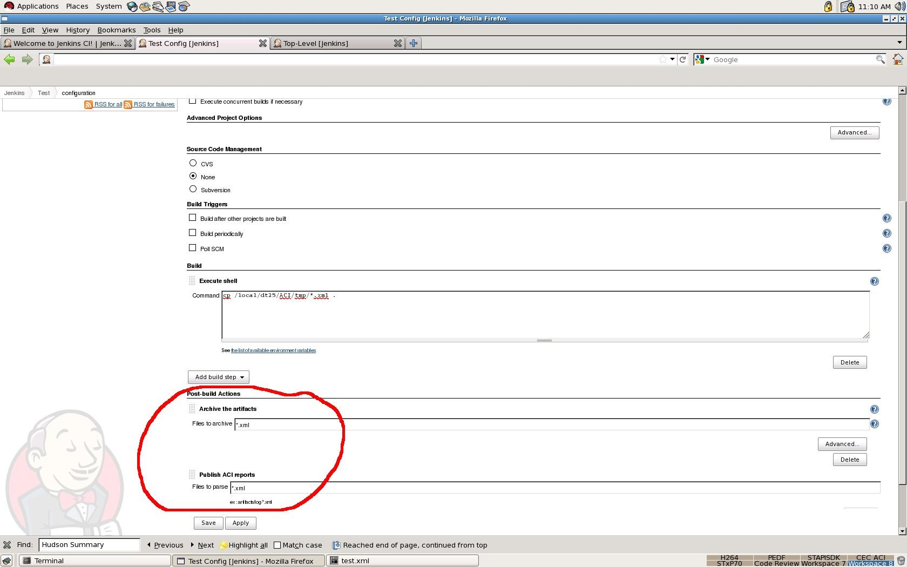
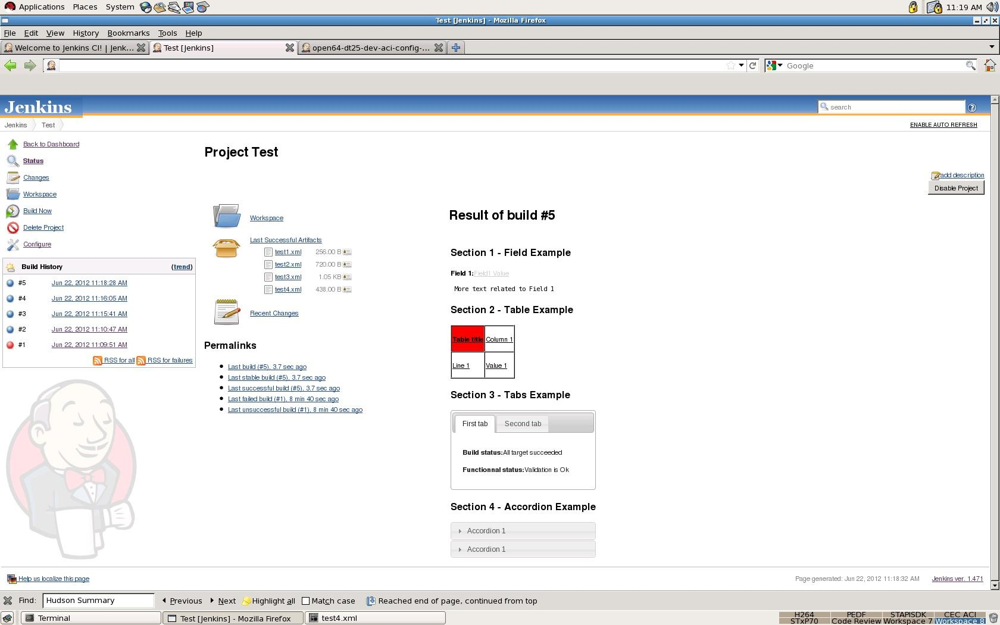
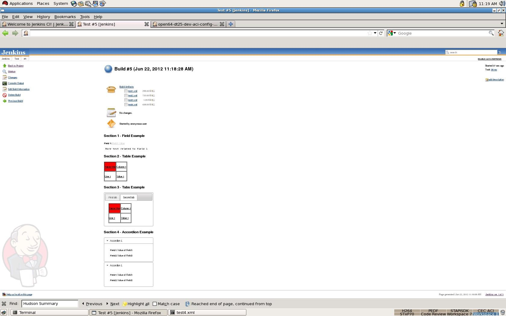

 +
This plugin allows an easy and fully customized build report display.

[[SummaryDisplayPlugin-TableofContent]]
== Table of Content

[[SummaryDisplayPlugin-PluginInformation]]
== Plugin Information

Display an extended summary report in project and build pages.

[[SummaryDisplayPlugin-Features]]
== Features

* Allow a rich summary report visible from both project and build page
* Reports must be written in an XML format according to the syntax
described in section Syntax Description
* This plugin allow the parsing of several XML files
* Reports displayed are ordered according to the XML file names
* Element displayed are based on 

[[SummaryDisplayPlugin-Usage]]
== Usage

* In order to activate the plugin you must:
** Activate result archiving of xml reports
** Activate ACI report publication of the xml summary reports

[.confluence-embedded-file-wrapper]##

[[SummaryDisplayPlugin-Examples]]
== Examples

* Result at project level:

[.confluence-embedded-file-wrapper]##

* Same result at build page

[.confluence-embedded-file-wrapper]## +
  

[[SummaryDisplayPlugin-SyntaxDescription]]
== Syntax Description

The Summary_report Hudson plugin can parse XML report with this
structure:  +
Only one section can be use in each XML file.

[[SummaryDisplayPlugin-Section]]
=== Section

Sections are created using _<section> ... </section>_ tags. +
Section attributes are:

* *name*: section name
* *fontcolor*: section font color

Example:

[source,syntaxhighlighter-pre]
----
<section name="Performance Summary" fontcolor="#ffffff">
</section>
----

[[SummaryDisplayPlugin-Field]]
=== Field

Fields are created using _<field> ... </field>_ tags. +
Fields attributes are:

* *name*: field name
* *value*: field value
* *href*: HTTP link, relative to the project build. For instance, to
access artifact dir, you can specify href="artifact/artifacts"
* *titlecolor*: font color for the field title
* *detailcolor*: font color for the field details
* *<![CDATA[ ]]>*: the CDATA term is used about text data that should
not be parsed by the XML parser. +
Everything inside a CDATA section is ignored by the parser. It can be
used to insert HTTP link given an absolute reference, as specified in
the example below. 
+
____
Only one CDATA is parsed between start and end field tag
____

Example:

[source,syntaxhighlighter-pre]
----
<field name="Field Name To Display" titlecolor="black" value="My Field Value" detailcolor="#000000" href="artifacts/field.txt">
    <![CDATA[
        ....TEXT....
        <a href="http://....">Link to something</a>
        ...Some more text...
     ]]>
</field>
----

[[SummaryDisplayPlugin-Table]]
=== Table

Tables are created using _<table> ... </table>_ tags. +
Fields attributes are:

* *_sorttable="yes"_*_:_ Each column become sortableTable structure:
* Lines are created using _<tr>...</tr>_ tags.
* Column are created using _<td>...</td>_ tags.

The number of column must be identical  in each line.

Attributes of a cell are:

* *title*:* *The text to show when the cursor is over the table cell.
* *bgcolor*: Cell background color. +
Authorized values are: 
** red, 
** green, 
** black, 
** #fffff....
* *fontcolor*: Cell font color. +
Authorized values are: 
** red,
** green, 
** black, 
** #fffff....
* *fontattribute*: Cell font attribute +
Authorized values are:
** normal, 
** bold, 
** number between 100 and 900
* *href*: Link, this link is relative from the artifact storage
location.
* *align*: The text alinment +
Authorized values are:
** center, 
** left, 
** right, 
** justify
* *width*: The width of the cell

Example:

[source,syntaxhighlighter-pre]
----
<table sorttable="yes">
        <tr>
                <td value="Table title" bgcolor="red" fontcolor="black" fontattribute="bold" href="report.xls" align="center" width="200"/>
                <td value="Column 1" bgcolor="white" fontcolor="black" fontattribute="normal" href="" align="center" width="200"/>
        </tr>
        <tr>
                <td value="Line 1" bgcolor="white" fontcolor="black" fontattribute="normal" href="" align="left" width="200"/>
                <td value="Value 1" bgcolor="white" fontcolor="black" fontattribute="normal" href="" align="none" width="200"/>
        </tr>
</table>
----

[[SummaryDisplayPlugin-Tabs]]
=== Tabs

A tab set can contain a lot of tab. Tab sets are created using _<tabs>
... </tabs>_ tags.

In a tab set, a tab is created using _<tab> ... </tab>_ tags.

Tab attributes are:

* *name*: Tab name

Content allowed for a tab:

* field
* table

____
It's not possible to insert tabs or accordion.
____

Example:

[source,syntaxhighlighter-pre]
----
<tabs>
    <tab name="First tab">
        <field name="Build status" value="All target succeeded" />
        <field name="Functionnal status" value="Validation is Ok" />
    </tab>
    <tab name="Second tab">
        <table>
            <tr>
                <td value="Table title" bgcolor="red" fontcolor="black" fontattribute="bold" href="report.xls" align="center" width="200"/>
                <td value="Column 1" bgcolor="white" fontcolor="black" fontattribute="normal" href="" align="center" width="200"/>
            </tr>
            <tr>
                <td value="Line 1" bgcolor="white" fontcolor="black" fontattribute="normal" href="" align="left" width="200"/>
                <td value="Value 1" bgcolor="white" fontcolor="black" fontattribute="normal" href="" align="none" width="200"/>
            </tr>
        </table>
    </tab>
</tabs>
----

[[SummaryDisplayPlugin-Accordion.]]
=== Accordion.

Accordions are created using _<accordion> ... </accordion>_ tags. +
Accordion_ _attributes are:

* *name*: Accordion name

Content allowed for nn accordion:

* fields 
* table.

____
It's not possible to insert tabs or accordion.
____

[[SummaryDisplayPlugin-AFullSectionExample]]
=== A Full Section Example

[source,syntaxhighlighter-pre]
----
<section name="" fontcolor="">
    // To display a field
    <field name="" titlecolor="" value="" detailcolor="" href=""> <![CDATA[  ]]> </field>

    // To display a table
    <table>
        <tr>
            <td value="" bgcolor="" fontcolor="" title="" fontattribute="" href="" align="" width=""/>
            <td value="" bgcolor="" fontcolor="" title="" fontattribute="" href="" align="" width=""/>
        </tr>
        <tr>
            <td value="" bgcolor="" fontcolor="" title="" fontattribute="" href="" align="" width=""/>
            <td value="" bgcolor="" fontcolor="" title="" fontattribute="" href="" align="" width=""/>
        </tr>
    </table>

    // To display tabs
    <tabs>
        <tab name="">
        // Only insert table or field in tab
        </tab>
        <tab name="">
        // Only insert table or field in tab
        </tab>
    </tabs>

    // To display an accordion
    <accordion name="">
    // Only insert table or field in tab
    </accordion>
</section>
----

[[SummaryDisplayPlugin-Changelog]]
== Changelog

[[SummaryDisplayPlugin-Version1.15(Jan29,2016)]]
=== Version 1.15 (Jan 29, 2016)

* Fix issue https://issues.jenkins-ci.org/browse/JENKINS-33044[JENKINS-33044]: implement
SimpleBuildStep thanks to Egor Shchegolkov
* Made project testable on windows thanks to Egor Shchegolkov

[[SummaryDisplayPlugin-Version1.14(Jan29,2016)]]
=== Version 1.14 (Jan 29, 2016)

* Fix issue https://issues.jenkins-ci.org/browse/JENKINS-30146[JENKINS-30146]
Plugin is hanging builds when running concurrently thanks to Shuaibing
Li Shuaibing.Li@lombardrisk.com
* Cleanup unused source files

[[SummaryDisplayPlugin-Version1.13(Apr21,2015)]]
=== Version 1.13 (Apr 21, 2015)

* Display on project page is now optional thanks to martinda
* Project without builds no longer create errors thanks to martinda

[[SummaryDisplayPlugin-Version1.12(Nov7,2014)]]
=== Version 1.12 (Nov 7, 2014)

* Fix
issue https://issues.jenkins-ci.org/browse/JENKINS-25466[JENKINS-25466] thanks
to Magnus Jacobsson 

[[SummaryDisplayPlugin-Version1.10(Sep26,2013)]]
=== Version 1.10 (Sep 26, 2013)

* Fixes for compatibility with jenkins version 1.532

[[SummaryDisplayPlugin-Version1.9(Feb6,2013)]]
=== Version 1.9 (Feb 6, 2013)

* Added some checks to avoid warning messages (Contribution from
David-caro david.caro.estevez@gmail.com)

[[SummaryDisplayPlugin-Version1.8(Jan8,2013)]]
=== Version 1.8 (Jan 8, 2013)

* Avoid javascript conflicts and allow absolute links (Contribution from
Mattias Holmund)
** Absolute links did not work, they were prefixed with a buildnumber
** There were javascript conflicts between the jquery included in
summary_report and the prototype.js used by jenkins
** There were javascript conflicts between sorttable and javascript code
included in jenkins. It manifested itself for me with the claim-plugin,
but I believe it can cause all sorts of mysterious problems.
* Table output slightly restyled and can now be restyles more with css.

[[SummaryDisplayPlugin-Version1.7(Dec10,2012)]]
=== Version 1.7 (Dec 10, 2012)

* Use CSS classes for styling (Contribution from Mattias Holmund)

[[SummaryDisplayPlugin-Version1.5(Sept12,2012)]]
=== Version 1.5 (Sept 12, 2012)

* Align panel on right without any size limit
* Add support for attribute title in cells (<td title="my title">)

[[SummaryDisplayPlugin-Version1.4(Jul5,2012)]]
=== Version 1.4 (Jul 5, 2012)

* Fix for URL loading issue when using plugin from windows
* Improve error reporting

[[SummaryDisplayPlugin-Version1.3(Jun22,2012)]]
=== Version 1.3 (Jun 22, 2012)

* Rename Git repository in summary_report-plugin to follow rules.
* Corrections in the documentation.

[[SummaryDisplayPlugin-Version1.2(Jun22,2012)]]
=== Version 1.2 (Jun 22, 2012)

* Rename plugin from Hudson Summary Display to Summary Display
* Change keyword in the Jenkins prject configuration panel

[[SummaryDisplayPlugin-Version1.1(Jun20,2012)]]
=== Version 1.1 (Jun 20, 2012)

* Cleanup in the descriptors.

[[SummaryDisplayPlugin-Version1.0(Jun13,2012)]]
=== Version 1.0 (Jun 13, 2012)

* Initial Release.
