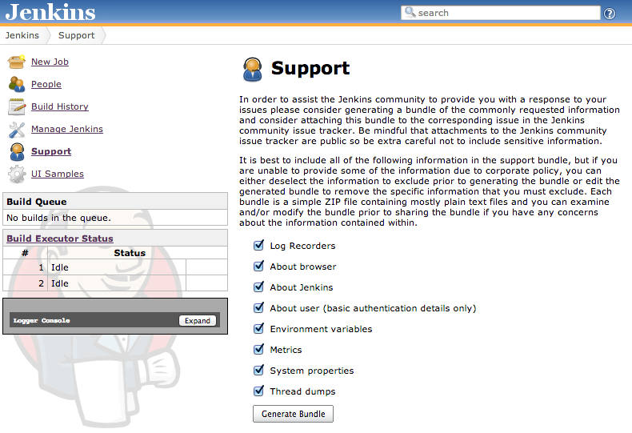

[.conf-macro .output-inline]# #

[.aui-icon .aui-icon-small .aui-iconfont-info .confluence-information-macro-icon]##

Older versions of this plugin may not be safe to use. Please review the
following warnings before using an older version:

* https://jenkins.io/security/advisory/2019-11-21/#SECURITY-1634[Users
with Overall/Read permission are able to delete arbitrary files]

[[SupportCorePlugin-SupportCorePlugin]]
== Support Core Plugin

The plugin provides the basic infrastructure for generating "bundles" of
support information within Jenkins.

There are three ways of generating bundles:

* Automatic bundles, these get saved in $JENKINS_HOME/support once per
hour starting 3 minutes after Jenkins starts the plugin (i.e. this may
still be generated even if Jenkins will not fully start). The automatic
bundles are retained using an exponential aging strategy, so you should
have a bunch of them over the entire lifetime once the plugin has been
installed.
* On demand bundles:
** You can generate them from the root "Support" action, using the User
Interface ; or
** By using the CLI Command. For the association documentation, please
refer to `+<yourJenkinsInstanceUrl>/cli/command/support+` embedded
documentation.

[.confluence-embedded-file-wrapper]##

[[SupportCorePlugin-DockerFile]]
=== Docker File

As part of the support bundle if the About Jenkins option is checked
then you will receive a docker file in the bundle also. The docker file
contains the current version of Jenkins, along with a wget operation to
download all of the plugins on the Jenkins master. This creates a
similar environment for testing or reproducing bugs.

First build the image:

....
docker build -f Dockerfile
....

then run the docker image

....
docker run -d -p 8080:80
....

This should create a new Jenkins master with the same version, and the
same plugins and versions all bundled.

[[SupportCorePlugin-Thirdpartysupportproviders]]
=== Third party support providers

Various companies and organizations provide commercial support for
Jenkins. They can provide additional content and branding to the support
action. The following lists the known third party support providers (in
date order) and the links to their support provider plugin.

* https://release-notes.cloudbees.com/product/CloudBees+Support+Plugin[CloudBees
Support Plugin] by https://www.cloudbees.com/[CloudBees, Inc.]

[[SupportCorePlugin-Frequentissues]]
=== Frequent issues

[[SupportCorePlugin-SupportbundlescorruptthroughtheUI]]
==== Support bundles corrupt through the UI

The most common situation for this to happen is when the *About Jenkins*
option is enabled.

Meanwhile, the support bundle is getting generated it looks like the
generation process is stuck as the downloaded size stays at the same
point for a long time. To diagnosis this issue the best is to take a
threadDump when in the moment where it is stuck and check the Jenkins
logs.

If a stacktrace like the one below appears

[source,syntaxhighlighter-pre]
----
"Handling POST /support/download from XX.XX.XX.XX : RequestHandlerThread[#126]" Id=123772 Group=main RUNNABLE
    at java.io.UnixFileSystem.getBooleanAttributes0(Native Method)
    at java.io.UnixFileSystem.getBooleanAttributes(UnixFileSystem.java:242)
    at java.io.File.isDirectory(File.java:849)
    at com.cloudbees.jenkins.support.impl.AboutJenkins$ItemsContent.printTo(AboutJenkins.java:641)
    at com.cloudbees.jenkins.support.api.PrintedContent.writeTo(PrintedContent.java:47)
    at com.cloudbees.jenkins.support.SupportPlugin.writeBundle(SupportPlugin.java:359)
    at com.cloudbees.jenkins.support.SupportAction.doDownload(SupportAction.java:154)
----

and the Jenkins logs are populated with 

[source,syntaxhighlighter-pre]
----
2018-01-04 04:52:17.633+0000 [id=123769]   WARNING c.c.j.support.SupportPlugin#writeBundle: Could not attach 'nodes/slave/Slave1/checksums.md5' to support bundle
org.eclipse.jetty.io.EofException: Closed
    at org.eclipse.jetty.server.HttpOutput.write(HttpOutput.java:476)
    at net.bull.javamelody.FilterServletOutputStream.write(FilterServletOutputStream.java:88)
    at net.bull.javamelody.CounterResponseStream.write(CounterResponseStream.java:82)
    at org.apache.tools.zip.ZipOutputStream.writeOut(ZipOutputStream.java:1029)
    at org.apache.tools.zip.ZipOutputStream.deflate(ZipOutputStream.java:680)
    at org.apache.tools.zip.ZipOutputStream.closeEntry(ZipOutputStream.java:432)
    at org.apache.tools.zip.ZipOutputStream.putNextEntry(ZipOutputStream.java:489)
    at com.cloudbees.jenkins.support.SupportPlugin.writeBundle(SupportPlugin.java:358)
    at com.cloudbees.jenkins.support.SupportAction.doDownload(SupportAction.java:154)
----

Then, surely the problem is that you are hitting the *Idle timeout* in
the load balancer and this makes the connection betweek the ELB and your
broweser to drop. To workaround this problem you can:

* Increase the Idle timeout in the load balancer
* Not include About Jenkins section
* Reduce the number of builds in the system

[[SupportCorePlugin-SupportBundleAnonymization]]
=== Support Bundle Anonymization

https://issues.jenkins-ci.org/browse/JENKINS-21670[Beginning in version
2.48], this plugin now allows for automated `+ContentFilter+` extensions
to enable anonymizing of various data. By enabling this feature, the
default set of filters will anonymize agent names, agent computer names,
agent labels, view names (aka folders), job names, usernames, and IP
addresses (both IPv4 and IPv6). These data are mapped to randomly
generated fake names which are saved to Jenkins master. A Jenkins
administrator can view these mappings by going to **Manage
Jenkins **[.caret]##*› Support Bundle Anonymization*. All files written
to the support bundle by this and all extensions of this plugin will
replace all instances of the original values with their anonymized
counterpart. Note that the Stop Words list on that page shows which
terms are ignored when filtering names (case-insensitive full match).##

[[SupportCorePlugin-Limitations]]
==== [.caret]#Limitations#

[.caret]# #

Anonymization filters only apply to text files. It cannot handle
non-Jenkins URLs, custom proprietary Jenkins plugin names, and
exceptions quoting invalid Groovy code in a Jenkins pipeline. The active
plugins, disabled plugins, failed plugins, and `+Dockerfile+` reports
are not anonymized due to several Jenkins plugins and other Java
libraries using version numbers that are indistinguishable from IP
addresses. These reports are in the
files `+plugins/active.txt+`, `+plugins/disabled.txt+`, `+plugins/failed.txt+`,
and `+docker/Dockerfile+`. These files should all be manually reviewed
if you do not wish to disclose the names of custom proprietary plugins.

 +

[[SupportCorePlugin-VersionHistory]]
=== Version History

[[SupportCorePlugin-Version2.64(2019Nov21)]]
==== Version 2.64 (2019 Nov 21)

* https://jenkins.io/security/advisory/2019-11-21/#SECURITY-1634[Fix
security issues]

[[SupportCorePlugin-Version2.62(2019Oct4)]]
==== Version 2.62 (2019 Oct 4)

* [.jira-issue .conf-macro .output-block]#
https://issues.jenkins-ci.org/browse/JENKINS-58165[[.aui-icon .aui-icon-wait .issue-placeholder]##
##JENKINS-58165] - [.summary]#Getting issue details...#
[.aui-lozenge .aui-lozenge-subtle .aui-lozenge-default .issue-placeholder]#STATUS#
#  Handle parameterized GC logs filenames
* [.jira-issue .conf-macro .output-block]#
https://issues.jenkins-ci.org/browse/JENKINS-56245[[.aui-icon .aui-icon-wait .issue-placeholder]##
##JENKINS-56245] - [.summary]#Getting issue details...#
[.aui-lozenge .aui-lozenge-subtle .aui-lozenge-default .issue-placeholder]#STATUS#
#  Add instance ID to AboutJenkins
* [.jira-issue .conf-macro .output-block]#
https://issues.jenkins-ci.org/browse/JENKINS-58980[[.aui-icon .aui-icon-wait .issue-placeholder]##
##JENKINS-58980] - [.summary]#Getting issue details...#
[.aui-lozenge .aui-lozenge-subtle .aui-lozenge-default .issue-placeholder]#STATUS#
#  Only include latest GC logs
* [.jira-issue .conf-macro .output-block]#
https://issues.jenkins-ci.org/browse/JENKINS-59453[[.aui-icon .aui-icon-wait .issue-placeholder]##
##JENKINS-59453] - [.summary]#Getting issue details...#
[.aui-lozenge .aui-lozenge-subtle .aui-lozenge-default .issue-placeholder]#STATUS#
#  Clean up plugin dependencies
* [.jira-issue .conf-macro .output-block]#
https://issues.jenkins-ci.org/browse/JENKINS-59554[[.aui-icon .aui-icon-wait .issue-placeholder]##
##JENKINS-59554] - [.summary]#Getting issue details...#
[.aui-lozenge .aui-lozenge-subtle .aui-lozenge-default .issue-placeholder]#STATUS#
#  Wait 3 minutes before generating a first support bundle
* LogFlusher should run before shutting down Jenkins. (PR
https://github.com/jenkinsci/support-core-plugin/pull/193[#193])
* [.js-issue-title]#More gracefully handle a configuration file deleted
while the bundle is being written (PR
https://github.com/jenkinsci/support-core-plugin/pull/190[#190])#

[[SupportCorePlugin-Version2.61(2019Sept9)]]
==== Version 2.61 (2019 Sept 9)

*  [.jira-issue .conf-macro .output-block]#
https://issues.jenkins-ci.org/browse/JENKINS-58528[[.aui-icon .aui-icon-wait .issue-placeholder]##
##JENKINS-58528] - [.summary]#Getting issue details...#
[.aui-lozenge .aui-lozenge-subtle .aui-lozenge-default .issue-placeholder]#STATUS#
#  Report available processes for master

[[SupportCorePlugin-Version2.60(2019Aug6)]]
==== Version 2.60 (2019 Aug 6)

*  [.jira-issue .conf-macro .output-block]#
https://issues.jenkins-ci.org/browse/JENKINS-58528[[.aui-icon .aui-icon-wait .issue-placeholder]##
##JENKINS-58528] - [.summary]#Getting issue details...#
[.aui-lozenge .aui-lozenge-subtle .aui-lozenge-default .issue-placeholder]#STATUS#
#  Fix memory leak caused by nodes statistics always growing.

[[SupportCorePlugin-Version2.59(2019Aug1)]]
==== Version 2.59 (2019 Aug 1)

* [.jira-issue .conf-macro .output-block]#
https://issues.jenkins-ci.org/browse/JENKINS-58606[[.aui-icon .aui-icon-wait .issue-placeholder]##
##JENKINS-58606] - [.summary]#Getting issue details...#
[.aui-lozenge .aui-lozenge-subtle .aui-lozenge-default .issue-placeholder]#STATUS#
# Add info about backup plugins to support bundle.

[[SupportCorePlugin-Version2.58(2019Jul16)]]
==== Version 2.58 (2019 Jul 16)

* [.jira-issue .conf-macro .output-block]#
https://issues.jenkins-ci.org/browse/JENKINS-58393[[.aui-icon .aui-icon-wait .issue-placeholder]##
##JENKINS-58393] - [.summary]#Getting issue details...#
[.aui-lozenge .aui-lozenge-subtle .aui-lozenge-default .issue-placeholder]#STATUS#
#  Avoid the bundle not being generated properly when getTime() failed.
* [.jira-issue .conf-macro .output-block]#
https://issues.jenkins-ci.org/browse/JENKINS-57602[[.aui-icon .aui-icon-wait .issue-placeholder]##
##JENKINS-57602] - [.summary]#Getting issue details...#
[.aui-lozenge .aui-lozenge-subtle .aui-lozenge-default .issue-placeholder]#STATUS#
#  Fix the agents reporting.

[[SupportCorePlugin-Version2.57(2019Jul5)]]
==== Version 2.57 (2019 Jul 5)

* [.jira-issue .conf-macro .output-block]#
https://issues.jenkins-ci.org/browse/JENKINS-57990[[.aui-icon .aui-icon-wait .issue-placeholder]##
##JENKINS-57990] - [.summary]#Getting issue details...#
[.aui-lozenge .aui-lozenge-subtle .aui-lozenge-default .issue-placeholder]#STATUS#
#  Improve the filtering, avoid filtering the garbage collectors logs.

[[SupportCorePlugin-Version2.56(2019Feb18)]]
==== Version 2.56 (2019 Feb 18)

* [.jira-issue .conf-macro .output-block]#
https://issues.jenkins-ci.org/browse/JENKINS-55866[[.aui-icon .aui-icon-wait .issue-placeholder]##
##JENKINS-55866] - [.summary]#Getting issue details...#
[.aui-lozenge .aui-lozenge-subtle .aui-lozenge-default .issue-placeholder]#STATUS#
#  Fix for first implementation.

[[SupportCorePlugin-Version2.55(2019Feb18)]]
==== Version 2.55 (2019 Feb 18)

* [.jira-issue .conf-macro .output-block]#
https://issues.jenkins-ci.org/browse/JENKINS-55014[[.aui-icon .aui-icon-wait .issue-placeholder]##
##JENKINS-55014] - [.summary]#Getting issue details...#
[.aui-lozenge .aui-lozenge-subtle .aui-lozenge-default .issue-placeholder]#STATUS#
#  Prevent deadlock when bundle generated at startup.
* [.jira-issue .conf-macro .output-block]#
https://issues.jenkins-ci.org/browse/JENKINS-55843[[.aui-icon .aui-icon-wait .issue-placeholder]##
##JENKINS-55843] - [.summary]#Getting issue details...#
[.aui-lozenge .aui-lozenge-subtle .aui-lozenge-default .issue-placeholder]#STATUS#
#  Avoid bundle getting corrupted when folder have certain names.
* [.jira-issue .conf-macro .output-block]#
https://issues.jenkins-ci.org/browse/JENKINS-55866[[.aui-icon .aui-icon-wait .issue-placeholder]##
##JENKINS-55866] - [.summary]#Getting issue details...#
[.aui-lozenge .aui-lozenge-subtle .aui-lozenge-default .issue-placeholder]#STATUS#
#  Replace only full words.

[[SupportCorePlugin-Version2.54(2019Jan15)]]
==== Version 2.54 (2019 Jan 15)

* [.jira-issue .conf-macro .output-block]#
https://issues.jenkins-ci.org/browse/JENKINS-55493[[.aui-icon .aui-icon-wait .issue-placeholder]##
##JENKINS-55493] - [.summary]#Getting issue details...#
[.aui-lozenge .aui-lozenge-subtle .aui-lozenge-default .issue-placeholder]#STATUS#
#  Update parent POM to test plugin with JDK 11.

[[SupportCorePlugin-Version2.53(2018Dec11)]]
==== Version 2.53 (2018 Dec 11)

* [.jira-issue .conf-macro .output-block]#
https://issues.jenkins-ci.org/browse/JENKINS-55493[[.aui-icon .aui-icon-wait .issue-placeholder]##
##JENKINS-55493] - [.summary]#Getting issue details...#
[.aui-lozenge .aui-lozenge-subtle .aui-lozenge-default .issue-placeholder]#STATUS#
#  Update parent POM to test plugin with JDK 11.

[[SupportCorePlugin-Version2.53(2018Dec11).1]]
==== Version 2.53 (2018 Dec 11)

* [.jira-issue .conf-macro .output-block]#
https://issues.jenkins-ci.org/browse/JENKINS-54922[[.aui-icon .aui-icon-wait .issue-placeholder]##
##JENKINS-54922] - [.summary]#Getting issue details...#
[.aui-lozenge .aui-lozenge-subtle .aui-lozenge-default .issue-placeholder]#STATUS#
#  Improve generated Markdown.
* [.jira-issue .conf-macro .output-block]#
https://issues.jenkins-ci.org/browse/JENKINS-54999[[.aui-icon .aui-icon-wait .issue-placeholder]##
##JENKINS-54999] - [.summary]#Getting issue details...#
[.aui-lozenge .aui-lozenge-subtle .aui-lozenge-default .issue-placeholder]#STATUS#
#  Improve anonymization performance.

[[SupportCorePlugin-Version2.52(2018Nov28)]]
==== Version 2.52 (2018 Nov 28)

* [.jira-issue .conf-macro .output-block]#
https://issues.jenkins-ci.org/browse/JENKINS-54688[[.aui-icon .aui-icon-wait .issue-placeholder]##
##JENKINS-54688] - [.summary]#Getting issue details...#
[.aui-lozenge .aui-lozenge-subtle .aui-lozenge-default .issue-placeholder]#STATUS#
#  Information about operating system does not get anonymized.

[[SupportCorePlugin-Version2.51(2018Nov19)]]
==== Version 2.51 (2018 Nov 19)

* [.jira-issue .conf-macro .output-block]#
https://issues.jenkins-ci.org/browse/JENKINS-54687[[.aui-icon .aui-icon-wait .issue-placeholder]##
##JENKINS-54687] - [.summary]#Getting issue details...#
[.aui-lozenge .aui-lozenge-subtle .aui-lozenge-default .issue-placeholder]#STATUS#
#  GC Logs should be excluded by default.

[[SupportCorePlugin-Version2.50(2018Sept13)]]
==== Version 2.50 (2018 Sept 13)

* https://issues.jenkins-ci.org/browse/JENKINS-53184[JENKINS-53184]: Use
Jenkins version as stop word.

[[SupportCorePlugin-Version2.49(2018Jul19)]]
==== Version 2.49 (2018 Jul 19)

* https://issues.jenkins-ci.org/browse/JENKINS-52639[JENKINS-52639]:
Remove transitive dependency on snakeyaml to fix API compatibility
issues.

[[SupportCorePlugin-Version2.48(2018Jul02)]]
==== Version 2.48 (2018 Jul 02)

* https://issues.jenkins-ci.org/browse/JENKINS-21670[JENKINS-21670]: Add
support for anonymizing private data in support bundles.
* https://issues.jenkins-ci.org/browse/JENKINS-49578[JENKINS-49578]:
Make the button for deleting old support bundles red to help prevent
users from deleting bundles inadvertently.

[[SupportCorePlugin-Version2.47(2018Apr19)]]
==== Version 2.47 (2018 Apr 19)

* https://issues.jenkins-ci.org/browse/JENKINS-50765[JENKINS-50765]https://issues.jenkins-ci.org/browse/JENKINS-50765[:
Harden against XXE vulnerabilities (Just a precaution as this does not
appear to be exploitable in practice)]
* https://issues.jenkins-ci.org/browse/JENKINS-50428[JENKINS-50428]https://issues.jenkins-ci.org/browse/JENKINS-50428[:
Support the property in Jenkins 2.114 in newer that allows the location
of AsyncPeriodicWork task logs to be configured]
* https://issues.jenkins-ci.org/browse/JENKINS-49668[JENKINS-49668]: Fix
the support bundle component that lists installed root certificate
authorities

[[SupportCorePlugin-Version2.46(2018Mar14)]]
==== Version 2.46 (2018 Mar 14)

* [.jira-issue .conf-macro .output-block]#
https://issues.jenkins-ci.org/browse/JENKINS-27035[[.aui-icon .aui-icon-wait .issue-placeholder]##
##JENKINS-27035] - [.summary]#Getting issue details...#
[.aui-lozenge .aui-lozenge-subtle .aui-lozenge-default .issue-placeholder]#STATUS#
#  Request/response statistics. Tallying command read/write events.
* *Jenkins baseline updated to 2.107.x.*

[[SupportCorePlugin-Version2.45.1(2018Mar09)]]
==== Version 2.45.1 (2018 Mar 09)

* As has been found abnormal usage of private API, it has been
reintroduced temporary because of backward compatibility.

[[SupportCorePlugin-Version2.45(2018Mar07)]]
==== Version 2.45 (2018 Mar 07)

* [.jira-issue .conf-macro .output-block]#
https://issues.jenkins-ci.org/browse/JENKINS-49931[[.aui-icon .aui-icon-wait .issue-placeholder]##
##JENKINS-49931] - [.summary]#Getting issue details...#
[.aui-lozenge .aui-lozenge-subtle .aui-lozenge-default .issue-placeholder]#STATUS#
#
Pass `+-Dcom.cloudbees.jenkins.support.impl.HeapUsageHistogram.DISABLED=false+`
to restore heap histogram generation, pending a better fix.
* Sort thread dumps by name rather than ID.
* Reduce pressure on master file descriptors.
* [.jira-issue .conf-macro .output-block]#
https://issues.jenkins-ci.org/browse/JENKINS-46132[[.aui-icon .aui-icon-wait .issue-placeholder]##
##JENKINS-46132] - [.summary]#Getting issue details...#
[.aui-lozenge .aui-lozenge-subtle .aui-lozenge-default .issue-placeholder]#STATUS#
#
* *Jenkins baseline updated to 2.46.x. +
*

[[SupportCorePlugin-Version2.44(2017Dec12)]]
==== Version 2.44 (2017 Dec 12)

* `+ClassCastException+` possible on 2.50+.
* [.jira-issue .conf-macro .output-block]#
https://issues.jenkins-ci.org/browse/JENKINS-48436[[.aui-icon .aui-icon-wait .issue-placeholder]##
##JENKINS-48436] - [.summary]#Getting issue details...#
[.aui-lozenge .aui-lozenge-subtle .aui-lozenge-default .issue-placeholder]#STATUS#
# Restoring compatibility for an API endpoint.

[[SupportCorePlugin-Version2.43]]
==== Version 2.43

* https://issues.jenkins-ci.org/browse/JENKINS-41653[JENKINS-41653] Support
core warning when collecting data
* https://issues.jenkins-ci.org/browse/JENKINS-47779[JENKINS-47779] Could not
create fully detailed support bundles after 2.86

[[SupportCorePlugin-Version2.42]]
==== Version 2.42

* https://issues.jenkins-ci.org/browse/JENKINS-22791[JENKINS-22791] Record
heap histograms new component

[[SupportCorePlugin-Version2.41]]
==== Version 2.41

* https://issues.jenkins-ci.org/browse/JENKINS-44236[JENKINS-44236] Also
gather NFS related stats
* (https://github.com/jenkinsci/support-core-plugin/pull/109[PR-109] non
functional/user facing change)

[[SupportCorePlugin-Version2.40]]
==== Version 2.40

* https://github.com/jenkinsci/support-core-plugin/pull/104[PR-104]
Delete temp files even if failures happen, and better error message if
failed to delete the file.
*  https://issues.jenkins-ci.org/browse/JENKINS-41745[JENKINS-41745] Allow
SupportCommand to work without a Remoting channel

[[SupportCorePlugin-Version2.39]]
==== Version 2.39

* https://issues.jenkins-ci.org/browse/JENKINS-42393[JENKINS-42393]
Temporary files should not be created in the bundles root directory
under JENKINS_HOME
* https://issues.jenkins-ci.org/browse/JENKINS-40613[JENKINS-40613]
Report a blocked Timer
* https://github.com/jenkinsci/support-core-plugin/pull/101[PR-101] Use
UTC for all timestamps

[[SupportCorePlugin-Version2.38]]
==== Version 2.38

* https://issues.jenkins-ci.org/browse/JENKINS-40062[JENKINS-40062]
Optionally include config.xml files for nodes
* https://github.com/jenkinsci/support-core-plugin/pull/96[PR-96] Print
stack trace in logical order
* https://github.com/jenkinsci/support-core-plugin/pull/97[PR-97] Max
file size for agent logs
* https://github.com/jenkinsci/support-core-plugin/pull/99[PR-99] Add
initialization milestone

[[SupportCorePlugin-Version2.37]]
==== Version 2.37

* https://issues.jenkins-ci.org/browse/JENKINS-40098[JENKINS-40098]
Bundle naming strategy should be able to specify an instance type

[[SupportCorePlugin-Version2.36]]
==== Version 2.36

* https://issues.jenkins-ci.org/browse/JENKINS-39150[JENKINS-39150]
Improve remoting channel diagnostics in Support Core
* https://issues.jenkins-ci.org/browse/JENKINS-40094[JENKINS-40094]
Global config.xml only contains a exception
* https://github.com/jenkinsci/support-core-plugin/pull/94[PR 94] Fix
weird display of the GC Logging gathering
* https://github.com/jenkinsci/support-core-plugin/pull/85[PR 85] Add
node monitoring data for all nodes (i.e. the columns you typically see
for each node on the /computer page)

[[SupportCorePlugin-Version2.35]]
==== Version 2.35

* https://github.com/jenkinsci/support-core-plugin/pull/89[PR 89] NPE in
GCLogs.addContents after 2.34.

[[SupportCorePlugin-Version2.34]]
==== Version 2.34

* https://issues.jenkins-ci.org/browse/JENKINS-38572[JENKINS-38572]
https://github.com/jenkinsci/support-core-plugin/pull/76[PR 76] Only
obtain proxy information if async-http-client plugin is installed.
* https://github.com/jenkinsci/support-core-plugin/pull/81[PR 81] Fixed
some buglets in SupportLogFormatter.
* https://issues.jenkins-ci.org/browse/JENKINS-39381[JENKINS-39381]
https://github.com/jenkinsci/support-core-plugin/pull/83[PR 83] Add a
support component for XML files.
* https://github.com/jenkinsci/support-core-plugin/pull/86[PR 86] Check
if Jenkins is quieting down.
* https://github.com/jenkinsci/support-core-plugin/pull/87[PR 87] Add
MIT license.md file.
* https://issues.jenkins-ci.org/browse/JENKINS-39607[JENKINS-39607]
https://github.com/jenkinsci/support-core-plugin/pull/88[PR 88] GC logs
should be collected.
* ***Jenkins baseline updated to **1.625.x*

[[SupportCorePlugin-Version2.33]]
==== Version 2.33

* https://github.com/jenkinsci/support-core-plugin/pull/74[PR 74] Add
proxy information to update center section.
* https://issues.jenkins-ci.org/browse/JENKINS-37772[JENKINS-37772]
https://github.com/jenkinsci/support-core-plugin/pull/73[PR 73] Get rid
of Initializer(after = InitMilestone.COMPLETED)
* https://github.com/jenkinsci/support-core-plugin/pull/70[PR 70] Use
require post annotation
* https://github.com/jenkinsci/support-core-plugin/pull/68[PR 68]
Diagnose startup performance.
* https://github.com/jenkinsci/support-core-plugin/pull/66[PR 66]
Upgrade parent 2.3 -> 2.11
* https://issues.jenkins-ci.org/browse/JENKINS-34719[JENKINS-34719]
https://github.com/jenkinsci/support-core-plugin/pull/63[PR 63] Pick up
and logs that have been refactored into JENKINS_HOME/logs.
* https://github.com/jenkinsci/support-core-plugin/pull/62[PR 62]
Separate slave logs, and master logs.
* https://issues.jenkins-ci.org/browse/JENKINS-26409[JENKINS-26409]
https://github.com/jenkinsci/support-core-plugin/pull/60[PR 60] If the
stream is terminated early log this information in FINE level.

[[SupportCorePlugin-Version2.32]]
==== Version 2.32

* https://github.com/jenkinsci/support-core-plugin/pull/58[PR 58] Enable
and enforce findbugs on the verify stage.
* https://github.com/jenkinsci/support-core-plugin/pull/53[PR 53] Adapt
to new parent POM.
* https://issues.jenkins-ci.org/browse/JENKINS-34462[JENKINS-34462]
https://github.com/jenkinsci/support-core-plugin/pull/59[PR 59] Add CSRF
protection status.
* ***Jenkins baseline updated to **1.580.x*

[[SupportCorePlugin-Version2.31]]
==== Version 2.31

* https://github.com/jenkinsci/support-core-plugin/pull/56[PR 65]
Prevent null pointer exception reporting log level.
* https://github.com/jenkinsci/support-core-plugin/pull/57[PR 57] Add
the locale of the browser to a slow request.

[[SupportCorePlugin-Version2.30]]
==== Version 2.30

* https://github.com/jenkinsci/support-core-plugin/pull/50[PR 50] Add
argument to increase max log rotate size.
* https://github.com/jenkinsci/support-core-plugin/pull/51[PR 51] Add
deadlock test.
* https://github.com/jenkinsci/support-core-plugin/pull/52[PR 52] Record
log rotate levels.
* https://github.com/jenkinsci/support-core-plugin/pull/48[PR 48] Add
update center information.
* https://github.com/jenkinsci/support-core-plugin/pull/54[PR 54] Add
slave version information for master node.
* https://github.com/jenkinsci/support-core-plugin/pull/55[PR 55] Switch
to a ThreadLocal DateFormatter

[[SupportCorePlugin-Version2.29]]
==== Version 2.29

* https://github.com/jenkinsci/support-core-plugin/pull/44[PR 44] Add
Jenkins url configuration to validate reverse proxy configuration
* https://github.com/jenkinsci/support-core-plugin/pull/43[PR 43] Check
build queue elements to see if the QueueTaskDispatcher is able to run
the builds.
* https://issues.jenkins-ci.org/browse/JENKINS-30117[JENKINS-30117]
Support bundle blocks with lots of data
* https://issues.jenkins-ci.org/browse/JENKINS-28216[JENKINS-28216]
Obtain slave logs using async callable.

[[SupportCorePlugin-Version2.28]]
==== Version 2.28

* https://github.com/jenkinsci/support-core-plugin/pull/41[PR 41]
Deadlock detector now records the full stack traces
* https://github.com/jenkinsci/support-core-plugin/pull/18[PR 18] Option
to capture the export table of slaves added

[[SupportCorePlugin-Version2.27]]
==== Version 2.27

* https://issues.jenkins-ci.org/browse/JENKINS-21668[JENKINS-21668]
Obtain root CA information.
* https://github.com/jenkinsci/support-core-plugin/pull/24[PR 24] Add
networking interface information
* https://issues.jenkins-ci.org/browse/JENKINS-28876[JENKINS-28876] Add
user-agent information to slow-request
* https://github.com/jenkinsci/support-core-plugin/pull/37[PR 37]
** add system uptime to see if an outage comes from a system reboot
** add DMI information to see if Jenkins is running on a virtualized
server
* https://issues.jenkins-ci.org/browse/JENKINS-29034[JENKINS-29034]
Modify filename to include date and time.

[[SupportCorePlugin-Version2.26Badrelease.]]
==== Version 2.26 Bad release.

[[SupportCorePlugin-Version2.25(June092015)]]
==== Version 2.25 (June 09 2015)

* https://issues.jenkins-ci.org/browse/JENKINS-26409[JENKINS-26409]
ClientAbortException logged when cancelling a support bundle download.
* https://issues.jenkins-ci.org/browse/JENKINS-28703[JENKINS-28703] Add
pinned status to plugin information.

[[SupportCorePlugin-Version2.24(June032015)]]
==== Version 2.24 (June 03 2015)

* https://issues.jenkins-ci.org/browse/JENKINS-24671[JENKINS-24671]
Added username to slow-requests.
* https://github.com/jenkinsci/support-core-plugin/pull/22[PR 22] Add
system metrics.

[[SupportCorePlugin-Version2.23(June032015)(Badrelease)]]
==== Version 2.23 (June 03 2015) (Bad release)

[[SupportCorePlugin-Version2.22(May062015)]]
==== Version 2.22 (May 06 2015)

* https://issues.jenkins-ci.org/browse/JENKINS-27669[JENKINS-27669]
`+ClassCircularityError+` after creating a log recorder with a blank
logger name.
* Limit winsw log file.

[[SupportCorePlugin-Version2.21(Apr282014)]]
==== Version 2.21 (Apr 28 2014)

* Fix Dockerfile generation to prevent overflowing the number of steps
* Fix download url for plugins in Dockerfile generation
* Quote thread names in thread dumps
* Fix HTML title tag to properly display action title
(https://issues.jenkins-ci.org/browse/JENKINS-23278[issue #23278])
* Add summary of current build queue
(https://issues.jenkins-ci.org/browse/JENKINS-20542[issue #20542])
* Set file last modified timestamp in ZIP archive
* Fix generated date format
* Add load statistics graphs and data to support bundle

[[SupportCorePlugin-Version2.20(Dec292014)]]
==== Version 2.20 (Dec 29 2014)

* https://issues.jenkins-ci.org/browse/JENKINS-24380[JENKINS-24380]
Support for new build directory layout in Jenkins 1.597+.

[[SupportCorePlugin-Version2.19]]
==== Version 2.19

No changelog recorded, blame
https://wiki.jenkins.io/display/~kohsuke[Unknown User (kohsuke)]!

[[SupportCorePlugin-Version2.18(Oct302014)]]
==== Version 2.18 (Oct 30 2014)

* `+slow-requests+` was missing stack traces.

[[SupportCorePlugin-Version2.17(Oct102014)]]
==== Version 2.17 (Oct 10 2014)

* Capture past slave launch logs, not just the current session
(https://issues.jenkins-ci.org/browse/JENKINS-25108[JENKINS-25108])

[[SupportCorePlugin-Version2.16(Oct82014)]]
==== Version 2.16 (Oct 8 2014)

* Prevent slow-request files from going over 2MB in size.

[[SupportCorePlugin-Version2.15(Sept252014)]]
==== Version 2.15 (Sept 25 2014)

* Added some NPE safety against cloud implementations that return
malformed slave descriptions
* Slow request content was not properly displaying stack trace elements
* Resolve file descriptor symlinks

[[SupportCorePlugin-Version2.14(Sept52014)]]
==== Version 2.14 (Sept 5 2014)

* Better summarize Item’s of all kinds.
(https://issues.jenkins-ci.org/browse/JENKINS-22609[JENKINS-22609])
* Checking for slow requests threw an exception on an non-locked thread.
(https://issues.jenkins-ci.org/browse/JENKINS-24567[JENKINS-24567])

[[SupportCorePlugin-Version2.13(Aug262014)]]
==== Version 2.13 (Aug 26 2014)

* Workaround for
https://issues.jenkins-ci.org/browse/JENKINS-24358[JENKINS-24358]
deadlock.
* Record the query string in slow request logs.
* Add lock owner thread info to slow request logs.
* Note the current thread name at each slow request sample.
* Omit empty `+other-logs/*.log+`.

[[SupportCorePlugin-Version2.12(Jul222014)]]
==== Version 2.12 (Jul 22 2014)

* Make the SlowRequestChecker timings configurable and only collect
thread dumps if there are slow requests
(https://issues.jenkins-ci.org/browse/JENKINS-23904[JENKINS-23904])

[[SupportCorePlugin-Version2.11(Jul82014)]]
==== Version 2.11 (Jul 8 2014)

* When sending log files remotely, GZip the content to reduce bandwidth
requirements

[[SupportCorePlugin-Version2.10(Jul82014)]]
==== Version 2.10 (Jul 8 2014)

* The remote node logs were not being transferred once the log file grew
above a certain undetermined critical size due to GC pressure removing
an exported remoting reference from the slave's JVM.

[[SupportCorePlugin-Version2.9(Jul82014)]]
==== Version 2.9 (Jul 8 2014)

* When there are many remote nodes, the serial fetching of logs in 2.8
can cause bundle generation to take an excessive amount of time. Now the
log fetching is performed in parallel.

[[SupportCorePlugin-Version2.8(Jul82014)]]
==== Version 2.8 (Jul 8 2014)

* Add caching of slave log files with append-based fetch for when the
cache contains partial content. Should significantly reduce the support
bundle generation load unless slave logs are generating a _lot_ of
content rapidly.

[[SupportCorePlugin-Version2.7(Jul42014)]]
==== Version 2.7 (Jul 4 2014)

* Make some of the remote operations asynchronous and time bounded in
order to reduce the impact of periodic support bundle generation and
speed up bundle generation in general.
* The only default content that retains synchronous remoting I/O is the
Log Recorders component.

[[SupportCorePlugin-Version2.6(May192014)]]
==== Version 2.6 (May 19 2014)

* Fix file list cap to actually do something, and not throw exceptions
when hitting the cap.
* Ignore offline slaves when checking file descriptors (workaround for
https://issues.jenkins-ci.org/browse/JENKINS-21999[JENKINS-21999]).

[[SupportCorePlugin-Version2.5(May122014)]]
==== Version 2.5 (May 12 2014)

* Reduce memory usage from features added in 2.3.

[[SupportCorePlugin-Version2.4(May062014)]]
==== Version 2.4 (May 06 2014)

* New component added in 2.3 usually failed to load.

[[SupportCorePlugin-Version2.3(April232014)]]
==== Version 2.3 (April 23 2014)

* Report a thread dump when the jvm starts to become unresponsive.
Checks every 3 seconds to see if the instance is unresponsive.
* Report when a deadlock has occurred. Checks every 15 seconds for
instance of deadlocks occurring.

[[SupportCorePlugin-Version2.1(Mar242014)]]
==== Version 2.1 (Mar 24 2014)

* Robustness for plugins missing descriptors, such as on special slave
launchers.
* https://issues.jenkins-ci.org/browse/JENKINS-22326[JENKINS-22326]
Deadlock in logging.

[[SupportCorePlugin-Version2.0(Mar202014)]]
==== Version 2.0 (Mar 20 2014)

* Upgraded from Yammer metrics to Codahale/Dropwizard metrics using the
https://wiki.jenkins.io/display/JENKINS/Metrics+Plugin[Metrics
Plugin] (as a result, minimum required version of Jenkins has been
increased to 1.520).
* Fixed bug where large slave launch logs could cause an OOM in Jenkins.
* Reports on LSB modules when defined / available 

[[SupportCorePlugin-Version1.8(Feb052014)]]
==== Version 1.8 (Feb 05 2014)

* Fixes and improvements to thread dump reports.

[[SupportCorePlugin-Version1.7(Feb042014)]]
==== Version 1.7 (Feb 04 2014)

* https://issues.jenkins-ci.org/browse/JENKINS-20863[JENKINS-20863]
Fixed integer overflow.
* https://issues.jenkins-ci.org/browse/JENKINS-19876[JENKINS-19876]
Storing custom logs on disk.
* Added CPU usage information to thread dumps.

[[SupportCorePlugin-Version1.6(Dec022013)]]
==== Version 1.6 (Dec 02 2013)

* Security fixes; please update.
* https://issues.jenkins-ci.org/browse/JENKINS-20362[JENKINS-20362]
Added CLI command.
* Better plugins/disables.txt.
* Summarize security configuration.
* Separate nodes.md.
* Remember deselected components.
* Fixed display of impermissible components.

[[SupportCorePlugin-Version1.4(Oct24th,2013)]]
==== Version 1.4 (Oct 24th, 2013)

* Update the User Agent detection resources

[[SupportCorePlugin-Version1.3(Oct24th,2013)]]
==== Version 1.3 (Oct 24th, 2013)

* Ensure AboutUser reports the details of the requesting user and not
the details of the impersonated user.

[[SupportCorePlugin-Version1.2(Oct24th,2013)]]
==== Version 1.2 (Oct 24th, 2013)

* Simplified threading model when generating bundles

[[SupportCorePlugin-Version1.1(Oct24th,2013)]]
==== Version 1.1 (Oct 24th, 2013)

* Refactoring some of the behaviour of AboutBrowser and AboutUser
components

[[SupportCorePlugin-Version1.0(Oct24th,2013)]]
==== Version 1.0 (Oct 24th, 2013)

* Initial release

 +

 +

 +
