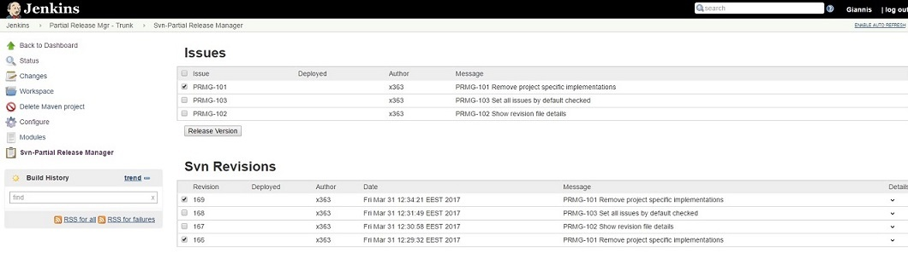
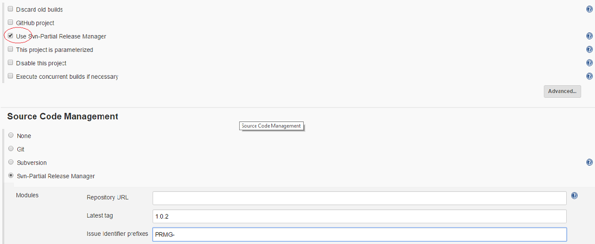
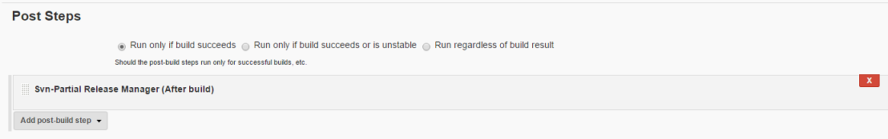

[.conf-macro .output-inline]# #

This plugin provides the option to set up a job in Jenkins in order to
build a partial release for a project.

Based on the
plugin https://wiki.jenkins-ci.org/display/JENKINS/Subversion+Release+Manager[Subversion
Release Manager Plugin]

 +

[[SVNPartialReleaseManagerPlugin-Description]]
== Description

Suppose you have released a major version into production and created a
tag into Subversion for that release.

The team developers start committing their code for the issues of the
next release. For some reason (client needs it urgently, QA team has not
signed off) you need to move into production only some of the issues you
have committed into SVN.

This plugin allows you to : 

* Select the issues you want to include into the partial release
* Keep track of all the revisions you have already deployed into
previous partial releases for the same tag

_Prerequisites: All revisions committed for the same issue must contain
into their commit message the same issue identifier (e.g PRMG-102 )
where the PRMG- is the prefix configured into the job._

Here is a screenshot of the job selection screen of the issues to be
released.( By checking an issue we actually check the revisions that
have been committed for that issue )  

[.confluence-embedded-file-wrapper]##

[[SVNPartialReleaseManagerPlugin-Functionality]]
== Functionality

After the user clicks the "Release Version" button the job will execute
the following steps.

* Checkout from SVN the tag revision source
* Will get the selected revision file sources from svn.
* Combine the source and proceed with normal build of a partial release.

[[SVNPartialReleaseManagerPlugin-Configuration]]
== Configuration

To create a partial release manager job one can act as follows.

* Create a new Maven Project Item
* Be sure to select the checkbox "Use- Svn Partial Relase Manager" ( red
circle in the screenshot 1 below )
* Enter your svn repository url
* Enter your latest major release tag to build the partial release uppon
to
* Enter the issue identifier prefixes ( comma delimeted if more than one
)

NOTE!! One might have more than one partial releases for the same tag so
he/she will repeat the above execution many times.

* In order to keep track of the previous release (aka the already moved
to production releases ) one needs also to add a post build step (
screenshot 2 )

  +
Screenshot 1

[.confluence-embedded-file-wrapper]##

Screenshot 2 +
[.confluence-embedded-file-wrapper]##

[[SVNPartialReleaseManagerPlugin-ChangeLog]]
== Change Log

[[SVNPartialReleaseManagerPlugin-Version0.1(2017-03-31)]]
=== Version 0.1 (2017-03-31)

* Initial release
