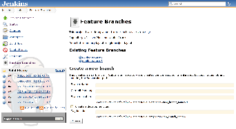
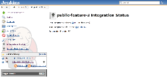
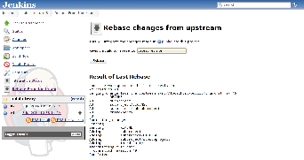
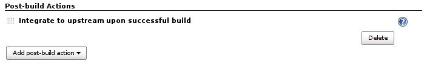

This plugin automates feature/personal branch workflow on Jenkins by
providing one-click branching/rebasing/integration or automated
rebasing/integration.

For general discussion of feature branches in Subversion, see
http://svnbook.red-bean.com/en/1.7/svn.branchmerge.commonpatterns.html[Online
subversion book] or
http://nedbatchelder.com/text/quicksvnbranch.html[articles]. Feature
branches allow developers to commit their changes without worrying too
much about regressions, and this Jenkins plugin assists teams to deploy
this more easily.

[[SubversionMergePlugin-Features]]
== Features

[[SubversionMergePlugin-One-clickfeaturebranchsetup]]
=== One-click feature branch setup

You can have Jenkins create a branch in Subversion and create a job for
it (by copying from the trunk build job) just by one click of a button.

To do this, first enable the feature branch support in the job that
currently builds the trunk by clicking "Accept Integration from
Subversion feature branches." This creates an action on the left to
manage/create new feature branches. From this page, you can create a
branch and the job:

[.confluence-embedded-file-wrapper .image-center-wrapper]##

Alternatively, you can manually create a branch, create a job, and
enable the feature branch support after the fact by clicking "This
project builds a Subversion feature branch" and specifying the trunk
job.

[[SubversionMergePlugin-Integrationstatusvisualization]]
=== Integration status visualization

Jobs that build feature branches get two actions on the left. One shows
the status of the integration, meaning what changes in the branch has
already been integrated into the trunk, the revision number of the
integration commit, what trunk CI job has built it, etc.

[.confluence-embedded-file-wrapper .image-center-wrapper]##

The up arrow in the build history indicates builds whose output has been
integrated upstream.

[[SubversionMergePlugin-One-clickrebase]]
=== One-click rebase

The other action in the project top page allows you to manually initiate
the "rebase" action, which is a Subversion merge command to pull in the
latest changes from the trunk into your feature branch, thereby
synchronizing the branch with the trunk.

[.confluence-embedded-file-wrapper .image-center-wrapper]##

In addition to rebasing with the tip of the trunk, this UI allows you to
pick arbitrary revision to rebase, in terms of the known build — for
example, you can rebase with the revision that was resulted in the last
stable trunk build, thereby eliminating any risk that you pick up
regressions into your branch.

(This also works with the build promotion plugin and others that can
define their own permalinks.)

[[SubversionMergePlugin-Automaticrebase]]
=== Automatic rebase

Aside from manually performing rebase, you can also make rebase a part
of the build. This can ensure that your feature branch always stay close
to the trunk, thereby reducing the pain of the merge down the road.

[.confluence-embedded-file-wrapper .image-center-wrapper]#image:docs/images/auto-rebase.png[image]#

Specifying the build to rebase to is a good way to control the frequency
of the rebase. For example, imagine using the build promotion plugin on
the trunk, and promote a build as "rebase point" about once a day
(contingent on passing QA jobs.) Since the last "rebase point" build
would only change about once a day, the automatic rebase would be no-op
most of the time but only once a day.

[[SubversionMergePlugin-Automaticintegration]]
=== Automatic integration

In addition to initiate integration manually, you can also make Jenkins
do integration automatically. This can be used as a publisher, as seen
below:

[.confluence-embedded-file-wrapper .image-center-wrapper]##

If you enable this in a project, you'll be automatically integrating
with every successful build. This is useful for personal branches, where
you'll keep on committing to this branch and let Jenkins verify the
change before it gets integrated into the trunk.

This feature gets more interesting in combination with the build
promotion. You can keep producing CI builds quickly, then use other jobs
to verify its quality, and as a promotion action you can make the
integration happen. This matches more closely with the typical
integration workflow.

[[SubversionMergePlugin-Tips]]
=== Tips

* Automatic rebase and integration actions can be configured in the
upstream job so they are automatically configured on feature branch jobs
when created by the plugin.
* You can avoid the so-called Subversion "keep-alive-dance" which
triggers unnecessary builds of the feature branch by excluding the
commit messages matching
`+Rebasing with the integration commit that was just made in rev\.\d++`
(see
https://wiki.jenkins-ci.org/display/JENKINS/Subversion+Merge+Plugin?focusedCommentId=82020693#comment-82020693[this
discussion]).

[[SubversionMergePlugin-Changelog]]
== Changelog

[[SubversionMergePlugin-Version2.6(December10,2015)]]
=== Version 2.6 (December 10, 2015)

* Add Support for Matrix build
(https://issues.jenkins-ci.org/browse/JENKINS-27609[issue 27609]).
* Mark build as unstable on failure
(https://issues.jenkins-ci.org/browse/JENKINS-27610[issue 27610]).
* Fix issue with "CloudBees Folder plugin"
(https://issues.jenkins-ci.org/browse/JENKINS-31745[issue 31745]).

[[SubversionMergePlugin-Version2.5(January10,2015)]]
=== Version 2.5 (January 10, 2015)

* Fix incompatible with
https://wiki.jenkins-ci.org/display/JENKINS/Subversion+Plugin[subversion]
2.5 (https://issues.jenkins-ci.org/browse/JENKINS-26347[issue 26347] and
https://issues.jenkins-ci.org/browse/JENKINS-26357[issue 26357]).
* Do integration on the first module regardless of the number of modules
defined and the "Ignore externals" option
(https://issues.jenkins-ci.org/browse/JENKINS-26280[issue 26280]).

[[SubversionMergePlugin-Version2.4(December20,2014)]]
=== Version 2.4 (December 20, 2014)

* Add support for build parameters in Subversion URLs.
(https://issues.jenkins-ci.org/browse/JENKINS-24735[issue 24735]).
* Fix wrong revision used for upstream integration
(https://issues.jenkins-ci.org/browse/JENKINS-25739[issue 25739]).
* Add permissions for Rebase and Integrate actions
(https://issues.jenkins-ci.org/browse/JENKINS-25942[issue 25942]).
* Fix integration of promoted builds
(https://issues.jenkins-ci.org/browse/JENKINS-14725[issue 14725]).

Breaking changes

[.aui-icon .aui-icon-small .aui-iconfont-warning .confluence-information-macro-icon]#
#

New permissions for Rebase and Integration will have to be granted
manually on system using matrix-based authorization.

[[SubversionMergePlugin-Version2.3(July15,2014)]]
=== Version 2.3 (July 15, 2014)

* Rebase not working for simple setup
(https://issues.jenkins-ci.org/browse/JENKINS-23107[issue 23107]).
* Ignore `+svn:externals+` when reintegrating branch
(https://issues.jenkins-ci.org/browse/JENKINS-23371[issue 23371]).
* Skip rebase on main branch
(https://issues.jenkins-ci.org/browse/JENKINS-23393[issue 23393]).

[[SubversionMergePlugin-Version2.2(May28,2014)]]
=== Version 2.2 (May 28, 2014)

* Improved repository layout detection and customization on "New Branch"
action (https://issues.jenkins-ci.org/browse/JENKINS-15830[issue 15830],
https://issues.jenkins-ci.org/browse/JENKINS-22284[issue 22284]).
* Added option on "Automatic Rebase" action to fail the build when merge
conflicts are found
(https://issues.jenkins-ci.org/browse/JENKINS-6851[issue 6851],
https://issues.jenkins-ci.org/browse/JENKINS-22850[issue 22850]).

[[SubversionMergePlugin-Version2.1(Mar13,2014)]]
=== Version 2.1 (Mar 13, 2014)

* Fix reintegration issue with HTTP protocol
(https://issues.jenkins-ci.org/browse/JENKINS-12495[issue 12495]).

[[SubversionMergePlugin-Version2.0.4(Feb28,2014)]]
=== Version 2.0.4 (Feb 28, 2014)

* Support
https://wiki.jenkins-ci.org/display/JENKINS/Subversion+Plugin[Subversion
Plugin] version 2.x
(https://issues.jenkins-ci.org/browse/JENKINS-21916[issue 21916]).
* Support rebase/integration actions on slaves
(https://issues.jenkins-ci.org/browse/JENKINS-12495[issue 12495]).

[[SubversionMergePlugin-Version1.3(Feb21,2014)]]
=== Version 1.3 (Feb 21, 2014)

* Handle feature branches in subfolder
(https://issues.jenkins-ci.org/browse/JENKINS-21781[isse 21781]).
* Added possibility to enter a commit message when creating a feature
branch (https://issues.jenkins-ci.org/browse/JENKINS-11012[issue
11012]).
* Copy "Local module directory" from upstream project when creating a
feature branch (https://issues.jenkins-ci.org/browse/JENKINS-11379[issue
11379]).

[[SubversionMergePlugin-Version1.2(Apr14,2012)]]
=== Version 1.2 (Apr 14, 2012)

* Changes
(https://github.com/jenkinsci/svnmerge-plugin/compare/svnmerge-1.1...svnmerge-1.2[GitHub]).

[[SubversionMergePlugin-Version1.1(Oct1,2011)]]
=== Version 1.1 (Oct 1, 2011)

* Changes
(https://github.com/jenkinsci/svnmerge-plugin/compare/svnmerge-1.0...svnmerge-1.1[GitHub]).

[[SubversionMergePlugin-Version1.0(Sep1,2011)]]
=== Version 1.0 (Sep 1, 2011)

* Initial release
