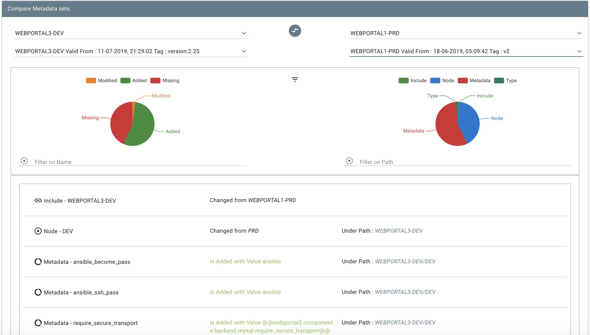

[[SWEAGLEPlugin-https://sweagle.com]]
== https://sweagle.com/[[.confluence-embedded-file-wrapper .image-left-wrapper .confluence-embedded-manual-size]#image:docs/images/sweaglelogo.png[image,height=200]#]

[[SWEAGLEPlugin-Aqualitygateforyourconfigurationdata.]]
== A quality gate for your configuration data.

SWEAGLE is a SaaS or On-Premise platform for managing, consolidating &
continuously validating all kinds of configuration data which is crucial
to your CI/CD pipeline.  This plugin allows for uploading config data
into SWEAGLE so it can be versioned, validated, and made consumable in
many different formats.   More info about SWEAGLE can be found
at https://www.sweagle.com/.   

For more information about the SWEAGLE API, register for an account
at https://support.sweagle.expert/[https://support.sweagle.expert].

The SWEAGLE plugin for Jenkins supports Jenkins Pipeline.  See an
example pipeline script
here:https://wiki.jenkins.io/display/JENKINS/SWEAGLE+pipeline+example

[.confluence-embedded-file-wrapper .confluence-embedded-manual-size]####[.confluence-embedded-file-wrapper .confluence-embedded-manual-size]####

 +

 +

The plugin supports 4 types of Jenkins build steps for stages of a
config data lifecycle. 

[[SWEAGLEPlugin-Upload-->Validate-->Snapshot-->Export]]
=== Upload --> Validate --> Snapshot --> Export

Global Config

[.confluence-embedded-file-wrapper .confluence-embedded-manual-size]##

[width="100%",cols="21%,79%",]
|===
|SWEAGLE API Key |API key from API type user with appropriate
permissions required for automating SWEAGLE tasks

|SWEAGLE Tenant URL |SaaS or On-Premise URL of your SWEAGLE instance
|===

 +

All actions have an [.underline]#Action Name# parameter and a
[.underline]#Show API responses# parameter that provide more context for
the action in the Jenkins console log.  

 +

[cols=",",]
|===
|Action Name |Give each action a descriptive name to precede the job's
output in the console. 

|Show API Responses in Console Log |If checked, SWEAGLE REST API
responses will be displayed in the job console. 
|===

[[SWEAGLEPlugin-UploadBuildStep]]
=== Upload Build Step

https://github.com/jenkinsci/sweagle-plugin/blob/master/screenshots/upload.png[[.confluence-embedded-file-wrapper .confluence-embedded-manual-size]#image:https://github.com/jenkinsci/sweagle-plugin/raw/master/screenshots/upload.png[upload,width=790]#]

[width="100%",cols="14%,86%",]
|===
|File Location |Location of the file in the workspace to be uploaded.

|Node Path |Enter the path where the data should be uploaded to.
seperate the nodenames in the path with a comma. In case the nodes do
not yet exist, they will be created automatically.

|File format |json | yaml | xml | txt | properties | ini +
Any of the supported formats
|===

[[SWEAGLEPlugin-ValidateBuildStep]]
=== Validate Build Step

[.confluence-embedded-file-wrapper .confluence-embedded-manual-size]##

[width="100%",cols="25%,75%",]
|===
|MDS Name |The exact name of the incoming metadata set which should be
validated.

|Fail build on validate errors |A threshold used to determine if the
build should be failed based on the number of validation errors or
warnings.  Use -1 to ignore either threshold.

| + | +
|===

[[SWEAGLEPlugin-SnapshotBuildStep]]
=== Snapshot Build Step

https://github.com/jenkinsci/sweagle-plugin/blob/master/screenshots/snapshot.png[[.confluence-embedded-file-wrapper .confluence-embedded-manual-size]#image:https://github.com/jenkinsci/sweagle-plugin/raw/master/screenshots/snapshot.png[snapshot,width=790]#]

[width="100%",cols="15%,85%",]
|===
|MDS Name |Exact name of pending metadata set for which the snapshot
should be taken

|Description |Description of the snapshot

|Tag |A single string as TAG for that snapshot - cannot contain spaces
but can utilize Jenkins variable4s ex "release1.2.$\{BUILD_ID}"

|Fail Build on Snapshot |If the snapshot should fail for any reason,
fail the build.
|===

[[SWEAGLEPlugin-GetConfigBuildStep]]
=== Get Config Build Step

[.confluence-embedded-file-wrapper .confluence-embedded-manual-size]## +
 +

[width="100%",cols="14%,86%",]
|===
|MDS Name |The stored Metadata set to use for retrieving the config
data.

|File Location |The location and filename in the Jenkins workspace to
save the retrieved config data.

|Exporter |The SWEAGLE exporter to use when retrieving the config data.
|===
