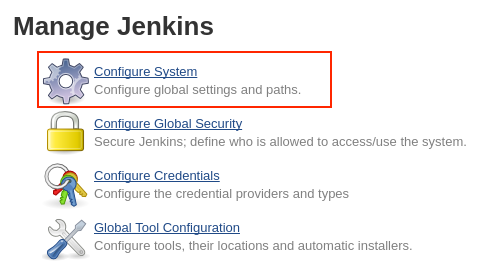
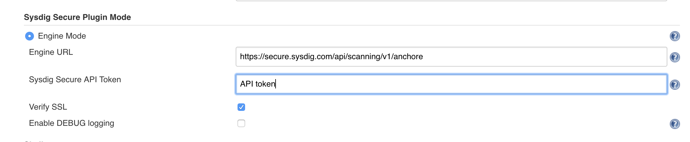
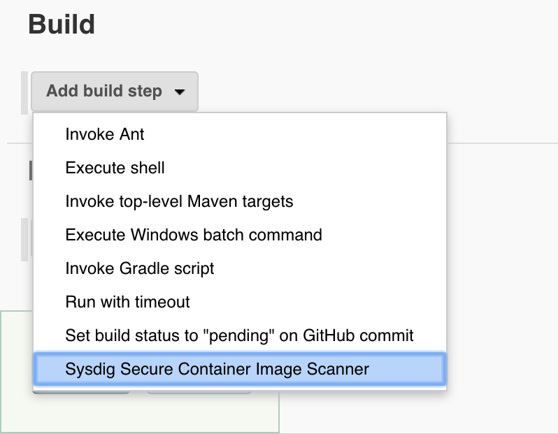
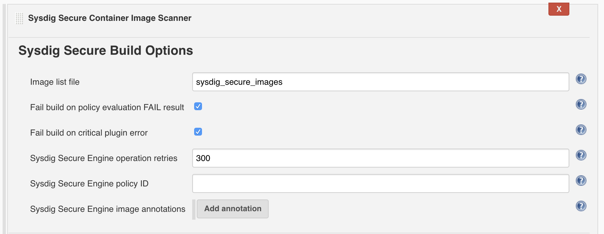

https://sysdig.com/products/secure/[Sysdig Secure] is a container
security platform that brings together docker image scanning and
run-time protection to identify vulnerabilities, block threats, enforce
compliance, and audit activity across your microservices. The Sysdig
Secure Jenkins plugin can be used in a Pipeline job, or added as a build
step to a Freestyle job, to automate the process of running an image
analysis, evaluating custom policies against images, and performing
security scans.

[[SysdigSecureJenkinsPlugin-Contents]]
== Contents

 +

[[SysdigSecureJenkinsPlugin-GettingStarted]]
== Getting Started

[[SysdigSecureJenkinsPlugin-Pre-requisites]]
=== Pre-requisites

The Sysdig Secure plugin installation process has the following
prerequisites:

* Sysdig Secure installed within the build environment.
* All authentication credentials/Sysdig Secure API endpoint information
prepared for input when configuring the plugin.

[[SysdigSecureJenkinsPlugin-Installation]]
=== Installation

The Sysdig Secure plugin is published in the Jenkins plugin registry,
and is available for installation on any Jenkins server.

. https://github.com/jenkinsci/sysdig-secure-plugin

[[SysdigSecureJenkinsPlugin-Configuration]]
=== Configuration

To configure the Sysdig Secure plugin:

. Complete these steps after installing the hpi file from the
installation link above.
. From the main Jenkins menu, select `+Manage Jenkins+`.
. Click the `+Configure System+` link. +
**[.confluence-embedded-file-wrapper .confluence-embedded-manual-size]#[.confluence-embedded-file-wrapper .confluence-embedded-manual-size]###**
. Scroll to the `+Sysdig Secure Plugin Mode+` section.
. Define the engine URL:
+
[source,syntaxhighlighter-pre]
----
https://secure.sysdig.com/api/scanning/v1/anchore
----
+
[.confluence-embedded-file-wrapper .confluence-embedded-manual-size]##
+
 +
. Input the API token found
here: https://secure.sysdig.com/#/settings/user
. Click `+Save+`.

[[SysdigSecureJenkinsPlugin-IntegratetheSysdigSecurePluginwithaFreestyleProject]]
== Integrate the Sysdig Secure Plugin with a Freestyle Project

The Sysdig Secure plugin reads a file called
`+sysdig_secure_images+` for the list of images to scan. In the example
below, an execute shell build step is used to build and push a container
to a local registry:

[source,syntaxhighlighter-pre]
----
TAG=$(date "+%H%M%S%d%m%Y")
IMAGENAME=build.example.com/myapp
docker build -t $IMAGENAME:$TAG .
docker push $IMAGENAME:$TAG
----

[.aui-icon .aui-icon-small .aui-iconfont-info .confluence-information-macro-icon]#
#

This process is an example, and should be used as a guide, rather than
copying commands directly into a terminal.

To configure the build step, add a line to the script to create the
`+sysdig_secure_images+` file:

[source,syntaxhighlighter-pre]
----
TAG=$(date "+%H%M%S%d%m%Y")
IMAGENAME=build.example.com/myapp
docker build -t $IMAGENAME:$TAG .
docker push $IMAGENAME:$TAG

# Line added to create sysdig_secure_images file
echo "$IMAGENAME:$TAG ${WORKSPACE}/Dockerfile " > sysdig_secure_images
----

[.aui-icon .aui-icon-small .aui-iconfont-info .confluence-information-macro-icon]#
#

Multiple lines can be added if the build produces more than a single
container image.

Once the image has been built and pushed to the staging registry, the
Sysdig Secure Image Scan can be called from the Jenkins UI:

. Open the `+Add build step+` drop-down menu, and select
`+Sysdig Secure Container Image Scanner+`. This creates a new build step
labeled `+Sysdig Secure Build Options+`. +
[.confluence-embedded-file-wrapper .confluence-embedded-manual-size]##
. Configure the available options, and click `+Save+`. +
[.confluence-embedded-file-wrapper .confluence-embedded-manual-size]## +
The table below describes each of the configuration options.
+
[cols=",",options="header",]
|===
|Option |Description
|Image list file |The name of the file, present in the workspace that
contains the image name, and optionally the Dockerfile location.

|Fail build on policy check STOP result |If the Sysdig Secure policy
evaluate returns a fail (STOP) then the Jenkins job should be failed. If
this is not selected then a failed policy evaluation will allow the
build to continue.

|Fail build on critical plugin error |If selected, and the Sysdig Secure
Plugin experiences a critical error, the the build will be failed. This
is typically used to ensure that a fault with Sysdig Secure (eg. service
not available) does not permit a failing image to be promoted to
production.

|Sysdig Secure operation retries |How long in seconds the Sysdig Secure
Plugin waits until timing out image analysis. The plugin will continue
operation once the image has been analyzed but will time out if this
period is exceeded.

|Sysdig Secure Engine policy ID |The ID of the policy that the image
will be evaluated against. Policies can be found within Sysdig Secure
here: https://secure.sysdig.com/#/scanning/policies.
|===
