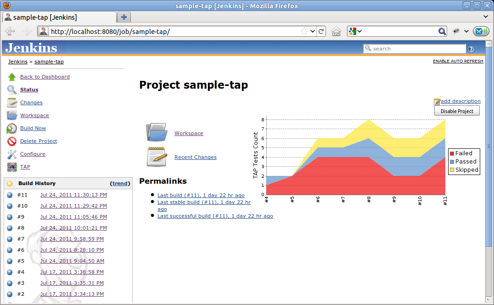

[.conf-macro .output-inline]##

[cols="",options="header",]
|===
|Plugin Information
|View TAP https://plugins.jenkins.io/tap[on the plugin site] for more
information.
|===

[.aui-icon .aui-icon-small .aui-iconfont-info .confluence-information-macro-icon]##

Older versions of this plugin may not be safe to use. Please review the
following warnings before using an older version:

* https://jenkins.io/security/advisory/2016-06-20/[Path traversal
vulnerability]

[.conf-macro .output-inline]#This plug-in adds support to
http://www.testanything.org/[TAP] test result files to Jenkins. It lets
you specify an
http://ant.apache.org/manual/dirtasks.html#patterns[ant-like pattern]
for a directory that contains your TAP files.# +
TAP Plug-in depends on http://www.tap4j.org/[tap4j] - a TAP
implementation for Java, and on the
https://wiki.jenkins-ci.org/display/JENKINS/JUnit+Plugin[JUnit Plug-in].
You may get errors if the JUnit Plug-in is not active in your Jenkins
instance (see
https://issues.jenkins-ci.org/browse/JENKINS-27227[JENKINS-27227] for
more).

[[TAPPlugin-Overview]]
== Overview

The plug-in looks for TAP files like the following one.

[source,syntaxhighlighter-pre]
----
1..2
ok 1 - Yahoo!
not ok 2 - org.tap4j.Error...
----

When a TAP stream like the above is found, the plug-in delegates the
parsing the tap4j. The results of tap4j parsing are then analysed,
organized and displayed to the user as graphs and custom pages.

[.aui-icon .aui-icon-small .aui-iconfont-approve .confluence-information-macro-icon]#
#

You can test your TAP streams with tap4j, using
http://instanttap.appspot.com/[InstantTAP].

[[TAPPlugin-UnderstandingTAPstreamsin2minutes]]
=== Understanding TAP streams in 2 minutes

One of the easiest ways to learn something new is by examples. So here
we will show some examples of TAP streams. For being human-friendly, it
shouldn't confuse you. We will use comments to explain each line.

[source,syntaxhighlighter-pre]
----
1..2 # a plan stating that we have two tests cases, from 1 to 2.
ok 1 - Yahoo! # the first test result was executed successfully and has a description of ' - Yahoo!'.
not ok 2 - org.tap4j.Error... # unfortunately, the second test result failed. The description here was used to display some nasty Exception.
----

[[TAPPlugin-RunningPerltestswithprove]]
=== Running Perl tests with prove

The plug-in cannot handle prove's default output (since it includes more
information than simply TAP, and causes tap4j parser to fail). The best
way to handle the prove output is by using Perl module
http://search.cpan.org/~wonko/TAP-Harness-Archive-0.14/lib/TAP/Harness/Archive.pm[TAP::Harness::Archive].
Supposing you have your tests under t/ directory, you can create another
directory (say, output) and archive your TAP tests with prove by using a
command line similar to the below:

[source,syntaxhighlighter-pre]
----
prove t/ --archive output
----

The result files will be stored under _output/t/_. You can use a pattern
in the plug-in configuration like __t/*__**_/_**_.t_.

[[TAPPlugin-Usingattachments]]
=== Using attachments

The following is a TAP with attachments, using YAMLish. If you are
familiar with YAML, this example should be very easy to read.

[source,syntaxhighlighter-pre]
----
1..2
ok 1
not ok 2 - br.eti.kinoshita.selenium.TestListVeterinarians#testGoogle
  ---
  extensions:
      Files:
          my_message.txt:
            File-Title: my_message.txt
            File-Description: Sample message
            File-Size: 31
            File-Name: message.txt
            File-Content: TuNvIGNvbnRhdmFtIGNvbSBtaW5oYSBhc3T6Y2lhIQ==
            File-Type: image/png
  ...
----

The Files entry has an array of files. You have to Base64 encode your
content data.

[[TAPPlugin-Subtests(groupingortestsuites).]]
=== Subtests (grouping or test suites).

Subtests let you group several TAP streams unto a single one. This way,
you can organize your tests in similar fashion to JUnit or TestNG test
suites. Indentation is important for TAP subtests.

[.aui-icon .aui-icon-small .aui-iconfont-warning .confluence-information-macro-icon]#
#

Subtests and YAMLish are not officially in TAP 13 specification

[source,syntaxhighlighter-pre]
----
  1..3
  ok 1 - First test
      1..2
      ok 1 - This is a subtest
      ok 2 - So is this
        1..2
        ok 1 - This is a subtest
        ok 2 - So is this
  ok 2 - An example subtest
  ok 3 - Third test
----

[[TAPPlugin-Configuration]]
== Configuration

. Install the Jenkins TAP Plug-in using the Plug-in Manager or manually
by copying the .hpi (or .jpi) file
. Check the option to publish TAP, configure a pattern (and other
settings)
. Execute your build and analyze the results

[[TAPPlugin-Screenshots]]
== Screenshots

[[TAPPlugin-JenkinsJUnitcompatiblereportsandgraphs]]
=== Jenkins JUnit compatible reports and graphs

[.confluence-embedded-file-wrapper]##

[[TAPPlugin-CustomactionsforTAPtoo]]
=== Custom actions for TAP too

[.confluence-embedded-file-wrapper]##

[[TAPPlugin-YAMLishsupport]]
=== YAMLish support

[.confluence-embedded-file-wrapper]#image:docs/images/003.png[image]#

[[TAPPlugin-LanguagesSupported]]
== Languages Supported

. English (American)
. Portuguese (Brazil)) Work in Progress
. Spanish (Thanks to http://www.cesinha.com/[César Fernandes de
Almeida]) Work in Progress

[[TAPPlugin-KnownLimitations]]
== Known Limitations

. If the file type of a TAP report is considered as binary by the
Jenkins webserver then the TAP plugin doesn't consider this file for
inclusion in TAP reports (see
https://issues.jenkins-ci.org/browse/JENKINS-15813[#15813] for further
details). To make sure your TAP report is considered for inclusion use
e.g. the file name suffix .tap (so instead of a file named "_report_"
use "_report.tap_").

[[TAPPlugin-CompatibilityMatrix]]
== Compatibility Matrix

[.aui-icon .aui-icon-small .aui-iconfont-warning .confluence-information-macro-icon]#
#

This plug-in is not developed for Hudson, and we don't fix bugs
happening in any version of Hudson.

[cols=",,,,,,,,,,,,,",]
|===
|Plugin |1.0 |1.1 |1.2.x |1.3~1.9 |1.10 |1.11 |1.12 |1.13 |1.14 |1.15
|1.16 |1.17 |1.18+

|TAP |13 |13 |13 |13 |13 |13 |13 |13 |13 |13 |13 |13 |13

|Jenkins |1.399+ |1.399+ |1.399+ |1.399+ |1.488+ |1.488+ |1.488+ |1.488+
|1.488+ |1.488+ |1.488+ |1.488+ |1.488+

|Hudson |? |? |? |Not supported |Not supported |Not supported |Not
supported |Not supported |Not supported |Not supported |Not supported
|Not supported |Not supported
|===

[[TAPPlugin-OpenIssues]]
== Open Issues

[#jiraissues]##

[.aui-icon .aui-icon-small .aui-iconfont-warning .confluence-information-macro-icon]#
#

[[TAPPlugin-Sponsors]]
== Sponsors

http://www.tupilabs.com/[[.confluence-embedded-file-wrapper .confluence-embedded-manual-size]#image:docs/images/logo1.png[image,width=300]#]

For commercial support, please get contact us
via https://twitter.com/tupilabs[@tupilabs]

[[TAPPlugin-Resources]]
== Resources

. This plug-in is going to be part of "Make your tests speak TAP"
presentation in http://www.jcertif.com/[JCertif] by
http://www.kinoshita.eti.br/[Bruno P. Kinoshita], in September 2011. In
this presentation will be presented too the tap4j project, how to enable
TAP in JUnit and TestNG, integrate http://www.perl.org/[Perl] and
http://www.oracle.com/java[Java] tests and an
https://github.com/kinow/tap-editor[Eclipse TAP editor].
. Gábor Szabó (2009), Test Reporting system: Smolder wish-list
<http://szabgab.com/blog/2009/07/test-reporting-system-smolder-wish-list.html>.
. Gábor Szabó (2009), Reporting Test Results
<http://szabgab.com/blog/2009/04/reporting-test-results.html>
. http://www.tap4j.org/[tap4j] - The TAP implementation for Java.
. http://www.testanything.org/[Test Anything Protocol] (official
webpage).
. http://www.slideshare.net/guest94ab56d/2013-0717continuous-performancemonitoringwithjenkins[Performance
tests with phantomjs and yslow] (uses the plug-in for plotting the TAP
results)
. http://www.mathworks.com/help/matlab/ref/matlab.unittest.plugins.tapplugin-class.html[TAP
Plugin for Matlab]

JCertif 2011

[.aui-icon .aui-icon-small .aui-iconfont-info .confluence-information-macro-icon]#
#

http://www.jcertif.com/[JCertif] - Make your tests speak TAP -
Speaker: http://www.kinoshita.eti.br/[Bruno P. Kinoshita] +
September, 2011 - Brazzaville, Congo +
[.confluence-embedded-file-wrapper]##

[[TAPPlugin-ReleaseNotes]]
== Release Notes

[[TAPPlugin-2.3(2019-06-05)]]
=== 2.3 (2019-06-05)

. https://github.com/jenkinsci/tap-plugin/pull/24[tap4j dependency
upgraded to 4.4.2 version]
. https://github.com/jenkinsci/tap-plugin/pull/25[enabled parsing of TAP
documents with corrupted YAML content]
.. New option in advanced, to remove corrupted YAML elements (should
work after upgrading the plug-in, but remember to back up first anyway!)

[[TAPPlugin-2.2.2(2019-02-14)]]
=== 2.2.2 (2019-02-14)

. [.jira-issue .conf-macro .output-block]#
https://issues.jenkins-ci.org/browse/JENKINS-55787[[.aui-icon .aui-icon-wait .issue-placeholder]##
##JENKINS-55787] - [.summary]#Getting issue details...#
[.aui-lozenge .aui-lozenge-subtle .aui-lozenge-default .issue-placeholder]#STATUS#
#

[[TAPPlugin-2.2.1(2018-02-07)]]
=== 2.2.1 (2018-02-07)

. [.jira-issue .conf-macro .output-block]#
https://issues.jenkins-ci.org/browse/JENKINS-48925[[.aui-icon .aui-icon-wait .issue-placeholder]##
##JENKINS-48925] - [.summary]#Getting issue details...#
[.aui-lozenge .aui-lozenge-subtle .aui-lozenge-default .issue-placeholder]#STATUS#
#

[[TAPPlugin-2.2(2018-01-26)]]
=== 2.2 (2018-01-26)

. [.jira-issue .conf-macro .output-block]#
https://issues.jenkins-ci.org/browse/JENKINS-48925[[.aui-icon .aui-icon-wait .issue-placeholder]##
##JENKINS-48925] - [.summary]#Getting issue details...#
[.aui-lozenge .aui-lozenge-subtle .aui-lozenge-default .issue-placeholder]#STATUS#
#

[[TAPPlugin-2.1(2017-02-28)]]
=== 2.1 (2017-02-28)

. https://issues.jenkins-ci.org/browse/JENKINS-22250[JENKINS-22250]:
"fail the build if no test results are present" option doesn't fail the
job
. https://issues.jenkins-ci.org/browse/JENKINS-21456[JENKINS-21456]:
Plugin runs despite earlier errors
. Upgraded tap4j dependency from 4.2.0 to 4.2.1 (latest)

[[TAPPlugin-2.0(2016-08-20)]]
=== 2.0 (2016-08-20)

. https://issues.jenkins-ci.org/browse/JENKINS-29649[JENKINS-29649:
don't overwrite existing junit-results]
. https://issues.jenkins-ci.org/browse/JENKINS-34000[JENKINS-34000:
Workflow/Pipeline Support for TAP Plugin]
. https://issues.jenkins-ci.org/browse/JENKINS-33779[JENKINS-33779: TAP
plugin: enable detailed output for TAP with subtests]

[[TAPPlugin-1.25(2016-06-21)]]
=== 1.25 (2016-06-21)

. https://issues.jenkins-ci.org/browse/JENKINS-23851[JENKINS-23851:
Expand env vars in the ant pattern field]
. https://issues.jenkins-ci.org/browse/JENKINS-17804[JENKINS-17804: Add
option to show only failures]
. https://issues.jenkins-ci.org/browse/JENKINS-29650[JENKINS-29650:
Don't use a build step synchronization, defaulting to NONE.]
. https://issues.jenkins-ci.org/browse/JENKINS-30751[JENKINS-30751: Use
same logic everywhere to say whether a test is a failure or not]
. https://issues.jenkins-ci.org/browse/JENKINS-24843[JENKINS-24843: Copy
duration from Tabulated Tests]
. https://github.com/jenkinsci/tap-plugin/pull/6[pull request #6: fix
duration_ms (thanks to @forrest79)]
. https://issues.jenkins-ci.org/browse/JENKINS-22016[JENKINS-22016 via
pull request #10: Expand env vars in the ant pattern field (thanks to
@evandy0)]
. https://issues.jenkins-ci.org/browse/SECURITY-85[SECURITY-85: [tap]
Can read all files on file system]

[[TAPPlugin-1.24(2015-10-01)]]
=== 1.24 (2015-10-01)

. https://issues.jenkins-ci.org/browse/JENKINS-19471[JENKINS-19471: TAP
parser does not conform to InstantTAP website]
. https://issues.jenkins-ci.org/browse/JENKINS-24505[JENKINS-24505:
Tests are not marked as skipped with TAP plugin]
. https://issues.jenkins-ci.org/browse/JENKINS-19676[JENKINS-19676: TAP
test description does not get escaped]
. https://issues.jenkins-ci.org/browse/JENKINS-27227[JENKINS-27227: TAP
plugin fails to load with java.lang.NoClassDefFoundError:
hudson/tasks/test/AbstractTestResultAction]
. https://issues.jenkins-ci.org/browse/JENKINS-29153[JENKINS-29153: tap
plugin fails job when not have to]

[[TAPPlugin-1.23(2015-05-23)]]
=== 1.23 (2015-05-23)

. https://issues.jenkins-ci.org/browse/JENKINS-28508[JENKINS-28508:
Broken link on Tap Results]

[[TAPPlugin-1.22(2015-03-07)]]
=== 1.22 (2015-03-07)

. https://github.com/jenkinsci/tap-plugin/pull/8[Pull request #8 to add
LICENSE.txt]

[[TAPPlugin-1.21]]
=== 1.21

. Dropped

[[TAPPlugin-Version1.20]]
=== Version 1.20

. https://issues.jenkins-ci.org/browse/JENKINS-22047[JENKINS-22047: Add
option to reduce noise in logs]

[[TAPPlugin-Version1.18]]
=== Version 1.18

. Updated to tap4j-4.0.8
. https://issues.jenkins-ci.org/browse/JENKINS-22047[JENKINS-22047: Add
option to reduce noise in logs]
. https://issues.jenkins-ci.org/browse/JENKINS-22036[JENKINS-22036: NullPointer
when there is no Test Plan]
. https://issues.jenkins-ci.org/browse/JENKINS-17960[JENKINS-17960: Indicate
if tests don't go to plan]
. https://issues.jenkins-ci.org/browse/JENKINS-21917[JENKINS-21917: TAP
results graph causes null pointer exception]
. https://github.com/jenkinsci/tap-plugin/pull/4

[[TAPPlugin-Version1.17]]
=== Version 1.17

. https://issues.jenkins-ci.org/browse/JENKINS-22047[JENKINS-22047: Add
option to reduce noise in logs]
. https://issues.jenkins-ci.org/browse/JENKINS-22036[JENKINS-22036:
NullPointer when there is no Test Plan]
. https://issues.jenkins-ci.org/browse/JENKINS-17960[JENKINS-17960:
Indicate if tests don't go to plan]
. https://issues.jenkins-ci.org/browse/JENKINS-21917[JENKINS-21917: TAP
results graph causes null pointer exception]
. https://github.com/jenkinsci/tap-plugin/pull/4[Pull request #4]

[[TAPPlugin-Version1.17.1]]
=== Version 1.17

. https://issues.jenkins-ci.org/browse/JENKINS-20924[JENKINS-20924: Make
plans optional in TAP via a configuration]

[[TAPPlugin-Version1.16]]
=== Version 1.16

. Updated to tap4j-4.0.5 (better subtests handling)

[[TAPPlugin-Version1.15]]
=== Version 1.15

. https://issues.jenkins-ci.org/browse/JENKINS-16325[JENKINS-16325: TAP
Parser can't handle the output from prove]

[[TAPPlugin-Version1.14]]
=== Version 1.14

. Security bug reported by Kees J. via e-mail. This issue is related to
exposing files that the user running Jenkins has access via the plug-in.

[[TAPPlugin-Version1.13]]
=== Version 1.13

. https://issues.jenkins-ci.org/browse/JENKINS-17960[JENKINS-17960:
Indicate if tests don't go to plan]

[[TAPPlugin-Version1.12]]
=== Version 1.12

. https://issues.jenkins-ci.org/browse/JENKINS-18885[JENKINS-18885:
Parse errors with Git's TAP test suite, part 2]
. https://issues.jenkins-ci.org/browse/JENKINS-17878[JENKINS-17878: HTML
test output in tapResults not escaped]
. https://issues.jenkins-ci.org/browse/JENKINS-17855[JENKINS-17855: TAP
Stream results summary page contains links that fail]
. https://issues.jenkins-ci.org/browse/JENKINS-17504[JENKINS-17504: TAP
Plugin generates bad detail links on "tapTestReport" page]

[[TAPPlugin-Version1.11]]
=== Version 1.11

. https://issues.jenkins-ci.org/browse/JENKINS-17859[JENKINS-17859: TAP
report table show failed test message on ALL tests after the failed
one.]
. https://issues.jenkins-ci.org/browse/JENKINS-17855[JENKINS-17855: TAP
Stream results summary page contains links that fail]
. https://issues.jenkins-ci.org/browse/JENKINS-17941[JENKINS-17941:
Parse errors with Git's TAP test suite]
. https://issues.jenkins-ci.org/browse/JENKINS-17947[JENKINS-17947:
Nested TAP not parsed correctly]
. https://issues.jenkins-ci.org/browse/JENKINS-17504[JENKINS-17504: TAP
Plugin generates bad detail links on "tapTestReport" page]

[[TAPPlugin-Version1.10]]
=== Version 1.10

. https://issues.jenkins-ci.org/browse/JENKINS-17245[JENKINS-17245: Tap
plug-in can't find TAP attachments]

[[TAPPlugin-Version1.9]]
=== Version 1.9

. https://issues.jenkins-ci.org/browse/JENKINS-16262[JENKINS-16262: Tap
plug-in can't find TAP attachments]

[[TAPPlugin-Version1.8]]
=== Version 1.8

. https://issues.jenkins-ci.org/browse/JENKINS-15914[JENKINS-15914: TAP
results table misses first comment line]
. https://issues.jenkins-ci.org/browse/JENKINS-15322[JENKINS-15322:
NOTESTS in TAP response gives parse error and stack trace from plugin]
. https://issues.jenkins-ci.org/browse/JENKINS-15401[JENKINS-15401:
support TODO directive to not fail such tests]
. https://issues.jenkins-ci.org/browse/JENKINS-15907[JENKINS-15907: When
multiple TAP files with same basename match pattern, only one is
processed]

[[TAPPlugin-Version1.7]]
=== Version 1.7

. https://issues.jenkins-ci.org/browse/JENKINS-15586[JENKINS-15586: TAP
plug-in is ignoring given file extension and looking for .tap files]

[[TAPPlugin-Version1.6]]
=== Version 1.6

. https://issues.jenkins-ci.org/browse/JENKINS-15419[JENKINS-15419: TAP
published results hide JUnit published results]
. https://issues.jenkins-ci.org/browse/JENKINS-15497[JENKINS-15497:
Display link to download TAP attachment]

[[TAPPlugin-Version1.2.7]]
=== Version 1.2.7

. Removed requirement to have the TAP Plan at start or at the end of the
TAP Stream. This way, TAP Streams generated using Perl done_testing()
now works well with the plug-in

[[TAPPlugin-Version1.2.6]]
=== Version 1.2.6

. Support JSON within YAMLish data

[[TAPPlugin-Version1.1]]
=== Version 1.1

. Support to Bail out!'s
. JENKINS-10562 TAP Plugin fails on slave

[[TAPPlugin-Version1.0]]
=== Version 1.0

. Initial design of the plug-in
. Custom UI for TAP test results
. JUnit-like graph that displays the test results per build (actually
the graph was modeled using TestNG Plug-in as basis)

[[TAPPlugin-Roadmap(wishlist)]]
== Roadmap (wish list)

[[TAPPlugin-Version1.x]]
=== Version 1.x

. Add configurations like validate number of tests with test plan, a
TODO causes a test to fail
. Diagnostics image gallery Done! Fixed as a
https://wiki.jenkins-ci.org/display/JENKINS/Image+Gallery+Plugin[new
plug-in]
. Diagnostics exception code formatting
. Add a link to open the file in the Build workspace (think about remote
and local issues) Done!

[[TAPPlugin-History]]
== History

The idea of the plug-in surged after tap4j was created. After learning
about Smolder, it became evident that Jenkins could be used as a
replacement for it. All that was needed was just adding TAP support to
Jenkins and implementing a nice UI to display the test results. After
some messages in jenkins-dev-list, Max and Nick commented about their
need to show test results in a different manner than how Jenkins was
doing at that moment. Soon after that Max, Nick, Bruno (tap4j) and Cesar
(tap4j) started to work together, exchanging mail messages and
discussing about a initial design for this plug-in.

In July 2011 the first version of the plug-in was ready to be released.
The graph code used here was adapted from TestNG Plugin (big thanks to
the development team, great work). The diagnostic (YAMLish) was
implemented in Jelly + Java + CSS. And the road map was incremented
based on what Gábor Szabó posted about Smolder and testing reports in
his blog (see resources for links).

[[TAPPlugin-SimulatingTAPstreamswithshellbuildsteps]]
== Simulating TAP streams with shell build steps

[source,syntaxhighlighter-pre]
----
#!/bin/bash

for x in {1..100}; do

cat > $x.tap <<EOF
ok 1
not ok 2
ok 3 # SKIP
not ok 4
ok 5
ok 6
ok 7
EOF

done ;
----
