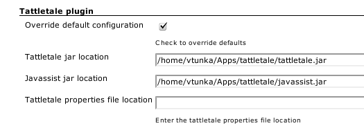
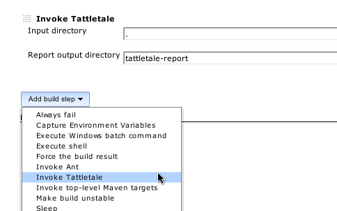
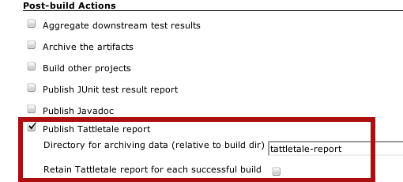
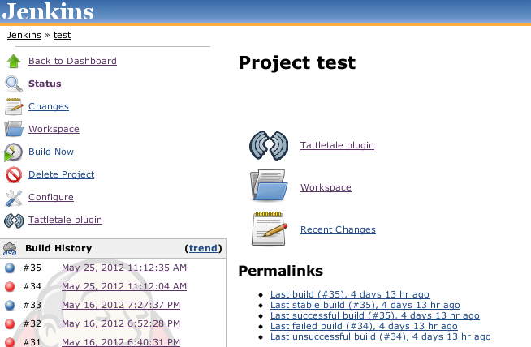
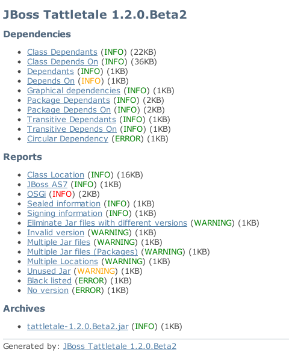

[.conf-macro .output-inline]####

[cols="",options="header",]
|===
|Plugin Information
|View Tattletale https://plugins.jenkins.io/tattletale-plugin[on the
plugin site] for more information.
|===

[.aui-icon .aui-icon-small .aui-iconfont-warning .confluence-information-macro-icon]##

*This plugin is up for adoption.* Want to help improve this plugin?
https://wiki.jenkins-ci.org/display/JENKINS/Adopt+a+Plugin[Click here to
learn more]!

This plugin generates http://www.jboss.org/tattletale[Tattletale]
reports, mostly useful for jar file analysis.

Tattletale can:

* Identify dependencies between JAR files
* Find missing classes from the classpath
* Spot if a class/package is located in multiple JAR files
* Spot if the same JAR file is located in multiple locations
* With a list of what each JAR file requires and provides
* Verify the SerialVersionUID of a class
* Find similar JAR files that have different version numbers
* Find JAR files without a version number
* Find unused JAR archives
* Identify sealed / signed JAR archives
* Locate a class in a JAR file
* Get the OSGi status of your project
* Remove black listed API usage
* And generate the same reports for your .WAR and .EAR archives +

Installation Requirements

[.aui-icon .aui-icon-small .aui-iconfont-warning .confluence-information-macro-icon]#
#

This plugin requires tattletale and javassist unzipped on filesystem.

Latest release download location:
http://maven.jenkins-ci.org:8081/content/repositories/releases/org/jenkins-ci/plugins/tattletale-plugin/0.3/

[[TattletalePlugin-Description]]
== Description

The Tattletale plug-in can generate tattletale reports and archive them
for each build.

The following features are provided by this plug-in:

* Tattletale execution using embedded mechanism
* Configuring which files to scan after each build.
* Report archivation for each build or per project
* Easy access and viewing of Tattletale reports

[[TattletalePlugin-HowToUse]]
== How To Use

. Download
http://sourceforge.net/projects/jboss/files/JBoss%20Tattletale/[Tattletale] or
use tattletale maven or ant integration
. Install plugin, Manage Hudson> manage plugins >Available
. Configure the tattletale and javassist (contained with tattetale
download) location
. Restart app server/ Hudson
. If you want the plugin to execute Tattletale add "Invoke Tattletale"
build step otherwise use maven or ant tattletale integration in your
project
. Check "Publish Tattletale report" in the post-build actions in your
project 
. Explore generated reports on project / build page

Step no. 3 - configuring global plugin settings: +
[.confluence-embedded-file-wrapper]##

Step no. 4 - invoking Tattletale for your project: +
[.confluence-embedded-file-wrapper]##

Step no. 5 - archiving reports: +
[.confluence-embedded-file-wrapper]##

Step no. 6 - Tattletale reports on project / build page:

 
[.confluence-embedded-file-wrapper]##

Example report: +
[.confluence-embedded-file-wrapper]##

[[TattletalePlugin-Changelog]]
== Changelog

Release 0.3

* Initial release
* Support for direct Tattletale execution (or usage of maven/ant
integration)
* Support for archiving reports per build or per project
