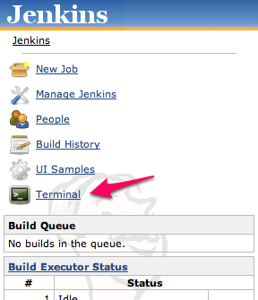
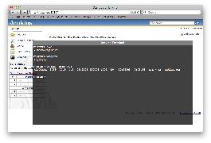
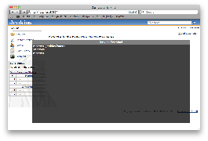
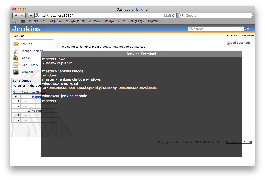

This plugin allows you to execute OS commands.

[[TerminalPlugin-Usage]]
== Usage

[[TerminalPlugin-ShowTerminal]]
=== Show Terminal

[.confluence-embedded-file-wrapper]##

[[TerminalPlugin-Runcommand]]
=== Run command

[.confluence-embedded-file-wrapper]##

[[TerminalPlugin-Shownodelist]]
=== Show node list

[.confluence-embedded-file-wrapper]##

[[TerminalPlugin-Runcommandatslave]]
=== Run command at slave

[.confluence-embedded-file-wrapper]##

[[TerminalPlugin-Seealso]]
== See also

https://wiki.jenkins-ci.org/display/JENKINS/Remote+Terminal+Access+Plugin[Remote
Terminal Access Plugin]

[[TerminalPlugin-VersionHistory]]
== Version History

[[TerminalPlugin-Version1.4(May23,2013)]]
=== Version 1.4 (May 23, 2013)

* Use POST method instead of GET.
https://issues.jenkins-ci.org/browse/JENKINS-18057[JENKINS-18057]

[[TerminalPlugin-Version1.3(Mar1,2011)]]
=== Version 1.3 (Mar 1, 2011)

* Rename to Jenkins.
* Time out error handling bug fix.

[[TerminalPlugin-Version1.1(Jan30,2011)]]
=== Version 1.1 (Jan 30, 2011)

* Fix bug when running with --prefix=xxx option.
http://issues.jenkins-ci.org/browse/JENKINS-8609[JENKINS-8609]

[[TerminalPlugin-Version1.0]]
=== Version 1.0

* Initial release
