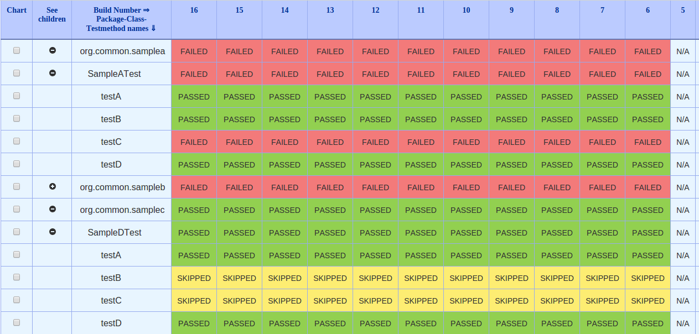
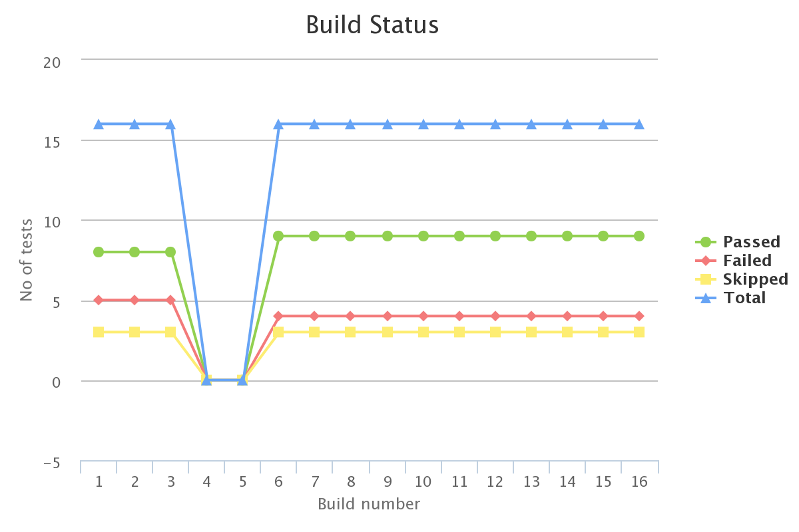
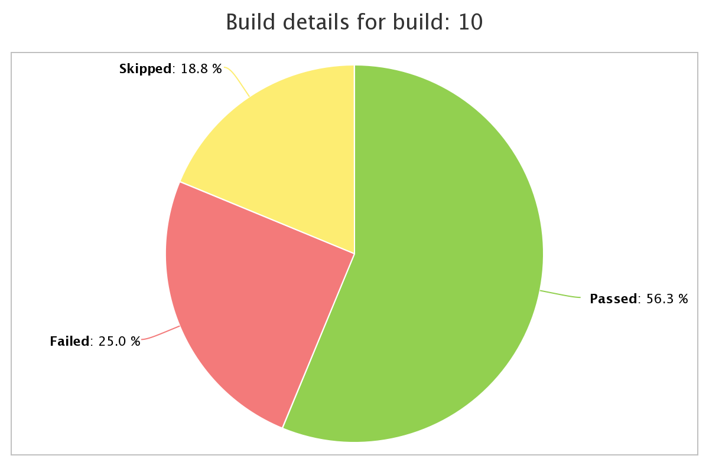
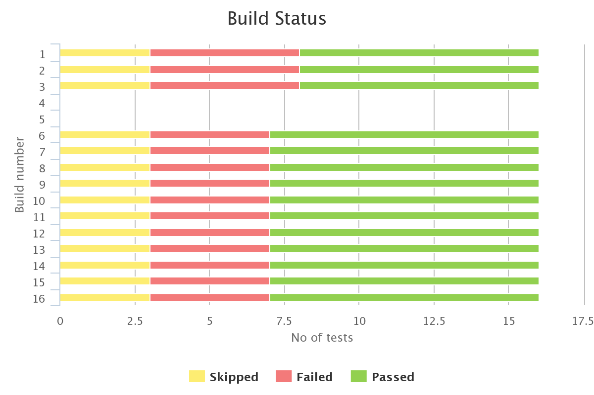

A plugin that shows history of test execution results in a tabular
format.

[[TestResultsAnalyzerPlugin-About]]
== About

While executing our tests on Jenkins many of time test fails on
particular builds. Now if you want to check that when a particular
test-case, test-class or a test-package has failed you may need to go to
each and every build report and check for the result.

This process is very cumbersome and may take a lot of time to get the
report. The said plugin solves the said issue by showing the build
result history of test-class, test-class and test-package in a tabular
tree format. The plugin can be used enabling the "Publish junit results"
or "Publish TestNG results"(in case of TestNG) feature of Jenkins.

It allows users to filter the results based on passed, failed and
skipped status. 

Once installed you can just click on the "Test Results Analyzer" link on
the left hand side of your job, as shown in the following image:

[.confluence-embedded-file-wrapper]##

Following is a sample image of the report:

[.confluence-embedded-file-wrapper]##

 

[[TestResultsAnalyzerPlugin-Graphs]]
=== Graphs

We all know the importance of the graphical report for our test
execution as it gives us a clear picture of the execution. The said
plugin also supports generation of Graphs for the test execution from
0.2.0 version onwards.

Following charts are available:

- *Line Charts*

*- Pie Charts*

*- Bar Charts*

Following are the sample images of the generated charts: +
[.confluence-embedded-file-wrapper .confluence-embedded-manual-size]## +
[.confluence-embedded-file-wrapper .confluence-embedded-manual-size]## +
[.confluence-embedded-file-wrapper .confluence-embedded-manual-size]## +
*Note*: *If you click on any point on the line chart it will generate a
pie chart for said build/point.*

[[TestResultsAnalyzerPlugin-ChangeLog]]
=== Change Log

[[TestResultsAnalyzerPlugin-Version0.3.5]]
==== Version 0.3.5

* Allow users to configure how many builds to be fetched by plugin for
reporting purpose. As of now this is applicable for all the jobs. This
will be helpful for big projects where lot of builds exists.
* UI changes to make table compact . Thanks
to https://github.com/mfuchs[mfuchs] and https://github.com/novirael[novirael]
* Support for 10 most broken test results. Thanks to "Jason Lantz"
* Show percentage of build passing/failure . Thanks
to https://github.com/mfuchs[mfuchs] and https://github.com/novirael[novirael]
* NullPointerException fix. Thanks to https://github.com/hblok[hblok]
* Fix for
https://issues.jenkins-ci.org/browse/JENKINS-48626[JENKINS-48626].
Thanks to https://github.com/scddev[scddev]

[[TestResultsAnalyzerPlugin-Version0.3.4]]
==== Version 0.3.4

* Fixing
issue https://issues.jenkins-ci.org/browse/JENKINS-30522[JENKINS-30522]
* Fixing
issue https://issues.jenkins-ci.org/browse/JENKINS-33576[JENKINS-33576].
Adding support to download Charts.

[[TestResultsAnalyzerPlugin-Version0.3.3]]
==== Version 0.3.3

* Fixing
issue https://issues.jenkins-ci.org/browse/JENKINS-32990[JENKINS-32990]

[[TestResultsAnalyzerPlugin-Version0.3.2]]
==== Version 0.3.2

* Fixing issue
https://issues.jenkins-ci.org/browse/JENKINS-28018[JENKINS-28018]

[[TestResultsAnalyzerPlugin-Version0.3.1]]
==== Version 0.3.1

* Feature to search for a package, class or method name. Thanks to
"https://github.com/ayushjain91[Ayush Jain]" for the changes
* Added feature for loading icon to be shown while fetching and loading
the report.

[[TestResultsAnalyzerPlugin-Version0.3.0]]
==== Version 0.3.0

* Support for Downloading test-results in CSV format. Thanks to
"https://github.com/shahzad-bhatti[Shahzad Bhatti]" for the changes.
* Added hyperlink to test results analyzer report for Junit reports.
Thanks to "https://github.com/OmarElabd[Omar Elabd]" for the changes.
* Added hyperlink to test results analyzer report for TestNG reports.
* Added functionality to detect new Failures in in table. Added a new
Column with an icon that is displayed when a new failure occurs. Thanks
to "https://github.com/ayushjain91[Ayush Jain]" for the changes
* Support for creating report for specified number of builds rather than
fixed set. Thanks to "https://github.com/raywang945[Shuo-Yang Wang]" for
the changes.
* Added Global config for setting default chart options. Thanks to
"https://github.com/hoff121324[hoff121324]" for the changes.
* On load show tabular report and charts and adding options menu for
changing the default options. Thanks to
"https://github.com/hoff121324[hoff121324]" for the changes.
* Show runtime graph. Thanks to
"https://github.com/hoff121324[hoff121324]" for the changes.
* Added support for setting custom status names in tabular report in
Global config.
* Added support for setting custom status colors in tabular report in
Global Config. 

[[TestResultsAnalyzerPlugin-Version0.2.3]]
==== Version 0.2.3

* Support for parsing TestNg results from the "TestNg results" plugin
and using it for generating the report. Thanks to "Markus Krügwe" for
the changes.
* Changes to fallback font to "Sans Serif". Thanks to "Derek" for the
changes.
* Updated the index jelly shown in the plugin repository. Thanks to
"Donald Woods" for the changes.

[[TestResultsAnalyzerPlugin-Version0.2.2]]
==== Version 0.2.2

* Added option to display execution duration in build report by going to
Advanced options -> Display Duration. Thanks to
"https://github.com/eHimmelreich[Evgeny Himmelreich]" for the changes.
* Fixed issue related revers display of builds when user chooses limited
build to see in the build report.

[[TestResultsAnalyzerPlugin-Version0.2.1]]
==== Version 0.2.1

* JENKINS-29111 - Show packages/classes/methods in sorted order
* JENKINS-27628 - Test results analyzer displays class as FAILED when a
testcase is skipped
* JENKINS-29186 - Pie chart title showing a wrong build number when the
chart generated for a build from line chart
* Changes done to UI look and feel for the table and charts. Thanks to
"*RICHARD Bruno*" for the changes.

[[TestResultsAnalyzerPlugin-Version0.2.0]]
==== Version 0.2.0

* Changes done to generate line, bar and pie chart for the report.
* Allow user to generate a pie chart for a particular build when user
clicks on a build in line chart.
* User have the options to choose from line, bar, pie or all charts
