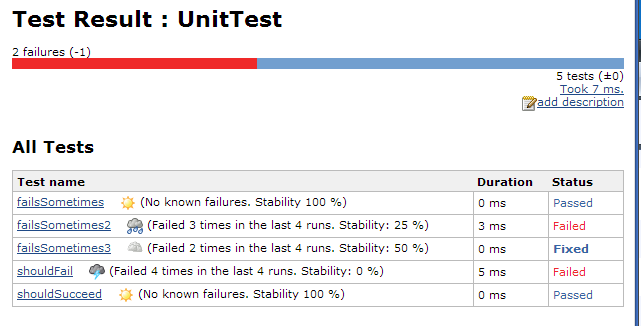

[[Teststabilityplugin-DevelopedBy]]
== Developed By http://www.esailors.de/en/[[.confluence-embedded-file-wrapper]#image:http://www.esailors.de/files/inhalte/allgemein/logo.png[image]#]

'''''

 +

This plugin adds historical information about the stability of tests -
i.e. the percentage how often they failed.

[[Teststabilityplugin-Version2.x]]
== Version 2.x

The plugin now implements newer APIs which allow it to work with
Pipeline builds. The version has been bumped to 2.x because the
test-stability plugin now requires Jenkins Core 1.596 (instead of 1.480)
and no longer supports the old _Additional test report features (fixed)_
workaround.

[[Teststabilityplugin-Configuration]]
== Configuration

[[Teststabilityplugin-Global]]
=== Global

Configure the maximal history length (default is 30)

[.confluence-embedded-file-wrapper]##

[[Teststabilityplugin-Per-Job]]
=== Per-Job

Enable the _Additional test report features_.

[[Teststabilityplugin-ForJenkins<1.530only!(Pluginversion1.0only)]]
==== *For Jenkins < 1.530 only!* _(Plugin version 1.0 only)_

Note that for maven jobs you must use the _Additional test report
features (fixed)_ as the built-in Jenkins one is broken up until Jenkins
1.529.

[.confluence-embedded-file-wrapper]#image:docs/images/test-stability-maven-config.PNG[image]#

[[Teststabilityplugin-Pipelineusage(Pluginversion2.xorlater)]]
== Pipeline usage _(Plugin version 2.x or later)_

Instead of using this in your Jenkinsfile to collect test results:

[source,syntaxhighlighter-pre]
----
    junit '**/*.xml'
----

you should use this:

[source,syntaxhighlighter-pre]
----
    junit testResults: '**/*.xml', testDataPublishers: [[$class: 'StabilityTestDataPublisher']]
----

[[Teststabilityplugin-Testhealth]]
== Test health

Example test result:

[.confluence-embedded-file-wrapper]##
