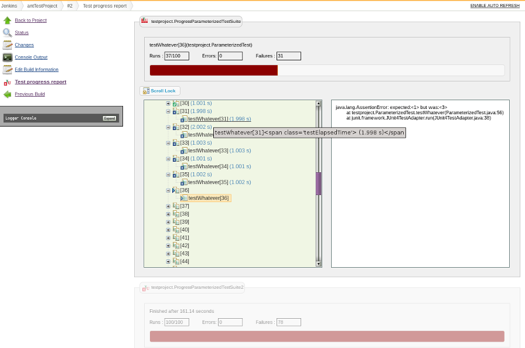

This plugin allows you to see how the tests progress during a build.

[[TestInProgressPlugin-About]]
== About

While executing our tests on Jenkins most of us may have faced the need
of knowing which test is getting executed or if a test has failed then
whats the exception. As of now many of us completely depends on the
execution console for the same.

This plugin solves the said issue and present the user with a user
friendly UI to look at the progress and failures if any. This plugin
allows you to see how your unit tests progress during a build. It shows
you the details of running, skipped and failed test-methods/test-classes
of your test-suite.

It supports sequential execution for Junit and Spock based Unit test
framework and support parallel execution for TestNg.

Currently supported unit test frameworks:

* https://wiki.jenkins-ci.org/display/JENKINS/Test+In+Progress+Plugin#TestInProgressPlugin-Junit[#Junit]
* https://wiki.jenkins-ci.org/display/JENKINS/Test+In+Progress+Plugin#TestInProgressPlugin-Spock[#Spock]
* https://wiki.jenkins-ci.org/display/JENKINS/Test+In+Progress+Plugin#TestInProgressPlugin-TestNg[#TestNg]

[.confluence-embedded-file-wrapper]##

[[TestInProgressPlugin-Usingtheplugin]]
== Using the plugin

[[TestInProgressPlugin-Pluginconfiguration]]
=== Plugin configuration

Check *Show tests in progress* in _Build Environment_ section while
configuring your project in jenkins :

[.confluence-embedded-file-wrapper]##

[[TestInProgressPlugin-AddtestInProgressclientlibrarytoyourUnitTestFramework.]]
=== Add testInProgress client library to your Unit Test Framework.

[[TestInProgressPlugin-Junit]]
=== Junit

Add *testInProgress-client-1.0.jar* to your test classpath. You can find
this library in the jenkins maven repository at
http://repo.jenkins-ci.org/releases/org/jenkins-ci/plugins/testInProgress-client/

If you use maven, add jenkins maven repository and add dependency to
testInProgress-client :

[source,syntaxhighlighter-pre]
----
    <repositories>
        <repository>
            <id>repo.jenkins-ci.org</id>
            <url>http://repo.jenkins-ci.org/public/</url>
        </repository>
    </repositories>
    <dependencies>
        <dependency>
            <groupId>junit</groupId>
            <artifactId>junit</artifactId>
            <version>4.10</version>
            <scope>test</scope>
        </dependency>
        <dependency>
            <groupId>org.jenkins-ci.plugins</groupId>
            <artifactId>testInProgress-client</artifactId>
            <version>1.0</version>
            <scope>test</scope>
        </dependency>
    </dependencies>
----

[[TestInProgressPlugin-Createaprogresssuite]]
=== Create a progress suite

Use _org.jenkinsci.testinprogress.runner.ProgressSuite_ runner instead
of _org.junit.runners.Suite_ to create your main suite :

[source,syntaxhighlighter-pre]
----
package testproject;

import org.jenkinsci.testinprogress.runner.ProgressSuite;
import org.junit.runner.RunWith;
import org.junit.runners.Suite.SuiteClasses;

@RunWith(ProgressSuite.class)
@SuiteClasses({ CalcTestsSuite.class, ParameterizedTest.class })
public class ProgressAllTestsSuite {

}
----

Instead you can use
_org.jenkinsci.testinprogress.runner.ProgressBatchSuite_ which allows to
define a junit 4 test suite based on pattern matching. +
_org.jenkinsci.testinprogress.runner.ProgressBatchSuite_ extends
_de.oschoen.junit.runner.BatchTestRunner_ which is included in
testInProgress-client-1.0.jar. See BatchTestRunner project on github :
https://github.com/oschoen/batch-test-runner

[source,syntaxhighlighter-pre]
----
package de.oschoen.junit.runner;

import org.jenkinsci.testinprogress.runner.ProgressBatchSuite;
import org.junit.runner.RunWith;

@RunWith(ProgressBatchSuite.class)
@BatchTestRunner.BatchTestInclude("**.*Suite")
public class ProgressAllTests {
}
----

[[TestInProgressPlugin-Configureyourbuildtorunyourprogresssuite]]
=== Configure your build to run your progress suite

[[TestInProgressPlugin-Usingant]]
==== Using ant

Select your progress test suite(s) :

[source,syntaxhighlighter-pre]
----
<junit haltonfailure="no" printsummary="yes" showoutput="true">
    <formatter type="xml" />
    <batchtest fork="false" todir="${target.dir}/junit-xml">
        <fileset dir="${test}">
            <include name="**/ProgressAllTestsSuite.java" />
        </fileset>
    </batchtest>
    <classpath refid="project.test-classpath" />
</junit>
----

[[TestInProgressPlugin-Usingmaven]]
==== Using maven

[source,syntaxhighlighter-pre]
----
<build>
    <plugins>
        <plugin>
            <groupId>org.apache.maven.plugins</groupId>
            <artifactId>maven-surefire-plugin</artifactId>
            <version>2.13</version>
            <configuration>
                <includes>
                    <include>**/ProgressAllTestsSuite.java</include>
                </includes>
            </configuration>
        </plugin>
    </plugins>
</build>
----

[[TestInProgressPlugin-Spock]]
=== Spock

Add *testInProgress-spock-client-0.1.2.jar* to your test classpath. You
can find this library in the jenkins maven repository
at http://repo.jenkins-ci.org/releases/org/imaginea/jenkins/plugins/testInProgress-spock-client/.

Source code is available
at: https://github.com/menonvarun/testInProgress-spock-client

If you use maven, add jenkins maven repository and add dependency to
testInProgress-client :

[source,syntaxhighlighter-pre]
----
    <repositories>
        <repository>
            <id>repo.jenkins-ci.org</id>
            <url>http://repo.jenkins-ci.org/public/</url>
        </repository>
    </repositories>
    <dependencies>
        <dependency>
            <groupId>org.imaginea.jenkins.plugins</groupId>
            <artifactId>testInProgress-spock-client</artifactId>
            <version>0.1</version>
            <scope>test</scope>
        </dependency>
    </dependencies>
----

If you use Gradle, :

[source,syntaxhighlighter-pre]
----
   repositories {
            mavenCentral()
            mavenRepo urls: "http://repo.jenkins-ci.org/public/"
        }
    dependencies{
            testCompile "org.imaginea.jenkins.plugins:testInProgress-spock-client:0.1"
        }
----

Once done please follow the following steps:

* Just add a file named
"*org.spockframework.runtime.extension.IGlobalExtension*" under folder
"*src/test/resources/META-INF/services*" under your source code.
* Add the line
"*org.imaginea.jenkins.testinprogress.spock.SpockTestInProgressExtension*"
to the above mentioned file.Once the above steps are done your are good
to go.Spock client supports disabling the client code execution by
setting the property *"testinprogress.enabled"* to *"false"* while
executing your tests.

[[TestInProgressPlugin-TestNg]]
=== TestNg

Add *testInProgress-testng-client-0.1.jar* to your test classpath. You
can find this library in the jenkins maven repository
at http://repo.jenkins-ci.org/releases/org/imaginea/jenkins/plugins/testInProgress-testng-client/.

Source code is available
at: https://github.com/menonvarun/testInProgress-testng-client

If you use maven, add jenkins maven repository and add dependency to
testInProgress-client :

[source,syntaxhighlighter-pre]
----
    <repositories>
        <repository>
            <id>repo.jenkins-ci.org</id>
            <url>http://repo.jenkins-ci.org/public/</url>
        </repository>
    </repositories>
    <dependencies>
        <dependency>
            <groupId>org.imaginea.jenkins.plugins</groupId>
            <artifactId>testInProgress-testng-client</artifactId>
            <version>0.1</version>
            <scope>test</scope>
        </dependency>
    </dependencies>
----

If you use Gradle, :

[source,syntaxhighlighter-pre]
----
   repositories {
            mavenCentral()
            mavenRepo urls: "http://repo.jenkins-ci.org/public/"
        }
    dependencies{
            testCompile "org.imaginea.jenkins.plugins:testInProgress-testng-client:0.1"
        }
----

Once done please follow the following steps:

* Just add the path
"*org.imaginea.jenkins.plugins.testinprogress.testng.TestNGProgressRunListener*"
as testng listener class to your test execution. This can be done either
in testng.xml or maven pom.xml or even in ant's build.xml
file.*Note: *The said client supports test to be executed in parallel.
Each test section of a suite xml file will shown in a different section
on the UI. The parallel execution only works if TestNg internal
multi-threading concept is used.

[[TestInProgressPlugin-ChangeLog]]
== Change Log

[[TestInProgressPlugin-Version1.3(August05,2014)]]
=== Version 1.3 (August 05, 2014)

* Changes done to support tests getting executed in parallel.
* Some UI fixes related to display of executing tests.
* Released TestNg client that supports tests to be executed in parallel.

[[TestInProgressPlugin-Version1.2(May08,2014)]]
=== Version 1.2 (May 08, 2014)

* Changes the data transfer from string to JSON
* Changes done to support other unit test frameworks other than Junit
* Made changes to UI generation.
* Released Spock client to support spock unit test framework.

[[TestInProgressPlugin-Version1.1(July01,2013)]]
=== Version 1.1 (July 01, 2013)

* Added support for assumptions
* Some bug corrections
* Keep stacktrace and tree side by side

[[TestInProgressPlugin-Version1.0(Feb03,2013)]]
=== Version 1.0 (Feb 03, 2013)

* Initial version
