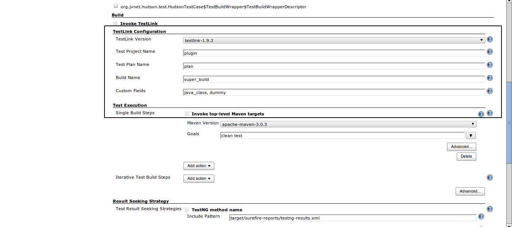
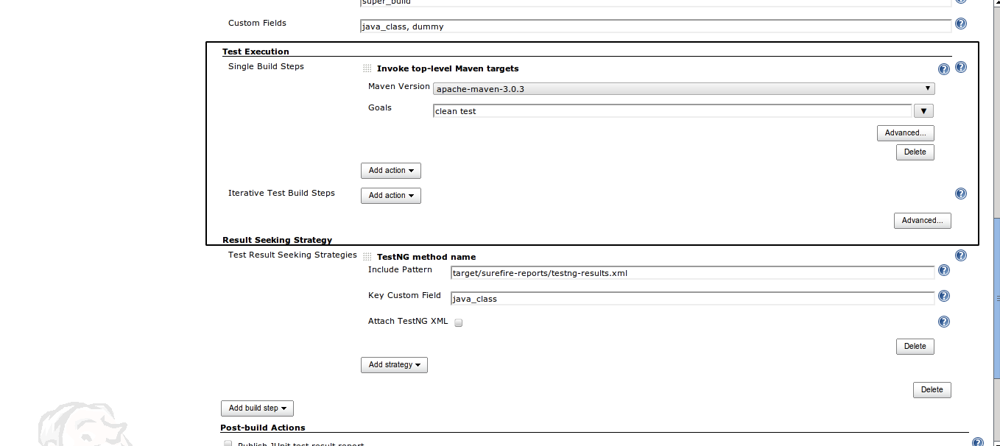
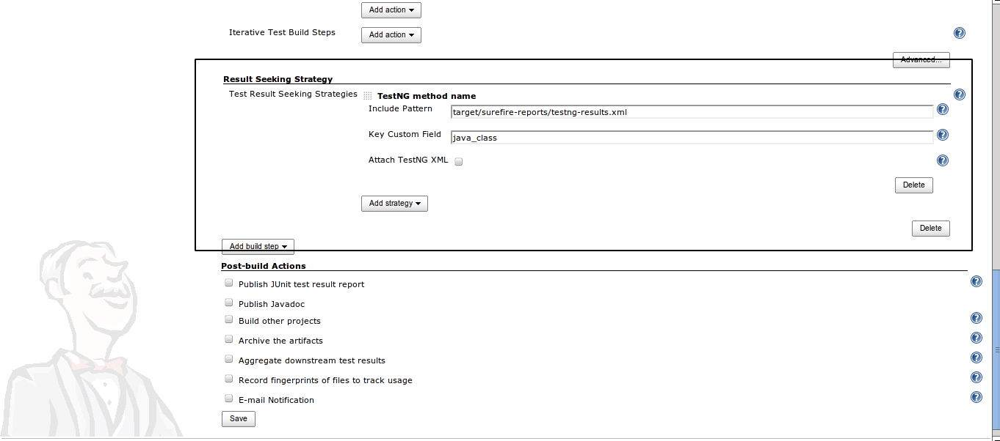
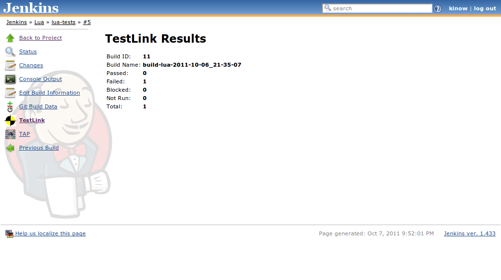
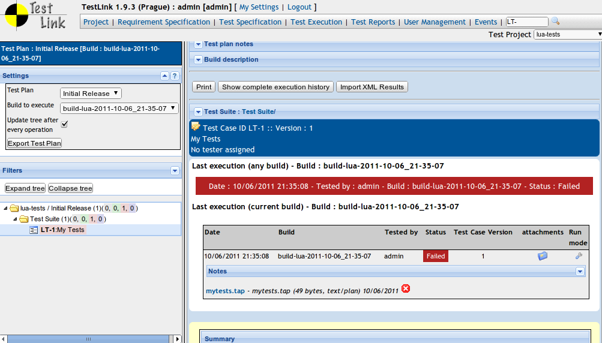
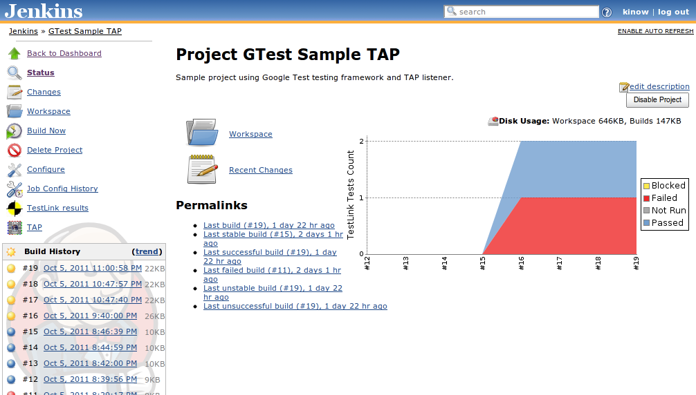

[.conf-macro .output-inline]##

[cols="",options="header",]
|===
|Plugin Information
|View TestLink https://plugins.jenkins.io/testlink[on the plugin site]
for more information.
|===

[.aui-icon .aui-icon-small .aui-iconfont-error .confluence-information-macro-icon]##

The current version of this plugin may not be safe to use. Please review
the following warnings before use:

* https://jenkins.io/security/advisory/2019-08-07/#SECURITY-1428[Credentials
stored in plain text]

[.aui-icon .aui-icon-small .aui-iconfont-info .confluence-information-macro-icon]##

Older versions of this plugin may not be safe to use. Please review the
following warnings before using an older version:

* https://jenkins.io/security/advisory/2018-02-26/#SECURITY-731[Stored
cross-site scripting vulnerability]

[.aui-icon .aui-icon-small .aui-iconfont-warning .confluence-information-macro-icon]##

*This plugin is up for adoption.* Want to help improve this plugin?
https://wiki.jenkins-ci.org/display/JENKINS/Adopt+a+Plugin[Click here to
learn more]!

[.conf-macro .output-inline]#This plug-in integrates Jenkins and
http://testlink.org/[TestLink] and generates reports on automated test
execution. With this plug-in you can manage your tests in TestLink,
schedule and control in Jenkins, and execute using your favorite test
execution tool (TestPartner, Selenium, TestNG, Perl modules, PHPUnit,
among others).# +
This plug-in is not part of TestLink project, issues regarding Jenkins
and TestLink integration must be reported in
http://issues.jenkins-ci.org/[Jenkins JIRA]. It has been reported by
users that it is also possible to use ReportNG, as this tool has an
option to output TestNG XML too.

[.aui-icon .aui-icon-small .aui-iconfont-warning .confluence-information-macro-icon]#
#

When filing an issue, remember to include as much data as possible, but
avoid including sensitive data, as attachments can take a while to be
deleted from JIRA, as the process is manual and quite troublesome
image:docs/images/smile.svg[(smile)]

Jenkins TestLink Plug-in Tutorial

[.aui-icon .aui-icon-small .aui-iconfont-info .confluence-information-macro-icon]#
#

Check out this tutorial with step-by-step instructions on how to
integrate Jenkins and TestLink using TestLink Plug-in.

* http://tupilabs.com/books/jenkins-testlink-plugin-tutorial/en/index.html[Jenkins
TestLink Plug-in Tutorial (HTML)]
* http://tupilabs.com/books/jenkins-testlink-plugin-tutorial/en/book.pdf[Jenkins
TestLink Plug-in Tutorial (PDF)]
* http://tupilabs.com/books/jenkins-testlink-plugin-tutorial/de-de/index.html[Jenkins
TestLink Plug-in Tutorial (HTML)] (German)
* http://tupilabs.com/books/jenkins-testlink-plugin-tutorial/fr/index.html[Jenkins
TestLink Plug-in Tutorial (HTML)] (French)
* http://tupilabs.com/books/jenkins-testlink-plugin-tutorial/es/index.html[Jenkins
TestLink Plug-in Tutorial (HTML)] (Spanish)
* http://tupilabs.com/books/jenkins-testlink-plugin-tutorial/pt-br/index.html[Jenkins
TestLink Plug-in Tutorial (HTML)] (Brazilian Portuguese)

[[TestLinkPlugin-WhoisusingJenkinsTestLinkPlug-in]]
== https://wiki.jenkins-ci.org/display/JENKINS/Who+is+using+TestLink+Plug-in[Who is using Jenkins TestLink Plug-in]

[.aui-icon .aui-icon-small .aui-iconfont-approve .confluence-information-macro-icon]#
#

https://wiki.jenkins-ci.org/display/JENKINS/Who+is+using+TestLink+Plug-in[Let
us know if you are using this plug-in.]

[[TestLinkPlugin-Description]]
== Description

The TestLink plug-in integrates *Jenkins* with
http://testlink.org/[TestLink]. TestLink plug-in uses
http://testlinkjavaapi.sourceforge.net/[testlink-java-api] to access
TestLink *XML-RPC* API. With the information that you provide in the
build step configuration the plug-in *retrieves automated tests from
TestLink*. With the plug-in, you are able to execute *build steps* that
call testing tools. It reads *TestNG*, *JUnit* and *TAP* test report
*formats*, used to update TestLink test cases' executions.

[.confluence-embedded-file-wrapper .confluence-embedded-manual-size]#image:docs/images/1.png[image,width=900]#

[.aui-icon .aui-icon-small .aui-iconfont-approve .confluence-information-macro-icon]#
#

The job configuration changed! Now there are three sections, what helps
you to configure your job, and add extra build steps, result seeking
strategies and general information about TestLink.

TestLink configuration section

[.confluence-embedded-file-wrapper .confluence-embedded-manual-size]##

Test Execution section

[.confluence-embedded-file-wrapper .confluence-embedded-manual-size]##

And Result Seeking Strategy section

[.confluence-embedded-file-wrapper .confluence-embedded-manual-size]##

[.aui-icon .aui-icon-small .aui-iconfont-approve .confluence-information-macro-icon]#
#

You can use environment variables in Test project name, Test plan name
or Build name. For instance, build-project-$BUILD_NUMBER would be
replaced by build-project- and the number of the Build executed in
Jenkins.

[.confluence-embedded-file-wrapper .confluence-embedded-manual-size]##

[.confluence-embedded-file-wrapper .confluence-embedded-manual-size]##

[.confluence-embedded-file-wrapper .confluence-embedded-manual-size]##

[[TestLinkPlugin-Howdoestheplug-inexecutemyautomatedtests?]]
=== How does the plug-in execute my automated tests?

TestLink Plug-in retrieves automated test cases data from TestLink. This
data is then set as environment variables. This way your build steps can
make use of this information to execute your automated tests.

For instance, you could run ant passing a Test Class as parameter, more
or less something like this, /opt/java/apache-ant-1.8.0/bin/ant
-DtestClass=$TESTLINK_TESTCASE_TEST_CLASS. In this case, Test Case is
the name of a custom field in TestLink.

List of environment variables available during TestLink Plug-in
execution of single build steps
(https://issues.jenkins-ci.org/browse/JENKINS-17622[JENKINS-17622]):

* TESTLINK_BUILD_NAME
* TESTLINK_TESTPLAN_NAME
* TESTLINK_TESTPROJECT_NAME
* TESTLINK_TESTCASE_TOTAL

List of environment variables available during TestLink Plug-in
execution of iterative build steps:

* TESTLINK_TESTCASE_ID
* TESTLINK_TESTCASE_NAME
* TESTLINK_TESTCASE_TESTPROJECTID
* TESTLINK_TESTCASE_AUTHOR
* TESTLINK_TESTCASE_SUMMARY
* TESTLINK_BUILD_NAME
* TESTLINK_TESTCASE_TESTSUITEID
* TESTLINK_TESTPLAN_NAME
* TESTLINK_TESTPROJECT_NAME
* TESTLINK_TESTCASE_$CUSTOM_FIELD_NAME

For each Custom Field found, TestLink Plug-in defines an environment
variable for with its name and value, as shown above
(%CUSTOM_FIELD_NAME%). If the custom field name contains spaces the
plug-in will convert them into _'s. i.e., Test Class can be accessed as
%TESTLINK_TESTCASE_TEST_CLASS% in Windows or
$TESTLINK_TESTCASE_TEST_CLASS in *nix-like systems.

[.aui-icon .aui-icon-small .aui-iconfont-error .confluence-information-macro-icon]#
#

For each test case, the plug-in executes one call for each custom field.
In other words, if you have 1000 tests in a test plan, the plug-in will
execute a lot of calls to TestLink, downgrading the execution of your
job.

[[TestLinkPlugin-Howdoestheplug-inknowifatestpassedorfailed?]]
=== How does the plug-in know if a test passed or failed?

You can choose among different *result seeking strategies* in your job
configuration. The plug-in supports three *result formats*, _TestNG_,
_JUnit_ and _TAP_. 

[[TestLinkPlugin-TestNGresultseekingstrategies]]
==== TestNG result seeking strategies

*TestNG class name*: The plug-in matches the TestNG class name (e.g.:
org.tap4j.TestParser) and the key custom field value.

*TestNG method name*: The plug-in matches the TestNG method name (e.g.:
org.tap4j.TestParser#testTokenizer) and the key custom field value.

*TestNG suite name*: The plug-in matches the TestNG suite name (e.g.:
functional tests) and the key custom field value.

[[TestLinkPlugin-JUnitresultseekingstrategies]]
==== JUnit result seeking strategies

*JUnit case class name*: The plug-in matches the JUnit case class name
(e.g.: org.tap4j.TestParser) and the key custom field value.

*JUnit case name*: The plug-in matches the JUnit case class name (e.g.:
testTokenizer) and the key custom field value.

*JUnit method name*: The plug-in matches the JUnit case class name
(e.g.: org.tap4j.TestParser#testTokenizer) and the key custom field
value.

*JUnit suite name*: The plug-in matches the JUnit suite name
(e.g.:functional tests) and the key custom field value.

[[TestLinkPlugin-TAPresultseekingstrategies]]
==== TAP result seeking strategies

*TAP file name*: The plug-in matches the TAP file name (e.g.:
testFtpProtocol.tap) and the key custom field value. 

*TAP file name multiple test points:* Adds one test execution in
TestLink for each TAP Test Result with its execution status

[[TestLinkPlugin-Configuration]]
== Configuration

. Download and install the latest version of TestLink
(http://testlink.org/).
. Create automated tests in TestLink with Custom Field for automation.
. Install the TestLink plug-in from the Jenkins Plugin Manager
. Define a TestLink configuration from the Configure System page.
. Add a Invoke TestLink build step in the job you want execute automated
tests.
. Configure the required properties.

[[TestLinkPlugin-LanguagesSupported]]
== Languages Supported

. English (American)
. Portuguese (Brazil)
. Spanish (Thanks to César Fernandes de Almeida)
. French (Thanks to Floréal Toumikian, Olivier Renault, Latifa Elkarama)

Want to see this plug-in in your language? Send us an e-mail and we will
get in touch with the text that needs to be translated.

[[TestLinkPlugin-CompatibilityMatrix]]
== Compatibility Matrix

The plug-in 1.0 and 1.1 versions were pilot projects that should be
ignored. They have issues in distributed environments and depend on
Maven. Please, consider updating your plug-in to the 2.0 version.

[.aui-icon .aui-icon-small .aui-iconfont-warning .confluence-information-macro-icon]#
#

We don't maintain the plug-in for Hudson. Issues happening in Hudson may
not be fixed here.

[cols=",,,,,,,,,,,,,,,,,,,,,",]
|===
|Plugin |1.0 |1.1 |2.0 |2.1 |2.2 |2.2.1 |2.2.2 |2.4 |2.5 |3.0 |3.1 |3.2
|3.3 |3.4 |3.5 |3.6 |3.7 |3.8 |3.9 |3.10 |3.11

|TestLink |1.9.0 |1.9.0 |1.9.0 |1.9.0 |1.9.0 |1.9.0 |1.9.0 |1.9.2 |1.9.3
|1.9.3 |1.9.3 |1.9.4 and 1.9.5 |1.9.6 |1.9.6 |1.9.6 |1.9.7 |1.9.7 |1.9.8
|1.9.8 |1.9.8+ |1.9.14+

|Jenkins |1.366+ |1.366+ |1.388+ |1.388+ |1.388+ |1.388+ |1.388+ |1.388+
|1.398+ |1.398+ |1.398+ |1.466+ |1.466+ |1.466+ |1.466+ |1.466+ |1.466+
|1.466+ |1.509+ |1.509 |1.642.3

|Hudson |1.366 |1.366 |1.388 |1.388-1.395 |1.388-1.395 |1.388-1.395
|1.388-1.395 |? |Not supported |- |- |- |- |- |- |- |- |- |- |- |-
|===

* 3.7 is broken with 1.9.8 due to a backward incompatibility in TestLink
XML-RPC API, please use 3.8 or higher

[#jiraissues]##

[.aui-icon .aui-icon-small .aui-iconfont-warning .confluence-information-macro-icon]#
#

[[TestLinkPlugin-Resources]]
== Resources

. http://yasassriratnayake.blogspot.co.nz/2016/04/enabling-ssl-for-jenkins-testlink.html[Enabling
SSL for Jenkins TestLink plugin in Tomcat]
. http://www.kinoshita.eti.br/2012/10/11/jenkins-testlink-and-gtest-in-5-minutes-or-so/[Google
Test + TAP Listener + Jenkins TestLink Plug-in]
. http://www.kinoshita.eti.br/wp-content/uploads/2010/12/testingexperience12_12_10_Kinoshita_Santos.pdf[Article]
published in http://www.testingexperience.com/[Testing Experience
magazine] issue number 12 (Open Source Tools) written by
http://www.kinoshita.eti.br/[Bruno P. Kinoshita] and Anderson dos
Santos. 2010.
. http://www.scribd.com/doc/43729582/Automatizando-Testes-Com-Hudson-e-TestLink[Slides]
used in the lighting talk presented at
http://www.encontroagil.com.br/[Encontro Ágil] 2010 in
http://www.ime.usp.br/[IME-USP] (Portuguese Only). 2010.
. http://www.automatedtestinginstitute.com/home/ASTMagazine/2011/AutomatedSoftwareTestingMagazine_March2011.pdf[Article]
published in http://www.automatedtestinginstitute.com/[Automated
Software Testing Magazine], volume 3, issue 1. March, 2011.
. http://www.belgiumtestingdays.com/archive/bruno_de_paula_kinoshita_how_to_automate_tests_using_testlink_and_hudson.pdf[Slides]
used in the presentation done in
http://www.belgiumtestingdays.com/[Belgium Testing Days] 2011.
. http://www.vimeo.com/16924211[Lighting talk] for
http://www.encontroagil.com.br/[Encontro Ágil] 2010, at
http://www.ime.usp.br/[IME-USP].
. More articles and tips on http://www.kinoshita.eti.br/[Bruno P.
Kinoshita's website].
. Sponsor company (until May 2011): http://www.sysmap.com.br/[Sysmap
Solutions] - Brazil.
. Sponsor company: http://www.tupilabs.com/[TupiLabs] - Brazil
. Presentation at http://www.stpcon.com/[STPCon] Spring March 2012 in
New Orleans - USA.
. A
http://forza.cocolog-nifty.com/blog/2012/10/jenkins-testlin.html[collection
of links] about jenkins-testlink plugin
by http://forza.cocolog-nifty.com/[http://forza.cocolog-nifty.com] (Japanese/日本語)

[[TestLinkPlugin-Sponsors]]
== Sponsors

http://www.tupilabs.com/[[.confluence-embedded-file-wrapper .confluence-embedded-manual-size]#image:docs/images/logo1.png[image,width=300]#]

For commercial support, please get contact us
via https://twitter.com/tupilabs[@tupilabs]

[[TestLinkPlugin-ReleaseNotes]]
== Release Notes

[[TestLinkPlugin-Release3.16(2019-02-07)]]
=== Release 3.16 (2019-02-07)

. https://issues.jenkins-ci.org/browse/JENKINS-48488[JENKINS-48488] -
Request to make Testcase version available in Jenkins Build environment

[[TestLinkPlugin-Release3.15(2018-12-29)]]
=== Release 3.15 (2018-12-29)

. Updated testlink-java-api to 1.9.17-0
. Updated Jenkins parent in pom.xml
. Updated dependencies (lang, io, codec)
. Set project Java to 8
. Tested with TestLink 1.9.17 (basic workflow, with a TAP file name
strategy)

[[TestLinkPlugin-Release3.14(2018-03-28)]]
=== Release 3.14 (2018-03-28)

. https://issues.jenkins-ci.org/browse/JENKINS-50445[JENKINS-50445] -
Add tap4j model objects to the whitelist for serialization to make TAP
reporting compatible with Jenkins 2.102+
. https://issues.jenkins-ci.org/browse/JENKINS-49302[JENKINS-49302] -
Fix escaping of summary reports (regression in 3.13)
. https://github.com/jenkinsci/testlink-plugin/pull/31[PR #31] - Fix
issues in French localization

[[TestLinkPlugin-Release3.13(2017--)]]
=== Release 3.13 (2017--)

. https://github.com/jenkinsci/testlink-plugin/pull/26[Pull request #26:
make the testcase external ID visible as an environment variable in a
Jenkins shell] thanks @johnwalker247!
. https://github.com/jenkinsci/testlink-plugin/pull/22[Pull request #22:
Updateparser to version 0.5 with code fixes] thanks @yasassri
. https://jenkins.io/security/advisory/2018-02-26/[Fix security issue]

[[TestLinkPlugin-Release3.12(2016-04-17)]]
=== Release 3.12 (2016-04-17)

. Upgraded
https://wiki.jenkins-ci.org/display/JENKINS/TestLink+Plugin#[tap4j](http://tap4j.org/[http://tap4j.org])
. Upgraded
https://wiki.jenkins-ci.org/display/JENKINS/TestLink+Plugin#[testlink-java-api](https://github.com/kinow/testlink-java-api)
. https://github.com/jenkinsci/testlink-plugin/pull/20[Pull request #20:
Plan and build custom fields support] thanks @maiksaray!

[[TestLinkPlugin-Release3.11(2015-11-14)]]
=== Release 3.11 (2015-11-14)

. https://github.com/jenkinsci/testlink-plugin/pull/19[TAP test plans
support "n..m" with n>1]
. https://github.com/jenkinsci/testlink-plugin/pull/18[Added build
number and error message in notes of JUnit Test Result]
. https://github.com/jenkinsci/testlink-plugin/pull/17[Update
TestLinkSite.java]

[[TestLinkPlugin-Release3.10]]
=== Release 3.10

. https://issues.jenkins-ci.org/browse/JENKINS-20599

[[TestLinkPlugin-Release3.9]]
=== Release 3.9

. https://issues.jenkins-ci.org/browse/JENKINS-20587
. https://issues.jenkins-ci.org/browse/JENKINS-20589

[[TestLinkPlugin-Release3.8]]
=== Release 3.8

. https://issues.jenkins-ci.org/browse/JENKINS-20014[JENKINS-20014:
Jenkins Testlink plugin reports "Found 0 automated test cases in
TestLink."]
. Reverted https://issues.jenkins-ci.org/browse/JENKINS-17567[JENKINS-17567: Allow
the plug-in to filter test cases by last execution status] due to a
backward incompatibility in TestLink 1.9.8 XML-RPC API
. Updated http://tap4j.org/[tap4j] to 4.0.4

[[TestLinkPlugin-Release3.7]]
=== Release 3.7

. Merged pull
request https://github.com/jenkinsci/testlink-plugin/pull/8 that adds
platforms to the job config

[[TestLinkPlugin-Release3.6]]
=== Release 3.6

. https://issues.jenkins-ci.org/browse/JENKINS-17801[JENKINS-17801: TAP-attachments
produce file not found error]
. https://issues.jenkins-ci.org/browse/JENKINS-15790[JENKINS-15790: Name
of Test Case is null]
. https://issues.jenkins-ci.org/browse/JENKINS-19209[JENKINS-19209: Testlink
Plugin Not Run Test should mark build as failed]
. https://issues.jenkins-ci.org/browse/JENKINS-19390[JENKINS-19390: Testlink
Plugin did not manage to get 2nd execution status]
. Updated testlink-java-api to 1.9.7-0

[[TestLinkPlugin-Release3.5]]
=== Release 3.5

. https://issues.jenkins-ci.org/browse/JENKINS-17622[JENKINS-17622: Cannot
access TestLink environment variables within Jenkins build]
. https://issues.jenkins-ci.org/browse/JENKINS-16640[JENKINS-16640: Mark
in Jenkins build with "NOT RUN" Test Cases and display in the UI (with
colours, etc)]

[[TestLinkPlugin-Release3.4]]
=== Release 3.4

. https://issues.jenkins-ci.org/browse/JENKINS-17567[JENKINS-17567: Allow
the plug-in to filter test cases by last execution status]
. https://issues.jenkins-ci.org/browse/JENKINS-13821[JENKINS-13821: When
test uses DataProvider it mark in TestLink only by last result]
. https://issues.jenkins-ci.org/browse/JENKINS-17642[JENKINS-17642: Trouble
finding test results using TAP result seeking strategy]
. Quick profiling with Yourkit. Nothing worth of refactoring was found.
Thanks to Yourkit for providing an Open Source license to us.

[[TestLinkPlugin-Release3.3]]
=== Release 3.3

. *https://issues.jenkins-ci.org/browse/JENKINS-17442[Jenkins-17442: When
connectin to TestLink find error ClassCastException] (due to a bug in TL
XML-RPC API, the plug-in wasn't working with TestLink 1.9.6)*
. https://issues.jenkins-ci.org/browse/JENKINS-16118[Jenkins-16118: Testlink
Plug-In: get Custom field information for Testplans and Testprojects]
. https://issues.jenkins-ci.org/browse/JENKINS-17023[Jenkins-17023: Jenkins
Testlink plugin Found 0 test result is show while test is runned]
. https://issues.jenkins-ci.org/browse/JENKINS-15588[Jenkins-15588: TestLink
is not getting Updated]
. https://issues.jenkins-ci.org/browse/JENKINS-17147[Jenkins-17147: The
configuration for testng method name and data provider is not saved]

[[TestLinkPlugin-Release3.2]]
=== Release 3.2

. *Updated Jenkins version to 1.466*
. The plug-in now should work correctly with other plug-ins that require
a BuildStepDescriptor, as Conditional Build Step
. https://issues.jenkins-ci.org/browse/JENKINS-15486[JENKINS-15486:
Documentation is needed for Project GTest Sample Tap&Testlink for C++
testing]
. https://issues.jenkins-ci.org/browse/JENKINS-15343[JENKINS-15343:
Unable to use Conditional BuildStep Plugin with Testlink Plugin]

[[TestLinkPlugin-Release3.1.5]]
=== Release 3.1.5

https://issues.jenkins-ci.org/browse/JENKINS-10904[JENKINS-10904] -
Include test step information as env vars. We had to update
testlink-java-api, as the bug was in there. However, the TestLink data
stored in builds will be lost. So if you need any of the data, back it
up before updating the plug-in. 

[[TestLinkPlugin-Release3.1.2]]
=== Release 3.1.2

Added test summary. This way the user can see more details in TestLink
reports.

[[TestLinkPlugin-Release3.1.1]]
=== Release 3.1.1

Fixing bugs in JUnit and TestNG strategies

[[TestLinkPlugin-Release3.1]]
=== Release 3.1

. *Created Result Seeking Strategy extension point*
. Fixed all blocker issues
. Added more result seeking strategies (TestNG method name, for example)
. Added new contributors to the project
. *Code reviewed and refactored several parts of the code, it's way
cleaner now*
. *Added configuration to make optional attachments upload*

[[TestLinkPlugin-Release3.0.2]]
=== Release 3.0.2

Minor improvements for issues found during update of Jenkins TestLink
Plug-in Tutorial

[[TestLinkPlugin-Release3.0.1]]
=== Release 3.0.1

https://issues.jenkins-ci.org/browse/JENKINS-11264[JENKINS-11264] - Test
execution notes being added twice and incorrectly formatted

[[TestLinkPlugin-Release3.0]]
=== Release 3.0

. https://issues.jenkins-ci.org/browse/JENKINS-10623[JENKINS-10623] -
Organize and update French, Spanish and Brazilian Portuguese translation
and documentation
. https://issues.jenkins-ci.org/browse/JENKINS-9054[JENKINS-9054] *- Add
support to platforms in TestLink plug-in*
. https://issues.jenkins-ci.org/browse/JENKINS-10809[JENKINS-10809] -
Add a way to call other build steps in test execution for the plug-in
(Yay for DRY!)
. https://issues.jenkins-ci.org/browse/JENKINS-10849[JENKINS-10849] -
OutOfMemoryError using TestLink plugin (Thanks to YourKit!)

[[TestLinkPlugin-Release2.5]]
=== Release 2.5

. JENKINS-9811 Add a POST <Single test command>-field, to execute a
process after the plug-in iterates the retrieved automated test cases
. JENKINS-9672 Test link custom field parser split the String value by
semicolon or comma.
. JENKINS-9993 Add root element for JUnit test results

[[TestLinkPlugin-Release2.2.2]]
=== Release 2.2.2

. FIXED-9444 - Add environment variables to single test command
(actually, I used some code from Jenkins core to execute both commands
now :-)

[[TestLinkPlugin-Release2.2.1]]
=== Release 2.2.1

. French translation
. Small issue with non-existent option Debug in Job configuration
. FIXED-9229 - JUnit wrong status
. Portuguese i18n messages typo

[[TestLinkPlugin-Release2.2]]
=== Release 2.2

. JUnit BUG fix
. Enhancement of the Build logs

[[TestLinkPlugin-Release2.1]]
=== Release 2.1

. *Migration from Hudson to Jenkins*
. Test transaction property.
. i18n (version 1.0 supports only English).
. Add Javascript validation functions to each field in the global and
config pages.
. Add single test command feature (it will enable running test suites)
. Fixed Java class headers
. JFreechart graphics betterment
. Fixed BUG JENKINS-8636 TestLink Plugin FATAL: Error creating test
project
. Fixed BUG JENKINS-8531 Unexprssive error message

[[TestLinkPlugin-Release2.0.1]]
=== Release 2.0.1

. Fixed BUG 8292 (java.lang.NullPointerException at
hudson.plugins.testlink.updater.TestLinkTestStatusUpdater.updateTestCases(TestLinkTestStatusUpdater.java:55)

[[TestLinkPlugin-Release2.0]]
=== Release 2.0

. *Settings automated tests properties as environment variables.*
. *Switch from dbfacade-testlink-java-api to testlink-java-api*
*http://sourceforge.net/projects/testlinkjavaapi/.*
. *JUnit parser.*
. *TestNG parser.*
. *TAP parser using tap4j* *http://sourceforge.net/projects/tap4j/.*

[[TestLinkPlugin-Release1.1]]
=== Release 1.1

. Execute Test Suites.
. Let the user define the custom fields name.
. Implement feature that lets user to use the latest revision from a SVN
repository as Build name.

[[TestLinkPlugin-Release1.0]]
=== Release 1.0

. First version of the plug-in (the development was guided based on the
source code of the following plug-ins:
http://wiki.jenkins-ci.org/display/HUDSON/CCM+Plugin[CCM] ,
http://wiki.jenkins-ci.org/display/HUDSON/Sonar+Plugin[Sonar] (how to
ref maven installations)).

[[TestLinkPlugin-Roadmap]]
== Roadmap

. Keep compatibility with latest versions of Jenkins and TestLink.
. Add test case steps
(https://issues.jenkins-ci.org/browse/JENKINS-10904[JENKINS-10904])

[[TestLinkPlugin-Opensourcelicensesdonatedforthisproject]]
== Open source licenses donated for this project

http://stan4j.com/[[.confluence-embedded-file-wrapper]##]

YourKit is kindly supporting open source projects with its full-featured
Java Profiler. +
YourKit, LLC is the creator of innovative and intelligent tools for
profiling +
Java and .NET applications. Take a look at YourKit's leading software
products: +
http://www.yourkit.com/java/profiler/index.jsp[YourKit Java Profiler]
and +
http://www.yourkit.com/java/profiler/index.jsp[YourKit .NET Profiler].
