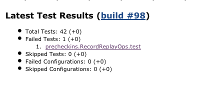
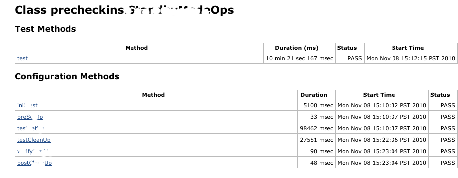
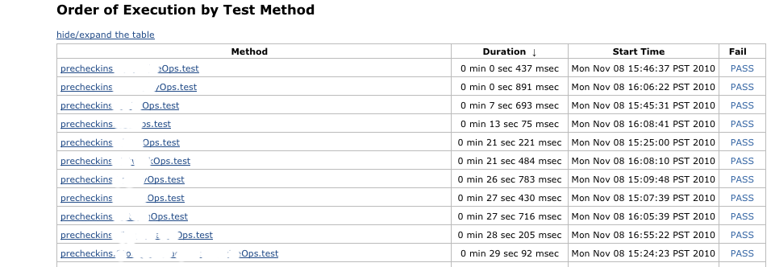
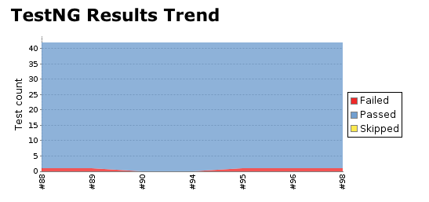

[.conf-macro .output-inline]##

[cols="",options="header",]
|===
|Plugin Information
|View TestNG Results https://plugins.jenkins.io/testng-plugin[on the
plugin site] for more information.
|===

[.aui-icon .aui-icon-small .aui-iconfont-warning .confluence-information-macro-icon]##

*This plugin is up for adoption.* Want to help improve this plugin?
https://wiki.jenkins-ci.org/display/JENKINS/Adopt+a+Plugin[Click here to
learn more]!

[.conf-macro .output-inline]##This plugin allows you to publish TestNG
results generated using `+org.testng.reporters.XMLReporter+`.##TestNG
result xml file contains more information than the junit report xml file
. This plugin exposes those extra information in graph and table
reports.

This plugin makes it possible to import TestNG XML reports from each
build into Jenkins.

The data is parsed using the output generated using
`+org.testng.reporters.XMLReporter+`. The results are displayed with a
trend graph and all details about which tests that failed are also
presented.

[[testng-plugin-Features]]
== Features

The page layouts are intentionally designed to look very similar to
Jenkins's JUnit plugin.

* In the project/build page you can see a summary of passed/fail tests
as well as passed/fail configuration methods. It also enlists the failed
test cases with a direct link to view the test failure.

[.confluence-embedded-file-wrapper .image-center-wrapper]##

* In the Class result summary page test methods are separated from
configuration methods

[.confluence-embedded-file-wrapper .image-center-wrapper]##

* In the Package result summary you can see the order which test methods
were ran during the regression run.

[.confluence-embedded-file-wrapper .image-center-wrapper]##

* Different graphs will show you the pass/failed trend of job's previous
results.

[.confluence-embedded-file-wrapper .image-center-wrapper]##

* Able to hide/expand tables that display package and class results

[[testng-plugin-Usage]]
== Usage

Once you have configured your build to run TestNG based test cases and
also generate the TestNG specific result XML, using this plugin is very
simple. In *Post-Build Actions*, simply enable *Publish TestNG Results*.
This option allows you to configure the following properties:

* *TestNG XML report pattern*: This is a file name pattern that can be
used to locate the TestNG XML report files (for example
***/target/testng-results.xml*). The path is an Ant-style pattern (e.g.
fileset) or a list of files and folders separated by the characters
'*_;:,_*'. TestNG must be configured to generate XML reports using
_org.testng.reporters.XMLReporter _for this plug-in to function.
* *Escape Test Description string?*: If checked, the plug-in escapes the
description string associated with the test method while displaying test
method details. Unchecking this allows you to use HTML tags to format
the description. (_enabled by default_).
* *Escape exception messages?*: If checked, the plug-in escapes the test
method's exception messages. Unchecking this allows you to use HTML tags
to format the exception message e.g. embed links in the text. (_enabled
by default_)
* *Show Failed Builds?*: If checked, the plug-in includes results from
failed builds in the trend graph. (Disabled by default). 
** If this is a maven build, it is better to configure the build step
with `+-Dmaven.test.failure.ignore=true+` option. This results in build
with test failures being marked as Unstable, thus distinguishing it from
build that failed because of non test related issues 
** Even when this option is selected, failed builds with no results and
aborted builds will not be displayed in graphs
* **Mark build as unstable on Skipped config/test methods?**: Marks the
build unstable of skipped configuration or test methods are found in
results. If build result is worse that UNSTABLE, this option has no
effect
* *Mark build as failure on failed configuration?*: Marks the build as
failed if there are any configuration method failures
* *Thresholds for marking the build as Unstable/Failed*: User can
configure a Threshold Mode as number of tests or percentage of tests and
then configure these values separately as well. This allows for
scenarios where we want the builds to be marked successful even when
there are some test failures or mark the build as failed even if there
is a single test method failure.

[[testng-plugin-PipelineinJenkinsfile]]
=== Pipeline in Jenkinsfile

According to  [.jira-issue .conf-macro .output-block]#
https://issues.jenkins-ci.org/browse/JENKINS-27121[[.aui-icon .aui-icon-wait .issue-placeholder]##
##JENKINS-27121] - [.summary]#Getting issue details...#
[.aui-lozenge .aui-lozenge-subtle .aui-lozenge-default .issue-placeholder]#STATUS#
#   [.jira-issue .conf-macro .output-block]#
https://issues.jenkins-ci.org/browse/JENKINS-46979[[.aui-icon .aui-icon-wait .issue-placeholder]##
##JENKINS-46979] - [.summary]#Getting issue details...#
[.aui-lozenge .aui-lozenge-subtle .aui-lozenge-default .issue-placeholder]#STATUS#
# ..

....
post {
        always {
            step([$class: 'Publisher', reportFilenamePattern: '**/testng-results.xml'])
        }
}
....

[[testng-plugin-OpenIssues]]
== Open Issues

[[refresh-module--179400458]]
[[refresh--179400458]][[jira-issues--179400458]]
T

Key

Summary

Assignee

Reporter

P

Status

Resolution

Created

Updated

Due

[.refresh-action-group]# #

[[refresh-issues-loading--179400458]]
[.aui-icon .aui-icon-wait]#Loading...#

[#refresh-issues-button--179400458]##
[#refresh-issues-link--179400458]#Refresh#
[#error-message--179400458 .error-message .hidden]# #

[[testng-plugin-ChangeLog]]
=== Change Log

[[testng-plugin-Release1.15(June28th,2018)]]
==== *Release 1.15 (June 28th, 2018)*

* Fixed: JENKINS-32746 - Change loop determination condition in order to
check all loaded builds (Julien Herr)
* Fixed: JENKINS-26971 - Looking at failed TestNG result causes an
exception (Vladimir Sitnikov)
* Added: JENKINS-51341 - Display suite name at main page and at method
result page (Vladimir Sitnikov)
* PR-35 - Show "failed configurations" earlier than "failed tests"
(Vladimir Sitnikov)

[[testng-plugin-Release1.14(July5th,2016)]]
==== *Release 1.14 (July 5th, 2016)*

* Added: Update to new parent POM (jglick)
* Added: JENKINS-27121 - Pipeline compatibility (jglick)
* Fixed: General code quality fixes (faisal-hameed)
* Added: Added some basic form validation

[[testng-plugin-Release1.13(May15th,2016)]]
==== *Release 1.13 (May 15th, 2016)*

* Fixed: JENKINS-34822 - TestNG plugin has incorrect default threshold
values

[[testng-plugin-Release1.12(May10th,2016)]]
==== *Release 1.12 (May 10th, 2016)*

* Fixed: JENKINS-34711 - NullPointerException after Update to 1.11 of
plugin

[[testng-plugin-Release1.11(May8th,2016)]]
==== *Release 1.11 (May 8th, 2016)*

* Added: Add ability to configure failed/skipped test thresholds
(ChrisEverling) (see JENKINS-20985)

[[testng-plugin-Release1.10(March31st,2015)]]
==== *Release 1.10 (March 31st, 2015)*

* Upped compatible Jenkins version to v1.554.3
* Added: MIT license
* Added: Add property to fail build on config fail (damienbiggs)
* Added: Make sure TestNGTestResultBuildAction caches counts and loads
results lazily (Jesse Glick)

[[testng-plugin-Release1.9.1(August13th,2014)]]
==== *Release 1.9.1 (August 13th, 2014)*

* Make duration calculation for PackageResults more accurate
* Retain white-space formatting in reporter output (steveims)

[[testng-plugin-Release1.9(August11th,2014)]]
==== *Release 1.9 (August 11th, 2014)*

* Fixed the duration values to be more accurate by accounting for tests
executing in parallel
* Fixed: JENKINS-24176 - Test result trend breaks lazy-loading (Jesse
Glick)
* Fix default value of testng.reportFilenamePattern (juherr)

[[testng-plugin-Release1.8(July20th,2014)]]
==== *Release 1.8 (July 20th, 2014)*

* Fixed: Added back package names in certain places where they were
helpful (see JENKINS-19217)

[[testng-plugin-Release1.7(June28th,2014)]]
==== *Release 1.7 (June 28th, 2014)*

* Fixed: JENKINS-23285 - All links on trend graph map are wrong on
"testngreports" subpage
* Fixed: JENKINS-19217 - Change class names to not contain package names
on result pages

[[testng-plugin-Release1.6(Feb9th,2014)]]
==== *Release 1.6 (Feb 9th, 2014)*

* Fixed: JENKINS-19353 - Exception error message newlines are escaped
* Fixed: JENKINS-20968 - Doesn't resolve parameters in "TestNG XML
report pattern" field
* Moved some configuration into Advanced section and cleaned up help
sections
* Added: JENKINS-20438 - Make it an option to show failed builds in
trend graph
* Added: New option to mark build as unstable on finding skipped config
or test methods

[[testng-plugin-Release1.5(Aug15th,2013)]]
==== *Release 1.5 (Aug 15th, 2013)*

* Fixed: JENKINS-19157 - Make st:bind work when Jenkins has jQuery
plugin installed
* Added: failure details to failed configuration methods on TestNG
results page

[[testng-plugin-Release1.4(Aug6th,2013)]]
==== *Release 1.4 (Aug 6th, 2013)*

* *Bumped up supported Jenkins version to v1.526 or later*
* Integrated TestNG plugin results into email-ext plugin

[[testng-plugin-Release1.3(Jul22nd,2013)]]
==== *Release 1.3 (Jul 22nd, 2013)*

* Added: JENKINS-11899 - Print all URLs as HTML anchors (when escaping
description and exception message)
* Added: JENKINS-12275 - TestNG plugin should contribute to Dashboard
View plugin
* Fixed: JENKINS-18750 - NPE in testng graph
* Fixed: JENKINS-17564 - Reporter output being escaped incorrectly

[[testng-plugin-Release1.2(Jun30th,2013)]]
==== *Release 1.2 (Jun 30th, 2013)*

* Added: Error details to failed test list
* Fixed: JENKINS-18498 - hudson.tasks.test.AggregatedTestResultAction$1
cannot be cast to hudson.tasks.test.TestResult
* Fixed: JENKINS-16832 - Do not show failed builds in trend graph
* Fixed: JENKINS-18206 - Total duration of a test class should include
the times for the configuration methods

[[testng-plugin-Release1.1(Feb1st,2013)]]
==== *Release 1.1 (Feb 1st, 2013)*

* Fixed: JENKINS-16592 - Invalid URL in testngreport on tests execution
history chart

[[testng-plugin-Release1.0(Jan21st,2013)]]
==== *Release 1.0 (Jan 21st, 2013)*

* Added: Implement AbstractTestResultAction
* Removed: deprecated class BuildIndividualReport (deprecated since
v0.23)
* Removed: deprecated fields isRelativePath, results, fullName (were
deprecated since v0.23 or earlier)
* Changed: duration in results to be seconds instead of milliseconds (as
we now implement AbstractTestResultAction)
* Removed: Commented out Age column from reports as it wasn't
symmetrical to Junit reports. Needs re-implementation
* Fixed: JENKINS-16374 - Allow concurrent builds for Projects using
TestNG plugin to proceed

[[testng-plugin-Release0.33(Jan06th,2013)]]
==== *Release 0.33 (Jan 06th, 2013)*

* *Upped compatible Jenkins version to v1.447*
* Fixed: JENKINS-15119 - Duration sorting is incorrect in TestNG report
* Fixed: JENKINS-12046 - TestNG shouldn't look for result files if build
was aborted (again!)
* Added: JENKINS-10832 - make testng reporter-output field viewable from
testng-plugin generated reports (Dan Alvizu)

[[testng-plugin-Release0.32(February14th,2012)]]
==== *Release 0.32 (February 14th, 2012)*

* Fixed: JENKINS-12648 - Results should be reported for failed/aborted
builds as well (Reverted fix for JENKINS-12046 in v0.30)

[[testng-plugin-Release0.31(January31st,2012)]]
==== *Release 0.31 (January 31st, 2012)*

* Fixed: JENKINS-12187 - Ignore testng XMLs (if any) from previous
builds
* Fixed: JENKINS-12494 - NPE while parsing testng xml with empty full
stacktrace and no short stacktrace (Benoit Guerin)
* Fixed: JENKINS-12567 - skipped tests and configurations shouldn't mark
the build as unstable (Christoph Kutzinski)

[[testng-plugin-Release0.30(January22nd,2012)]]
==== *Release 0.30 (January 22nd, 2012)*

* Fixed: JENKINS-12046 - TestNG shouldn't look for result files if build
was aborted
* Fixed: JENKINS-11158 - Don't fail build if result files cannot be
found
* Added: More logging around what the plugin is doing
* Improved TestNG trend graph accuracy. It now shows all builds, even
ones for which there were no TestNG results

[[testng-plugin-Release0.29(December4th,2011)]]
==== *Release 0.29 (December 4th, 2011)*

* Fixed: JENKINS-11236 - TestNG plugin links to wrong document (kohsuke)
* Fixed: JENKINS-11045 - Hold TestNG Results in memory using weak
references
* Performance improvements (kutzi)
* Improve Load time for graphs (kutzi) + trivial cleanup

[[testng-plugin-Release0.28(September20th,2011)]]
==== *Release 0.28 (September 20th, 2011)*

* Bumped up supported Jenkins version to v1.403 or later
* Fixed: JENKINS-9918 - Limit the number of rows in method execution
order table

[[testng-plugin-Release0.27(September11th,2011)]]
==== *Release 0.27 (September 11th, 2011)*

* Added: JENKINS-10882 - Add duration in the XML API for test-result,
package and classes
https://wiki.jenkins-ci.org/display/JENKINS/testng-plugin#[Nicolas De
Loof]
* Added: JENKINS-10018 - New graph for test method details page

[[testng-plugin-Release0.26(July6th,2011)]]
==== *Release 0.26 (July 6th, 2011)*

* Added: JENKINS-8926 - Add group name to class test methods page
* Added: JENKINS-9969 - Store/Display user provided custom test name

[[testng-plugin-Release0.25(June24th,2011)]]
==== *Release 0.25 (June 24th, 2011)*

* Fixed: JENKINS-10000 - Config methods for classes with no test methods
are not displayed
* Added: JENKINS-10001 - Store/Display group names (if any) for test
methods
* Added: JENKINS-10098 - Add test/suite names to class results page

[[testng-plugin-Release0.24(June13th,2011)]]
==== *Release 0.24 (June 13th, 2011)*

* Fixed: JENKINS-9742 - Test Report exposes data via the Remote APIs now

[[testng-plugin-Release0.23(June8th,2011)]]
==== *Release 0.23 (June 8th, 2011)*

* Fixed: JENKINS-9835 - Remove isRelativePath option
* Fixed: JENKINS-9836 - Start storing testng-results.xml with build
artifacts
* Moved help information from configuration options to help.html
* Fixed: JENKINS-9839 - Fix graph refresh after a build is deleted
* Added: JENKINS-9837 - capture parameters used to run the test method
* Changed to start appending '_x' where 1<=x<=n to test method names in
urls +
to disambiguate multiple tests with same name from same class. This
stops +
using the UUID that was being associated with all the test methods.

(*NOTE*: There is a slight break in backward compatibility in this
release. +
URLs for older data for test methods will change. Also, significant code
changes and +
features have been introduced in this version. Older builds might face
some issues, +
though the chances are very low.)

[[testng-plugin-Release0.22(May29th,2011)]]
==== *Release 0.22 (May 29th, 2011)*

* A whole lot of code cleanup. Removed a lot of unnecessary classes. No
new features.

[[testng-plugin-Release0.21(May20th,2011)]]
==== *Release 0.21 (May 20th, 2011)*

* Have checkboxes for escaping test description and exception message
selected by default
* Changes to how exceptions are displayed. No need to repeat message,
highlight exception class etc
* Removed code supposed to make this work as Maven plugin. Was all
unnecessary code.
* Fixed NPE because of GroupTestRun

[[testng-plugin-Release0.20(May9th,2011)]]
==== *Release 0.20 (May 9th, 2011)*

* New: JENKINS-9605 - Add option to not HTML-sanitize localized messages
of exceptions

[[testng-plugin-Release0.19(May2nd,2011)]]
==== *Release 0.19 (May 2nd, 2011)*

* Fixed: JENKINS-9083 - fix urls in results trend chart (wasn't
completely fixed in v0.18)

[[testng-plugin-Release0.18(April28th,2011)]]
==== Release 0.18 (April 28th, 2011)

* Fixed: JENKINS-9083 - handle jenkins context path in URLs properly
* Updated pom dependency to jenkins 1.399

[[testng-plugin-Release0.17(April24th,2011)]]
==== Release 0.17 (April 24th, 2011)

* Fixed JENKINS-9299 : test results trend chart not showing
* Updated pom dependency to jenkins 1.396

[[testng-plugin-Release0.16(March25th,2011)]]
==== Release 0.16 (March 25th, 2011)

* Fixed the breakage for new jenkins build because we were using
ChartUtil class methods which are deprecated in hudson since 1.320
* Bumped the dependency revision to jenkins 1.395. This plugin now only
works with jenkins. Shoot me an email if you are still using Hudson and
I will try to release a version for hudson as well.

[[testng-plugin-Release0.15(March24th,2011)]]
==== Release 0.15 (March 24th, 2011)

* Fixed JENKINS-9002 : cssClass is not set properly for ClassResult view
in testng-plugin
* Fixed JENKINS-8976 : testng plugin is not able to differentiate
between multiple test-methods run as part of the same <class> in data
provider mode
* Fixed JENKINS-9157 : Package results should now aggregate up the
duration totals correctly

[[testng-plugin-Release0.14(February18th,2011)]]
==== Release 0.14 (February 18th, 2011)

* Fixed JENKINS-8828 : exception.message is not displayed correctly for
failed tests
* Fixed JENKINS-7916 : FormatUtil method is using TimeUnit.toMinutes
which is not defined in Java 1.5

[[testng-plugin-Release0.12(February12th,2011)]]
==== Release 0.12 (February 12th, 2011)

* Fixed : The plugin wasen't showing all the @Test methods which ran as
part of the same class. For example you can have multiple @Test methods
in the same class with couple of @Before and @After methods.Release 0.11
(February 8th, 2011)
* Fixed : diff value was display as --3 instead of 3 and -3 instead of
+3
* Fixed : Checked in the missing sidebar icon files

[[testng-plugin-Release0.7(October25,2010)]]
==== Release  0.7 (October 25, 2010)

* Fixed: Plugin fails to find testng-results.xml file when project is
configured to checkout sources from SVN SCM.

[[testng-plugin-Release0.5(September24,2010)]]
==== Release  0.5 (September 24, 2010)

* Fixed: parser test cases were failing with IOException
* Fixed: Updated colors for Trend Graph to match JUnit graph and bar
colors
* Fixed: Better display of content on the test method result page
* Fixed: Open/Close js behavior on Package results page
* Fixed: Removed a lot of dead code and unnecessary files
* Fixed: Trend Graph is shown for Projects and not for Builds
* Changed: TestNG Results link at Project page doesn't take you to
latest build results anymore
* New: Trend graph has tooltips and links to different builds

[[testng-plugin-Release0.4(August17,2010)]]
==== Release  0.4 (August 17, 2010)

* New: Initial release

[[testng-plugin-Release0.1(August12,2010)]]
==== Release  0.1 (August 12, 2010)

* First Revision
