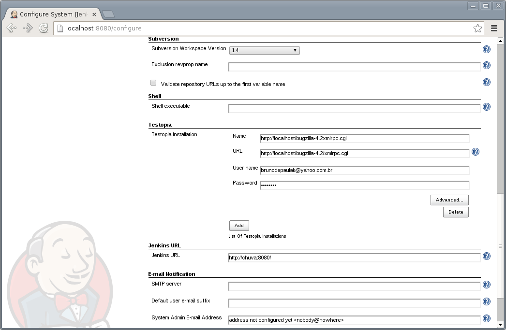
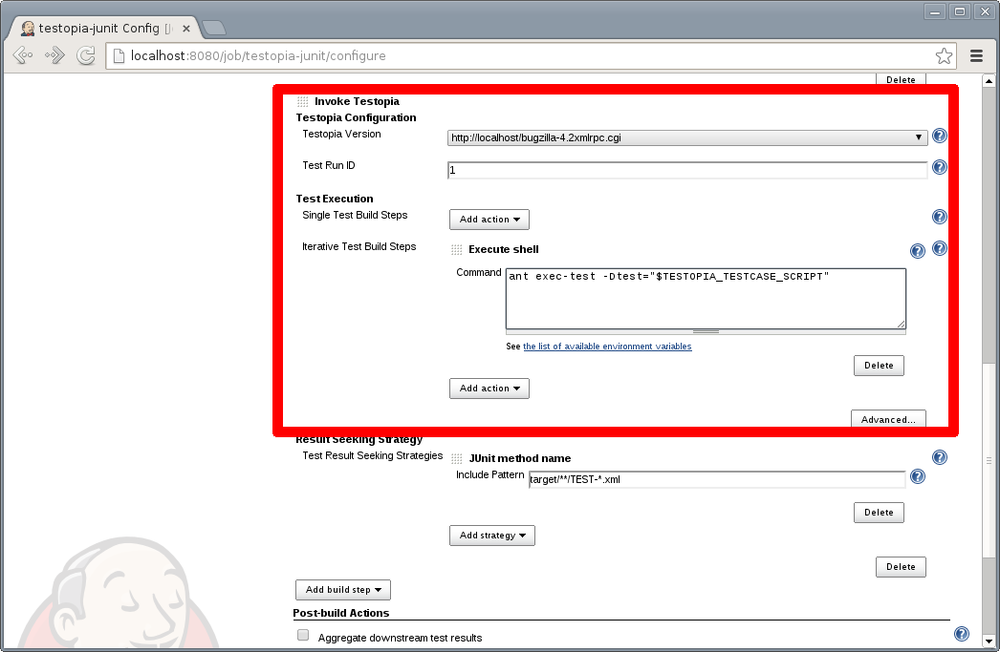
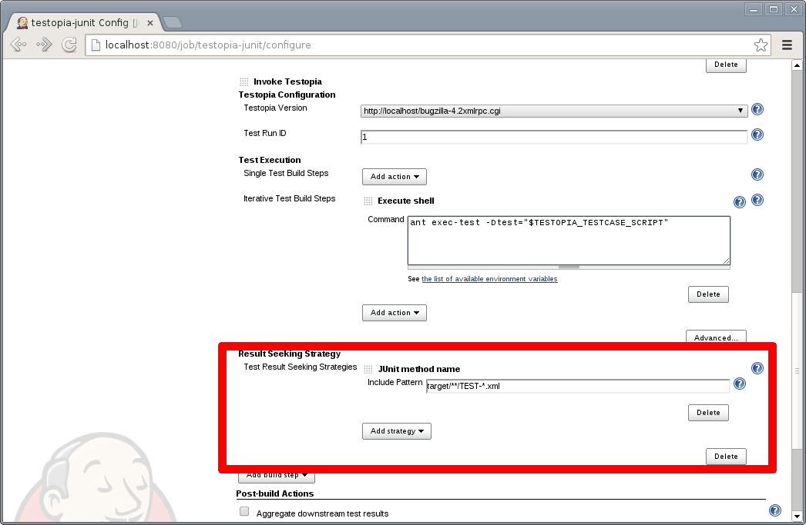

[.conf-macro .output-inline]# #

[.aui-icon .aui-icon-small .aui-iconfont-warning .confluence-information-macro-icon]##

*This plugin is up for adoption.* Want to help improve this plugin?
https://wiki.jenkins-ci.org/display/JENKINS/Adopt+a+Plugin[Click here to
learn more]!

This plug-in integrates *Jenkins* with Testopia and generates reports on
automated test execution. With this plug-in you can manage your tests in
Testopia, schedule and control in *Jenkins*, and execute using your
favorite test execution tool (TestPartner, Selenium, TestNG, Perl
modules, prove, PHPUnit, among others).

[.aui-icon .aui-icon-small .aui-iconfont-warning .confluence-information-macro-icon]#
#

When filing an issue, remember to include as much data as possible, but
avoid including sensitive data, as attachments can take a while to be
deleted from JIRA, as the process is manual and quite
troublesome image:docs/images/smile.svg[(smile)]

[[TestopiaPlugin-Description]]
== Description

The Testopia plug-in
integrates *Jenkins* with http://www.mozilla.org/projects/testopia[Testopia].
Testopia plug-in
uses https://github.com/kinow/testopia-java-driver[testopia-java-driver] to
access Testopia *XML-RPC* API. With the information that you provide in
the build step configuration the plug-in *retrieves automated tests from
Testopia*. With the plug-in, you are able to execute *build steps* that
call testing tools. It reads *TestNG*, *JUnit* and *TAP* test
report *formats*, used to update Testopia test cases' executions.

[[TestopiaPlugin-Testopiaconfigurationsection]]
=== *Testopia configuration section*

[.confluence-embedded-file-wrapper]##

[[TestopiaPlugin-TestExecutionsection]]
=== Test Execution section

[.confluence-embedded-file-wrapper]##

[[TestopiaPlugin-ResultSeekingStrategysection]]
=== Result Seeking Strategy section

[.confluence-embedded-file-wrapper]##

[.aui-icon .aui-icon-small .aui-iconfont-approve .confluence-information-macro-icon]#
#

You can use environment variables. 

[[TestopiaPlugin-Howdoestheplug-inexecutemyautomatedtests?]]
=== How does the plug-in execute my automated tests?

Testopia Plug-in retrieves automated test cases data from Testopia. This
data is then set as environment variables. This way your build steps can
make use of this information to execute your automated tests.

For instance, you could run a ant command passing a Test Class as
parameter, more or less something like this,
/opt/java/apache-ant-1.8.0/bin/ant
-DtestClass=$TESTOPIA_TESTCASE_SCRIPT. In this case,
TESTOPIA_TESTCASE_SCRIPT the value of the script automation field in
Testopia.

List of environment variables available during Testopia Plug-in
execution:

[[TestopiaPlugin-Alreadyimplemented:]]
==== *Already implemented:*

[[TestopiaPlugin-Testruninfo]]
===== *Test run info*

* TESTOPIA_TESTRUN_ID
* TESTOPIA_TESTRUN_BUILD
* TESTOPIA_TESTRUN_ENVIRONMENT
* TESTOPIA_TESTRUN_MANAGER
* TESTOPIA_TESTRUN_NOTES
* TESTOPIA_TESTRUN_PRODUCT_VERSION
* TESTOPIA_TESTRUN_SUMMARY
* TESTOPIA_TESTRUN_CASES
* TESTOPIA_TESTRUN_PLAN_ID
* TESTOPIA_TESTRUN_PLAN_TEXT_VERSION
* TESTOPIA_TESTRUN_RUN_ID
* TESTOPIA_TESTRUN_STATUS
* TESTOPIA_TESTRUN_TARGET_COMPLETION
* TESTOPIA_TESTRUN_PLAN_TARGET_PASS

[[TestopiaPlugin-Testcaseinfo]]
===== Test case info

* TESTOPIA_TESTCASE_ID
* TESTOPIA_TESTCASE_RUN_ID
* TESTOPIA_TESTCASE_BUILD_ID
* TESTOPIA_TESTCASE_SCRIPT
* TESTOPIA_TESTCASE_ALIAS
* TESTOPIA_TESTCASE_ARGUMENTS
* TESTOPIA_TESTCASE_REQUIREMENT
* TESTOPIA_TESTCASE_SORT_KEY
* TESTOPIA_TESTCASE_SUMMARY
* TESTOPIA_TESTCASE_AUTHOR_ID
* TESTOPIA_TESTCASE_CATEGORY_ID
* TESTOPIA_TESTCASE_DEFAULT_TESTER_ID
* TESTOPIA_TESTCASE_PRIORITY_ID
* TESTOPIA_TESTCASE_STATUS_ID
* TESTOPIA_TESTCASE_AUTOMATED
* TESTOPIA_TESTCASE_CREATION_DATE
* TESTOPIA_TESTCASE_ESTIMATED_TIME
* TESTOPIA_TESTCASE_ESTIMATED_ENV_ID

[[TestopiaPlugin-Howdoestheplug-inknowifatestpassedorfailed?]]
=== How does the plug-in know if a test passed or failed?

You can choose among different *result seeking strategies* in your job
configuration. The plug-in will support three *result
formats*, _TestNG_, _JUnit_ and _TAP_. 

*Already implemented:*

* http://testanything.org/[TAP] (using http://www.tap4j.org/[tap4j])
* JUnit (using Jenkins built-in parser)
* TestNG (using
http://repo2.maven.org/maven2/com/tupilabs/testng-parser/[testng-parser])

[[TestopiaPlugin-TAPresultseekingstrategies]]
==== TAP result seeking strategies

*TAP file name*: The plug-in matches the TAP file name (e.g.:
testFtpProtocol.tap) and the key custom field value.

[[TestopiaPlugin-DoesthepluginrecordthetestresultsinTestopia?]]
==== Does the plugin record the test results in Testopia?

Yes, the plugin will update the testcase in Testopia and set the status
according to the result of the testcase.

[[TestopiaPlugin-Configuration]]
== Configuration

. Download and install the latest version of Testopia
(http://www.mozilla.org/projects/testopia).
. Create automated tests in Testopia (Check automated field).
. Install the Testopia plug-in from the Jenkins Plugin Manager
. Define a Testopia configuration from the Configure System page.
. Add a Invoke Testopia build step in the job you want execute automated
tests.
. Configure the required properties.

[[TestopiaPlugin-LanguagesSupported]]
== Languages Supported

. English (American)
. Dutch (the Netherlands)
. Portuguese (Brazil)

Want to see this plug-in in your language? Send us an e-mail and we will
get in touch with the text that needs to be translated.

[[TestopiaPlugin-CompatibilityMatrix]]
== Compatibility Matrix

[.aui-icon .aui-icon-small .aui-iconfont-warning .confluence-information-macro-icon]#
#

We don't maintain the plug-in for Hudson. Issues happening in Hudson may
not be fixed here.

[width="100%",cols="20%,20%,20%,20%,20%",]
|===
|Plugin |1.0 |1.1 |1.2 |1.3  +
|Testopia |2.5+ |2.5+ |2.5+ |2.5+
|Jenkins |1.424+ |1.424+ |1.424+ |1.424+
|===

[[TestopiaPlugin-Issues]]
== Issues

type

key

summary

assignee

reporter

priority

status

resolution

created

updated

due

[.icon-in-pdf]# # Data cannot be retrieved due to an unexpected error.

http://issues.jenkins-ci.org/secure/IssueNavigator.jspa?reset=true&jqlQuery=project%20=%20JENKINS%20AND%20status%20in%20%28Open,%20%22In%20Progress%22,%20Reopened%29%20AND%20component%20=%20%27testopia-plugin%27&tempMax=1000&src=confmacro[View
these issues in Jira]

[[TestopiaPlugin-Resources]]
== Resources

Testopia Plug-in used TestLink Plug-in as basis. Below you will find
resources for Testopia and TestLink plug-ins, as the concept in both
plug-ins is very similar.

. http://www.kinoshita.eti.br/wp-content/uploads/2010/12/testingexperience12_12_10_Kinoshita_Santos.pdf[Article] published
in http://www.testingexperience.com/[Testing Experience magazine] issue
number 12 (Open Source Tools) written
by http://www.kinoshita.eti.br/[Bruno P. Kinoshita] and Anderson dos
Santos. 2010.
. http://www.scribd.com/doc/43729582/Automatizando-Testes-Com-Hudson-e-TestLink[Slides] used
in the lighting talk presented
at http://www.encontroagil.com.br/[Encontro Ágil] 2010
in http://www.ime.usp.br/[IME-USP] (Portuguese Only). 2010.
. http://www.automatedtestinginstitute.com/home/ASTMagazine/2011/AutomatedSoftwareTestingMagazine_March2011.pdf[Article] published
in http://www.automatedtestinginstitute.com/[Automated Software Testing
Magazine], volume 3, issue 1. March, 2011.
. http://www.belgiumtestingdays.com/archive/bruno_de_paula_kinoshita_how_to_automate_tests_using_testlink_and_hudson.pdf[Slides] used
in the presentation done in http://www.belgiumtestingdays.com/[Belgium
Testing Days] 2011.
. http://www.vimeo.com/16924211[Lighting
talk] for http://www.encontroagil.com.br/[Encontro Ágil] 2010,
at http://www.ime.usp.br/[IME-USP].
. More articles and tips on http://www.kinoshita.eti.br/[Bruno P.
Kinoshita's website].
. Presentation at http://www.stpcon.com/[STPCon] Spring March 2012 in
New Orleans - USA.
. http://www.slideshare.net/walkerchang/automated-testing-environment-by-bugzilla-testopia-and-jenkins[Automated
Testing Environment by Bugzilla, Testopia and Jenkins] by Chin Pin
Chang. July, 2014.

[[TestopiaPlugin-Documentation]]
== Documentation

. Various Testopia documentation assembled on
http://storify.com/peterflorijn/testopia-documentation[Storify]
. How to handle self signed certificates on Jenkins Server
(https://wiki.jenkins-ci.org/display/JENKINS/TestLink+Plugin+SSL+support[TestLink
Plugin SSL support])

[[TestopiaPlugin-Sponsors]]
== Sponsors

http://www.tupilabs.com/[[.confluence-embedded-file-wrapper .confluence-embedded-manual-size]##]

https://sites.google.com/site/peterflorijnconsultancy[[.confluence-embedded-file-wrapper .confluence-embedded-manual-size]##]

[[TestopiaPlugin-ReleaseNotes]]
== Release Notes

[[TestopiaPlugin-Release1.3]]
=== Release 1.3

. JUnit and TestNG result seeking strategies

[[TestopiaPlugin-Release1.0]]
=== Release 1.0

. First version of the plug-in (the development was guided based on the
source code of the following plug-ins:
https://wiki.jenkins-ci.org/display/JENKINS/Testlink+Plugin[TestLink] 
http://wiki.jenkins-ci.org/display/HUDSON/CCM+Plugin[CCM] , http://wiki.jenkins-ci.org/display/HUDSON/Sonar+Plugin[Sonar] (how
to ref maven installations)).

[[TestopiaPlugin-Roadmap]]
== Roadmap

. Keep compatibility with latest versions of Jenkins and Testopia.

[[TestopiaPlugin-Troubleshooting]]
== Troubleshooting

* A test case without a tester assigned doesn't execute.
