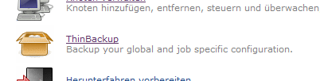
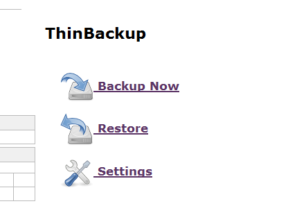
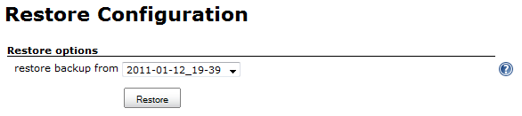
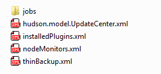
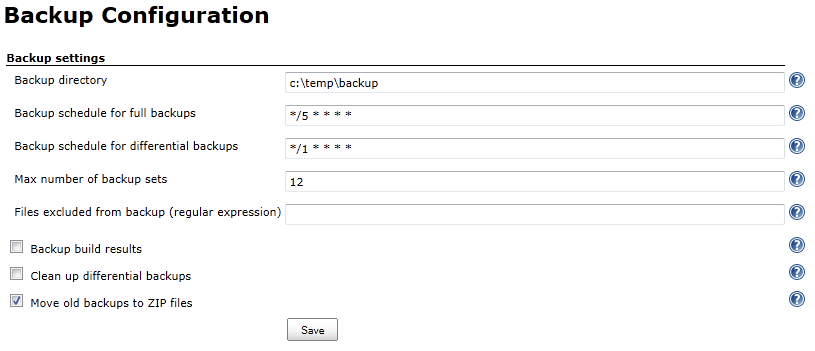

[.conf-macro .output-inline]##

[cols="",options="header",]
|===
|Plugin Information
|View ThinBackup https://plugins.jenkins.io/thinBackup[on the plugin
site] for more information.
|===

[.aui-icon .aui-icon-small .aui-iconfont-warning .confluence-information-macro-icon]##

*This plugin is up for adoption.* Want to help improve this plugin?
https://wiki.jenkins-ci.org/display/JENKINS/Adopt+a+Plugin[Click here to
learn more]!

This plugin simply backs up the global and job specific configurations
(not the archive or the workspace). 

[[thinBackup-Whyanotherbackupplugin]]
== Why another backup plugin

The https://wiki.jenkins-ci.org/display/JENKINS/Backup+Plugin[Backup
Plugin] only does manual backups, and stores all data found in
JENKINS_HOME. This is sometimes (e.g. big Jenkins environment) not
practical because of time and disk space requirements, and because it
can only be manually triggered. __thinBackup__s can be scheduled and
only backs up the most vital configuration info.

[[thinBackup-Documentation]]
== Documentation

This plugin adds another management link to 'Manage Hudson' called
ThinBackup which looks like this:

[.confluence-embedded-file-wrapper]##

This new link provides the following actions: +
[.confluence-embedded-file-wrapper]##

[[thinBackup-BackupNow]]
=== Backup Now

Triggers a manual full back up right now.

[[thinBackup-Restore]]
=== Restore

[.confluence-embedded-file-wrapper]## +
Select the date of the backup you would like to restore. After the
restore finishes you are redirected to the plugin main page. To activate
the restored settings you need to restart jenkins.

*Note:* The file 'nextBuildnumber' will not be backed up or restored to
prevent buildnumber collision by default. The archive and the workspace
will not be deleted or changed, but all backed up files will simply be
overwritten with the restored versions (e.g. config.xml, thinBackup.xml
-> for more info simply look in a backup).

[.confluence-embedded-file-wrapper]##.

[[thinBackup-Restorenextbuildnumberfile(iffoundinbackup)]]
==== Restore next build number file (if found in backup)

If this option is enabled, the file nextBuildNumber will also be
restored. +
*Note:*Take special care when restoring a backup that contains a
nextBuildNumber file, as this may potentially cause a lot of problems.

[[thinBackup-Restoreplugins]]
==== Restore plugins

If this option is enabled, the plugins get restored. You need an active
internet connection to the update server, because plugins will be
downloaded from the update server to keep the backup small.

[[thinBackup-Settings]]
=== Settings

[.confluence-embedded-file-wrapper]##

[[thinBackup-Backupdirectory]]
==== Backup directory

Specify the backup directory. The Jenkins process needs write access to
this directory. You can use environment variables like
$\{JENKINS_WORKSPACE} to specify the path.

[[thinBackup-Backupscheduleforfullbackups]]
==== Backup schedule for full backups

Specify schedule when a full backup is triggered. Cron notation is used.
A full backup backs up all files even if there were no changes.

[[thinBackup-Backupschedulefordifferentialbackups]]
==== Backup schedule for differential backups

Specify schedule when a differential backup is triggered. Cron notation
is used. A differential backup stores only modified data since the last
full backup. If there are no changes detected, no diff backup will be
created.

*Note:* You do not need to specify a differential backup schedule if you
only need full backups. Because differential backups depend on full
backups, a schedule for full backups is mandatory if you specify a
differential backup schedule.

[[thinBackup-WaituntilJenkins/Hudsonisidletoperformabackup]]
==== Wait until Jenkins/Hudson is idle to perform a backup

It is very recommended to enable this option (default). Nevertheless,
many users report that the quiet mode is blocking the execution of long
running jobs. If you disable this option the backup will be made without
waiting for a safe state of your instance. In other words, the backup
will be done immediately, and this could cause corrupt backups.

[[thinBackup-ForceJenkinstoquitemodeafterspecifiedminutes]]
==== Force Jenkins to quite mode after specified minutes

Force a quiet mode after the specified time in minutes to force a safe
environment for the back up. Zero means the quite mode is forced
directly when the back up is triggered by the scheduler. Read more about
the back up process below.

[[thinBackup-Maxnumberofbackupsets]]
==== Max number of backup sets

To save disk space, you can specify the maximum number of stored backup
sets. A backup set is defined as a full backup together with its
referencing diff backups. Older backup sets will be deleted after the
next full backup action. This also applies to zipped backup sets.

[[thinBackup-Filesexcludedfrombackup]]
==== Files excluded from backup

If you have specific files you do not want to back up, entering a regex
here which identifies those files will prevent them being backed up. All
files with a name matching this regular expression will not be backed
up. Leave empty if not needed. If the expression is invalid, it will be
disregarded.

[[thinBackup-Backupbuildresults]]
==== Back up build results

If this option is enabled, build results will also be backed up. This is
potentially a lot of data, so think carefully about it. Once you decide
to backup build results you get also to option about backup your build
archives. Once again, be careful with this option, because it could be
very *time consuming* and needs probably *a lot of disk space*!

[[thinBackup-Backup'userContents']]
==== Back up 'userContents'

Jenkins provides a URL where you can put common data (e.g. static HTML,
Tools, ...). you can back up all these data if you check this option.

[[thinBackup-Backuponlybuildsmarkedtokeep]]
==== Backup only builds marked to keep

If this option is enabled, only builds results/artifacts on builds which
are marked "Keep this build forever" are backed up.

[[thinBackup-Cleanupdifferentialbackups]]
==== Clean up differential backups

If this option is enabled, all differential backups are removed whenever
a new full backup is done.

[[thinBackup-MoveoldbackupstoZIPfiles]]
==== Move old backups to ZIP files

If this is checked, then whenever a new full backup is performed all old
backup sets will be moved to ZIP files. Each ZIP file will contain one
backup set, i.e. one full backup and any diff backups referencing it.
The file name will identify the time frame where the backups are
included (i.e. the time stamp of the full backup and the time stamp of
the latest diff backup).

*Note:* The setting "_Max number of backup sets_" applies to backup ZIP
files created by thinBackup as well.

*Note:* In case "_Clean up differential backups_" is checked, diff
cleanup will be performed before zipping is done, and therefore no diff
backups will be in the ZIP files.

[[thinBackup-Backupprocess]]
== Back up process

Because many of you are asking why Jenkins is going to shutdown when a
back up is triggered, I decided to explain my ideas behind the back up
process. +
First of all, *Jenkins will not be shut down at any time*. +
Second, I use the build-in quiet mode (Jenkins is going to shutdown) to
ensure a safe environment during the back up process and cancel the
quiet mode afterwards. This could be misleading, I know, *but there is
no point where Jenkins will be shutdown*.

So what is a safe environment? +
A safe environment would mean that no jobs are running. Because a
running job could change a file in the workspace (results, build output,
...), in this case the file could be locked. This situation should be
avoided by using the quiet mode.

How it works, an example:

* The scheduler triggers a backup
* There are active jobs and some jobs are waiting in the queue
* The back up waits for a safe environment (recommended way). This means
running jobs will be finished in any case. Waiting jobs will be started
as long Jenkins is not in the quiet mode. The 'Force Jenkins to quite
mode after specified minutes' option will force Jenkins after the
specified time into the quiet mode. From this point on no further jobs
will be started until the backup is finished. +
In case of 'Wait until Jenkins/Hudson is idle to perform a backup' is
disabled the backup will be done immediately.
* The back up starts when no job is running.
* Once the back up is finished the quiet mode will be canceled. Manually
canceling the quiet mode will force a new quiet period.

[[thinBackup-Changelog]]
== Changelog

[cols=",",options="header",]
|===
|Version |Comment
|1.8.0 |new feature:
https://issues.jenkins-ci.org/browse/JENKINS-21221[JENKINS-21221],
https://issues.jenkins-ci.org/browse/JENKINS-21472[JENKINS-21472] +
this features will provide functionality to backup sources from 3rd
party plugins

|1.7.4 |fixed issued:
https://issues.jenkins-ci.org/browse/JENKINS-20026[JENKINS-20026]

|1.7.3 |fixed issues:
https://issues.jenkins-ci.org/browse/JENKINS-17475[JENKINS-17475] +
image:docs/images/warning.svg[(warning)]
Upgrade Jenkins core version to 1.509, verions before this are not
tested and midge be buggy.

|1.7.2 |fixed issues:
https://issues.jenkins-ci.org/browse/JENKINS-16426[JENKINS-16426] (->
https://issues.jenkins-ci.org/browse/JENKINS-16897[JENKINS-16897] ) +
improvements:
https://issues.jenkins-ci.org/browse/JENKINS-16609[JENKINS-16609]

|1.7.1
|
defect artifact - Please do not use!

|1.7 |new features:
https://issues.jenkins-ci.org/browse/JENKINS-10947[JENKINS-10947]:
Plug-ins will be restored from the update server +
improvements:https://issues.jenkins-ci.org/browse/JENKINS-15681[JENKINS-15681]:
Support for Cloudbees Folders +
fixed issues:
https://issues.jenkins-ci.org/browse/JENKINS-15514[JENKINS-15514]

|1.6.2 |fixed issues:
https://issues.jenkins-ci.org/browse/JENKINS-14288[JENKINS-14288],
https://issues.jenkins-ci.org/browse/JENKINS-12173[JENKINS-12173],
https://issues.jenkins-ci.org/browse/JENKINS-12098[JENKINS-12098]

|1.6.1 |fixed issues:
https://issues.jenkins-ci.org/browse/JENKINS-14111[JENKINS-14111],
https://issues.jenkins-ci.org/browse/JENKINS-13980[JENKINS-13980]

|1.6 |fixed issues:
https://issues.jenkins-ci.org/browse/JENKINS-13427[JENKINS-13427] +
improvements:
https://issues.jenkins-ci.org/browse/JENKINS-13059[JENKINS-13059]

|1.5 |fixed issues: +
improvements:
https://issues.jenkins-ci.org/browse/JENKINS-8565[JENKINS-8565];
https://issues.jenkins-ci.org/browse/JENKINS-11062[JENKINS-11062];
https://issues.jenkins-ci.org/browse/JENKINS-11678[JENKINS-11678];
https://issues.jenkins-ci.org/browse/JENKINS-11975[JENKINS-11975] +
new features:
https://issues.jenkins-ci.org/browse/JENKINS-10994[JENKINS-10994]

|1.4 |fixed issues:
https://issues.jenkins-ci.org/browse/JENKINS-10377[JENKINS-10377];
https://issues.jenkins-ci.org/browse/JENKINS-10381[JENKINS-10381]

|1.3 |fixed issues:
https://issues.jenkins-ci.org/browse/JENKINS-9117[JENKINS-9117];https://issues.jenkins-ci.org/browse/JENKINS-8955[JENKINS-8955];https://issues.jenkins-ci.org/browse/JENKINS-9171[JENKINS-9171];https://issues.jenkins-ci.org/browse/JENKINS-9669[JENKINS-9669] +
new features: Compress old backupsets; exclude files from backup via
regex

|1.2 |fixed issues:
http://issues.jenkins-ci.org/browse/JENKINS-8782[JENKINS-8782];http://issues.jenkins-ci.org/browse/JENKINS-8781[JENKINS-8781];
http://issues.jenkins-ci.org/browse/JENKINS-8606[JENKINS-8606];http://issues.jenkins-ci.org/browse/JENKINS-8564[JENKINS-8564] +
http://issues.jenkins-ci.org/browse/JENKINS-8583[JENKINS-8583] will be
fixed if you use Jenkins greater or equal 1.396

|1.1 |first published version

|1.0 |never published because of release problems
|===

[[thinBackup-FeatureRequestsorBugReports]]
== Feature Requests or Bug Reports

Please let us know if you would have another option or feature for this
plugin by entering an issue or write us an email. THANKS

Before submitting a feature request or bug report, you can check if it
has already been submitted by searching issues in JIRA categorized under
the thinbackup-plugin component. There are
currently [.static-jira-issues_count .conf-macro .output-block]#
[.aui-icon .aui-icon-wait .issue-placeholder]# # Getting issues... #
 open.

 
