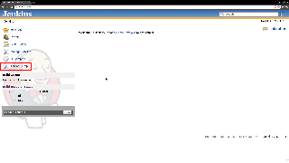
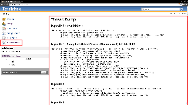

[[ThreadDumpActionPlugin-ThreadDumpActionPlugin]]
== Thread Dump Action Plugin

Provides an easy mechanism to obtain a Jenkins thread dump.

 +

'''''

 +

[cols=",,",]
|===
|Root Action
|[.confluence-embedded-file-wrapper]##
|The root action to launch a Thread Dump

|Thread Dump
|[.confluence-embedded-file-wrapper]##
|The Jenkins generated thread dump
|===

 +

'''''

 +

[[ThreadDumpActionPlugin-Changelog]]
=== Changelog

[[ThreadDumpActionPlugin-1.0(released2012-03-03)]]
==== 1.0 (released 2012-03-03)

* fully I18N
* initial implementation
