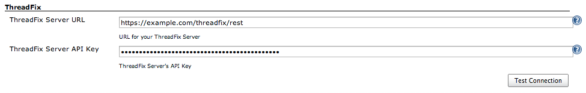
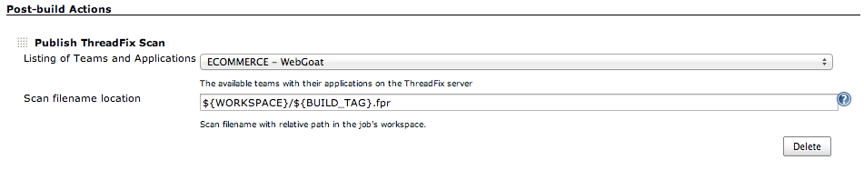

Uploads any supported ThreadFix scan file to your ThreadFix server

[[ThreadFixPlugin-Note:]]
== _Note:_

* This plugin is _NOT_ maintained by *Denim Group*
* Plugin version 1.0 supports ThreadFix versions 1.0 and 2.0.

[[ThreadFixPlugin-Features]]
== Features

* Upload any supported scan file(s) from your Jenkins Slave/Master to
your ThreadFix web server using your ThreadFix API Keys.
* Ability to specify any scan filename under the Project's workspace
using Jenkin's environmental variables.
* ThreadFix
https://github.com/denimgroup/threadfix/wiki/Threadfix-REST-Interface[REST
API] is used for all communication from the Jenkins Server.

[[ThreadFixPlugin-JenkinsGlobalConfig]]
== Jenkins Global Config

[.confluence-embedded-file-wrapper .image-center-wrapper]##

[[ThreadFixPlugin-JenkinsProjectConfig]]
== Jenkins Project Config

[.confluence-embedded-file-wrapper .image-center-wrapper]##

[[ThreadFixPlugin-Installation&Setup]]
== Installation & Setup

A http://www.threadfix.org/download/[ThreadFix server] deployment with
an API Key created from your ThreadFix installation.

[[ThreadFixPlugin-Contact]]
== Contact

otto [at] automationdomination [dot] me

[[ThreadFixPlugin-Changelog]]
== Changelog

[[ThreadFixPlugin-1.5.3(Aug02,2016)]]
=== 1.5.3 (Aug 02, 2016)

* Added ability to configure multiple scan files for uploading
