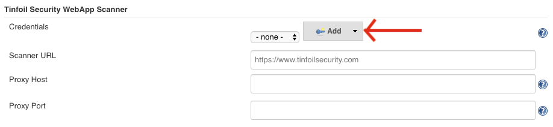
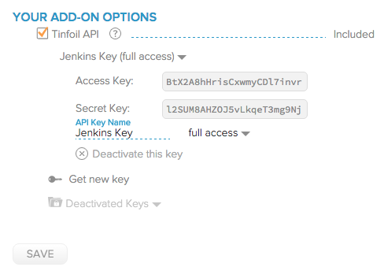
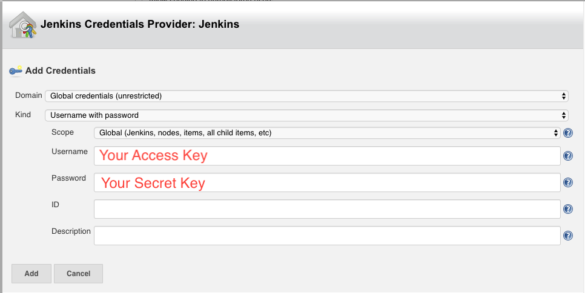
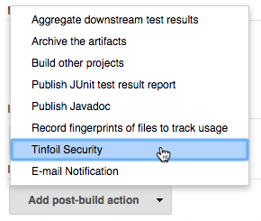
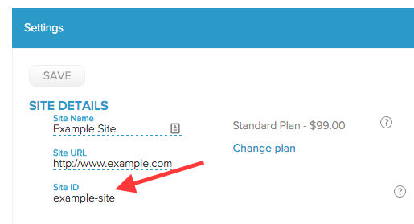

[.conf-macro .output-inline]##

[cols="",options="header",]
|===
|Plugin Information
|View Tinfoil Security https://plugins.jenkins.io/tinfoil-scan[on the
plugin site] for more information.
|===

[.aui-icon .aui-icon-small .aui-iconfont-info .confluence-information-macro-icon]##

Older versions of this plugin may not be safe to use. Please review the
following warnings before using an older version:

* https://jenkins.io/security/advisory/2018-07-30/#SECURITY-840[Plugin
stored API Secret Key in plain text]

 +

[[TinfoilSecurityPlugin-TinfoilSecurityPlugin]]
== Tinfoil Security Plugin

[.conf-macro .output-inline]#Allows you to run web security tests from
the cloud using https://www.tinfoilsecurity.com/[Tinfoil Security].# +

[[TinfoilSecurityPlugin-Setup]]
=== Setup

[[TinfoilSecurityPlugin-GlobalConfiguration]]
==== Global Configuration

If you navigate to 'Manage Jenkins > Configure System', you should see a
section labeled Tinfoil Security. Here, you'll be able to set your
Tinfoil API keys, as well as optionally set a hostname of your Tinfoil
Security installation if you are using the Tinfoil appliance and proxy
information if needed.

 +

[.confluence-embedded-file-wrapper .confluence-embedded-manual-size]##

First though, you'll need to get your API keys. To generate a set of API
keys, log in to your Tinfoil Security account and navigate to
https://www.tinfoilsecurity.com/add_ons. From there, you can select the
checkbox to enable the Tinfoil API and create an API key. Make sure you
create a 'Full Access' API key pair, since 'Read-Only' API keys cannot
start scans. Keep in mind you won't see the actual values of your API
keys until you've clicked 'Save'.

 +

[.confluence-embedded-file-wrapper]##

Then hit the 'add' button on the credentials line and select the context
you want to add the credentials to ('Jenkins' is the default)

[.confluence-embedded-file-wrapper .confluence-embedded-manual-size]##

Choose the 'Username with password' kind and fill in your Access Key as
the username and Secret Key as the password.

[.confluence-embedded-file-wrapper .confluence-embedded-manual-size]##

[[TinfoilSecurityPlugin-Per-ProjectConfiguration]]
==== Per-Project Configuration

For each project in your Jenkins installation. You can configure a
Tinfoil Security Post-build Action which allows you to specify a Tinfoil
Site ID for the site you want to scan at the end of your Jenkins build.

[.confluence-embedded-file-wrapper]##

To find your Site ID, you need to log in to your Tinfoil Security
account and navigate to the settings panel for the site you want to
scan. Underneath the site name and URL, you should see the
auto-generated Site ID for that site.

[.confluence-embedded-file-wrapper]##

[[TinfoilSecurityPlugin-Usage]]
=== Usage

To use the Tinfoil Security plugin, just run a build. When Jenkins
performs the Tinfoil Security post-build action, you will see a message
like this in your console output telling you everything is working.

Tinfoil Security scan started! Log in to
https://www.tinfoilsecurity.com/sites to view its progress.

[[TinfoilSecurityPlugin-Support]]
=== Support

For support, please e-mail us at support@tinfoilsecurity.com

[[TinfoilSecurityPlugin-Changelog]]
=== Changelog

[[TinfoilSecurityPlugin-3.0(Jul92019)]]
==== 3.0 (Jul 9 2019)

* image:docs/images/add.svg[(plus)] Added
support for the Tinfoil Security API Scanner.

[[TinfoilSecurityPlugin-2.0(Jul302018)]]
==== 2.0 (Jul 30 2018)

* {blank}
+
https://jenkins.io/security/advisory/2018-07-30/#SECURITY-840[Fix
security issue]: The plugin now integrates with
https://plugins.jenkins.io/credentials[Credentials Plugin]. Existing
configurations are not migrated and will need to be reconfigured.

[[TinfoilSecurityPlugin-1.6(Mar12017)]]
==== 1.6 (Mar 1 2017)

* image:docs/images/add.svg[(plus)]
 Add the ability to configure a proxy to access the Tinfoil Security
service.

[[TinfoilSecurityPlugin-1.5(Jul12016)]]
==== 1.5 (Jul 1 2016)

* image:docs/images/add.svg[(plus)]
API Access Key and API Secret Key can include environment variables,
specified as $\{VARIABLE} in the text fields.

[[TinfoilSecurityPlugin-1.4(Mar22016)]]
==== 1.4 (Mar 2 2016)

* image:docs/images/add.svg[(plus)]
Reduced minimum Jenkins version to 1.479

[[TinfoilSecurityPlugin-1.3(Nov172015)]]
==== 1.3 (Nov 17 2015)

* image:docs/images/error.svg[(error)]
Fixed an issue where the plugin refused to connect to Tinfoil hosts that
use self-signed certificates.
* image:docs/images/add.svg[(plus)]
Tinfoil hosts can now be configured per-project as well as globally.

[[TinfoilSecurityPlugin-1.2(Oct162015)]]
==== 1.2 (Oct 16 2015)

* image:docs/images/add.svg[(plus)]
API Keys can now be configured per-project as well as globally.

[[TinfoilSecurityPlugin-1.1(Oct62015)]]
==== 1.1 (Oct 6 2015)

* image:docs/images/add.svg[(plus)]
Added a global configuration to allow you to specify a root URL for your
Tinfoil installation (if you are using the Tinfoil appliance).

[[TinfoilSecurityPlugin-1.0(Oct22015)]]
==== 1.0 (Oct 2 2015)

* First release!
* image:docs/images/add.svg[(plus)]
Allow you to run an asynchronous Tinfoil Security scan on your site as a
post build action.

 +

 +

 +
