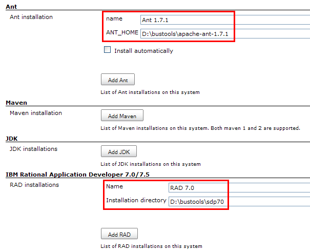
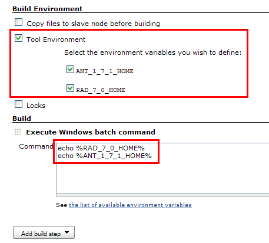
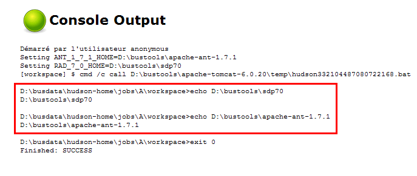

Lets you use "tools" in unusual ways, such as from shell scripts.

[[ToolEnvironmentPlugin-Aboutthisplugin]]
== About this plugin

See http://issues.jenkins-ci.org/browse/JENKINS-4532 for motivation.

Some screenshots are better than a long discussion:

. This is what you define in Hudson's main config screen: +
[.confluence-embedded-file-wrapper .image-center-wrapper]##
. This is how you use the plugin in a job: +
[.confluence-embedded-file-wrapper .image-center-wrapper]##
. This is what you get: +
[.confluence-embedded-file-wrapper .image-center-wrapper]##

Compared to
https://wiki.jenkins-ci.org/display/JENKINS/Custom+Tools+Plugin[Custom
Tools Plugin] the advantage is that you can use the tool in arbitrary
ways, not just running an executable from it. In the future these
plugins should be merged.
https://wiki.jenkins-ci.org/display/JENKINS/SharedObjects+Plugin[SharedObjects
Plugin] can also be used to achieve this plugin's effect.

[[ToolEnvironmentPlugin-History]]
== History

1.0 released Feb 15 2010
