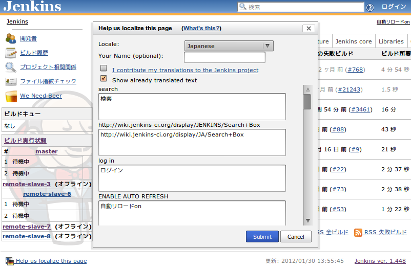

[.aui-icon .aui-icon-small .aui-iconfont-error .confluence-information-macro-icon]#
#

*The server handling submitted translations has been shut down.* While
this plugin is still useful for local translations, it's not possible to
submit translations to the Jenkins project anymore.

[.conf-macro .output-inline]# #

[.aui-icon .aui-icon-small .aui-iconfont-info .confluence-information-macro-icon]##

Older versions of this plugin may not be safe to use. Please review the
following warnings before using an older version:

* https://jenkins.io/security/advisory/2018-01-22/[Cross-site request
forgery (CSRF) vulnerability]

This plugin adds an additional dialog box in every page, which enables
people to contribute localizations for the messages they are seeing in
the current page.This reduces the barrier of entry to localization, and
by showing messages in the context of a page, it should also improve the
quality of the translation.

[[TranslationAssistancePlugin-Howdoesitwork?]]
== How does it work?

Browse any page of Jenkins, and you'll see a link in the footer section
that opens the translation dialog. +
[.confluence-embedded-file-wrapper]##

Click this link, and you'll see an inline dialog box. +
[.confluence-embedded-file-wrapper]##

Choose the locale that you'd like to contribute, then type the
translation text. The message follows the format of
http://java.sun.com/j2se/1.4.2/docs/api/java/text/MessageFormat.html[`+MessageFormat+`],
and in particular,

. Markers like "\{0}" and "\{1}" represent the arguments
. Single quote (') needs to be escaped as two single-quote ('')
+
[.aui-icon .aui-icon-small .aui-iconfont-info .confluence-information-macro-icon]#
#

Your name allows us to recognize your contributions and bypass manual
review, especially when you've been contributing in the past. So do
supply some unique string, even if it's not your real name.
+
If you have an administrative access to the Jenkins instance, your
contributions will be reflected right away — just reload the page to see
the effect. (If you do not have the access, your changes won't be
reflected to the running instance for security reasons, but nonetheless
they are sent to the Jenkins server.)

Your contributions are also sent to the Jenkins project for inclusion in
future versions of Jenkins.

[[TranslationAssistancePlugin-Participatingmoretothelocalizationeffort]]
== Participating more to the localization effort

If you'd like to involve more deeply with the localization effort,
please drop us a note at http://groups.google.com/group/jenkinsci-dev.
Also see
https://wiki.jenkins-ci.org/display/JENKINS/Internationalization[Internationalization].

[[TranslationAssistancePlugin-ChangeLog]]
== Change Log

[[TranslationAssistancePlugin-Version1.16(Jan22,2018)]]
=== Version 1.16 (Jan 22, 2018)

* https://jenkins.io/security/advisory/2018-01-22/[Fix security issue]

[[TranslationAssistancePlugin-Version1.15(Jun21,2016)]]
==== Version 1.15 (Jun 21, 2016)

* https://issues.jenkins-ci.org/browse/JENKINS-34713[JENKINS-34713]
Updated to the new parent POM. Some tests have been reviewed.

[[TranslationAssistancePlugin-Version1.12(Oct30,2014)]]
==== Version 1.12 (Oct 30, 2014)

* German translation added.

[[TranslationAssistancePlugin-Version1.11(Jan07,2014)]]
==== Version 1.11 (Jan 07, 2014)

* updated some translations or labels (French, Portuguese, Norwegian,
Chinese Traditional, Telugu)
* do not allow Afrikaans to be the default language
* do not show footer to anonymous users without read permission
* fixed overlapping popup window
* attempted to fix an unreproducible NPE

[[TranslationAssistancePlugin-Version1.10(Nov06,2012)]]
==== Version 1.10 (Nov 06, 2012)

* Added support for Tamil (ta) (pull #1)
* Updated Spanish translation of help text

[[TranslationAssistancePlugin-Version1.9(Mar20,2012)]]
==== Version 1.9 (Mar 20, 2012)

* Added support for Faroese (fo)
* Added support for British English (en_GB)
* Ensure icon is cached properly, as it is loaded on every page

[[TranslationAssistancePlugin-Version1.8(Oct10,2011)]]
==== Version 1.8 (Oct 10, 2011)

* Fixed typo in plugin display name
(https://issues.jenkins-ci.org/browse/JENKINS-11235[JENKINS-11235])

[[TranslationAssistancePlugin-Version1.7(Aug29,2011)]]
==== Version 1.7 (Aug 29, 2011)

* Made to work with Jenkins

[[TranslationAssistancePlugin-Version1.4(Mar22,2010)]]
==== Version 1.4 (Mar 22, 2010)

* Localization updates for this plugin

[[TranslationAssistancePlugin-Version1.3(Jan19,2010)]]
==== Version 1.3 (Jan 19, 2010)
