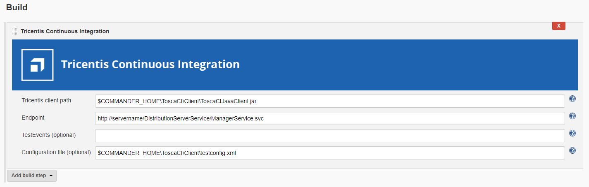
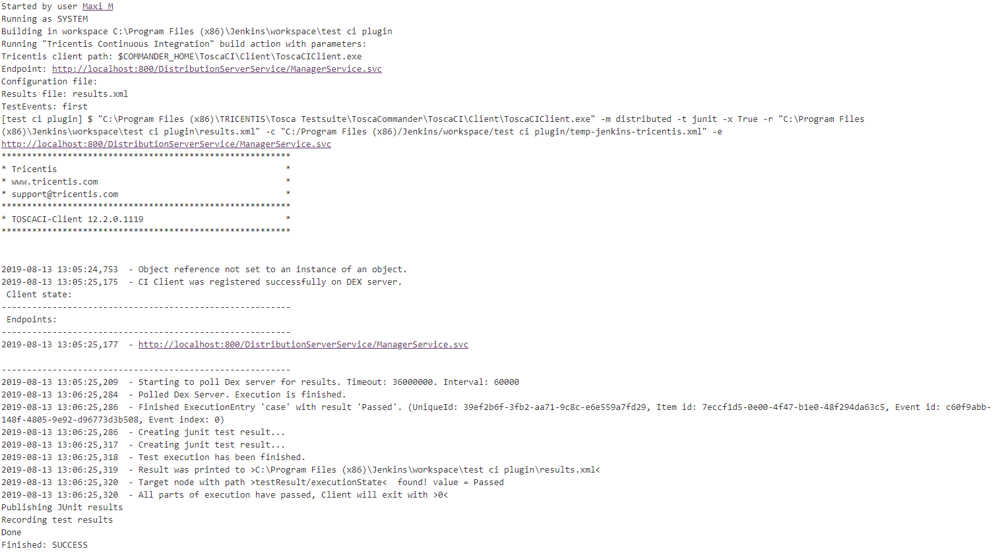
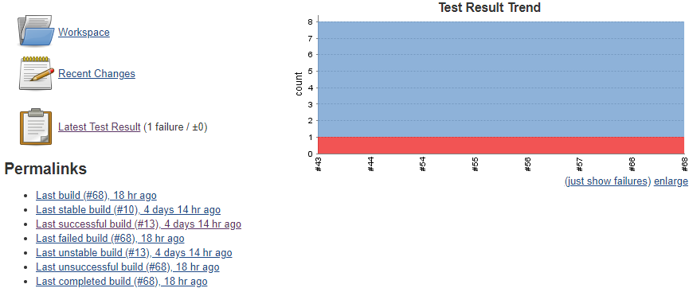

The Tricentis Continuous Integration plugin integrates Jenkins with
Tricentis Tosca CI. With this plugin, you can execute Tricentis Tosca
tests via Jenkins.

To configure Jenkins for the execution of Tricentis Tosca tests, perform
one of the following actions:

* https://wiki.jenkins.io/display/JENKINS/Tricentis+Continuous+Integration#TricentisContinuousIntegration-add_build_step[Add
a new Tricentis Continuous Integration build step to your project.]
* https://wiki.jenkins.io/display/JENKINS/Tricentis+Continuous+Integration#TricentisContinuousIntegration-configure_pipeline[Configure
your Jenkins pipeline for Tricentis Continuous Integration].

Once you have configured Jenkins for Tricentis Continuous Integration,
https://wiki.jenkins.io/display/JENKINS/Tricentis+Continuous+Integration#TricentisContinuousIntegration-execute_tests[execute
your tests.]

 +

For more information on Tricentis Tosca and Tosca Continuous
Integration, see the following links:

* https://www.youtube.com/watch?v=6469lMkeMiM[Tricentis Tosca in 60
seconds]
* https://support.tricentis.com/community/manuals_detail.do?lang=en&url=continuous_integration/concept.htm[Tosca
Continuous Integration documentation]

You can execute your tests via
https://support.tricentis.com/community/manuals_detail.do?lang=en&url=continuous_integration/set_up_ci_remote.htm[Tosca
Remote Service] or
https://support.tricentis.com/community/manuals_detail.do?lang=en&url=continuous_integration/set_up_ci_dex.htm[Tosca
Distributed Execution].

 +

[[TricentisContinuousIntegration-add_build_stepAddanewTricentisContinuousIntegrationbuildstep]]
== [#TricentisContinuousIntegration-add_build_step .confluence-anchor-link .conf-macro .output-inline]## ##Add a new Tricentis Continuous Integration build step +

To execute tests in Tricentis Tosca CI, add a new Tricentis Continuous
Integration build step:

[.confluence-embedded-file-wrapper]##

 +

[width="100%",cols="16%,^5%,79%",options="header",]
|===
|Field name [pipeline property] |Required |Description
a|
Tricentis client path

{empty}[tricentisClientPath]

|Yes a|
Input the path to either the ToscaCIClient.exe or the
ToscaCIJavaClient.jar file. This component is responsible for sending
the execution request to your execution machines.

If you use ToscaCIJavaClient.jar, you need to install JRE 1.7 or higher
on the Jenkins Slave machine and set the JAVA_HOME environment variable
accordingly.

a|
Endpoint +

{empty}[endpoint]

|Yes a|
Specify the address of the webservice. This component triggers the test
execution.

If you execute your tests via
https://support.tricentis.com/community/manuals_detail.do?lang=en&url=continuous_integration/set_up_ci_remote.htm[Tosca
Remote Service], the endpoint needs to point to the
TOSCARemoteExecutionService
(e.g. [.nolink]#http://servername:8732/TOSCARemoteExecutionService/).#

If you execute your tests via
https://support.tricentis.com/community/manuals_detail.do?lang=en&url=continuous_integration/set_up_ci_dex.htm[Tosca
Distributed Execution], the endpoint needs to point to the Manager
Service of the Tosca Distribution Server (e.g.
[.nolink]#http://servername:8732/DistributionServerService/ManagerService.svc#).

a|
TestEvents (Distributed Execution only)

{empty}[testEvents]

|No a|
Input the
https://support.tricentis.com/community/manuals_detail.do?lang=en&url=tosca_commander/creating_events.htm[TestEvents]
that you want to execute, separated by semicolons. You can identify the
TestEvents with their name or their
https://support.tricentis.com/community/manuals_detail.do?lang=en&url=continuous_integration/configure_execution_command_dex.htm[system
ID].

This field is optional. It can only be used if you execute your tests
via Tosca Distributed Execution.

If you use this setting, leave the Configuration File setting of this
page empty. Otherwise, this build step fails.

a|
Configuration file

{empty}[configurationFilePath]

|No a|
Specify the path to the Tricentis CI
https://support.tricentis.com/community/manuals_detail.do?lang=en&url=continuous_integration/configure_execution_command.htm#CreatetheXMLfile[test
execution configuration XML file]. The test configuration file includes
more details about which items you would like to execute. +

If you use this setting, leave the TestEvents setting of this page
empty. Otherwise, this build step fails.

|===

[[TricentisContinuousIntegration-configure_pipelineConfiguretheJenkinspipelineforTricentisContinuousIntegration]]
== [#TricentisContinuousIntegration-configure_pipeline .confluence-anchor-link .conf-macro .output-inline]## ##Configure the Jenkins pipeline for Tricentis Continuous Integration +

If you use https://jenkins.io/doc/book/pipeline/getting-started/[Jenkins
Pipelines,] specify Tricentis Tosca build logic with pipeline script:

*Pipeline configuration*

[source,syntaxhighlighter-pre]
----
pipeline {    
    agent any
    stages {
       stage('Build') {
          steps {
             tricentisCI tricentisClientPath: '$COMMANDER_HOME\\ToscaCI\\Client\\ToscaCIClient.exe', configurationFilePath: 'configuration.xml', endpoint: 'http://localhost:8732/TOSCARemoteExecutionService/'
          }
       }
    }
}
----

[[TricentisContinuousIntegration-execute_testsExecutetests]]
== [#TricentisContinuousIntegration-execute_tests .confluence-anchor-link .conf-macro .output-inline]## ##Execute tests +

After you configure the job, run it.

[[TricentisContinuousIntegration-Jenkinsjoboutputexample]]
=== Jenkins job output example

[.confluence-embedded-file-wrapper]##

[[TricentisContinuousIntegration-TricentisreportsautomaticallypublishedtoJenkins]]
=== Tricentis reports automatically published to Jenkins

 +

[.confluence-embedded-file-wrapper]##
