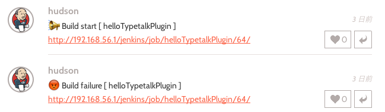
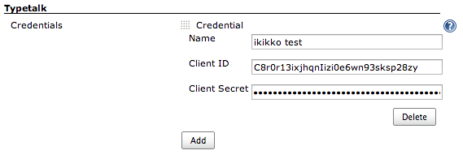
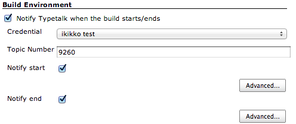
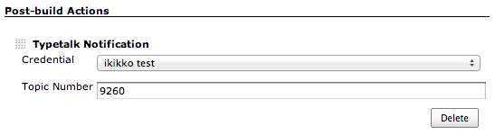

This is a Jenkins plugin which works with
https://www.typetalk.com/[Typetalk]. Typetalk is a chat tool provided by
http://nulab-inc.com/[Nulab].

'''''

[[TypetalkPlugin-Feature]]
== Feature

[[TypetalkPlugin-SendnotificationtoTypetalk]]
=== Send notification to Typetalk

You can send notification to Typetalk when the following build events
occur

* when build starts / ends
* when build fails

[.confluence-embedded-file-wrapper]##

[[TypetalkPlugin-OperateJenkinsfromTypetalk]]
=== Operate Jenkins from Typetalk

You can operate Jenkins by mentioning to a bot in Typetalk and this
enables you to do ChatOps. If you can understand Japanese, Refer to
http://nulab-inc.com/ja/blog/typetalk/chatops-without-programming[this
blog entry] for more details.

This plugin provides some features, like build/list projects.

[[TypetalkPlugin-Buildproject]]
==== Build project

[.confluence-embedded-file-wrapper]##

[[TypetalkPlugin-Listprojects]]
==== List projects

[.confluence-embedded-file-wrapper]##

[[TypetalkPlugin-Showhelpmessages]]
==== Show help messages

[.confluence-embedded-file-wrapper]##

'''''

[[TypetalkPlugin-Configuration]]
== Configuration

[[TypetalkPlugin-Globalconfiguration]]
=== Global configuration

At first, you must add credential to access Typetalk in the global
configuration page.

How to configure credentials:

. https://typetalk.in/my/develop/applications/register[Register a new
application] via the Typetalk Developer Application Page. Choose 'Client
Credentials' in 'Grant Type'. Other items are optional.
. Input the 'Client ID' and 'Client Secret' displayed on the
registration page. Input any value in 'Name'.

[.confluence-embedded-file-wrapper]##

[[TypetalkPlugin-Jobconfiguration]]
=== Job configuration

[[TypetalkPlugin-BuildEnvironment]]
==== Build Environment

In this section, you can configure notifications about starting/ending
build. +
You can also change notification message as you like.

[.confluence-embedded-file-wrapper]##

[[TypetalkPlugin-Post-buildActions]]
==== Post-build Actions

In this section, you can configure notifications about build results. +
The notifications are sent when the build doesn't succeed and recovers.

[.confluence-embedded-file-wrapper]##

[[TypetalkPlugin-Pipelinestep]]
==== Pipeline step

You can use typetalk step in your pipeline as well as a classic style
job.

When you want to notify a build result, you can use 'typetalkSend' step
with 'catchError'.

[source,syntaxhighlighter-pre]
----
node {
    catchError {
        sh 'might fail'
    }
    typetalkSend name: 'ikikko test', topicId: 9260
}
----

You can also notify an event which starts and/or ends with
'withTypetalk' step.

[source,syntaxhighlighter-pre]
----
withTypetalk(name: 'ikikko test', notifyEnd: true, notifyEndMessage: '', notifyStart: true, notifyStartMessage: '', topicId: 9260) {
    // some block
}
----

Notification URL

In order to operate Jenkins from Typetalk, you should set a certain
endpoint to Typetalk bot in a topic.

[[TypetalkPlugin-BotforallJenkinsprojects]]
==== Bot for all Jenkins projects

This plugin provides the following endpoint to receive message from
Typetalk. You have to set it to a webhook URL of Typetalk bot. See
http://developer.nulab-inc.com/docs/typetalk/webhook[the official
document] for more.

....
http://<Jenkins URL>/typetalk/notify
....

Then, you can operate Jenkins by mentioning to the bot as follows:

....
@jenkins+ build <project> (<key=value>)
@jenkins+ list (<regexp filter>)
@jenkins+ help ()
....

In this case, @jenkins+ is your bot name here.

[[TypetalkPlugin-BotforasingleJenkinsproject]]
==== Bot for a single Jenkins project

By adding project name as a parameter of webhook URL,

....
http://<Jenkins URL>/typetalk/notify?project=<project>
....

then you can omit the name when mentioning to Typetalk bot like this.

....
@jenkins-project+
@jenkins-project+ build (<key=value>)
....

'''''

[[TypetalkPlugin-History]]
== History

[[TypetalkPlugin-Version1.3.0(Dec29,2017)]]
=== Version 1.3.0 (Dec 29, 2017)

* Fix POST to /typetalk/notify with CSRF protection

[[TypetalkPlugin-Version1.2.0(Mar14,2017)]]
=== Version 1.2.0 (Mar 14, 2017)

* Support pipeline

[[TypetalkPlugin-Version1.1.0(Feb25,2015)]]
=== Version 1.1.0 (Feb 25, 2015)

* Add "operation from Typetalk" features

[[TypetalkPlugin-Version1.0.0(May12,2014)]]
=== Version 1.0.0 (May 12, 2014)

* v1 release
+
[.aui-icon .aui-icon-small .aui-iconfont-warning .confluence-information-macro-icon]#
#

'Notify When Success' in Post-build Actions section is removed. +
If you use it, please 'Notify end' in Build Environment section instead
of it.

[[TypetalkPlugin-Version0.9.1(Feb3,2014)]]
=== Version 0.9.1 (Feb 3, 2014)

* Initial release ( not finished i18n )
