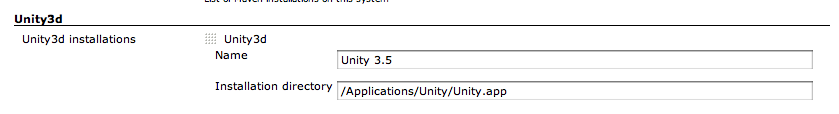
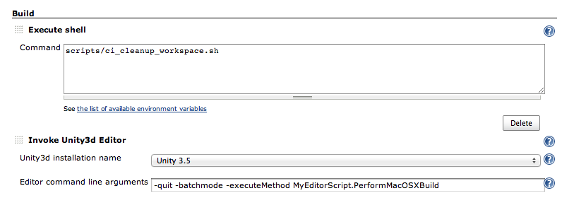

Join the community?

[.aui-icon .aui-icon-small .aui-iconfont-approve .confluence-information-macro-icon]#
#

If you want to build Unity3d with Jenkins, or are already doing so,
please drop a line on the
http://forum.unity3d.com/threads/automating-builds-with-jenkins.319169/[Unity3d
forums], and tell us more about what you do or would like to do.

A problem, An idea ?

[.aui-icon .aui-icon-small .aui-iconfont-approve .confluence-information-macro-icon]#
#

_Please use our tasks and issues tracker to report bugs, improvements or
new feature._

* https://issues.jenkins-ci.org/secure/CreateIssueDetails!init.jspa?Create=Create&components=16422&pid=10172&issuetype=1[[.confluence-embedded-file-wrapper]#image:https://issues.jenkins-ci.org/images/icons/bug.gif[image]#
Report a bug]
* https://issues.jenkins-ci.org/secure/CreateIssueDetails!init.jspa?Create=Create&components=16422&pid=10172&issuetype=2[[.confluence-embedded-file-wrapper]#image:https://issues.jenkins-ci.org/images/icons/newfeature.gif[image]#
Ask for a new feature]
* https://issues.jenkins-ci.org/secure/CreateIssueDetails!init.jspa?Create=Create&components=16422&pid=10172&issuetype=4[[.confluence-embedded-file-wrapper]#image:https://issues.jenkins-ci.org/images/icons/improvement.gif[image]#
Ask for an improvement of an existing feature]

Also if you want to propose some code change using a Github pull
request, please open also a Jira issue. It is easier for developers to
track them.

[.conf-macro .output-inline]# #

http://unity3d.com/[Unity3d] is a powerful 3d game creation editor and
engine that runs on Mac and Windows.

This plugin adds the ability to call the Unity3d Editor from the command
line to automate build and packaging of Unity3d applications.

*Table of content*

[[Unity3dBuilderPlugin-Background]]
==== Background

Automating Unity3d builds from the command line is
http://unity3d.com/support/documentation/Manual/Command%20Line%20Arguments.html[possible].
There are a few problems though:

* the unity runner writes its output to a separate log file, instead of
the output
* tool and file locations are platform specific
* the editor is very GUI centered and only provides default build
strategies

[[Unity3dBuilderPlugin-Features]]
==== Features

This plugin aims to make it easier to run Unity3d builds easily in
Jenkins, by adding the following features:

* log file redirection
* distributed builds

The plugin was tested with versions ranging from unity3d 3.4.2 to 5.0.1.
Tested on distributed and single server environments

[[Unity3dBuilderPlugin-Documentation]]
== Documentation

[[Unity3dBuilderPlugin-Installationguide]]
=== Installation guide

As Unity3d is multi-platform, you may need to install the proper third
party OS & tools (Android SDK, XCode, etc) depending on the type of
build targets you intend to exercise.

Install the latest version of the plugin from the update center and
configure a freestyle job (see
https://wiki.jenkins-ci.org/display/JENKINS/Unity3dBuilder+Plugin#Unity3dBuilderPlugin-UsageGuide[#Usage
Guide]). If necessary restrict the job to the node(s) that will perform
the build(s).

On the node(s) you are going to build Unity projects, add at least one
unity3d installation (Manage Jenkins -> Global Tool Configuration) and
configure the location of the Unity3d installation. This location is by
default `+/Applications/Unity/Unity.app+` on Mac OS X and
`+C:\Program Files (x86)\Unity+` on Windows. The plugin will
automatically suffix the installation path with the proper executable
location.

[.confluence-embedded-file-wrapper]##

[[Unity3dBuilderPlugin-Usageguide]]
=== Usage guide

[[Unity3dBuilderPlugin-Prerequisites]]
==== Prerequisites

The plugin assumes you've created a special Editor class with at least
one method responsible for your build.

Here's an example extracted from one of our projects:

*Assets/Editor/MyEditorScript.cs*

[source,syntaxhighlighter-pre]
----
class MyEditorScript {
        static string[] SCENES = FindEnabledEditorScenes();

        static string APP_NAME = "YourProject";
        static string TARGET_DIR = "target";

        [MenuItem ("Custom/CI/Build Mac OS X")]
        static void PerformMacOSXBuild ()
        {
                 string target_dir = APP_NAME + ".app";
                 GenericBuild(SCENES, TARGET_DIR + "/" + target_dir, BuildTarget.StandaloneOSXIntel,BuildOptions.None);
        }

    private static string[] FindEnabledEditorScenes() {
        List<string> EditorScenes = new List<string>();
        foreach(EditorBuildSettingsScene scene in EditorBuildSettings.scenes) {
            if (!scene.enabled) continue;
            EditorScenes.Add(scene.path);
        }
        return EditorScenes.ToArray();
    }

        static void GenericBuild(string[] scenes, string target_dir, BuildTarget build_target, BuildOptions build_options)
        {
                EditorUserBuildSettings.SwitchActiveBuildTarget(build_target);
                string res = BuildPipeline.BuildPlayer(scenes,target_dir,build_target,build_options);
                if (res.Length > 0) {
                        throw new Exception("BuildPlayer failure: " + res);
                }
        }
}
----

[[Unity3dBuilderPlugin-User/OSsetup]]
==== User/OS setup

[[Unity3dBuilderPlugin-MacOSX]]
===== Mac OS X

On Mac OS X, the user running needs to be logged in otherwise the
Unity3d editor might fail to acquire the graphical resources.

If you don't you might see something like

[source,syntaxhighlighter-pre]
----
Piping unity Editor.log from /Users/Shared/Jenkins/Library/Logs/Unity/Editor.log
[Schicksalsklinge HD Windows] $ /Applications/Unity/Unity.app/Contents/MacOS/Unity -projectPath "/Users/Shared/Jenkins/Home/workspace/ProjectXYZ/repo" -quit -batchmode -buildLinux32Player -executeMethod BuildProject.PerformLinuxTestBuild
Initialize mono
Mono path[0] = '/Applications/Unity/Unity.app/Contents/Frameworks/Managed'
Mono path[1] = '/Applications/Unity/Unity.app/Contents/Frameworks/Mono/lib/mono/2.0'
Mono config path = '/Applications/Unity/Unity.app/Contents/Frameworks/Mono/etc'
Using monoOptions --debugger-agent=transport=dt_socket,embedding=1,defer=y
_RegisterApplication(), FAILED TO establish the default connection to the WindowServer, _CGSDefaultConnection() is NULL.
2015-04-18 21:20:08.497 Unity[702:27617] NSDocumentController Info.plist warning: The values of CFBundleTypeRole entries must be 'Editor', 'Viewer', 'None', or 'Shell'.
----

[[Unity3dBuilderPlugin-Windows]]
===== Windows

FIXME describe and add a log about what happens on Windows.

[[Unity3dBuilderPlugin-Linux]]
===== Linux

On Linux, you will need an X server. If you are running Jenkins on a
headless server, use the
https://wiki.jenkins-ci.org/display/JENKINS/Xvfb+Plugin[Xvfb Plugin].
See also
http://forum.unity3d.com/threads/qxcbconnection-could-not-connect-to-display.352536/[this
thread].

[[Unity3dBuilderPlugin-Buildqueue]]
==== Build queue

The Unity Editor can only perform one build at a time on a given
projectPath. If you want to run multiple builds in parallels for the
same project, you will need to create multiple jobs, each with their
workspace.

[[Unity3dBuilderPlugin-Settingupabuildstep]]
==== Setting up a build step

Add the Unity3d build step to a free-style project, select the unity3d
installation and set your command line arguments (e.g.
`+-quit -batchmode -executeMethod MyEditorScript.PerformMacOSXBuild+`).
If you do not specify -projectPath (case-sensitive), the plugin will use
the current workspace. You may want to add an extra step to clean the
project before you build to make sure the build starts in a clean state.

[.confluence-embedded-file-wrapper]##

If you want to build for iOS, you will have to add extra build steps to
trigger xcode build. This step isn't covered here. Same for Windows
8/10.

[[Unity3dBuilderPlugin-Unity3dBuilderconfigurationparameters]]
==== Unity3d Builder configuration parameters

[cols=",,",options="header",]
|===
|Parameter |Since version |Description
|command line |0.1 |The full command line, the builder adding the
-projectPath (case-sensitive) if it isn't specified

|unstable return codes |1.0 |The optional comma separated list of
command line return codes that should result in unstable builds instead
of failures. E.g '2,3' if you use Unity3d Test Results
|===

[[Unity3dBuilderPlugin-Tips]]
=== Tips

[[Unity3dBuilderPlugin-UsingUnity3dwithlargesetofjobs]]
==== Using Unity3d with large set of jobs

* use multiple executors. Ensure that you do not run multiple concurrent
build from the same job
* use the global argLine (from 0.6) to configure default configuration
in one place
* specify the -logFile argument to be relative to each project. You
don't want all concurrent projects to use the same standard editor.log
file
* combine it with a plugin like EnvInject to differentiate between jobs
* automate the install of unity

[[Unity3dBuilderPlugin-Automaticallyinstallingunity3d(MacOSX)]]
==== Automatically installing unity3d (MacOSX)

To automatically install unity3d from jenkins (even beta versions),

{empty}1. install
https://bitbucket.org/WeWantToKnow/unity3d_scripts[this set of scripts].

. Install https://gist.github.com/lacostej/5962700[this script]
somewhere on your machines. E.g. /Users/Shared/Jenkins/Home/bin/
. Create a parametrized job that takes a String parameter +
name: UNITY3D_URL +
default value: e.g.
http://netstorage.unity3d.com/unity/unity-4.2.1.dmg +
description: The URL of the DMG package to install
. Add a shell builder to your job:
+
*shell build step*

[source,syntaxhighlighter-pre]
----
cd
echo "Installing $UNITY3D_URL"
download_install_unity3d.sh "$UNITY3D_URL"
----

[[Unity3dBuilderPlugin-Friendlyplugins]]
=== Friendly plugins

* The
https://wiki.jenkins-ci.org/display/JENKINS/EnvInject+Plugin[EnvInject
Plugin] can help you parametrize your command line for maintaining large
amount of projects in a similar manner

* The https://wiki.jenkins-ci.org/display/JENKINS/Log+Parser+Plugin[Log
Parser Plugin] can help you to quickly set some parsing rules for your
Unity3d builds. Here's a tentative set of rules that we use in one
project:
+
[source,syntaxhighlighter-pre]
----
start /^Initialize mono/
start /^- starting compile/
start /^Mono dependencies included in the build/
start /^Textures/
info /^Complete size/
warning /warning CS/
error /error CS/
start /^-----CompilerOutput:-stdout/
info /^Compilation succeeded/
error /^Compilation failed/
start /^Used Assets, sorted by uncompressed size/
info /^\*\*/
info /^Exiting batchmode successfully now/
start /^=== BUILD NATIVE TARGET/
start /^Packaging IPA/
start /^Archiving artifacts/
start /Uploading to testflight/
----

* https://wiki.jenkins-ci.org/display/JENKINS/Xvfb+Plugin[Xvfb Plugin]
for running Unity on Linux headless servers.

[[Unity3dBuilderPlugin-Knownissues]]
=== Known issues

type

key

summary

assignee

reporter

priority

status

resolution

created

updated

due

[.icon-in-pdf]# # Data cannot be retrieved due to an unexpected error.

http://issues.jenkins-ci.org/secure/IssueNavigator.jspa?reset=true&jqlQuery=component%20=%20unity3d-plugin%20AND%20project%20=%20JENKINS%20AND%20resolution%20=%20Unresolved%20ORDER%20BY%20updated%20DESC&tempMax=1000&src=confmacro[View
these issues in Jira]

[[Unity3dBuilderPlugin-Troubleshootingfailures]]
=== Troubleshooting failures

If the plugin fails to run the command you want it to run here are some
steps you can perform to help identifying the issue:

* check the editor.log and/or the job console for any errors. If you
don't see any log, check if you specify the -logFile argument.
* if you are trying to run an -executeMethod argument, expose the editor
method in the Unity3d menus ( [MenuItem (".../...")] ) and run it. Bonus
if you are able to run it on the machine it is supposed to run. If the
command doesn't run here, then the problem isn't in the plugin
* run your build command from a Jenkins "Run in a Windows batch command"
build step. If the job fails, then check the arguments (the plugins may
have fiddled with the arguments incorrectly).
* run your build command from a CMD on the machine you intend to. If
that works, and the run from jenkins doesn't, compare the environments
(user, permissions, access to graphics devices, etc)

[[Unity3dBuilderPlugin-Relatedinformation]]
=== Related information

* http://lacostej.blogspot.com/2012/02/automating-management-of-ios.html[Automated
management of iOS provisioning profiles]
* http://lacostej.blogspot.com/2012/03/unity3d-from-commit-to-deployment-onto.html[Unity3d
build pipeline using jenkins]
* http://lacostej.blogspot.com/2012/02/downloading-and-installingupgrading.html[Command
line install of Unity3d on mac]

[[Unity3dBuilderPlugin-Changelog]]
== Changelog

[[Unity3dBuilderPlugin-Version1.4(DEVINPROGRESS)]]
=== Version 1.4 (DEV IN PROGRESS)

[[Unity3dBuilderPlugin-Version1.3(11.09.2015)]]
=== Version 1.3 (11.09.2015)

* fix broken mac build support
(https://issues.jenkins-ci.org/browse/JENKINS-30396[JENKINS-30396])

[[Unity3dBuilderPlugin-Version1.2(10.09.2015)]]
=== Version 1.2 (10.09.2015)

* added Linux support
(https://issues.jenkins-ci.org/browse/JENKINS-30321[JENKINS-30321])

[[Unity3dBuilderPlugin-Version1.1(07.07.2015)]]
=== Version 1.1 (07.07.2015)

* improve documentation and feedback when using parametrized path for
jenkins installation homes
(https://issues.jenkins-ci.org/browse/JENKINS-29218[JENKINS-29218])
* improved command line parsing WRT environment and build parameters
(https://issues.jenkins-ci.org/browse/JENKINS-29226[JENKINS-29226])

[[Unity3dBuilderPlugin-Version1.0(29.05.2015)]]
=== Version 1.0 (29.05.2015)

* allow some return codes to turn the build to UNSTABLE, easing
UnityTestTools integration
(https://issues.jenkins-ci.org/browse/JENKINS-24386[JENKINS-24386])

[[Unity3dBuilderPlugin-Version0.9(26.05.2015)]]
=== Version 0.9 (26.05.2015)

* fixed the detection of the proper location of the Editor.log on
Windows
(https://issues.jenkins-ci.org/browse/JENKINS-24265[JENKINS-24265])
* improved Unity3d installation directory configuration documentation
and error checks for both distributed and non distributed setups
(https://issues.jenkins-ci.org/browse/JENKINS-20349[JENKINS-20349])

[[Unity3dBuilderPlugin-Version0.8(25.05.2015)]]
=== Version 0.8 (25.05.2015)

* fixed the "Pipe broken" issue
(https://issues.jenkins-ci.org/browse/JENKINS-23958[JENKINS-23958]) in
distributed builds

[[Unity3dBuilderPlugin-Version0.7(02.04.2015)]]
=== Version 0.7 (02.04.2015)

* Prevent hanging if the Editor.log file we are looking at isn't been
written to
(https://issues.jenkins-ci.org/browse/JENKINS-27710[JENKINS-27710]).
Consequence of us not finding the Editor.log on Windows 2008
installations.

[[Unity3dBuilderPlugin-Version0.6(24.03.2014)]]
=== Version 0.6 (24.03.2014)

* reduce risks of truncating console
* fix command line documentation issue
* properly handle editor.log piping when using the -logFile argument
* global argLine

[[Unity3dBuilderPlugin-Version0.5(27.09.2003)]]
=== Version 0.5 (27.09.2003)

* fix command line setting been overwritten at execution time

[[Unity3dBuilderPlugin-Version0.4(16.09.2013)]]
=== Version 0.4 (16.09.2013)

* support build and environment variables injection into the command
line

[[Unity3dBuilderPlugin-Version0.3(06.06.202)]]
=== Version 0.3 (06.06.202)

* Validity of Unity3D project folder was not correctly checked when
projectPath parameter was used.

[[Unity3dBuilderPlugin-Version0.2(30.01.2012)]]
=== Version 0.2 (30.01.2012)

* (https://issues.jenkins-ci.org/browse/JENKINS-12590[JENKINS-12590])

[[Unity3dBuilderPlugin-Version0.1(24.01.2012)]]
=== Version 0.1 (24.01.2012)

* live redirection of the Editor.log file into the console
* supports distributed builds
* automatically adds the -projectPath command line
