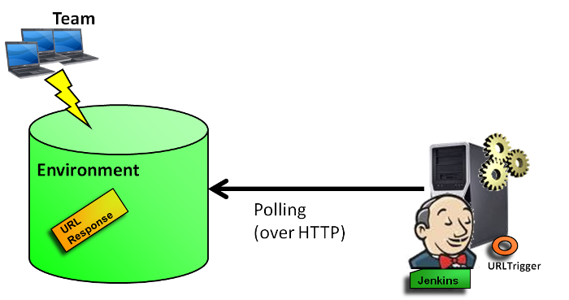
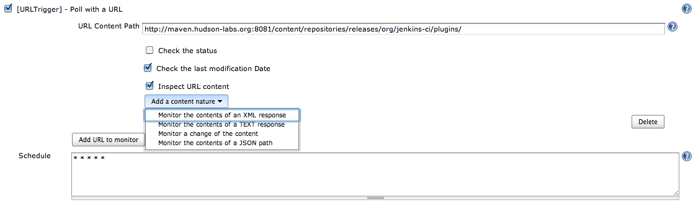

[.conf-macro .output-inline]##

[cols="",options="header",]
|===
|Plugin Information
|View URLTrigger https://plugins.jenkins.io/urltrigger[on the plugin
site] for more information.
|===

[.aui-icon .aui-icon-small .aui-iconfont-info .confluence-information-macro-icon]##

Older versions of this plugin may not be safe to use. Please review the
following warnings before using an older version:

* https://jenkins.io/security/advisory/2018-06-25/#SECURITY-819[Server-side
request forgery vulnerability]

URLTrigger plug-in makes it possible to monitor changes of the response
got from an URL invocation.

[[URLTriggerPlugin-Features]]
== Features

Jenkins can be configured to poll URL changes. +
The plug-in makes it possible to check the last modification date
response and the response content of an URL invocation. +
For the response content, you can check:

* a simple response content (the content nature is not interpreted; a
MD5 is used)
* a TXT response content (the returned values from the evaluation of
regular expressions are checked)
* an XML response content (the returned values from the evaluation of
XPath expressions are checked)
* a JSON response content (the returned values from the evaluation of
JSONPath expressions are checked)

[.confluence-embedded-file-wrapper]##

Note: The plug-in uses only persistence in memory. There is no impact on
the Jenkins infrastructure (no new files created). +
This plugin provides a polling typology among the
https://wiki.jenkins-ci.org/display/JENKINS/XTrigger+Plugin[XTrigger
Plugin].

[[URLTriggerPlugin-SomeUsecases]]
== Some Use cases

* This plugin enables users to check if new artifacts (such as binaries)
have been deployed in a repository (managed for example by a repository
manager such as Sonatype Nexus, JFrog Artifactory, Apache Archiva and so
on). +
* This plugin is useful to know if a stage of a pipeline (for a
continuous testing, a continous delivery or a continuous deployment) has
to be executed.

[[URLTriggerPlugin-KnownLimitations]]
== Known Limitations

Only http(s) and ftp URLs are supported. For non-http protocols,
consider other XTrigger plugins such as the
https://wiki.jenkins-ci.org/display/JENKINS/FSTrigger+Plugin[FSTrigger
Plugin]

[[URLTriggerPlugin-Configuration]]
== Configuration

[.confluence-embedded-file-wrapper .image-center-wrapper]##

 +

[[URLTriggerPlugin-DeclarativePipelineSyntax]]
== Declarative Pipeline Syntax

[source,syntaxhighlighter-pre]
----
pipeline {
    
    agent any
    
    triggers {
    
        URLTrigger( 
            cronTabSpec: '* * * * *',
            entries: [
                URLTriggerEntry( 
                    url: 'http://www.mysite.com/jsoncontent',
                    username: 'myuser',
                    password: 'mypassword',
                    checkETag: false,
                    checkStatus: true,
                    statusCode: 403,
                    checkLastModificationDate: true,
                    timeout: 200,
                    requestHeaders: [
                        RequestHeader( headerName: "Accept" , headerValue: "application/json" )
                    ],
                    contentTypes: [
                        JsonContent(
                            [
                                JsonContentEntry( jsonPath: 'level1.level2.level3' )
                            ])
                    ]
                ),
                URLTriggerEntry( 
                    url: 'http://www.mysite.com/xmlcontent',
                    requestHeaders: [
                        RequestHeader( headerName: "Accept" , headerValue: "application/xml" )
                    ],
                    contentTypes: [
                        XMLContent(
                            [
                                XMLContentEntry( xPath: 'level1/level2/level3' )
                            ])
                    ]
                ),
                URLTriggerEntry( 
                    url: 'http://www.mysite.com/textcontent',
                    contentTypes: [
                        TextContent(
                            [
                                TextContentEntry( regEx: "Hello.*" ),
                                TextContentEntry( regEx: "Goodbye.*" )
                            ])
                    ]
                ),
                URLTriggerEntry( 
                    url: 'http://www.mysite.com/generalcontent',
                    contentTypes: [
                        MD5Sum()
                    ]
                )
            ]
        )
    }
    stages {
        stage( "Default stage" ) {
            steps {
                echo "This is a stage"
            }
        }
    }
}
----

 +

[[URLTriggerPlugin-Comparisonwithsimilarplugins]]
== Comparison with similar plugins

This plugin supports all
https://wiki.jenkins-ci.org/display/JENKINS/URL+Change+Trigger[URL
Change Trigger] features and it includes all the fixes of the current
https://wiki.jenkins-ci.org/display/JENKINS/URL+Change+Trigger[URL
Change Trigger] issues. +
And unlike the
https://wiki.jenkins-ci.org/display/JENKINS/URL+Change+Trigger[URL
Change Trigger], URLTrigger plug-in is also able to check the content
nature (TEXT, XML, JSON) of a file. +
Additionally the plugin can be extended (in the same plugin or by an
other plugin) to check other content type.

[[URLTriggerPlugin-Changelog]]
== Changelog

[[URLTriggerPlugin-Release0.47]]
=== Release 0.47

Bugfix for the 'inspect content' checkbox being incorrectly set
automatically.

[[URLTriggerPlugin-Release0.46]]
=== Release 0.46

Pipeline compatibility.  As well as now supporting pipeline jobs,
declarative syntax for triggers is supported.

[[URLTriggerPlugin-Release0.45]]
=== Release 0.45

Bugfix: Triggers configured to check ETag values no longer build
immediately on Jenkins startup

[[URLTriggerPlugin-Release0.44]]
=== Release 0.44

Bugfix: Request Header functionality was causing null pointer exceptions
when old config was used (JENKINS-51892)

[[URLTriggerPlugin-Release0.42]]
=== Release 0.42

Tidied URL verification and removed unnecessary url GET.

[[URLTriggerPlugin-Release0.41]]
=== Release 0.41

* allow to use jsonarray as root of input message

[[URLTriggerPlugin-Release0.40]]
=== Release 0.40

* Fix https://issues.jenkins-ci.org/browse/JENKINS-28834[JENKINS-28834]
- Declare dependency on matrix project plugin

[[URLTriggerPlugin-Release0.39]]
=== Release 0.39

* Fix https://issues.jenkins-ci.org/browse/JENKINS-29610[JENKINS-29610]
- Scheduling skipped when there is no label restriction (trigger-lib
0.33) +
* Fix https://issues.jenkins-ci.org/browse/JENKINS-20712[JENKINS-20712]
- ETag/MTime saved in config.xml but there is no flag in job web page

[[URLTriggerPlugin-Release0.38]]
=== Release 0.38

* Assign meaningful name to executor thread +
* Be more explicit about failed content check preconditions

[[URLTriggerPlugin-Release0.37]]
=== Release 0.37

* Fix https://issues.jenkins-ci.org/browse/JENKINS-20359[JENKINS-20359]
- Monitoring URL for JSON content change not working

[[URLTriggerPlugin-Release0.36]]
=== Release 0.36

* Making the build compatible with Java 7

[[URLTriggerPlugin-Release0.35]]
=== Release 0.35

* Fix https://issues.jenkins-ci.org/browse/JENKINS-17961[JENKINS-17961]
- URLTrigger does not poll when URL starts with environment variable

[[URLTriggerPlugin-Release0.34]]
=== Release 0.34

* Fix https://issues.jenkins-ci.org/browse/JENKINS-18035[JENKINS-18035]
- Request to support HTTPS url monitoring in URLTrigger plugin

[[URLTriggerPlugin-Release0.33]]
=== Release 0.33

* Fix regression on polling log from previous version

[[URLTriggerPlugin-Release0.32]]
=== Release 0.32

* Fix https://issues.jenkins-ci.org/browse/JENKINS-18683[JENKINS-18683]
- Jenkins 1.522 config changes cannot be saved +
* Fix https://issues.jenkins-ci.org/browse/JENKINS-18764[JENKINS-18764]
- NPE in URLTrigger when saving project configuration

[[URLTriggerPlugin-Release0.31]]
=== Release 0.31

* Fix https://issues.jenkins-ci.org/browse/JENKINS-17641[JENKINS-17641]
- Unknown field 'logEnabled' in org.jenkinsci.lib.xtrigger.XTriggerCause

[[URLTriggerPlugin-Release0.30]]
=== Release 0.30

* Fix https://issues.jenkins-ci.org/browse/JENKINS-17468[JENKINS-17468]
- NullPointerException in URLTrigger.getFTPResponse during startup

[[URLTriggerPlugin-Release0.29]]
=== Release 0.29

* Add FTP Support

[[URLTriggerPlugin-Release0.28]]
=== Release 0.28

* Fix https://issues.jenkins-ci.org/browse/JENKINS-16774[JENKINS-16774]
- URLTrigger gives severe error message instead of detecting change

[[URLTriggerPlugin-Release0.27]]
=== Release 0.27

* warn user that only http is supported for URL protocol (added by
ndeloof)

[[URLTriggerPlugin-Release0.26]]
=== Release 0.26

* Fix https://issues.jenkins-ci.org/browse/JENKINS-14620[JENKINS-14620]
- Invalid configurations

[[URLTriggerPlugin-Release0.25]]
=== Release 0.25

* Fix https://issues.jenkins-ci.org/browse/JENKINS-15564[JENKINS-15564]
- URLTrigger: Allow timeouts to be configurable

[[URLTriggerPlugin-Release0.24]]
=== Release 0.24

* Fix https://issues.jenkins-ci.org/browse/JENKINS-14607[JENKINS-14607]
- URLTrigger "Polling error null"

[[URLTriggerPlugin-Release0.23]]
=== Release 0.23

* Add the capability to check ETag response header

[[URLTriggerPlugin-Release0.22]]
=== Release 0.22

* Add JENKINS_URL resolution at startup check +
* Update to xtrigger-lib 0.17 +
* Update to envinject-lib 1.10

[[URLTriggerPlugin-Release0.21]]
=== Release 0.21

* Add environment variables resolution at the trigger startup
lifecycle +
* Update to xtrigger-lib 0.16 +
* Update to envinject-lib 1.9

[[URLTriggerPlugin-Release0.20]]
=== Release 0.20

* Upgrade to xtrigger-lib 0.14 (more log)

[[URLTriggerPlugin-Release0.19]]
=== Release 0.19

* Restrict to successful family for URL content +
* Exclude polling on unavailable services

[[URLTriggerPlugin-Release0.18]]
=== Release 0.18

* Fix job restart when JENKINS URLs to check are unavailable at Jenkins
startup

[[URLTriggerPlugin-Release0.17]]
=== Release 0.17

* Update to xtrigger-lib 0.12 (fix link to polling log to appear on
build console)

[[URLTriggerPlugin-Release0.16]]
=== Release 0.16

* Fix TXT content type detection

[[URLTriggerPlugin-Release0.15]]
=== Release 0.15

* Fix https://issues.jenkins-ci.org/browse/JENKINS-12912[JENKINS-12912]
- URLTtrigger does not poll on jobs which are tied to disconnected
slaves

[[URLTriggerPlugin-Release0.14]]
=== Release 0.14

* Update to xtrigger-lib 0.8

[[URLTriggerPlugin-Release0.13]]
=== Release 0.13

* Fix the hang problem
(https://issues.jenkins-ci.org/browse/JENKINS-12696[JENKINS-12696])

[[URLTriggerPlugin-Release0.11]]
=== Release 0.11

* Update to xtrigger-lib 0.7

[[URLTriggerPlugin-Release0.10]]
=== Release 0.10

* Update to xtrigger-lib 0.2 +
* Fix https://issues.jenkins-ci.org/browse/JENKINS-12213[JENKINS-12213]
- Polling error org/jenkinsci/plugins/envinject/EnvInjectAction" when
monitoring build number url

[[URLTriggerPlugin-Release0.9]]
=== Release 0.9

* Fix https://issues.jenkins-ci.org/browse/JENKINS-11859[JENKINS-11859]
- java.io.IOException: Stream closed" when monitoring a jenkins job
build number

[[URLTriggerPlugin-Release0.8]]
=== Release 0.8

* Environment variables are taken into account

[[URLTriggerPlugin-Release0.7]]
=== Release 0.7

* Add proxy configuration if needed

[[URLTriggerPlugin-Release0.6]]
=== Release 0.6

* Fix https://issues.jenkins-ci.org/browse/JENKINS-11273[JENKINS-11273]
- Basic Authentication support in urltrigger

[[URLTriggerPlugin-Release0.5.1]]
=== Release 0.5.1

* Fix TXT Content type saving

[[URLTriggerPlugin-Release0.5]]
=== Release 0.5

* Change 'Add Button' label +
* Fix https://issues.jenkins-ci.org/browse/JENKINS-10731[JENKINS-10731]
- XMLContentType didn't update initial results HashMap +
* Fix https://issues.jenkins-ci.org/browse/JENKINS-10728[JENKINS-10728]
- URLTrigger, config.jelly and checkLastModificationDate should be
optionalBlock

[[URLTriggerPlugin-Release0.4.3]]
=== Release 0.4.3

* Add message when there are no URLs to poll

[[URLTriggerPlugin-Release0.4.2]]
=== Release 0.4.2

* Fix NullPointerException when there is no URL entry

[[URLTriggerPlugin-Release0.4.1]]
=== Release 0.4.1

* Fix a NullPointerException at Jenkins startup +
* Add a delete button on the configuration page to remove an entry
section

[[URLTriggerPlugin-Release0.4]]
=== Release 0.4

* Add Text Content check

[[URLTriggerPlugin-Release0.3]]
=== Release 0.3

* Add JSON content check +
* Technical features: additional unit tests

[[URLTriggerPlugin-Release0.2]]
=== Release 0.2

* Add poll changes of URL contents

[[URLTriggerPlugin-Release0.1]]
=== Release 0.1

* Initial release

 +

 +
