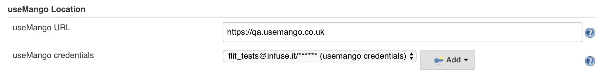
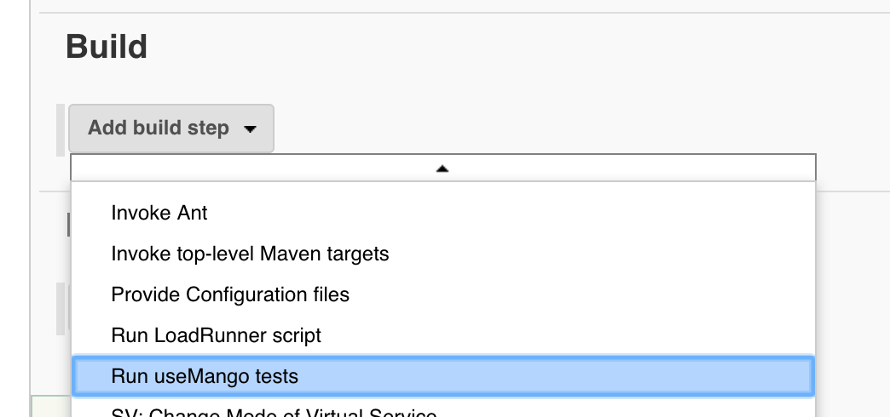
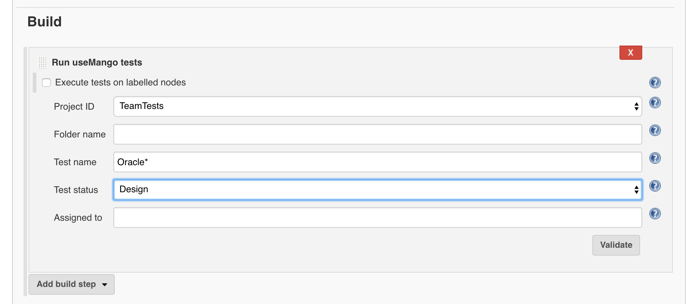
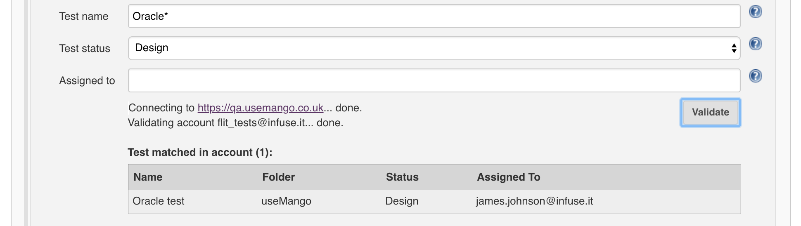
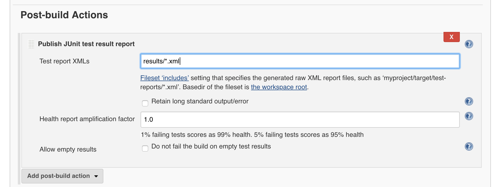

Jenkins plugin for running useMango tests. +
 +
Description

Allows users to execute useMango tests on Jenkins. +
 +
Features +

* Execute useMango tests on Jenkins
* Filter tests using account settings
* Run tests in parallel across multiple nodes
* Generate JUnit reports

[[useMangoRunnerPlugin-Usage]]
== Usage

[[useMangoRunnerPlugin-GlobalConfiguration]]
=== Global Configuration

 Add your useMango account credentials to the global configuration:

 +

[.confluence-embedded-file-wrapper .confluence-embedded-manual-size]##

[[useMangoRunnerPlugin-RunningTests]]
=== Running Tests

 After setting your useMango account credentials, you can start running
tests.  To do this, create a Freestyle project and configure. +
 +

* Add the build step __Run useMango tests:__

[.confluence-embedded-file-wrapper .confluence-embedded-manual-size]####`++`

* Set your _Project ID_ (i.e. the name of your project in your useMango
account) along with any other filtering:

[.confluence-embedded-file-wrapper .confluence-embedded-manual-size]## +
 +

* Click _Validate_ to validate your settings (Note: only the tests shown
will be executed during the build):

[.confluence-embedded-file-wrapper .confluence-embedded-manual-size]## +
 +

* Optional: Add the post-build action __Publish JUnit test result
report__ and enter __results/*.xml__ as the value for _Test report
XMLs: +
_

_[.confluence-embedded-file-wrapper .confluence-embedded-manual-size]##_

[[useMangoRunnerPlugin-Dependencies]]
== Dependencies

In order to use the useMango Runner plugin, you will need the following:

* https://wiki.jenkins-ci.org/display/JENKINS/Credentials+Plugin[Credentials]
* https://wiki.jenkins.io/display/JENKINS/Test+Results+Analyzer+Plugin[Test
Results Analyzer]
* Windows node(s) with useMango installed: To run useMango tests you
must have Windows slave nodes configured in your Jenkins setup, with
useMango installed on each node. To run useMango tests on your Windows
node(s), give each node the same label then
check `+Execute tests on labelled nodes+` and enter the label as the
value for `+Label Expression+`.

 +
