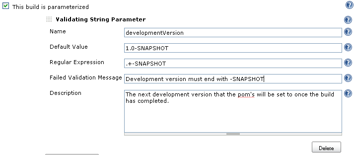
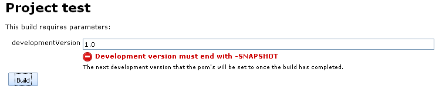
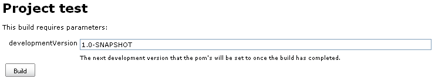

The validating string parameter plugin contributes a new parameter type
to Jenkins that supports regular expression validation of the user's
entered parameter.

[[ValidatingStringParameterPlugin-Usage]]
== Usage

This plugin is used wherever build parameter selection is available,
most commonly in the job configuration page by enabling parameterized
builds (this parameter type will also be available as release parameters
using the
https://wiki.jenkins-ci.org/display/JENKINS/Release+Plugin[release
plugin]).

Configure the parameter by entering a name, regular expression to
validate the entered value and optionally a default value, an error
message shown when the user entered value fails the regular expression
check and a parameter description. +
[.confluence-embedded-file-wrapper]## +
  +
When a build is requested, the user will be prompted with the parameters
to enter.  Users enter the parameter as normal, but will now be prompted
with an error message if the entered value does not meet the regular
expression. +
[.confluence-embedded-file-wrapper]## +
Once the entered value meets the configured regular expression, the
error message is no longer displayed. +
[.confluence-embedded-file-wrapper]##

[[ValidatingStringParameterPlugin-VersionHistory]]
== Version History

[[ValidatingStringParameterPlugin-Version2.4(TBD)]]
=== Version 2.4 (TBD)

[[ValidatingStringParameterPlugin-Version2.3(04-Feb-2015)]]
=== Version 2.3 (04-Feb-2015)

* Fixed links to regex pattern documentation
* Use codemirror for the description field

[[ValidatingStringParameterPlugin-Version2.2(13-Sep-2011)]]
=== Version 2.2 (13-Sep-2011)

* http://issues.jenkins-ci.org/browse/JENKINS-10139[JENKINS-10139] Fix
for regex containing back slashes

[[ValidatingStringParameterPlugin-Version2.1(27-Feb-2011)]]
=== Version 2.1 (27-Feb-2011) +

* If an invalid value is passed to the build, the build will be aborted
and an error message will display in console indicating the parameter
and failing value

[[ValidatingStringParameterPlugin-Version2.0(19-Feb-2011)]]
=== Version 2.0 (19-Feb-2011)

* Migrated code to jenkins and performed release

[[ValidatingStringParameterPlugin-Version1.4(13-Oct-2010)]]
=== Version 1.4 (13-Oct-2010)

* http://issues.jenkins-ci.org/browse/JENKINS-6158[JENKINS-7794]
validation check doesn't work if Jenkins is hosted with a context root

[[ValidatingStringParameterPlugin-Version1.3(22-May-2010)]]
=== Version 1.3 (22-May-2010)

* http://issues.jenkins-ci.org/browse/JENKINS-6158[JENKINS-6158] Build
will fail if invalid parameter is passed
* http://issues.jenkins-ci.org/browse/JENKINS-6160[JENKINS-6160] Jenkins
will record regex used to validate the build parameter as part of build
configuration and display as tooltip on the parameter page.

[[ValidatingStringParameterPlugin-Version1.2(29-Aug-2009)]]
=== Version 1.2 (29-Aug-2009)

* Used the javascript function encodeURIComponent to properly handle
characters within the user entered values for regex and validation error
message. (Issue
http://wiki.jenkins-ci.org/pages/editpage.action?pageId=38928603[4334]) 

[[ValidatingStringParameterPlugin-Version1.1(28-Aug-2009)]]
=== Version 1.1 (28-Aug-2009)

* Supported the release plugins as well as any other plugin that uses
build parameters

[[ValidatingStringParameterPlugin-Version1.0(24-Aug-2009)]]
=== Version 1.0 (24-Aug-2009)

* Initial Version

[[ValidatingStringParameterPlugin-]]
===  
