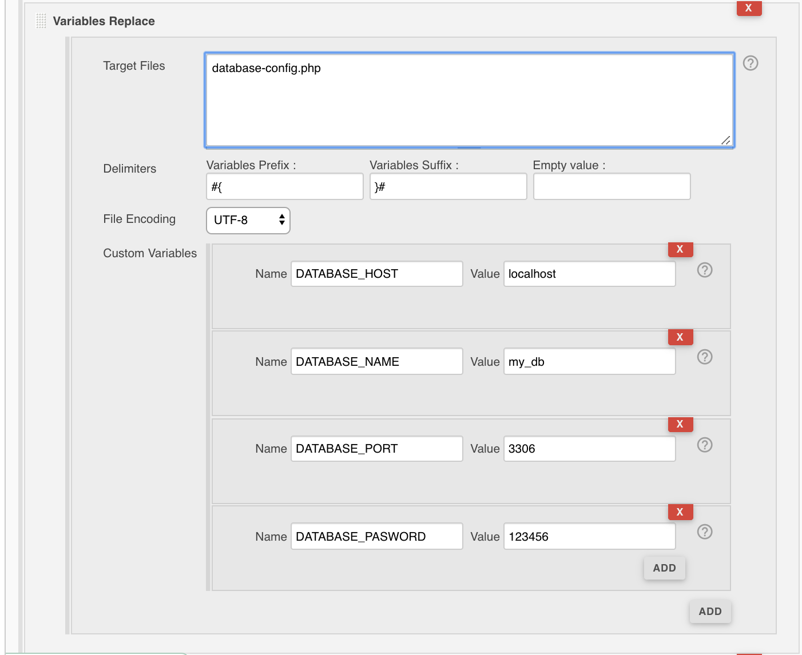

[.conf-macro .output-inline]#This Jenkins plugin allow to replace easily
variables in files content.# +

[[VARIABLESREPLACE-Features]]
== Features

* Search and replace variables using

        - FilePath,

        - Variables prefix,

        - Variables suffix

        - Variables list ( Name / Value )

[[VARIABLESREPLACE-Requirements]]
== Requirements

[[VARIABLESREPLACE-Jenkins]]
=== Jenkins

Jenkins https://jenkins.io/changelog#v2.7.3[version 2.7.3] or newer is
required.

 +

[[VARIABLESREPLACE-Freestylejobconfiguration]]
==== Freestyle job configuration

 +

[.confluence-embedded-file-wrapper]##

[[VARIABLESREPLACE-Pipelinejobconfiguration]]
==== Pipeline job configuration

[source,syntaxhighlighter-pre]
----
variableReplace(
    configs: [
        variablesReplaceConfig(
            configs: [
                variablesReplaceItemConfig( 
                    name: 'DATABASE_HOST',
                    value: 'localhost'
                ),
                variablesReplaceItemConfig( 
                    name: 'DATABASE_NAME',
                    value: 'my_db'
                ),
                variablesReplaceItemConfig( 
                    name: 'DATABASE_PORT',
                    value: '3306'
                ),
                variablesReplaceItemConfig( 
                    name: 'DATABASE_PASSWORD',
                    value: '123456'
                )
            ],
            fileEncoding: 'UTF-8', 
            filePath: 'database-config.php', 
            variablesPrefix: '#{', 
            variablesSuffix: '}#'
            )]
)
----
