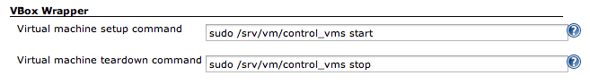
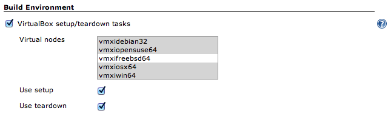

Plugin provides a build wrapper for starting and stopping slaves on the
virtual machine

Start/stop is performed by launching shell scripts (init.d, VBoxManage
for example). +
Each start/stop command takes a list of nodes with virtual machines as
an argument. +
After launching a script plugin waits for all nodes to enter an
online/offline state +
by periodical reconnecting to them. It's required because master doesn't
know that slave +
waked up.

[[VBoxWrapper-Configuration]]
== Configuration

[[VBoxWrapper-SystemConfiguration]]
=== System Configuration

Define a wrapper command that should be used to start/stop VirtualBox.
Usually it is a sort of init.d script.

[.confluence-embedded-file-wrapper]##

[[VBoxWrapper-JobConfiguration]]
=== Job Configuration

Enable a build wrapper (pre- and/or post-build command). Choose needed
virtual machines.

[.confluence-embedded-file-wrapper]##

[[VBoxWrapper-Changelog]]
==== Changelog

[[VBoxWrapper-Version1.3(02/07/2013)]]
===== Version 1.3 (02/07/2013)

* image:docs/images/warning.svg[(warning)]
Allowed plugin to launch commands on Windows (*needs to be tested*)

[[VBoxWrapper-Version1.2(01/21/2013)]]
===== Version 1.2 (01/21/2013)

* image:docs/images/error.svg[(error)]
Fixes height of the node list

[[VBoxWrapper-Version1.1(01/20/2013)]]
===== Version 1.1 (01/20/2013)

* image:docs/images/warning.svg[(warning)]
Changed package name so previous plugin usage should be fixed in a
config file or fixed in a job. Sorry for inconvenience.
* image:docs/images/information.svg[(info)]
Added build parameter _VBox node parameter_ - list of virtual nodes
joined with the delimiter. Can be used with scripts.

[[VBoxWrapper-Version1.0(10/22/2012)]]
===== Version 1.0 (10/22/2012)

* image:docs/images/information.svg[(info)]
Initial release.
