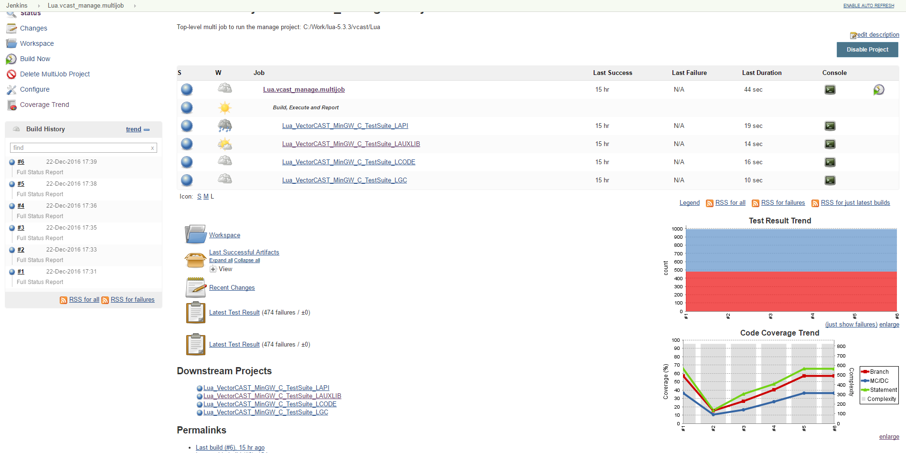
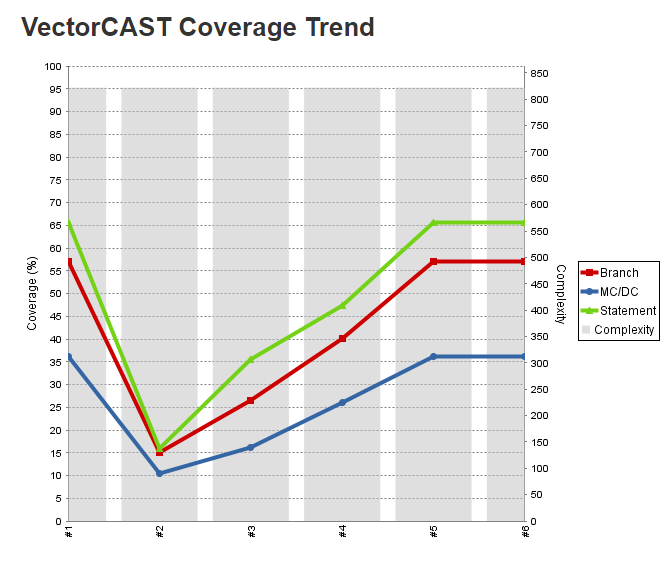
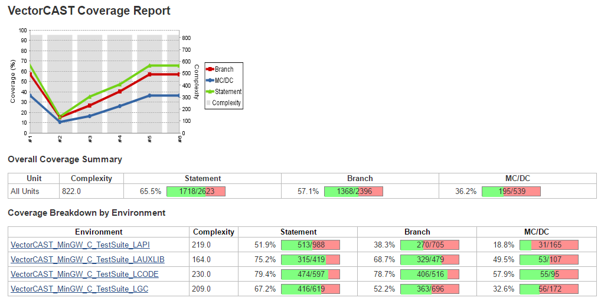
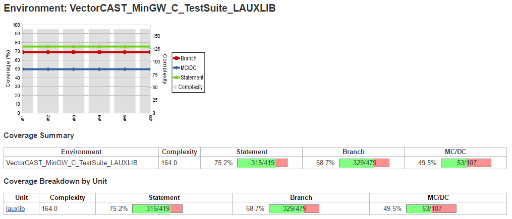
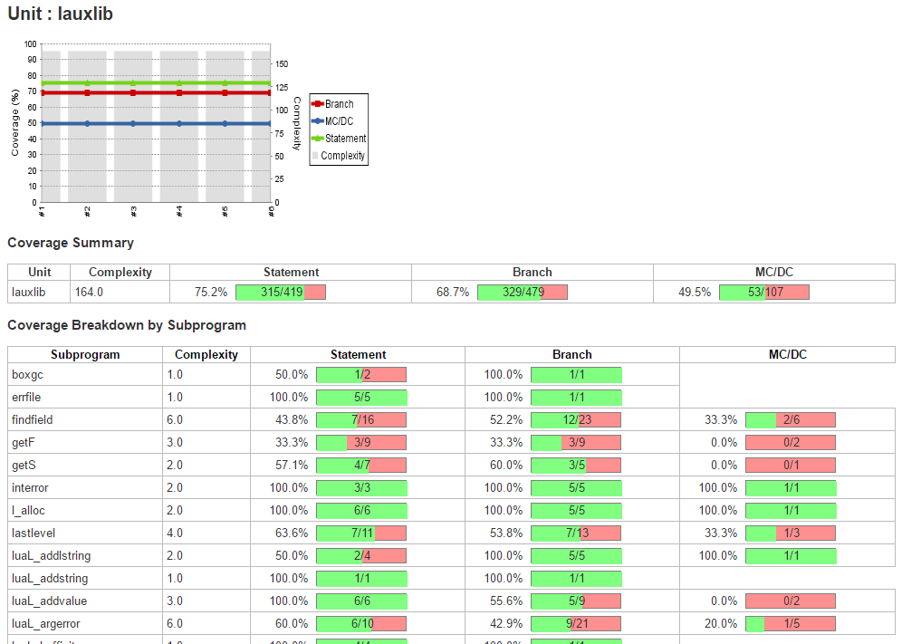

[.conf-macro .output-inline]#Display coverage from
http://www.vectorcast.com/[VectorCAST]/Manage projects.#

[[VectorCASTCoveragePlugin-Summary]]
== Summary

This plugin allows you to capture code coverage reports from Manage
projects in http://www.vectorcast.com/[VectorCAST]. Jenkins will
generate the trend report of coverage. This plugin is used automatically
with the
https://wiki.jenkins-ci.org/display/JENKINS/VectorCAST+Execution+Plugin[VectorCAST
Execution Plugin].

[[VectorCASTCoveragePlugin-Usage]]
== Usage

This plugin displays coverage and coverage trend data from running
VectorCAST/Manage projects with the
https://wiki.jenkins-ci.org/display/JENKINS/VectorCAST+Execution+Plugin[VectorCAST
Execution Plugin]. It is added as a dependency to the execution plugin
and is automatically used to display coverage data.

The top page of a job will contain coverage trend graph

[.confluence-embedded-file-wrapper]##

Both the small coverage trend graph and 'Coverage Trend' menu on the
left can be clicked on. Clicking on the 'Coverage Trend' menu will show
a full page coverage trend graph.

[.confluence-embedded-file-wrapper]##

Clicking on either the small or large coverage trend graph will show
more information and so on as you click on additional links

[.confluence-embedded-file-wrapper]##

[.confluence-embedded-file-wrapper]##

[.confluence-embedded-file-wrapper]##

[[VectorCASTCoveragePlugin-Changelog]]
== Changelog

[[VectorCASTCoveragePlugin-Version0.14(12Aug2019]]
=== Version 0.14 (12 Aug 2019

* Additional debug logging

[[VectorCASTCoveragePlugin-Version0.13(10May2019)]]
=== Version 0.13 (10 May 2019)

* Add SimpleBuildStep usage to support freestyle jobs.

[[VectorCASTCoveragePlugin-Version0.12(26Apr2019)]]
=== Version 0.12 (26 Apr 2019)

* Update for additional chart fixes

[[VectorCASTCoveragePlugin-Version0.11(25Apr2019)]]
=== Version 0.11 (25 Apr 2019)

* Trend Chart not updating correctly with all coverage metrics at 0

[[VectorCASTCoveragePlugin-Version0.10(7Dec2016)]]
=== Version 0.10 (7 Dec 2016)

* Support for displaying top-level coverage calculated by VectorCAST
Execution Plugin scripts

[[VectorCASTCoveragePlugin-Version0.9(18Nov2016)]]
=== Version 0.9 (18 Nov 2016)

* Initial release
