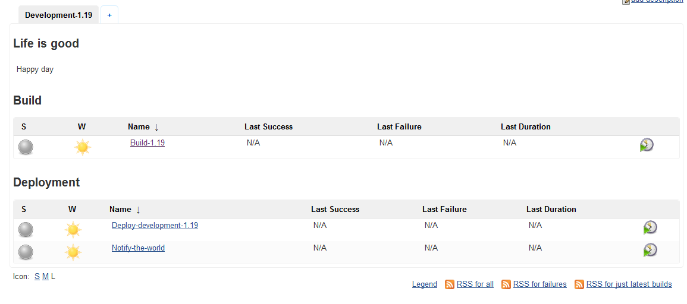
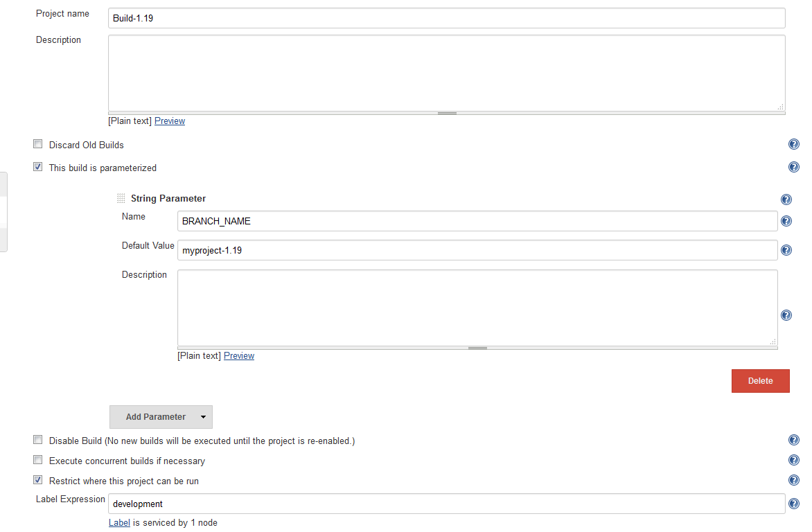
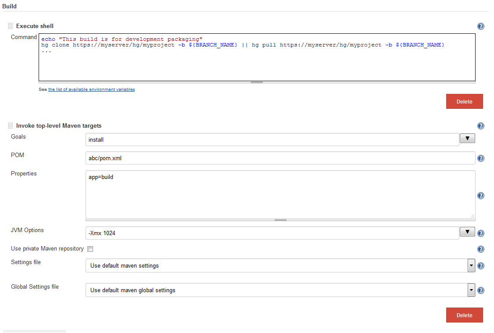
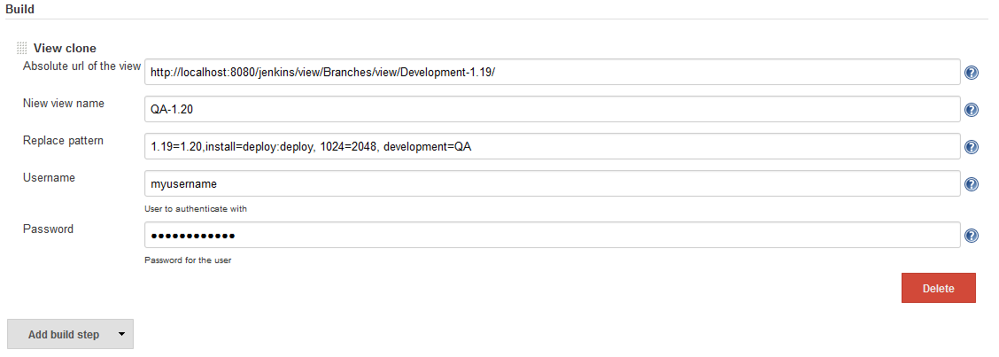
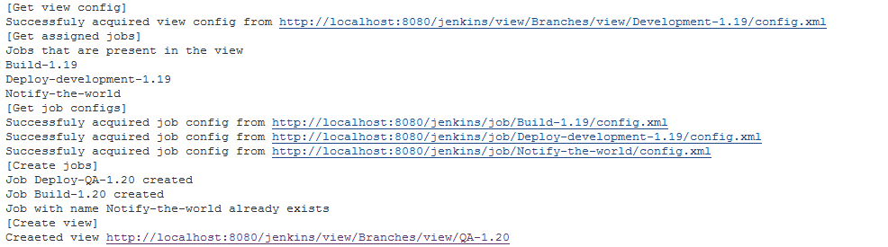
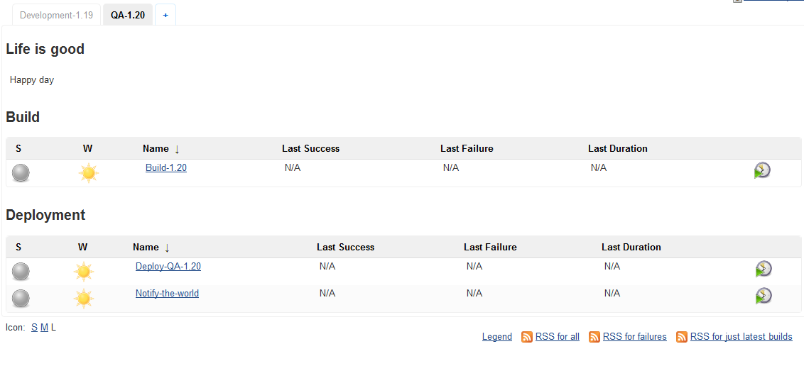
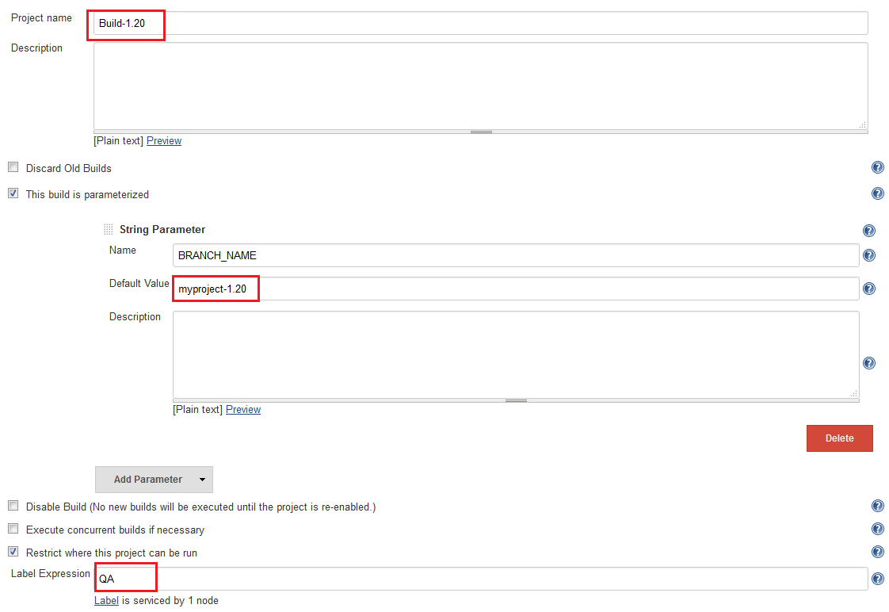
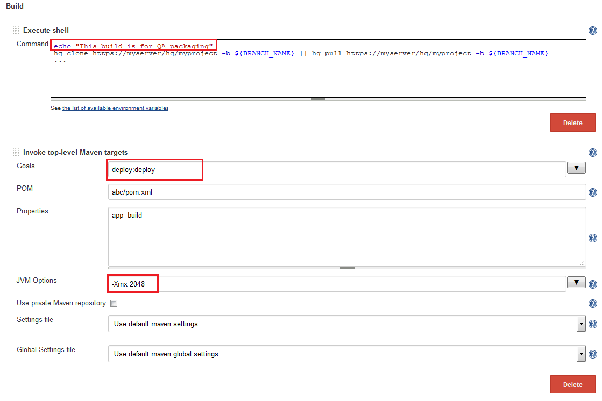

Jenkins plugin that adds a build step for cloning a view and jobs that
are visible in it.

[[ViewClonerPlugin-Summary]]
== Summary

View-cloner is a build step plugin that allows to copy a view and jobs
visible in it. In the process of copying job names and configurations
can be changed with supplied replacement pattern.

[[ViewClonerPlugin-Usage]]
== Usage

. Create a Freestyle Project and add "View clone" step.
. Fill all 5 fields
.. Absolute url of the view (Absolute url to the view you want to clone)
.. Niew view name (Name of the view that will be created)
.. Replace pattern (Comma separated list of oldValue=newValue Example:
1.1-SNAPSHOT=1.2-SNAPSHOT, slave1=slave2, master=release_19)
.. Username to authenticate with (user needs to have rights to job/view
configs and job/view creation).
.. Password for the user
.  Save and Build.

If you have role based security it is advised to create the "view clone
job" where simple users cant configure it.

NOTE: Views populated using regex are not supported (jobs will not be
cloned)

[[ViewClonerPlugin-Examples]]
== Examples

[[expander-1741872065]]
[[expander-control-1741872065]]
[.expand-icon .aui-icon .aui-icon-small .aui-iconfont-chevron-right]## ##[.expand-control-text]##Image
heavy##

[[expander-content-1741872065]]
Example was done using Nested and Sectioned view plugins.

[[ViewClonerPlugin-Originalview]]
=======  Original view

[.confluence-embedded-file-wrapper]##

[[ViewClonerPlugin-Oneofthejobsconfiguration]]
======= One of the jobs configuration

[.confluence-embedded-file-wrapper]##

[.confluence-embedded-file-wrapper]##

[[ViewClonerPlugin-Viewclonestep]]
======= View clone step

[.confluence-embedded-file-wrapper]##

[[ViewClonerPlugin-Execution]]
======= Execution

[.confluence-embedded-file-wrapper]##

[[ViewClonerPlugin-Niewview]]
======= Niew view

[.confluence-embedded-file-wrapper]##

[[ViewClonerPlugin-Oneofthejobsnewconfiguration]]
======= One of the jobs new configuration

[.confluence-embedded-file-wrapper]## +
[.confluence-embedded-file-wrapper]##

[[ViewClonerPlugin-Changelog]]
== Changelog

*1.1* initial release

[[ViewClonerPlugin-TODO]]
== TO DO

* Add ability to clone from remote Jenkins instances.
* Add support for views populated with regex.
* Allow variables in step configuration
