Create smart views with exactly the jobs you want. Your smart views can
automatically include or exclude jobs by using things like the SCM path
or type, the job type, build statuses or trends or triggers, relevance
to the logged-in user, email recipients, Maven configuration, job
parameterization, and user permissions. Mix and match filters to narrow
down to exactly what you want.

[[ViewJobFilters-Whatisthe"ViewJobFilters"plugin?]]
== What is the "View Job Filters" plugin?

This plugin provides a number of filters that you can
https://wiki.jenkins-ci.org/display/JENKINS/Using+the+View+Job+Filters+Match+Type["chain"
together] to provide a much easier way to create views to organize
hundreds of jobs.  For each filter type, you can add multiple filters,
and combine them with filters of other types.  For example, you can
create a view of all your nightly jobs except those not under any SCM. 
In a nutshell, this plugin provides the following:

* Create view to manage hundreds of jobs by
https://wiki.jenkins-ci.org/display/JENKINS/Using+the+View+Job+Filters+Match+Type[mixing-and-matching
filters] to include exactly the jobs you want
* Use
https://wiki.jenkins-ci.org/display/JENKINS/View+Job+Filters#ViewJobFilters-RegularExpressionJobFilter[regular
expressions] to match against your choice of
** Job name or description
** Job's SCM Configuration path
** Email recipients for build
** Maven configuration for the job
** Chron Trigger
* https://wiki.jenkins-ci.org/display/JENKINS/View+Job+Filters#ViewJobFilters-FilterbyJobParameterization[Filter
Parameterized Jobs by their configured parameters]
* https://wiki.jenkins-ci.org/display/JENKINS/View+Job+Filters#ViewJobFilters-FilterbyRelevancetoLogged-inUser[Create
views relevant to the logged in user]
* Also filter by
** https://wiki.jenkins-ci.org/display/JENKINS/View+Job+Filters#ViewJobFilters-FilterbySCMType[SCM
Type]
** Job Type
** Job or
https://wiki.jenkins-ci.org/display/JENKINS/View+Job+Filters#ViewJobFilters-FilterbyBuildStatuses[Build
Status], or
https://wiki.jenkins-ci.org/display/JENKINS/View+Job+Filters#ViewJobFilters-FilterbyBuildTrend[Status
trends] and triggers over a duration
** https://wiki.jenkins-ci.org/display/JENKINS/View+Job+Filters#ViewJobFilters-FilterbytheJobsinOtherViews[Jobs
in another View]
** https://wiki.jenkins-ci.org/display/JENKINS/View+Job+Filters#ViewJobFilters-UserPermissionsforJobs[User
permissions for Jobs]
* Upstream/Downstream jobs
* Filter out all but the
https://wiki.jenkins-ci.org/display/JENKINS/View+Job+Filters#ViewJobFilters-FiltertoMostRecentJobs[most
recent jobs]
* Use the
https://wiki.jenkins-ci.org/display/JENKINS/Build+Filter+%28Wrapper%29+Column[Build
Filter (Wrapper) Column] to render your favorite columns with the
relevant builds.

Also, see
http://blog.cloudbees.com/2012/01/controlling-what-you-see-with-view-job.html[this
Cloud Bees write-up] of the View Job Filters plugin.

[[ViewJobFilters-HowdoIgetstarted?]]
== How do I get started?

* https://wiki.jenkins-ci.org/display/JENKINS/Plugins[Install the
plugin]
* If needed, create a new view (besides the All view) by clicking the
"+" tab
** You might optionally want to see
https://wiki.jenkins-ci.org/display/JENKINS/Editing+or+Replacing+the+All+View[Editing
or Replacing the All View] - the default "All" view is not editable
* If editing an existing view, click the "Edit View" link (won't be
available for the "All" view)
* You will see the following button in the "Job Filters" section. Click
it to select and add the filter type(s) you want. +
[.confluence-embedded-file-wrapper]##

[[ViewJobFilters-RegularExpressionJobFilter]]
== Regular Expression Job Filter

With a large organization and hundreds of jobs, it will become very
annoying and time-consuming to try to keep your views organized.  The
regular expression job filter can help, and there are multiple options
to choose from to make it easier.

* *Include/Exclude options* - ability to either add jobs or filter out
jobs based on the expression, or the negation of the expression
* *Job name* - allows you to filter out jobs when you have naming
conventions.  Also allows you to "narrow down" other filters, or to
match the negation of an expression
* *Job description* - if you use descriptions, this may help you get
what you want
* *SCM Configuration* - this one is perhaps the best bang for the buck -
put in something like ".*/my-office-name/.*" to automatically include
all jobs that are organized under source control already by office.
* *Maven Configuration* - looks at all your Maven goals, including
freestyle projects, matrix (multi-configuration) projects, Maven
projects, and Maven extra steps.
* *Email Recipients* - a great way to organize views by "who cares about
this job".  Will look in either the standard email publisher or the
https://wiki.jenkins-ci.org/display/JENKINS/Email-ext+plugin[extended
email publisher]
* *Job Schedule* - searches the chron spec and description to group jobs
by when they run - for example "weekend jobs"
* *Node/Slave Label* - matches against the Label Expression under the
"Restrict where this project can be run" option

[.confluence-embedded-file-wrapper]#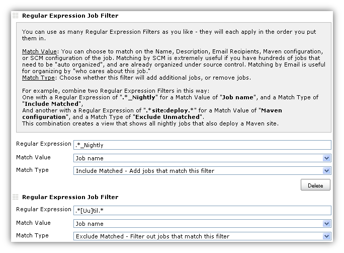#

[[ViewJobFilters-FilterbyRelevancetoLogged-inUser]]
== Filter by Relevance to Logged-in User

Create views that are most relevant to the logged-in user.

The "*Name Matching*" checkbox items are to allow you to get the name
matching just right. The problem is that organizations often have
different naming conventions that may not be consistent across version
control, network logins, and email addresses. All of the options are
checked by default so that this filter can make a thorough effort to
find matching users.

The "*Relevance Matching*" options should be self explanatory. The point
is to try and find all jobs that the logged in user cares about, based
on their activity.

For the "How far back to check" value, use either "0" or blank to
indicate you want to check all builds.

Note that not all combinations of criteria will make sense. Also take a
look at the
https://wiki.jenkins-ci.org/display/JENKINS/View+Job+Filters#ViewJobFilters-UserPermissionsforJobs[User
permissions for Jobs] filter.

[.confluence-embedded-file-wrapper]#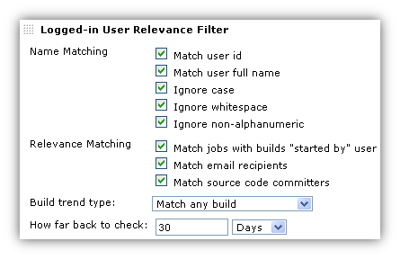#

[[ViewJobFilters-FilterbyJobStatuses]]
== Filter by Job Statuses

This filter provides a number of options, and you can also add multiple
of these filters, and choose different Match Types to include/exclude
exactly the jobs you want.  For example, you could create "Failed Jobs
Only" and "Unstable Jobs Only" views, or make a more complicated view
like the following example combination.

[.confluence-embedded-file-wrapper]#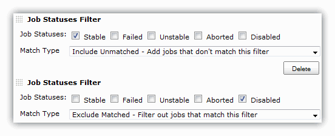#

[[ViewJobFilters-FilterbyBuildStatuses]]
== Filter by Build Statuses

This filter gets a little more specific, and provides options to filter
by the status of the job's builds.  This example filters out (excludes)
all jobs that have never built.

[.confluence-embedded-file-wrapper]#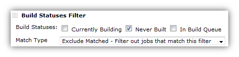#

[[ViewJobFilters-FilterbyBuildTrend]]
== Filter by Build Trend

This filter is similar to the build status filter, but it takes into
account the time in which the status changed.

[.confluence-embedded-file-wrapper]#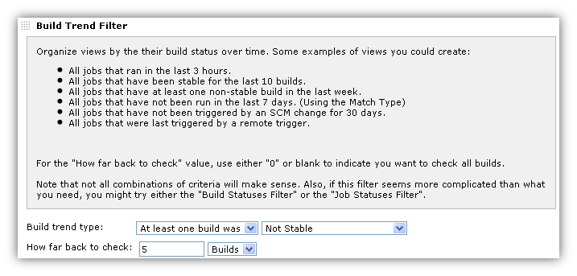#

The different Build trend types are

* The latest build was
* At least one build was
* All builds were
* Completed, Started, Stable, Unstable, Failed, Not Stable
* Triggered by Timer, SCM, User, Remote, Upstream Job, CLI

The different "how far back to check" types include, "Days", "Hours" and
"Builds".

[[ViewJobFilters-FilterbySCMType]]
== Filter by SCM Type

[.confluence-embedded-file-wrapper]#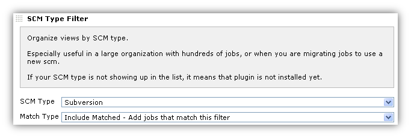#

[[ViewJobFilters-FilterbytheJobsinOtherViews]]
== Filter by the Jobs in Other Views

[.confluence-embedded-file-wrapper]#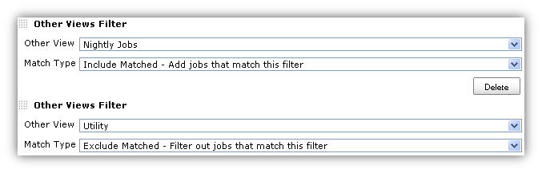#

[[ViewJobFilters-FilterbyJobParameterization]]
== Filter by Job Parameterization

Use Regular Expressions to include or exclude parameterized jobs based
on their build parameters. +
Match the parameter name, build value, or description. Alternately, you
may opt to depend on the default configured value.

For the name, value, and description - a blank indicates you do not care
about that field - it behaves as if you had assigned it the regular
expression ".*".

This filter works with String, Boolean, File, Choice, and Validating
String parameter types.

[.confluence-embedded-file-wrapper]#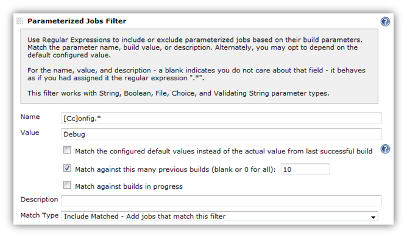#

[[ViewJobFilters-UserPermissionsforJobs]]
== User Permissions for Jobs

Use this feature in tandem with security features such as the
https://wiki.jenkins-ci.org/display/JENKINS/Standard+Security+Setup[Standard
matrix based security] to create views that show different jobs
depending on who is logged in.

[.confluence-embedded-file-wrapper]#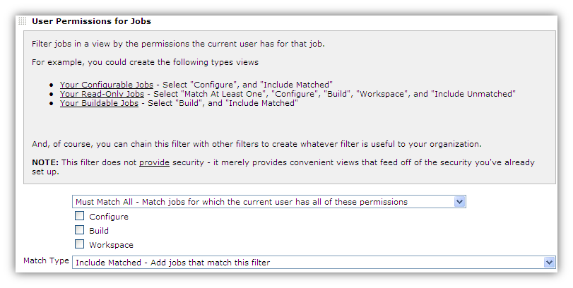#

[[ViewJobFilters-Filterjobsthathaveenabledproject-basedsecurity]]
== Filter jobs that have enabled project-based security

This filters on whether a job is secured through the "Project-based
Matrix Authorization Strategy".

[[ViewJobFilters-Upstream/DownstreamJobsFilter]]
== Upstream/Downstream Jobs Filter

This filter allows you to create a view consisting of jobs that are
related through the concept of Upstream/Downstream (also called "Build
after other projects are built" and "Build other projects"). +
The options provided allow you to choose exactly which types of related
jobs to show.

Note that filters are chained together, so using this filter builds off
of the jobs included by previous filters. Remember that

* This filter will not include any jobs if there are no jobs already
selected
* This filter (like most other filters) is capable of removing jobs that
were already selected

[.confluence-embedded-file-wrapper]#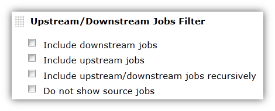#

[[ViewJobFilters-FiltertoMostRecentJobs]]
== Filter to Most Recent Jobs

Combine this filter with other filters to choose not only the exact
types of jobs to show, but how many of them to show.

[.confluence-embedded-file-wrapper]#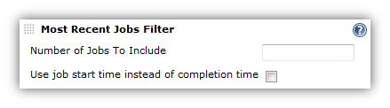#

[[ViewJobFilters-ShowingAllJobswiththe"AllJobs"Filter]]
== Showing All Jobs with the "All Jobs" Filter

The All Jobs view by default shows all jobs, but all other views require
you to either select the jobs you want to include, or add a regex of
".*" to select all jobs always.  This filter does this for you.  This
mostly useful if you're creating multiple "All Jobs" views, or replacing
the default view, and would like to customize the columns, and would
simply like to have each of those views show all jobs.

[[ViewJobFilters-TheBuildFilter(Wrapper)Column.]]
== The Build Filter (Wrapper) Column.

This column is an integral part of creating a smart view that shows just
the jobs you want, and just the builds for those jobs that you want.
Full documentation is found on the
https://wiki.jenkins-ci.org/display/JENKINS/Build+Filter+%28Wrapper%29+Column[Build
Filter (Wrapper) Column] page.

[[ViewJobFilters-Roadmap]]
== Roadmap

[[ViewJobFilters-Version1.x(Ideas)]]
=== Version 1.x (Ideas)

These features are not entered as JIRA tickets because technically no
one is requesting them.  If you want one of these features, please
https://issues.jenkins-ci.org/browse/JENKINS/component/15736[Enter a
JIRA Ticket] and the feature will probably be added within a week.

* Retrofit existing filters to be default extensions (like the way
columns work).  Justifications are
** Allow for other views besides list view to more easily make use of
them (for example, the status filter wasn't picked up by other views)
** Minor benefit is that if you have hundreds of jobs, your view edit
screen is cluttered by the list of jobs when all you wanted was a regex
or a status.  So, you could delete any filters you don't want to see and
they won't show up again.  Another strategy to handle this might simply
be a checkbox titled "hide view list".  However, this would obscure the
fact that often a job is added to a view accidentally by clicking the
"new job" link while on that view.
* Update other views to use the extension.  Currently only used by
ListView.  Some views extend ListView (and do an include with jelly), so
they can't be updated unless they update to newer ListView.  Not sure
about other views - will need to take time and look at each.
* Filter on other "descriptive" things besides job name.  Large
organizations will have other things that distinguish jobs
automatically, but Job name isn't always one of those things
** Maven group id (not sure how practical this is)
** SCM - add more scms besides cvs and svn - need to test and determine
best way to make those scms "optional".
** "java package" - could do by looking at file path?
* More status filter options
** Last time built - i.e. in the last X days (very useful for managing
hundreds of jobs that should run nightly, but sometimes are
misconfigured, etc.)
** Number of days/builds stable
** Build duration (e.g. for a "long running builds" view)
* Other views filter improvements/fixes
** Proper handle of deletes
** ditto for renames
** Don't allow a view to recursively include itself (currently doesn't
break if you do, but it shouldn't even be an option)
* Filter by scheduling types
** Filter by all jobs that have polling and/or forced timed builds setup
- e.g. "Manual Jobs" and "Scheduled Jobs"
*** And/or Filter by jobs last built manually/polled/forced
** Filter by jobs that will soon be built (or SCM polled?)

[[ViewJobFilters-Changelog]]
== Changelog

[[ViewJobFilters-Version2.1.1(ReleasedNovember9,2018)]]
=== Version 2.1.1 (Released November 9, 2018)

* Fix: https://issues.jenkins-ci.org/browse/JENKINS-43343[[JENKINS-43343]] Regex
filter now works with cron schedule for Pipeline jobs

[[ViewJobFilters-Version2.1.0(ReleasedNovember4,2018)]]
=== Version 2.1.0 (Released November 4, 2018)

* Feature: Regex Filter now supports full name, display name and full
display name for jobs and folders
* Feature: Introduces internationalization support and adds German as
first supported language
* Improvement: In-application help has been largely rewritten

[[ViewJobFilters-Version2.0.4(ReleasedOctober19,2018)]]
=== Version 2.0.4 (Released October 19, 2018)

* Fix: https://issues.jenkins-ci.org/browse/JENKINS-13464[[JENKINS-13464]]https://issues.jenkins-ci.org/browse/JENKINS-14916[[JENKINS-14916]]https://issues.jenkins-ci.org/browse/JENKINS-32496[[JENKINS-32496]] Stack
overflow when using OtherViewsFilter or UnclassifiedJobsFilter without
View.READ permission

[[ViewJobFilters-Version2.0.3(ReleasedOctober16,2018)]]
=== Version 2.0.3 (Released October 16, 2018)

* Fix: prevent stack overflow when circular references in Other Views
and Unclassified Views filter are detected
** Display an error message identifying the circular view definition on
the view config page
* Fix:
make https://plugins.jenkins.io/mailer[mailer], https://plugins.jenkins.io/matrix-auth[matrix-auth] and https://plugins.jenkins.io/matrix-project[matrix-project] dependencies
optional

[[ViewJobFilters-Version2.0.2(ReleasedSeptember18,2018)]]
=== Version 2.0.2 (Released September 18, 2018)

* Fix: prevent StackOverflowException when more than one view uses
UnclassifiedJobsFilter
* Fix: validate regex in RegexJobFilter
* Fix: ensure sorting in MostRecentJobsFilter is stable

[[ViewJobFilters-Version2.0.1(ReleasedSeptember13,2018)]]
=== Version 2.0.1 (Released September 13, 2018)

* Fix: https://issues.jenkins-ci.org/browse/JENKINS-29991[[JENKINS-29991]]https://issues.jenkins-ci.org/browse/JENKINS-31710[[JENKINS-31710]] RegExJobFilter/ScmTypeFilter
now work with SCMTriggerItem
* Fix: inconsistency in multi-line regex matching,
see https://github.com/jenkinsci/view-job-filters-plugin/commit/cbba158c80d1af91afa7b61cc20858a6c7f8607b[commit
message] for details

[[ViewJobFilters-Version2.0.0(ReleasedSeptember9,2018)]]
=== Version 2.0.0 (Released September 9, 2018)

New maintainer and first release in three years. This release merely
puts the project on a newer foundation and updates some dependencies,
but otherwise introduces no new features or bug fixes. Existing filters
from pre-2.x versions should continue to work.

* Minimal required Jenkins version increased to 1.625.3
* Switch to https://semver.org/[Semantic Versioning]
* Project is now explicitly under the MIT License

[[ViewJobFilters-Version1.27(ReleasedAugust21,2015)]]
=== Version 1.27 (Released August 21, 2015)

Switched from Subversion to GitHub so the changelog is tricky to
determine.

* https://issues.jenkins-ci.org/browse/JENKINS-20522[JENKINS-20522]
Proper use of top-level item visibility filter.
* https://issues.jenkins-ci.org/browse/JENKINS-29747[JENKINS-29747]
Fallback filters.
* Handle recurse in view.
* https://issues.jenkins-ci.org/browse/JENKINS-21862[JENKINS-21862]
Allow parameter filter to filter particular runs correctly.

[[ViewJobFilters-Version1.26(ReleasedAugust14,2013)]]
=== Version 1.26 (Released August 14, 2013)

* https://issues.jenkins-ci.org/browse/JENKINS-19191[JENKINS-19191]
(don't just consider build-trigger upstream, but all upstreams
(including join))
* https://issues.jenkins-ci.org/browse/JENKINS-19125[JENKINS-19125] (Job
SCM Configuration filter fails with CVS plugin disabled.)
* https://issues.jenkins-ci.org/browse/JENKINS-18986[JENKINS-18986]
(Fencepost error in AbstractBuildTrendFilter.amount)

[[ViewJobFilters-Version1.23(ReleasedJune29,2013)]]
=== Version 1.23 (Released June 29, 2013)

* https://issues.jenkins-ci.org/browse/JENKINS-18386[JENKINS-18386]
(more flexible job filter by parameter)
* https://issues.jenkins-ci.org/browse/JENKINS-17597[JENKINS-17597]
(Poor performance using ParameterFilter)
* https://issues.jenkins-ci.org/browse/JENKINS-17093[JENKINS-17093]
(Filter to show N jobs sorted by most recently completed)
* https://issues.jenkins-ci.org/browse/JENKINS-18399[JENKINS-18399]
(possibility to filter jobs by "Restrict where this project can be run")

[[ViewJobFilters-Version1.22(ReleasedMay24,2012)]]
=== Version 1.22 (Released May 24, 2012)

* Re-Fixed
https://issues.jenkins-ci.org/browse/JENKINS-13781[JENKINS-13781] (NPE
in UserRelevanceView when no user is logged on)

[[ViewJobFilters-Version1.21(ReleasedMay23,2012)]]
=== Version 1.21 (Released May 23, 2012)

* Improved Maven project support by implementing two enhancements
** https://issues.jenkins-ci.org/browse/JENKINS-13846[JENKINS-13846]
(Upstream filter does not show all dependencies)
** https://issues.jenkins-ci.org/browse/JENKINS-13850[JENKINS-13850]
(Unable to match emails for "Regular Expression Job Filter" on Match
Value "Email recipients")

[[ViewJobFilters-Version1.20(ReleasedMay16,2012)]]
=== Version 1.20 (Released May 16, 2012)

* Fixed
https://issues.jenkins-ci.org/browse/JENKINS-13781[JENKINS-13781] (NPE
in UserRelevanceView when no user is logged on)
* Improvement -
https://issues.jenkins-ci.org/browse/JENKINS-13748[JENKINS-13748]
(Support for upstream/downstream jobs)

[[ViewJobFilters-Version1.19(ReleasedMarch26,2012)]]
=== Version 1.19 (Released March 26, 2012)

* Fixed
https://issues.jenkins-ci.org/browse/JENKINS-13223[JENKINS-13223]
(Filter jobs that have enabled project-based security)

[[ViewJobFilters-Version1.18(ReleasedSeptember10,2011)]]
=== Version 1.18 (Released September 10, 2011)

* Added the
https://wiki.jenkins-ci.org/display/JENKINS/Build+Filter+%28Wrapper%29+Column[Build
Filter (Wrapper) Column]

[[ViewJobFilters-Version1.17.2(ReleasedSeptember8,2011)]]
=== Version 1.17.2 (Released September 8, 2011)

* Fixed
https://issues.jenkins-ci.org/browse/JENKINS-10935[JENKINS-10935]

[[ViewJobFilters-Version1.17.1(ReleasedSeptember5,2011)]]
=== Version 1.17.1 (Released September 5, 2011)

* Minor fix for Jenkins 1.427 compatibility issue with the introduction
of "UserIdCause" (vs UserCause)

[[ViewJobFilters-Version1.17(ReleasedSeptember3,2011)]]
=== Version 1.17 (Released September 3, 2011)

* Added User Relevance Filter (see documentation on this page)

[[ViewJobFilters-Version1.16(ReleasedAugust16,2011)]]
=== Version 1.16 (Released August 16, 2011)

* Fixed a bug with the way the regex filter handles multi-line
descriptions (and trigger specs)
http://issues.jenkins-ci.org/browse/JENKINS-10716[JENKINS-10716]

[[ViewJobFilters-Version1.15(ReleasedAugust13,2011)]]
=== Version 1.15 (Released August 13, 2011)

* added trigger types to the build trend filter. For example, create a
view of all jobs that have not been triggered by an SCM change in a
month.

[[ViewJobFilters-Version1.14(ReleasedAugust10,2011)]]
=== Version 1.14 (Released August 10, 2011)

* fixed regression in the regex filter. version 1.13 unintentionally
requires git plugin to be installed, or regex on scm will cause an
exception that cannot be recovered from through the hudson gui.

[[ViewJobFilters-Version1.13(ReleasedJuly23,2011)]]
=== Version 1.13 (Released July 23, 2011)

* add git
* add chron to regex filter

[[ViewJobFilters-Version1.12]]
=== Version 1.12

* Added Matrix Job support to Regular Expressions Maven option
* Fixed a bug in Regular Expressions Maven option

[[ViewJobFilters-Version1.11]]
=== Version 1.11

* Improved Parameterized Jobs Filter - see
http://issues.jenkins-ci.org/browse/JENKINS-8944

[[ViewJobFilters-Version1.9]]
=== Version 1.9

* Job Type Filter
* Parameter Filter improvement to look at build parameter - see
http://issues.jenkins-ci.org/browse/JENKINS-7252
* Security Filter - see http://issues.jenkins-ci.org/browse/JENKINS-8355

[[ViewJobFilters-Version1.8]]
=== Version 1.8

* Did not release properly due to Hudson infrastructure problems - all
features scheduled for 1.8 are moved to 1.9

[[ViewJobFilters-Version1.7]]
=== Version 1.7

* Under-the-hoods performance improvements such as
http://issues.jenkins-ci.org/browse/JENKINS-7956[JENKINS-7956]

[[ViewJobFilters-Version1.6]]
=== Version 1.6

* Add Maven support to regular expression filter
* Fixed bug where filters take jobs out of order.  This is not a
backwards compatible fix in terms of the way it displays, but fixes an
obvious bug where the "Job" column shows it is sorted by name, but in
fact the jobs are obviously not sorted by name.

[[ViewJobFilters-Version1.5]]
=== Version 1.5

* Fix http://issues.jenkins-ci.org/browse/JENKINS-7732[JENKINS-7732] -
"Job Views - Jobs not listed in other views filter"

[[ViewJobFilters-Version1.4]]
=== Version 1.4

* Fix http://issues.jenkins-ci.org/browse/JENKINS-7479[JENKINS-7479] -
"Create View Job Filter that includes/excludes Jobs by their Parameters"
* Fix SCM Type localization bug
* For "Other Views" filter, added handling of ViewGroups for nested
views

[[ViewJobFilters-Version1.3]]
=== Version 1.3

* Fixed http://issues.jenkins-ci.org/browse/JENKINS-7432[JENKINS-7432] -
"Provide View Job Filter by Email Recipients"
* Make SVN and CVS plugins optional instead of required

[[ViewJobFilters-Version1.2]]
=== Version 1.2

* Fixed http://issues.jenkins-ci.org/browse/JENKINS-7160[JENKINS-7160] -
"Provide View Filter for Current Jobs (Jobs build within the last x
days)"
* Added Build Trend Filter to provide filtering on what happened to the
build in recent history (configurable).  See this page for details.

[[ViewJobFilters-Version1.1]]
=== Version 1.1

* Fixed http://issues.jenkins-ci.org/browse/JENKINS-6932[JENKINS-6932] -
"Allow to filter by SCM Branch" - applies to CVS only

[[ViewJobFilters-Version1.0(initialrelease)]]
=== Version 1.0 (initial release)

* Filter on other "descriptive" things besides job name.  Large
organizations will have other things that distinguish jobs
automatically, but Job name isn't one of those things
** SCM "URL" (only cvs and svn)
** Job description field
* More comprehensive status filter - would obsolete some other
features/plugins, but this filter should be more useful/useable
** Stable, Unstable, Failed, Aborted
** In queue, never built, building
** Disabled
* Common include/exclude drop-down to make filters more easy to "chain"
* All Jobs
* Filter one view's jobs based on other view's jobs. 
** Exclude - For example, View 1 will want all jobs with a certain
regex, except for jobs already shown in View 2.  Then if View 2 changes
what jobs it shows, View 1 is automatically updated.
** Include - for a large organization, we might want "composite" views
(not nested views) of the hierarchical parts of the organization
