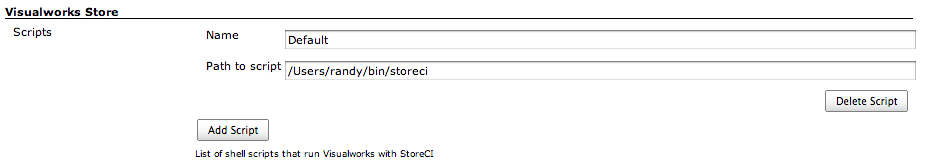
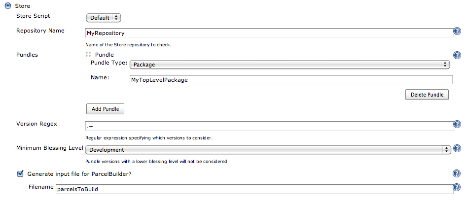

This plugin integrates Jenkins with http://cincomsmalltalk.com/[Cincom
Visualworks] Smalltalk Store.  The plugin requires at least one shell
script or batch file to be created that can run a Visualworks image with
the StoreCI-Polling package loaded.

[[VisualworksSmalltalkStorePlugin-UsingtheVisualworksStorePlugin]]
== Using the Visualworks Store Plugin

In order to use the Visualworks Store Plugin, a few steps are required.

[[VisualworksSmalltalkStorePlugin-ConfigureaVisualworksImage]]
=== Configure a Visualworks Image

This plugin requires the StoreCI-Polling package that is available in
the
http://www.cincomsmalltalk.com/CincomSmalltalkWiki/Public+Store+Repository[Cincom
Public Store Repository].  StoreCI-Polling works with Cincom Visualworks
7.7 or later.

StoreCI-Polling is part of the
https://github.com/randycoulman/StoreCI[StoreCI suite].

To use this plugin, build a Visualworks image that contains the
following:

* The Store package for your Store repository database (e.g.
StoreForPostgreSQL).
* Repository definitions for each of the Store repositories you want to
use with the plugin (or use the -importRepositories command-line
option).
* The StoreCI-Polling package (or a Parcel version of that package
available).

[[VisualworksSmalltalkStorePlugin-CreateaShellScriptorBatchFiletoRunYourImage]]
=== Create a Shell Script or Batch File to Run Your Image

This plugin expects to run a shell script or batch file that runs
Visualworks with the image you created above.  This script should pass
all of its arguments on to the image.  For example, a Linux or MacOS/X
script might contain a line such as:

[source,syntaxhighlighter-pre]
----
 /path/to/visualworksVM /path/to/image "$@"
----

Or, if you saved StoreCI-Polling as a parcel instead:

[source,syntaxhighlighter-pre]
----
 /path/to/visualworksVM /path/to/image -pcl /path/to/StoreCI-Polling.pcl "$@"
----

This plugin allows more than one such script to be configured.  This
allows different builds to be run using different versions of
Visualworks.

[[VisualworksSmalltalkStorePlugin-InstallthePlugin]]
=== Install the Plugin

Install the plugin either using Jenkins plugin administration or
manually.

[[VisualworksSmalltalkStorePlugin-ConfigurethePlugin]]
=== Configure the Plugin

If the plugin was installed correctly, there will be a Visualworks Store
section in the global configuration page of Jenkins (Manage Jenkins |
Configure System).  Enter the path to the shell script or batch file you
created above.  If you created more than one script, use the Add Script
button to configure any additional scripts.
[.confluence-embedded-file-wrapper]##

[[VisualworksSmalltalkStorePlugin-ConfigureaBuildtoUseVisualworksStore]]
=== Configure a Build to Use Visualworks Store

In the Source Code Management section of your build, choose Store.
[.confluence-embedded-file-wrapper]## +
Specify the following settings:

* *Store Script:* Choose one of the scripts you configured in the global
settings.
* *Repository Name:* Specify the name of the Store repository to
monitor.
* *Pundles:* Choose the type (Package or Bundle) and enter the name of a
pundle to monitor.  If you would like to specify more than one pundle,
use the Add Pundle button.  StoreCI-Polling will watch for changes to
those pundles and any of their (recursive) prerequisites in the same
repository.  Thus, it is only necessary to specify "root" pundles here.
* *Version Regex:* Specify a regular expression that indicates which
pundle versions you would like to consider.  By default, all versions
are considered.  The regular expression must be in Regex11 format.  For
example, integer-only version numbers can be matched using "\d+".
* *Minimum Blessing Level:* Specify a minimum blessing level (default:
Development).  Pundles with a lower blessing level will not be
considered.
* *Generate input file for ParcelBuilder?:* If desired, check the box to
enable generation of an input file for ParcelBuilder (now called
StoreCI-Building) and then specify a filename.  This file will contain
the list of most-recent pundle versions that were found by
StoreCI-Polling as of the time the build started.  This file can be used
by StoreCI-Building (available in the Public Store Repository) or a
similar tool to build an image or deploy parcels as part of the build.
 If no path is specified, the file will be created in the root of the
Jenkins workspace directory for your project.  This file will contain
the pundles in "load order".  That is, all of a pundle's prerequisites
will be earlier in the list than the pundle itself.  That way, when
loading the pundles into an image, no automatic prerequisite resolution
will need to be done.

Visualworks Smalltalk Store Plugin is designed to work with the
https://wiki.jenkins-ci.org/display/JENKINS/Multiple+SCMs+Plugin[Multiple
SCMs Plugin].  This is useful if you need to monitor more than one
repository for the same build, or if you need to monitor both a Store
repository and a git or Subversion repository.

[[VisualworksSmalltalkStorePlugin-Changelog]]
== Changelog

[[VisualworksSmalltalkStorePlugin-Version1.1.1]]
=== Version 1.1.1

https://issues.jenkins-ci.org/browse/JENKINS-23389[[JENKINS-23389]] Support
checking out on a build slave.

[[VisualworksSmalltalkStorePlugin-Version1.1]]
=== Version 1.1

Failed release; skipping

[[VisualworksSmalltalkStorePlugin-Version1.0]]
=== Version 1.0

Initial version.
