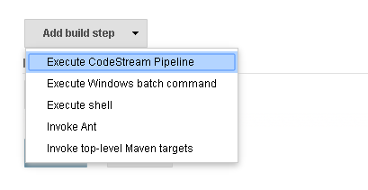
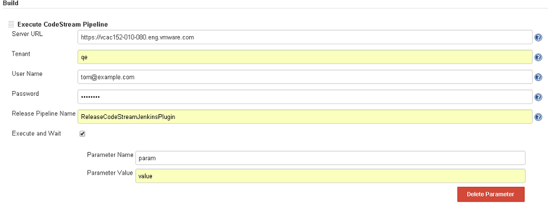

Provide integration with
https://www.vmware.com/products/vrealize-code-stream[vRealize Code
Stream]

[[VmwarevRealizeCodeStreamPlugin-JobConfiguration]]
== Job Configuration

*    1. Build step* : On Job configuration page click on *Add build
step *select “Execute CodeStream Pipeline” option                       
     

                        
[.confluence-embedded-file-wrapper]## +
*    2. Configure** : * Configure CodeStream pipeline like show in
image. Below is the description of each field*                         
                                                                       
                                     *

* {blank}
** Server URl -   vRealize CodeStream host URL
** Tenant - User group tenant against which you want to execute the
pipeline
** User Name - Username for given tenant. User should have Release
Manager or Release Engineer Role.
** Password - Password for given user
** Release Pipeline Name - Pipeline which you want to execute. Pipeline
should be activate and its latest version will be executed.
** Execute and Wait - If this checkbox is checked the job will wait for
pipeline execution to complete or fail.
** Add Parameter - If you want to override default value of any pipeline
property then you can use this option. Click on Add Parameter and
provide property name in Parameter Name. New  value in Parameter Value.
For all the other properties default value will be used.

                     
[.confluence-embedded-file-wrapper]##

[[VmwarevRealizeCodeStreamPlugin-Output]]
== Output

Plugin publish below o/p Jenkins parameters once the execution is
complete.

* CS_PIPELINE_EXECUTION_ID - Pipeline execution id
* CS_PIPELINE_EXECUTION_STATUS - Pipeline execution status. This
parameter is available only if "Execute and wait" checkbox is checked.
* CS_PIPELINE_EXECUTION_RES - Pipeline execution object as JSON. This
parameter is available only if "Execute and wait" checkbox is checked.
