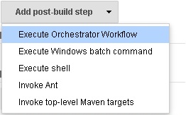
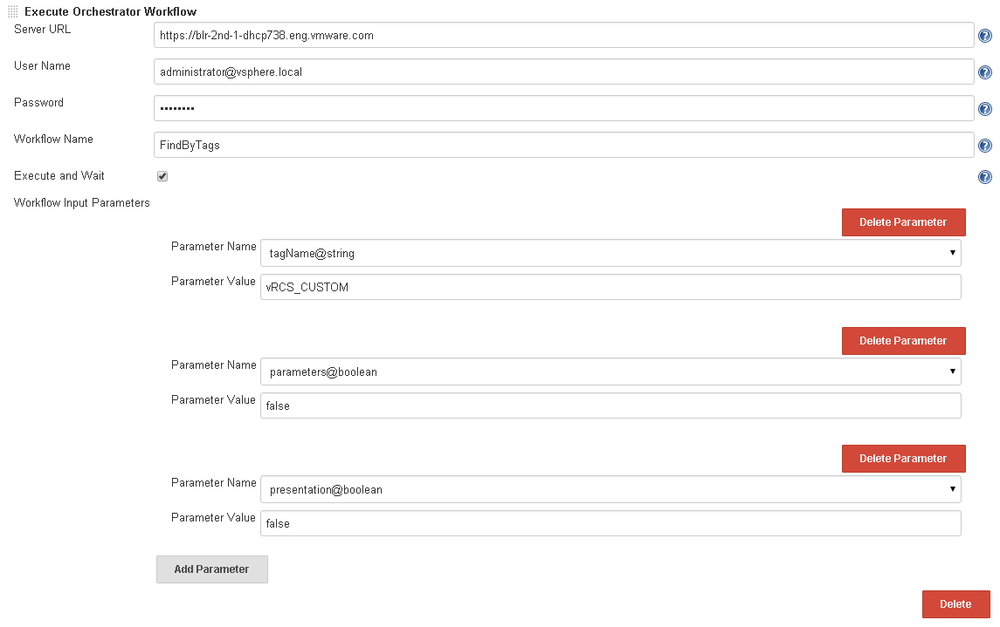

Provide integration
with http://www.vmware.com/products/vrealize-orchestrator/[vRealize Orchestrator].
Allows us to configure any Orchestrator workflows as part of the jenkins
plugin configuration. It support only Data types such as String /
SecureString/ EncryptedString / Boolean / Date / Number / SDKObject.

[[VMwarevRealizeOrchestratorPlugin-JobConfiguration]]
== Job Configuration

*    1. Build step* : On Job configuration page click on *Add build
step *select “Execute Orchestrator Workflow” option                     
       

                        

                          
[.confluence-embedded-file-wrapper]## +
*    2. Configure** : * Configure Orchestrator workflow like shown in
image. Below is the description of each field*                         
                                                                       
                                  *

* Server URl -   vRealize Orchestrator Server URL.
* User Name - Username to connect to Orchestrator server.
* Password - Password to connect to Orchestrator server.
* Workflow Name - Name of the workflow which you want to execute.
* Execute and Wait - If this checkbox is checked the job will wait for
workflow to complete its execution.
* Workflow Input Parameters(Add Parameter) - Once the workflow name is
given, it will fetch all the input parameters of the workflow. Now you
can click on Add parameter to provide values for the input parameters. 
        
[.confluence-embedded-file-wrapper]## +
           

[[VMwarevRealizeOrchestratorPlugin-Output]]
== Output

Plugin publishes below output as Jenkins environment variables once the
execution is complete. The below variables will be filled with the
values of the workflow only when "Execute and wait" option is selected.

* ORCHESTRATOR_WORKFLOW_EXECUTION_STATE - Status of the workflow
execution.
* ORCHESTRATOR_WORKFLOW_EXECUTION_OUTPUT- Output parameters that are
published by the workflow once it is complete in the JSON format.
