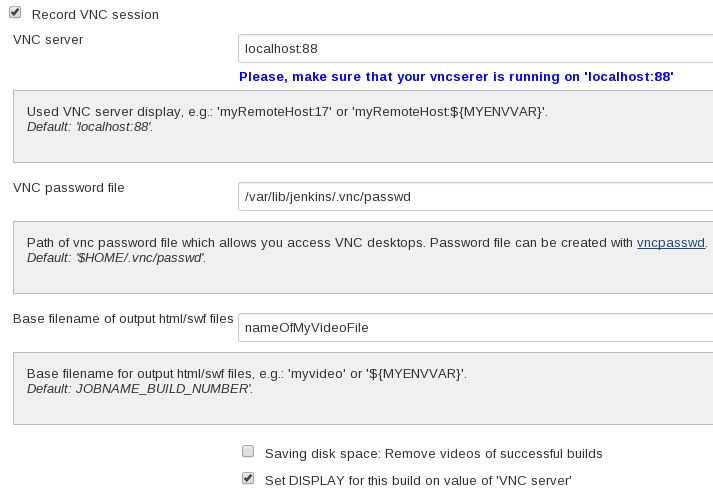
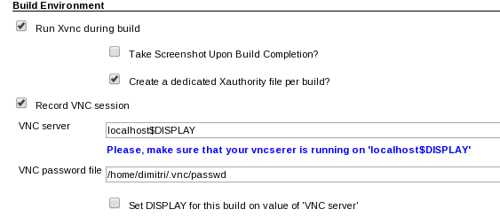
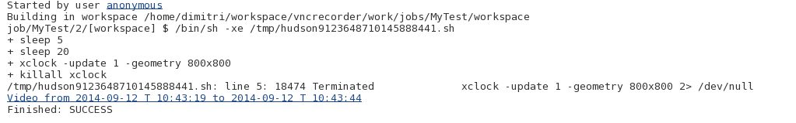
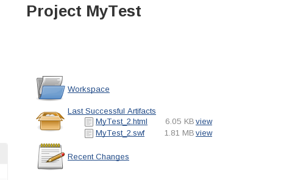
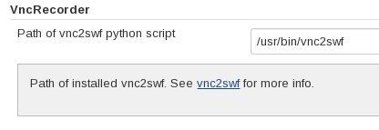

This plugin records screen of current build or other configured VNC
session as Shock Wave Flash (swf) file during a build and stores it as
an artifact. This plugin can be used in combination with
https://wiki.jenkins-ci.org/display/JENKINS/VncViewer+Plugin[VncViewer]
and https://wiki.jenkins-ci.org/display/JENKINS/Xvnc+Plugin[Xvnc
plugin].

After the build, the video file gets also published as a HTTP link in
the "Console output" of the build. The generated HTML file embeds a
video and makes it possible to navigate within a recorded video directly
in browser.

[[VncRecorderPlugin-Requirements]]
== Requirements

* Linux on Jenkins master node
* http://rpm.pbone.net/index.php3?stat=3&limit=1&srodzaj=3&dl=80&search=pyvnc2swf[vnc2swf] on
Jenkins master node

[[VncRecorderPlugin-Howyouusetheplugininajob]]
== How you use the plugin in a job

[.confluence-embedded-file-wrapper]##

[[VncRecorderPlugin-ExampleforusagetogetherwithXvncplugin]]
=== Example for usage together with https://wiki.jenkins-ci.org/display/JENKINS/Xvnc+Plugin[Xvnc plugin]

[.confluence-embedded-file-wrapper]##

[[VncRecorderPlugin-Result:videoinyourBrowser]]
== Result: video in your Browser

[[VncRecorderPlugin-Linkin"Consoleoutput"]]
=== Link in "Console output"

[.confluence-embedded-file-wrapper]##

'''''

[[VncRecorderPlugin-Storeasbuildartifact]]
=== Store as build artifact

[.confluence-embedded-file-wrapper]##

The generated HTML file
https://wiki.jenkins-ci.org/download/attachments/74055684/MyTest_2.html?version=1&modificationDate=1410512066000&api=v2[MyTest_2.html] embeds
video
https://wiki.jenkins-ci.org/download/attachments/74055684/MyTest_2.swf?version=1&modificationDate=1410512061000&api=v2[MyTest_2.swf] and
makes it possible to navigate within a video directly in browser.

[[VncRecorderPlugin-Pathofvnc2swf]]
== Path of vnc2swf

Path of used vnc2swf can be customized under "Jenkins System
configuration / Global settings". Default is the vnc2swf found in the
PATH variable.

[.confluence-embedded-file-wrapper]##

[[VncRecorderPlugin-JIRAissues]]
== JIRA issues

[[refresh-module--1436734834]]
[[refresh--1436734834]][[jira-issues--1436734834]]
T

Key

Summary

Assignee

Reporter

P

Status

Resolution

Created

Updated

Due

[.refresh-action-group]# #

[[refresh-issues-loading--1436734834]]
[.aui-icon .aui-icon-wait]#Loading...#

[#refresh-issues-button--1436734834]##
[#refresh-issues-link--1436734834]#Refresh#
[#error-message--1436734834 .error-message .hidden]# #
