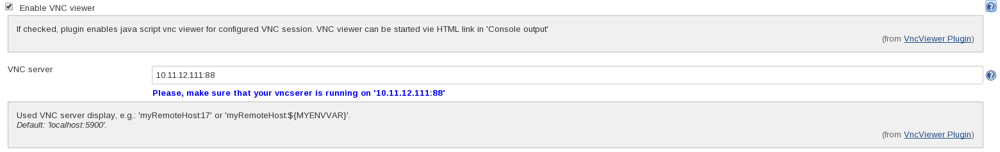
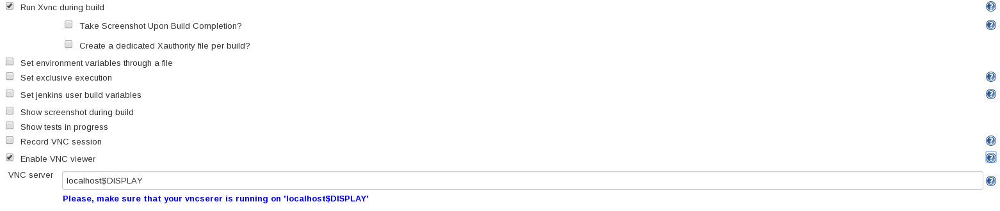
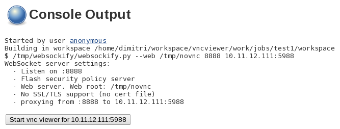

VncViewer lets you monitor or operate GUI of your running build. You can
start HTML5 based VNC viewer via HTML link directly from 'Console
output'. This plugin can be used in combination
with https://wiki.jenkins-ci.org/display/JENKINS/Xvnc+Plugin[Xvnc] and https://wiki.jenkins-ci.org/display/JENKINS/VncRecorder+Plugin[VncRecorder]
plugins.

The plugin uses internally HTML5 based VNC
client http://kanaka.github.io/noVNC/[noVNC]. 

[[VncViewerPlugin-Requirements]]
== Requirements

* Linux on Jenkins master node

[[VncViewerPlugin-Howyouusetheplugininajob]]
== How you use the plugin in a job

[.confluence-embedded-file-wrapper]##

[[VncViewerPlugin-ExampleforusagetogetherwithXvncplugin]]
=== Example for usage together with https://wiki.jenkins-ci.org/display/JENKINS/Xvnc+Plugin[Xvnc plugin]

[.confluence-embedded-file-wrapper]##

[[VncViewerPlugin-StartVNCviewerfrom"Consoleoutput"]]
== Start VNC viewer from "Console output"

[.confluence-embedded-file-wrapper]##

[[VncViewerPlugin-JIRAissues]]
== JIRA issues

[[refresh-module--1384189999]]
[[refresh--1384189999]][[jira-issues--1384189999]]
T

Key

Summary

Assignee

Reporter

P

Status

Resolution

Created

Updated

Due

[.refresh-action-group]# #

[[refresh-issues-loading--1384189999]]
[.aui-icon .aui-icon-wait]#Loading...#

[#refresh-issues-button--1384189999]##
[#refresh-issues-link--1384189999]#Refresh#
[#error-message--1384189999 .error-message .hidden]# #
