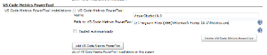
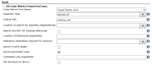
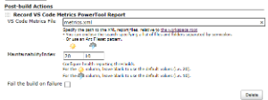
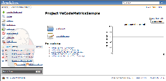
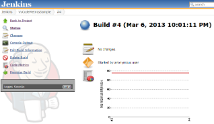
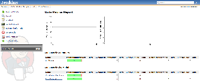
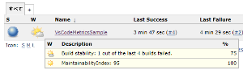
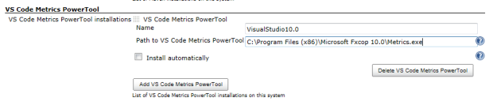
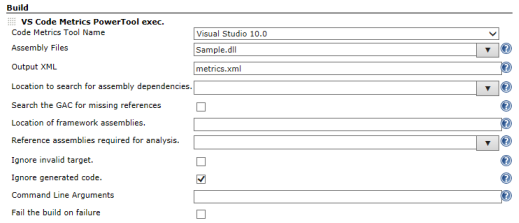
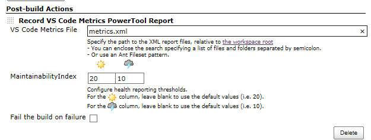

http://www.microsoft.com/en-us/download/details.aspx?id=9422[Visual
Studio Code Metrics PowerTool] execute plugin. +
And record the metrics report.

[[VisualStudioCodeMetricsPlugin-Image]]
== Image

[cols=",,",options="header",]
|===
|Installation |Build |Post-build Actions
|[.confluence-embedded-file-wrapper]##
|[.confluence-embedded-file-wrapper]##
|[.confluence-embedded-file-wrapper]##
|===

[cols=",,",options="header",]
|===
|Project Trend |Build Trend |Report
|[.confluence-embedded-file-wrapper]##
|[.confluence-embedded-file-wrapper]##
|[.confluence-embedded-file-wrapper]##
|===

[cols="",options="header",]
|===
|Health Report
|[.confluence-embedded-file-wrapper]##
|===

[[VisualStudioCodeMetricsPlugin-Description]]
== Description

http://www.microsoft.com/en-us/download/details.aspx?id=9422[Visual
Studio Code Metrics PowerTool] execute plugin. +
And record the metrics report.

Install the Visual Studio 2010 or
http://www.microsoft.com/en-us/download/details.aspx?id=6544[FxCop 10.0]
to use the
http://www.microsoft.com/en-us/download/details.aspx?id=9422[Visual
Studio Code Metrics PowerTool].

Maintainability Index description are listed below. +
http://msdn.microsoft.com/library/vstudio/bb385914

[[VisualStudioCodeMetricsPlugin-Configuration]]
== Configuration

[[VisualStudioCodeMetricsPlugin-Systemconfiguration]]
=== System configuration

[.confluence-embedded-file-wrapper]##

. Open the system configuration page "Manage Jenkins->Configure system"
. Enter the path to the Visual Studio Code Metrics PowerTool, that
should be used by Jenkins.

* Example: *C:\Program Files (x86)\Microsoft Visual Studio 10.0\Team
Tools\Static Analysis Tools\FxCop\Metrics.exe*

[[VisualStudioCodeMetricsPlugin-Jobconfiguration]]
=== Job configuration

[.confluence-embedded-file-wrapper]##

[width="100%",cols="50%,50%",options="header",]
|===
|name |description
|Code Metrics Tool Name |Select Visual Studio Code Metrics PowerTool
version.

|Assembly Files |Assembly file(s) to analyze. +
You can specify multiple analyze assemblies by separating them with
new-line or space.

|Output XML |Metrics results XML output file.

|Location to search for assembly dependencies. |Location to search for
assembly dependencies. +
You can specify multiple directories by separating them with new-line or
space.

|Search the GAC for missing references |Search the Global Assembly Cache
for missing references.

|Location of framework assemblies. |Location of framework assemblies,
such as mscorlib.dll.

|Reference assemblies required for analysis. |Reference assemblies
required for analysis. +
You can specify multiple reference assemblies by separating them with
new-line or space.

|Ignore invalid target. |Silently ignore invalid target files.

|Ignore generated code. |Suppress analysis results against generated
code.

|Command Line Arguments |This is a whitespace separated list of command
line arguments you can specify.

|Fail the build on failure |Fail the build on failure.
|===

[[VisualStudioCodeMetricsPlugin-Post-buildActionconfiguration]]
=== Post-build Action configuration

[.confluence-embedded-file-wrapper]##

[width="100%",cols="50%,50%",options="header",]
|===
|name |description
|VS Code Metrics File a|
Specify the path to the XML report files, relative to the workspace root

* You can enclose the search specifying a list of files and folders
separated by semicolon.
* Or use an Ant 'Fileset' pattern.

|MaintainabilityIndex |Configure health reporting thresholds. +
For the sunny icon column, leave blank to use the default values (i.e.
20). +
For the stormy icon column, leave blank to use the default values (i.e.
10).

|Fail the build on failure |Fail the build on failure.
|===

[[VisualStudioCodeMetricsPlugin-Changelog]]
== Changelog

[[VisualStudioCodeMetricsPlugin-Version1.7(03/14/2014)]]
=== Version 1.7 (03/14/2014)

* Fix : Add flag to set build to Unstable if failure
(https://issues.jenkins-ci.org/browse/JENKINS-20573[JENKINS-20573])
* Add ignoregeneratedcode field.

[[VisualStudioCodeMetricsPlugin-Version1.6(06/26/2013)]]
=== Version 1.6 (06/26/2013)

* Fix : Jenkins lock metrics.xml file
(https://issues.jenkins-ci.org/browse/JENKINS-18369[JENKINS-18369])

[[VisualStudioCodeMetricsPlugin-Version1.5(05/30/2013)]]
=== Version 1.5 (05/30/2013)

* Edit help-directory.html

[[VisualStudioCodeMetricsPlugin-Version1.4(05/29/2013)]]
=== Version 1.4 (05/29/2013)

* Specify multiple directories.
(https://github.com/jenkinsci/vs-code-metrics-plugin/pull/1[Pull
Requests #1])

[[VisualStudioCodeMetricsPlugin-Version1.3(03/31/2013)]]
=== Version 1.3 (03/31/2013)

* Build trend width change.(300px -> 500px)
* Performance tuning.

[[VisualStudioCodeMetricsPlugin-Version1.2(03/18/2013)]]
=== Version 1.2 (03/18/2013)

* Project trend width change.(400px -> 500px)

[[VisualStudioCodeMetricsPlugin-Version1.1(03/07/2013)]]
=== Version 1.1 (03/07/2013)

* Remove default 'Path to VS Code Metrics PowerTool' value.

[[VisualStudioCodeMetricsPlugin-Version1.0(03/06/2013)]]
=== Version 1.0 (03/06/2013)

* Initial release.
