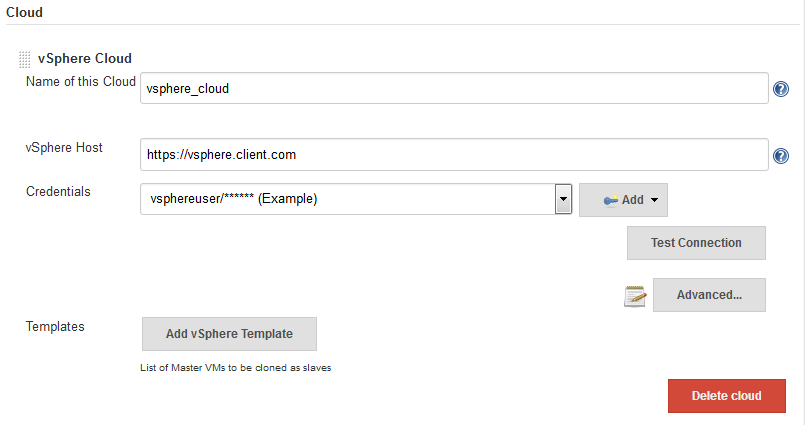
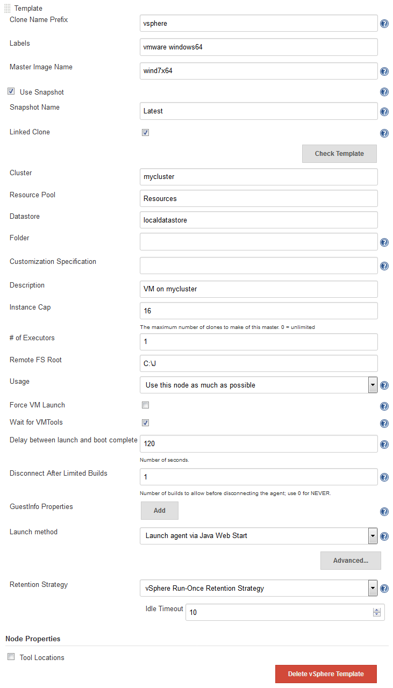
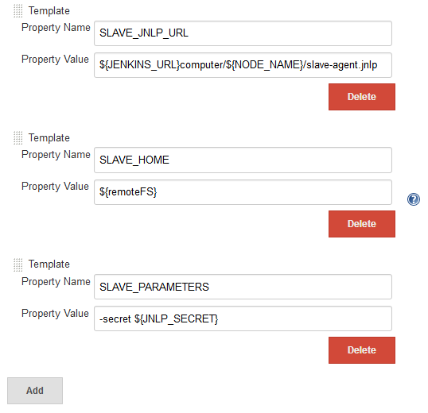
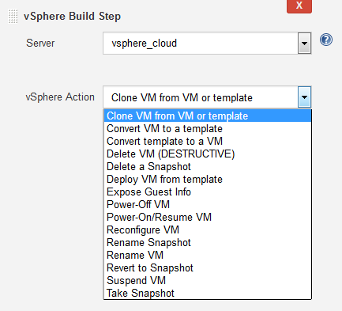
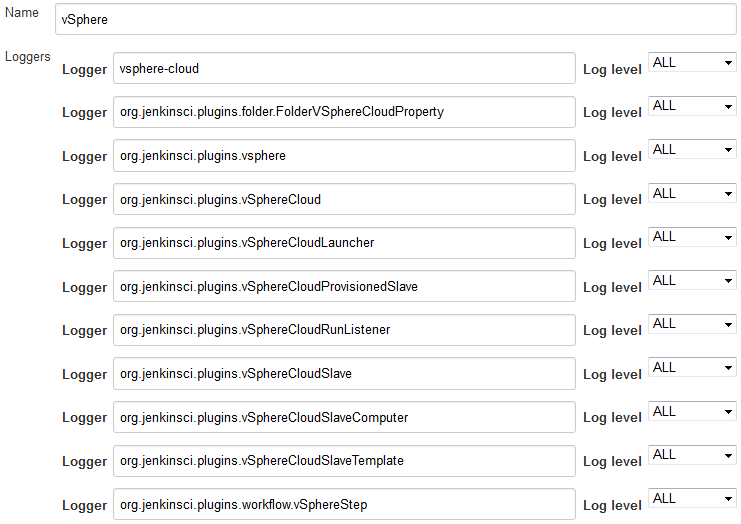

[.conf-macro .output-inline]# #

[.aui-icon .aui-icon-small .aui-iconfont-info .confluence-information-macro-icon]##

Older versions of this plugin may not be safe to use. Please review the
following warnings before using an older version:

* https://jenkins.io/security/advisory/2018-03-26/#SECURITY-504[Plugin
disables SSL/TLS certificate validation]
* https://jenkins.io/security/advisory/2018-03-26/#SECURITY-745[CSRF
vulnerability and insufficient permission checks allow capturing
credentials, vSphere denial of service]

[.aui-icon .aui-icon-small .aui-iconfont-warning .confluence-information-macro-icon]##

*This plugin is up for adoption.* Want to help improve this plugin?
https://wiki.jenkins.io/display/JENKINS/Adopt+a+Plugin[Click here to
learn more]!

Add VMware vSphere support to Jenkins by making available multiple
vSphere Build Steps and supporting the use of Virtual Machines as
slaves.

[[vSphereCloudPlugin-vSphereCloudPlugin]]
== *vSphere Cloud Plugin*

This plugin adds a way to control Virtual Machines hosted in a VMware
vSphere server using Jenkins.  You can configure a Jenkins Slave to use
a virtual machine, including an optional snapshot name.  If configured
to do so, Jenkins will (optionally) revert, then start the virtual
machine as a slave.  If configured to do so, Jenkins will also shutdown
and (optionally) revert the virtual machine when all jobs have finished
processing.

Additionally, you can manipulate your vSphere VMs & templates using any
of the vSphere Build steps provided by this plugin.

[[vSphereCloudPlugin-Configuration]]
=== *Configuration*

[[vSphereCloudPlugin-vSphereCloudConfiguration]]
==== vSphere Cloud Configuration

The first step is to configure Jenkins to know what vSphere server you
will be using. To do this you need to add a new "Cloud" in the Jenkins
"Configure System" menu.

[.confluence-embedded-file-wrapper .confluence-embedded-manual-size]##

You will need to enter a display name for this vSphere cloud, the
hostname of your vSphere server, and login credentials.  You can (in the
Advanced... settings) also specify limits on the number of VMs to be
created by Jenkins.

The "vSphere Host" is the name of the VMware vCenter service endpoint;
it usually has a format of
https://host-name-or-ip-address/*&nbsp[https://host-name-or-IP-address]

The credentials specify the username and password used to log in to the
vSphere Host.  If you do now have existing credentials defined for this
within Jenkins will will need to "Add" them and then refresh the page.

The "Test Connection" button will test to see if your vSphere is
accessible with the specified host name, user name and password.

The user entered when defining the cloud will need to have the following
vsphere permissions:

[cols=",",]
|===
|■ |Virtual machine*.*Provisioning*.*Clone virtual machine on the
virtual machine you are cloning.

|■ |Virtual machine *.*Inventory*.*Create from existing on the
datacenter or virtual machine folder.

|■ |Virtual machine*.*Configuration*.*Add new disk on the datacenter or
virtual machine folder.

|■ |Resource*.*Assign virtual machine to resource pool on the
destination host, cluster, or resource pool.

|■ |Datastore*.*Allocate space on the destination datastore or datastore
folder.

|■ |Network*.*Assign network on the network to which the virtual machine
will be assigned.

|■ |Virtual machine*.*Provisioning*.*Customize on the virtual machine or
virtual machine folder if you are customizing the guest operating
system.

|■ |Virtual machine*.*Provisioning*.*Read customization specifications
on the root vCenter Server if you are customizing the guest operating
system.
|===

[[vSphereCloudPlugin-VMCloneConfiguration]]
==== VM Clone Configuration

There are two ways to define the creation of a clone:

* Static configuration: You can define the clone creation configuration
globally. It can later be referenced in the Jenkins job configuration by
using a "label". This configuration is done in the global Jenkins
configuration.
** This method is recommended for build jobs that "do not care about
vSphere", e.g. basic compilation/test jobs which simply need a Jenkins
slave to run on.
* Per job configuration: You can define the clone creation configuration
individually in each job. This configuration is done in the Jenkins job
configuration.
** This method is recommended for jobs which "know" that they are using
vSphere to control a specific VM.

It is not uncommon to use both strategies, e.g. per-job configuration to
create VM templates for later use in the global configuration.

[[vSphereCloudPlugin-Staticconfigurationofclonecreation]]
===== Static configuration of clone creation

After adding a cloud you can configure Jenkins to create clones "on
demand" by clicking on "Add vSphere Template" and then expanding the
"Advanced..." section.  You may add as many templates that you wish. 
Each template defines a means of creating a new VM to be used as a
Jenkins slave which will automatically be used to clone new slaves as
necessary.  You can control which templates get used by specifying
labels on the templates and "Restrict where build can run" on the jobs.

 
[.confluence-embedded-file-wrapper .confluence-embedded-manual-size]##

.

* Enter a "Clone Name Prefix", that name will be used when creating new
clones. The new clone will be named: <clone_prefix><UUID>, where UUID is
some dynamically created UUID added to the prefix.  Prefixes *MUST* be
sufficiently unique that any given name can be uniquely matched to a
single prefix.
* The "Master Image Name" is the name of the master image which will be
used to make the new clones.
* Use snapshot: (optional) If ticked, the new clone will be based on a
Snapshot within the master image instead of the "live" image.  Ticking
this enables the following: +
** Snapshot Name: The name of the snapshot to use, e.g. "Latest".
** Linked Clone: A linked clone is where the disks of the clone are
defined as a delta from the template's disks, meaning that storage space
if only required on vSphere for the differences, rather than each clone
requiring its own (full) copy of the template's disks.  Recommended for
short-lived VMs.
* Enter Cluster, Resource Pool, Datastore, Folder, Customization
Specification as required, this are settings how the clone will be
created in vSphere. Enter "Resources" as default for "Resource Pool" if
you haven't explicitly defined resource pools in vCenter.
* Labels: You can use these labels to configure a job where it should be
built. Use the label in the box "Restrict where this project can be run"
in the job configuration.  This is how Jenkins decides which template to
use.
* Force VM Launch: Launches the virtual machine when necessary.
* Wait for VMTools: Useful if the virtual machine has VMTools installed;
when enabled, Jenkins will wait until VMTools is running before
continuing with the connection allowing a lower "Delay between launch
and boot complete" value without sacrificing reliability.
* Delay between launch and boot complete: Number of seconds to delay
after starting the virtual machine (or after waiting for VMTools) before
assuming the slave is operational.
* Disconnect after Limited Builds: Will force the slave agent to
disconnect after the specified number of builds have been performed,
triggering the disconnect action. +
Note: Currently, the "Disconnect After Limited Builds" configuration
parameter is not used.
* GuestInfo Properties: you can use "guestinfos" to provide properties
(e.g. the URL to the Jenkins Master and the JNLP "secret") to the clone.
This is especially useful if you chose "Java Web Start" (JNLP) as launch
method, e.g. for a Windows VM.  See below for further details and
example.
* Retention Strategy: Whether to use each VM once before disposing of it
(the "Run-Once" strategy) or to allow the VM to run multiple builds and
only be disposed of once the VM has remained unused for too long (the
"Keep-Until-Idle" strategy).  If your builds require a fresh VM then use
"Run-Once", otherwise the "Keep-Until-Idle" will be more efficient.

GuestInfo properties (mentioned above) allow you to pass information
from Jenkins to the newly started VMs.  If you are using the SSH launch
method then you may not need this, but if you are using Java Web Start
(JNLP) then this will be needed to tell your slave process where the
Jenkins server is, what slave it is, the JNLP "secret" etc.  For
example, to pass the data necessary for the newly-started VM to start a
JNLP slave process and connect back to Jenkins, you could set the
following GuestInfo properties:

[.confluence-embedded-file-wrapper .confluence-embedded-manual-size]##

You would then need to ensure that, after bootup, your VM would
automatically use the vmware tools to reach each of these properties
(e.g. `+vmtoolsd --cmd "info-get guestinfo.SLAVE_JNLP_URL"+` to request
the jnlp URL) before starting the slave.jar with those arguments.

All the rest of the configuration variables are the same as when you
define a Static Slave.   Please see below for information on setting
those configuration parameters.

[[vSphereCloudPlugin-Perjobconfigurationofclonecreation]]
===== Per job configuration of clone creation

Add a new "vSphere Build Step" in the job configuration and select the
desired action.

[[vSphereCloudPlugin-BuildSteps]]
====== *Build Steps*

[[vSphereCloudPlugin-]]
====== *[.confluence-embedded-file-wrapper]##*

Build steps can be used to interact directly with your vSphere
instances.  Typical use cases have been added as build steps.  If you
would like to see more functionality in this plugin, please open an
enhancement request ticket (and, ideally, implement the addition
yourself and raise a pull request as well).

[[vSphereCloudPlugin-CloneVMfromTemplateorVM]]
====== Clone VM from Template or VM

This build step will clone an existing Template or VM to a new VM.
Linked clones are optional.  Cluster, Resource Pool, and Datastore can
be specified.

[[vSphereCloudPlugin-DeployVMfromTemplate]]
====== Deploy VM from Template

This build step will create a VM from the specified template.  The
template must have at least one snapshot before it can be cloned.  A
linked clone may optionally be chosen.  The new VM will be placed in the
same folder and storage device as the original template, and will use
the specified ResourcePool and Cluster.

[[vSphereCloudPlugin-ConvertVMtoTemplate]]
====== Convert VM to Template

This build step will mark the specified VM as a template. The VM must be
powered down first, or the user must use the "force" option.

[[vSphereCloudPlugin-ConvertTemplatetoVM]]
====== Convert Template to VM

This build step will convert a template into the VM. 

[[vSphereCloudPlugin-DeleteVM]]
====== Delete VM

This build step will delete the specified VM.  At this time, templates
will not be deleted by this build step.

As an additional precaution against accidental deletion, if the name or
description associated with the vSphere Cloud changes after the Job has
been saved, the job will need to be re-saved before it will function
correctly.

*WARNING: THIS IS A DESTRUCTIVE OPERATION THAT WILL DELETE THE VIRTUAL
MACHINE WITHOUT ADDITIONAL CONFIRMATION.  IT CANNOT BE UNDONE.*

[[vSphereCloudPlugin-DeleteSnapshot]]
====== Delete Snapshot

This build step will delete a snapshot, and optional allow consolidation
of the disk.

[[vSphereCloudPlugin-Power-On/ResumeVM]]
====== Power-On / Resume VM

This build step will power on the specified VM and store the IP address
in the "VSPHERE_IP" environment variable.   The build step will wait as
long as specified in the "timeout" field (max 3600 seconds).  This build
step will resume suspended VMs as well.

[[vSphereCloudPlugin-Power-OffVM]]
====== Power-Off VM

This build step will power off the specified VM.  There is an optional
"Graceful shutdown", to attempt a shutdown via VMware Tools, if it's
installed.

[[vSphereCloudPlugin-ReconfigureVM]]
====== Reconfigure VM

This build step will allow selectively reconfiguration of the VM.
 Available at this time are the following reconfigurations:

* Edit CPU - change the number of cores and/or sockets.
* Edit Disk - add a new disk
* Edit RAM - change the amount of RAM
* Edit NIC - Add, edit or remove a NIC interface, specify label, MAC
address and port group.
* Edit Notes - Add-to/replace the text "Notes" for the VM.

[[vSphereCloudPlugin-RenameSnapshot]]
====== Rename Snapshot

This build step allows renaming of a snapshot.

[[vSphereCloudPlugin-RenameVM]]
====== Rename VM

This build step will allow renaming the VM

[[vSphereCloudPlugin-SuspendVM]]
====== Suspend VM

This build step will suspend the specified VM. 

[[vSphereCloudPlugin-ReverttoSnapshot]]
====== Revert to Snapshot

This build step will revert the specified VM to the specified snapshot.

[[vSphereCloudPlugin-TakeSnapshot]]
====== Take Snapshot

This build step will take a snapshot of the specified VM using the
specified Snapshot name, description, and whether or not to include
memory in the snapshot. 

[[vSphereCloudPlugin-DeleteaSnapshot]]
====== Delete a Snapshot

This build step will delete a specified snapshot from a specified VM. It
will optionally consolidate all of the VM's disks.

*WARNING: THIS IS A DESTRUCTIVE OPERATION THAT WILL DELETE THE SNAPSHOT
WITHOUT ADDITIONAL CONFIRMATION.  IT CANNOT BE UNDONE.*

Additionally, you can manipulate your vSphere VMs & templates using any
of the vSphere Build steps provided by this plugin.

[[vSphereCloudPlugin-VirtualMachineconfiguration]]
== Virtual Machine configuration** +
**

Most of the vSphere plugin "cloud" functionality centers around the
cloning of VMs and/or Templates with the objective of having those VMs
appear as slave (agent) nodes on Jenkins and then be available to
perform builds.  In order for this to happen, the VMs either have to
connect to Jenkins, or have to allow Jenkins to connect to them, just
like any other Jenkins slave (agent) machine (see
https://wiki.jenkins.io/display/JA/Distributed+builds[Distributed
builds] for more details).  Failure to set up the VM correctly will mean
that, while the plugin is able to start and stop the VMs, they won't be
any use to Jenkins and won't run any builds.

There are two common methods by which this can be achieved, and both
require the VM/Template to have been configured with the requisite
software on it.

* Launch slave agents via SSH

After the VM has booted up (and after the VMware tools have been
detected), the Jenkins master will connect to the slave.

This requires that you configure your VM to run sshd, that it has Java
installed, and that Jenkins has network connectivity to the VM's first
IP address.  This means that you won't be able to get away with using a
host-only network on vSphere for your VMs; you'll need them to have IP
addresses that Jenkins can ping.

See the https://plugins.jenkins.io/ssh-slaves[SSH Slaves plugin] for
further details on how to configure this.

* Launch agent via Java Web Start

The Jenkins master does not connect to the slave; it relies on the slave
connecting to the master.

This requires that you configure your VM to start the Jenkins slave
process such that it to connects to the master. This means that you can
use a non-routable network for your VMs (they only need NAT access to
the Jenkins master's IP address; the Jenkins master doesn't need to be
able to connect to them) but, unless you wish to hard-code knowledge of
your Jenkins master into your slave VM, you should use the GuestInfo
properties to pass the relevant information to the slave, and have the
slave automatically read that information on startup prior to connecting
to Jenkins.  Exactly how you do this is up to you.  The help for the
"GuestInfo properties" section provides details of how to read the
properties at runtime.

e.g. If you're using a *nix OS with upstart, you could run the slave
from upstart by having a script read the GuestInfo properties, download
slave.jar, then runs java -jar slave.jar with the appropriate arguments.

e.g. If you're using Windows, you could have the machine auto-login to
itself, start a desktop session and
https://wiki.jenkins.io/download/attachments/58002960/JenkinsSlaveStartup.cmd?version=1&modificationDate=1550574727000&api=v2[have
a .CMD script] in the StartUp folder that achieves the same thing.  This
example
https://wiki.jenkins.io/download/attachments/58002960/JenkinsSlaveStartup.cmd?version=1&modificationDate=1550574727000&api=v2[JenkinsSlaveStartup.cmd]
script requires 3 GuestInfo properties to be set: Property Name
"JNLPURL" should be set to value
"$\{JENKINS_URL}computer/$\{NODE_NAME}/slave-agent.jnlp", "SLAVE_HOME"
should be set to "$\{remoteFS}" and "SLAVE_SECRET" should be set to
"$\{JNLP_SECRET}" (all without the quotes).

[[vSphereCloudPlugin-Debugging]]
== Debugging** +
**

To see what's going on "under the hood", you'll need to see the logs
generated by the code.  To do that, you're best advised to go to Manage
Jenkins → System Log and define a logger called "vSphere".  In that,
you'll then need to add all the individual loggers that the plugin uses
... unfortunately, this is not presented in a nice clean fashion (for
historical reasons that are expensive to resolve).  The vSphere plugin
code is not all under one nice neat package; you'll need to have a
Logger for "vsphere-cloud" and a Logger for every Java class or package
in the
https://github.com/jenkinsci/vsphere-cloud-plugin/tree/master/src/main/java[source
code], while also taking care not to accidentally include anything that
isn't vSphere (e.g. the package org.jenkinsci.plugins.workflow includes
lots of general Jenkins logs, so it's necessary to specify
org.jenkinsci.plugins.workflow.vSphereStep instead) and set the Log
level for each of these to "ALL".

Once done, you'll end up with a log definition that looks something like
this:

[.confluence-embedded-file-wrapper .confluence-embedded-manual-size]##

Once you've got that, save it, and then you'll see any future activity
in that system log - these logs are likely to reveal more detail than
shows up in any build logs, and may help explain why slave node VMs
aren't coming online as expected etc.

[[vSphereCloudPlugin-Notes&Compatibility]]
== Notes & Compatibility

* In some cases, starting a VM might cause vSphere to prompt the user to
answer a question regarding the copying or moving of a VM.  This plugin
will use the default answer, which is "I copied it."
* A great deal of thanks to the authors of
the https://wiki.jenkins.io/display/JENKINS/Lab+Manager+Plugin[Lab
Manager Plugin]; their code was heavily copied to make this plugin.

This plugin is supposed to work in the following environments:

* A licensed vCenter 4.0 and higher.  An evaluation license for vCenter
should work.
* A licensed ESX 4.0 or higher, or ESXi 4.0 or higher stand alone host.
For some actions like start/stop of a VM the ESX(i) is sufficient, for
other actions you need the vCenter management application.
* NOT TESTED, but should work in theory: VMware Server

This plugin will NOT work with the following VMWare products:

* VMWare Player, Fusion, or Workstation (no remote APIs)
* The free ESXi server (remote APIs only work for the vSphere Client)

[[vSphereCloudPlugin-ChangeLog]]
=== Change Log

[[vSphereCloudPlugin-Version2.21(Sept24th,2019):]]
==== Version 2.21 (Sept 24th, 2019):

* Bugfix: Shutdown tick box
(https://issues.jenkins-ci.org/browse/JENKINS-58136[JENKINS-58136],
https://github.com/jenkinsci/vsphere-cloud-plugin/pull/106[PR-106]).
* Bugfix: Fix NodeProperties support
(https://issues.jenkins-ci.org/browse/JENKINS-41428[JENKINS-41428],
https://issues.jenkins-ci.org/browse/JENKINS-46375[JENKINS-46375],
https://github.com/jenkinsci/vsphere-cloud-plugin/pull/105[PR-105],
https://github.com/jenkinsci/vsphere-cloud-plugin/pull/108[PR-108]).
* State software license more clearly
(https://github.com/jenkinsci/vsphere-cloud-plugin/pull/109[PR-109]).

[[vSphereCloudPlugin-Version2.20(July8th,2019):]]
==== Version 2.20 (July 8th, 2019):

* Bugfix: Cope with ssh-slaves version 1.30 onwards
(https://github.com/jenkinsci/vsphere-cloud-plugin/pull/104[PR-104]).
* Misc code tidying
(https://github.com/jenkinsci/vsphere-cloud-plugin/pull/102[PR-102]).

[[vSphereCloudPlugin-Version2.19(Feb26th,2019):]]
==== Version 2.19 (Feb 26th, 2019):

* Enhancement: Graceful shutdown timeout is now customizable
(https://github.com/jenkinsci/vsphere-cloud-plugin/pull/97[PR-97]).
* Correct button text on Folder configuration
(https://github.com/jenkinsci/vsphere-cloud-plugin/pull/99[PR-99]).
* Improve appearance of slave WebUI page
(https://github.com/jenkinsci/vsphere-cloud-plugin/pull/101[PR-101]).

[[vSphereCloudPlugin-Version2.18(July23rd,2018):]]
==== Version 2.18 (July 23rd, 2018):

* Enhancement: Added "Reconnect and Revert" VM slave option
(https://github.com/jenkinsci/vsphere-cloud-plugin/pull/90[PR-90]).
* Enhancement: Improved localization support + code tidy-up for cloud
agent retention
(https://github.com/jenkinsci/vsphere-cloud-plugin/pull/91[PR-91]).
* Enhancement: Don't hard-code a '-' into the VM name
(https://github.com/jenkinsci/vsphere-cloud-plugin/pull/92[PR-92],
https://github.com/jenkinsci/vsphere-cloud-plugin/pull/93[PR-93])
* Enhancement: Implement "Reconfigure Notes" build step
(https://github.com/jenkinsci/vsphere-cloud-plugin/pull/94[PR-94]).
* Enhancement: Show VM information (including any Notes) on Jenkins'
.../computer/... page
(https://github.com/jenkinsci/vsphere-cloud-plugin/pull/95[PR-95]).

[[vSphereCloudPlugin-Version2.17(March26th,2018):]]
==== Version 2.17 (March 26th, 2018):

* https://jenkins.io/security/advisory/2018-03-26/#SECURITY-504[Fix
security issue]: Enable SSL/TLS certificate validation by default.
* https://jenkins.io/security/advisory/2018-03-26/#SECURITY-745[Fix
security issue]: Properly implement access control and CSRF protection
on form validation related URLs to prevent credentials capturing and
denial of service.

[[vSphereCloudPlugin-Version2.16(Sep7th,2017)]]
==== Version 2.16 (Sep 7th, 2017)

* BugFix folder configuration
(https://github.com/jenkinsci/vsphere-cloud-plugin/pull/72[PR-72])
* BugFix build exception if VSPHERE_IP is NULL
(https://issues.jenkins-ci.org/browse/JENKINS-36952[JENKINS-36952],
https://github.com/jenkinsci/vsphere-cloud-plugin/pull/79[PR-79])
* BugFix Retention strategy "until idle" configuration
(https://issues.jenkins-ci.org/browse/JENKINS-45786[JENKINS-45786],
https://github.com/jenkinsci/vsphere-cloud-plugin/pull/82[PR-82])
* BugFix Change version of yavijava from 6.0.04 to 6.0.05
(https://issues.jenkins-ci.org/browse/JENKINS-43962[JENKINS-43962],
https://github.com/jenkinsci/vsphere-cloud-plugin/pull/71[PR-71])
* Improve exception handling when cloning
(https://github.com/jenkinsci/vsphere-cloud-plugin/pull/70[PR-70])
* Improve vSphere error handling
(https://issues.jenkins-ci.org/browse/JENKINS-44796[JENKINS-44796],
https://github.com/jenkinsci/vsphere-cloud-plugin/pull/73[PR-73],
https://github.com/jenkinsci/vsphere-cloud-plugin/pull/75[PR-75],
https://github.com/jenkinsci/vsphere-cloud-plugin/pull/77[PR-77],
https://github.com/jenkinsci/vsphere-cloud-plugin/pull/85[PR-85] )
* Improve logging
(https://github.com/jenkinsci/vsphere-cloud-plugin/pull/74[PR-74])
* Enhancement: Added timeout to Clone and Deploy build steps
(https://github.com/jenkinsci/vsphere-cloud-plugin/pull/81[PR-81],
https://github.com/jenkinsci/vsphere-cloud-plugin/pull/84[PR-84])

[[vSphereCloudPlugin-Version2.15(Jan2nd,2017)]]
==== Version 2.15 (Jan 2nd, 2017)

* Folder parameter
(https://github.com/jenkinsci/vsphere-cloud-plugin/pull/61[PR-61])
* Folder configuration support
(https://github.com/jenkinsci/vsphere-cloud-plugin/pull/62[PR-62])
* Add new parameter ignoreIfNotExists
(https://github.com/jenkinsci/vsphere-cloud-plugin/pull/63[PR-63])

[[vSphereCloudPlugin-Version2.14(Oct27th,2016)]]
==== Version 2.14 (Oct 27th, 2016)

* Expose customization spec setting
(https://github.com/jenkinsci/vsphere-cloud-plugin/pull/60[PR-60])
* https://wiki.jenkins.io/display/JENKINS/vSphere+Cloud+Plugin#[JENKINS-39232]
Make vSphereCloudLauncher inherit from DelegatingComputerLauncher
(https://github.com/jenkinsci/vsphere-cloud-plugin/pull/59[PR-59])
* Re-fix JENKINS-24661
(https://github.com/jenkinsci/vsphere-cloud-plugin/pull/58[PR-58])
* JENKINS-20743 part two
(https://github.com/jenkinsci/vsphere-cloud-plugin/pull/57[PR-57])
* Implement JENKINS-20743
(https://github.com/jenkinsci/vsphere-cloud-plugin/pull/55[PR-55],
https://github.com/jenkinsci/vsphere-cloud-plugin/pull/56[PR-56])
* Implement JENKINS-38269
(https://github.com/jenkinsci/vsphere-cloud-plugin/pull/54[PR-54])
* Enhance JENKINS-22437
(https://github.com/jenkinsci/vsphere-cloud-plugin/pull/53[PR-53])
* Fix JENKINS-24605 and JENKINS-24661
(https://github.com/jenkinsci/vsphere-cloud-plugin/pull/52[PR-52])
* Fix for JENKINS-38249
(https://github.com/jenkinsci/vsphere-cloud-plugin/pull/51[PR-51])
* Bugfix jenkins 36878
(https://github.com/jenkinsci/vsphere-cloud-plugin/pull/50[PR-50])
* Implement JENKINS-22437
(https://github.com/jenkinsci/vsphere-cloud-plugin/pull/49[PR-49])
* Fix JENKINS-36878 and JENKINS-32112
(https://github.com/jenkinsci/vsphere-cloud-plugin/pull/48[PR-48])
* Fix for
https://issues.jenkins-ci.org/browse/JENKINS-38030[JENKINS-38030](https://github.com/jenkinsci/vsphere-cloud-plugin/pull/47[PR-47])
* Change version of yavijava that we fetch from 6.0.03 to 6.0.04
(https://github.com/jenkinsci/vsphere-cloud-plugin/pull/46[PR-46])

[[vSphereCloudPlugin-Version2.13(June7th,2016)]]
==== Version 2.13 (June 7th, 2016)

* Enabled Pipeline support
(https://github.com/jenkinsci/vsphere-cloud-plugin/pull/45[PR-45])
* Handle disconnect and temporarily offline
(https://github.com/jenkinsci/vsphere-cloud-plugin/pull/44[PR-44])

[[vSphereCloudPlugin-Version2.12(Mar25th,2016)]]
==== Version 2.12 (Mar 25th, 2016)

* Allow SSH logins
(https://github.com/jenkinsci/vsphere-cloud-plugin/pull/43[PR-43])

[[vSphereCloudPlugin-Version2.11(Feb24th,2016)]]
==== Version 2.11 (Feb 24th, 2016)

* Fixed naming issues with templates
(https://github.com/jenkinsci/vsphere-cloud-plugin/pull/42[PR-42])

[[vSphereCloudPlugin-Version2.10(Jan26th,2016)]]
==== Version 2.10 (Jan 26th, 2016)

* Slave naming fixes
(https://github.com/jenkinsci/vsphere-cloud-plugin/pull/41[PR-41])

[[vSphereCloudPlugin-Version2.9(Dec30th,2015)]]
==== Version 2.9 (Dec 30th, 2015)

* Power state after deploy
(https://github.com/jenkinsci/vsphere-cloud-plugin/pull/40[PR-40])
* Provided fixes
(https://github.com/jenkinsci/vsphere-cloud-plugin/pull/39[PR-39])

[[vSphereCloudPlugin-Version2.8(Dec11th,2015)]]
==== Version 2.8 (Dec 11th, 2015)

* Dynamic On-Demand slaves
(https://github.com/jenkinsci/vsphere-cloud-plugin/pull/35[PR-35])
* Set DataStore when reconfiguring disks
(https://github.com/jenkinsci/vsphere-cloud-plugin/pull/37[PR-37])
* Distributed vSwitch Support
(https://github.com/jenkinsci/vsphere-cloud-plugin/pull/38[PR-38])

[[vSphereCloudPlugin-Version2.7(Nov,20th,2015)]]
==== Version 2.7 (Nov, 20th, 2015)

* Clone with resource pool:
https://github.com/jenkinsci/vsphere-cloud-plugin/pull/33[PR-33]

[[vSphereCloudPlugin-Version2.6(June10th,2015)]]
==== Version 2.6 (June 10th, 2015)

* Handle null GuestInfo during PowerOn via PR-31
* Additional time outs during PowerOn via PR-32

[[vSphereCloudPlugin-Version2.5(May18th,2015)]]
==== Version 2.5 (May 18th, 2015)

* HelpDoc: Set correct name for ip address variable
via https://github.com/jenkinsci/vsphere-cloud-plugin/pull/27[PR-27]
* ClusterFix: Don't assume that the cluster should exist
via https://github.com/jenkinsci/vsphere-cloud-plugin/pull/28[PR-28]
* SelectableCloud: Cloud should be selectable
via https://github.com/jenkinsci/vsphere-cloud-plugin/pull/29[PR-29]
* Logging: Log stack trace if exception message is null
via https://github.com/jenkinsci/vsphere-cloud-plugin/pull/30[PR-30]

*Version 2.4 (February 26th, 2015)*

*  Disconnect from vSphere after performing actions, contributed by
ParagDoke
via https://github.com/jenkinsci/vsphere-cloud-plugin/pull/26[PR-26]

 *Version 2.3 (February 3rd, 2015)*

* Add build step for exposing GuestInfo.  Contributed by vorbis via
https://github.com/jenkinsci/vsphere-cloud-plugin/pull/22[PR-22]
* Get datastores directly from cluster. Contributed by vorbis via
https://github.com/jenkinsci/vsphere-cloud-plugin/pull/23[PR-23]
* VsphereSelection: Allow dynamic selection of vsphere cloud.
Contributed by vorbis via
https://github.com/jenkinsci/vsphere-cloud-plugin/pull/24[PR-24]
* Optimization contributed by ParagDoke via
https://github.com/jenkinsci/vsphere-cloud-plugin/pull/25/files[PR-25]

[[vSphereCloudPlugin-Version2.2(January16th,2015)]]
==== Version 2.2 (January 16th, 2015)

* Contribute feature: Change/Add disk, by calj via
https://github.com/jenkinsci/vsphere-cloud-plugin/pull/19[PR-19]

[[vSphereCloudPlugin-Version2.1(January6th,2015)]]
==== Version 2.1 (January 6th, 2015)

* Fixes contributed by Oleg Nenashev in relation
to  https://issues.jenkins-ci.org/browse/JENKINS-25588[JENKINS-25588] 

[[vSphereCloudPlugin-Version2.0(December24th,2014)]]
==== Version 2.0 (December 24th, 2014)

*  Use Jenkins Credentials Plugin for username/password.
 https://issues.jenkins-ci.org/browse/JENKINS-25588[JENKINS-25588] 
Contributed by Oleg Nenashev
* Fix for missing DataStores, contributed by calj

[[vSphereCloudPlugin-Version1.1.12(September26th,2014)]]
==== Version 1.1.12 (September 26th, 2014)

* Possible fix for disconnect, shutdown, power on issue
* Eric added some new VM actions:
** Clone from template/VM
** Rename VM
** Rename Snapshot
** Added Datastore name to Clone/Deploy
** Added VM Reconfigure, to adjust CPU, RAM and NIC interfaces

[[vSphereCloudPlugin-Version1.1.11(July8th,2014)]]
==== Version 1.1.11 (July 8th, 2014)

* https://issues.jenkins-ci.org/browse/JENKINS-21647[JENKINS-21647]:
Allow deployment without a resource pool
* Added a Graceful Shutdown to the Power Down build step
* Additional fixes to handle multiple slave shutdowns and job runs on
powered down slaves.

[[vSphereCloudPlugin-Version1.1.10(May15th,2014)]]
==== Version 1.1.10 (May 15th, 2014)

* Modified the previous fix for preventing jobs running on slaves that
had limited test runs enabled.  The original fix wasn't robust in terms
of Jenkins restarts.
* *NOTE:* A cleanup of the code revealed that the plugin was storing
information in the slave configuration that it wasn't supposed to.  When
this version of the plugin is installed, some old data may have been
stored and Jenkins will note this on the Manage Jenkins page.  If the
data is in regard to "isStarting" and "isDisconnecting", then it should
be fine to delete that old data with no adverse effects.

[[vSphereCloudPlugin-Version1.1.9(May12th,2014)]]
==== Version 1.1.9 (May 12th, 2014)

* Fixed problem where VM restarts due to limited test runs would result
in the next build failing

[[vSphereCloudPlugin-Version1.1.6(April25th,2014)]]
==== Version 1.1.6 (April 25th, 2014)

* https://github.com/jenkinsci/vsphere-cloud-plugin/pull/12[Pull 12]:
from hrabbouh.  Added new disconnect options and an error case where
disconnects were being called too many times.

[[vSphereCloudPlugin-Version1.1.5(March13th,2014)]]
==== Version 1.1.5 (March 13th, 2014)

* https://issues.jenkins-ci.org/browse/JENKINS-22025[JENKINS-22025]: "VM
cannot be started" repeatedly with vSphere plugin
* https://issues.jenkins-ci.org/browse/JENKINS-21312[JENKINS-21312]:
Vsphere plugin keeps reseting the slave when slave is configured for on
demand start

[[vSphereCloudPlugin-Version1.1.4(January30th,2014)]]
==== Version 1.1.4 (January 30th, 2014)

* When configuring a job, the "ServerName" drop-down now properly
defaults to the saved value.
(https://issues.jenkins-ci.org/browse/JENKINS-21580[JENKINS-21580]).

[[vSphereCloudPlugin-Version1.1.3(January7th,2014)]]
==== Version 1.1.3 (January 7th, 2014)

* Add "Delete a Snapshot" build step
(https://issues.jenkins-ci.org/browse/JENKINS-20793[JENKINS-20793]).
* Update vijava dependency to 5.1.

[[vSphereCloudPlugin-Version1.1.2(November26th,2013)]]
==== Version 1.1.2 (November 26th, 2013)

* Fixed a race-case type issue where Jenkins would disconnect a slave
that was in the process of trying to connect.

[[vSphereCloudPlugin-Version1.1.1(November6th,2013)]]
==== Version 1.1.1 (November 6th, 2013)

* Fixed an issue where certain exceptions, including those thrown during
the initial connection to vSphere, were not logged to the console.
* Adding "Resume" to "Power-On" build step title.

[[vSphereCloudPlugin-Version1.1.0(October4th,2013)]]
==== Version 1.1.0 (October 4th, 2013)

* Condensed all vSphere build steps into a single "vSphere Build Step"
container
* Added more build steps; Made existing build steps more granular
(https://issues.jenkins-ci.org/browse/JENKINS-19702[JENKINS-19702])
** Convert VM to a template
** Convert template to a VM
** Delete VM
** Deploy VM from template
** Power On VM
** Power Off VM
** Revert to Snapshot
** Suspend VM
** Take Snapshot
* Deployment log now prints the name of created VM
(https://issues.jenkins-ci.org/browse/JENKINS-19436[JENKINS-19436])
* Added configurable timeout to Power On Build Step
* More code cleanup, restructuring, and refactoring
* *Due to the restructuring of classes, this plugin's job configurations
won't survive the upgrade from 1.0.x to 1.1.0 or above.*

[[vSphereCloudPlugin-Version1.0.2(August28,2013)]]
==== Version 1.0.2 (August 28, 2013)

* Massive code cleanup, restructure, and refactoring.
* Help text has been overhauled to work better with Jenkins standards
(localizable, linkable).

[[vSphereCloudPlugin-Version1.0.1(August22,2013)]]
==== Version 1.0.1 (August 22, 2013)

* Added build step functionality. The following build steps are now
available: Create VM from Template, Convert VM to template, Convert
template to VM, and Delete VM.
* Minor behind-the-scenes code cleanup and re-factoring. 

[[vSphereCloudPlugin-Version0.10(May25,2012)]]
==== Version 0.10 (May 25, 2012)

* Fixed https://issues.jenkins-ci.org/browse/JENKINS-13722[JENKINS-13722]
* Undid all the slave launching logic - the logic
plus https://issues.jenkins-ci.org/browse/JENKINS-13735[JENKINS-13735] was
resulting in slaves that would never start.  Slave STILL never start in
some cases, but once the Jenkins bug is fixed, it should begin working
better.

[[vSphereCloudPlugin-Version0.9(May7,2012)]]
==== Version 0.9 (May 7, 2012)

* Overhaul of the slave launching logic.  Multiple slaves will be
launched if unique.
* Fixed https://issues.jenkins-ci.org/browse/JENKINS-17323[JENKINS-17323] Log
lines should print with new lines.

[[vSphereCloudPlugin-Version0.8(May4,2012)]]
==== Version 0.8 (May 4, 2012)

* Fixed
https://issues.jenkins-ci.org/browse/JENKINS-13675[JENKINS-13675 ]Fixed
an NPE in some race cases involving slave startups

[[vSphereCloudPlugin-Version0.7(May2,2012)]]
==== Version 0.7 (May 2, 2012)

* Re-release due to problems in the release process.

[[vSphereCloudPlugin-Version0.6(releaseprocessfailed)]]
==== Version 0.6 (release process failed)

* Fixed https://issues.jenkins-ci.org/browse/JENKINS-12241[JENKINS-12241] Test
Connection fails if vSphere host contains trailing slash ('/') character
* Fixed https://issues.jenkins-ci.org/browse/JENKINS-12163[JENKINS-12163] Cleaning
VM before start next job in queue.
* Fixed https://issues.jenkins-ci.org/browse/JENKINS-13537[JENKINS-13537] Not
perform "revert snapshot" for all vmwares of a label

[[vSphereCloudPlugin-Version0.5(Dec8,2011)]]
==== Version 0.5 (Dec 8, 2011)

* Added "Reset" to the disconnect behavior.  Will do a Reset VM when the
agent disconnects.
* Added "Nothing" to the disconnect behavior.  Nothing at all will
happen when the agent disconnects.
* Updated the VM Java API to the latest version.

[[vSphereCloudPlugin-Version0.4(Oct8,2011)]]
==== Version 0.4 (Oct 8, 2011)

* Initial Release
