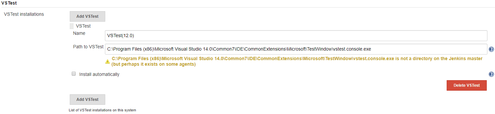
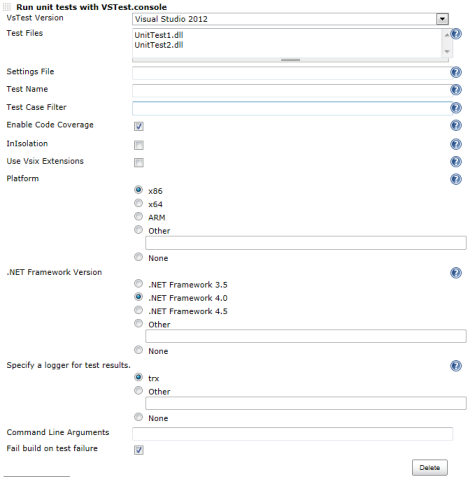

[.conf-macro .output-inline]#This plugin allow you to execute test using
http://msdn.microsoft.com/en-us/library/vstudio/ms182486.aspx[VsTest]
command line tool.#

[[VsTestRunnerPlugin-Description]]
== Description

This plugin allow you to execute test using
http://msdn.microsoft.com/en-us/library/vstudio/ms182486.aspx[VsTest]
command line tool. +
VSTest are test classes for .NET framework which are integrated into
Visual Studio.

[[VsTestRunnerPlugin-Configuration]]
== Configuration

[[VsTestRunnerPlugin-Systemconfiguration]]
=== System configuration

[.confluence-embedded-file-wrapper .confluence-embedded-manual-size]##

. Open the system configuration page "Manage Jenkins→Global Tool
Configuration"
. Enter the path to the VsTest command line client, that should be used
by Jenkins.

* The path location is as instance: C:\Program Files (x86)\Microsoft
Visual Studio
14.0\Common7\IDE\CommonExtensions\Microsoft\TestWindow\vstest.console.exe.

[[VsTestRunnerPlugin-Jobconfiguration]]
=== Job configuration

[.confluence-embedded-file-wrapper]##

[cols=",",options="header",]
|===
|name |description
|VsTest Version |Select VsTest Version.

|Test Files |Specify the path to your VsTest compiled assemblies. +
You can specify multiple test assemblies by separating them with
new-line or space.

|Settings File |Run tests with additional settings such as data
collectors.

|Test Name |Run tests with names that match the provided values. +
To provide multiple values, separate them by commas.

|Test Case Filter |Run tests that match the given expression. +
<Expression> is of the format
<property>=<value>https://wiki.jenkins-ci.org/display/JENKINS/VsTestRunner+Plugin[VsTestRunner
Plugin].

|Enable Code Coverage |Enables data diagnostic adapter CodeCoverage in
the test run.

|InIsolation |Runs the tests in an isolated process.

|Use Vsix Extensions |This makes vstest.console.exe process use or skip
the VSIX extensions installed (if any) in the test run.

|Use VS 2017 or Later |This makes changes to the arguments passed to the
VS Test Agent in order to ensure compatibility with the latest version.

|Platform |Target platform architecture to be used for test execution.

|.NET Framework Version |Target .NET Framework version to be used for
test execution.

|Specify a logger for test results. |Specify a logger for test results.
For example, to log results into a Visual Studio Test Results File (TRX)
use /Logger:trx.

|Command Line Arguments |This is a whitespace separated list of command
line arguments you can specify. These can be the same as if you were to
run VsTest from the command line.

|Fail build on test failure |Fail build on test failure
|===

[[VsTestRunnerPlugin-Changelog]]
== Changelog

[[VsTestRunnerPlugin-Version1.0.5(10/24/2017)]]
=== Version 1.0.5 (10/24/2017)

* To be updated with description of changes and links to the resolved
issues.

[[VsTestRunnerPlugin-Version1.0.4(08/31/2014)]]
=== Version 1.0.4 (08/31/2014)

* Make trx and coverage files paths available to further build steps in
VSTestRunner plugin.
(https://issues.jenkins-ci.org/browse/JENKINS-22450[JENKINS-22450])(https://github.com/jenkinsci/vstestrunner-plugin/pull/2[Pull
Requests #2])

[[VsTestRunnerPlugin-Version1.0.3(10/21/2013)]]
=== Version 1.0.3 (10/21/2013)

* Changed to extend BuildStepDescriptor.
(https://github.com/jenkinsci/vstestrunner-plugin/pull/1[Pull Requests
#1])

[[VsTestRunnerPlugin-Version1.0.2(07/24/2013)]]
=== Version 1.0.2 (07/24/2013)

* Supports Jenkins variable. +
I can be used in the following items.
** Test Files
** Settings File
** Test Name
** Test Case Filter
** Command Line Arguments

* I Fixed a bug that was not used by the "Command Line Arguments".

[[VsTestRunnerPlugin-Version1.0.1(03/09/2013)]]
=== Version 1.0.1 (03/09/2013)

Mod default value.

* Plaform Field: None
* .NET Framework Version Field: None
* Specify a logger for test results. Field: trx

[[VsTestRunnerPlugin-Version1.0.0(01/29/2013)]]
=== Version 1.0.0 (01/29/2013)

Initial release.
